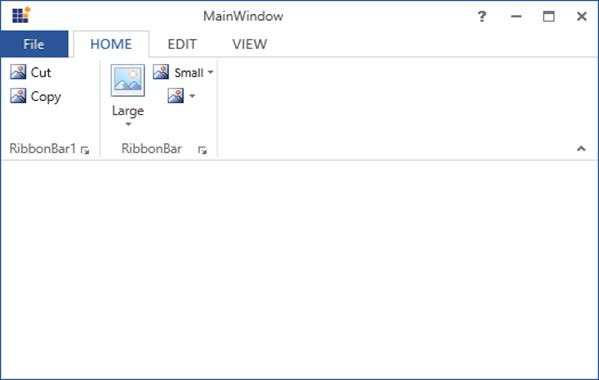

## SplitButton

### Adding Item to the control

Items to **SplitButton** are added by using **DropDownMenuItems**.



[XAML]

<syncfusion:Ribbon Name="_Ribbon1" HorizontalAlignment="Stretch" VerticalAlignment="Top">

<syncfusion:RibbonTab Name="_RibbonTab1" Caption="HOME"  IsChecked="False">

<syncfusion:RibbonBar Name="_RibbonBar1" Header="RibbonBar1">

<syncfusion:RibbonButton   Label="Cut"/>

<syncfusion:RibbonButton   Label="Copy"/>

</syncfusion:RibbonBar>

<syncfusion:RibbonBar Name="_RibbonBar2" Header="RibbonBar2">

<syncfusion:SplitButton Label="Chart">

<syncfusion:DropDownMenuItem Header="PieChart"/>

<syncfusion:DropDownMenuItem Header="ColumnChart"/>

</syncfusion:SplitButton>

<syncfusion:SplitButton Label="Table"/>

</syncfusion:RibbonBar>

</syncfusion:RibbonTab>

<syncfusion:RibbonTab Caption="EDIT"  IsChecked="False"/>

<syncfusion:RibbonTab Caption="VIEW"  IsChecked="False"/>

</syncfusion:Ribbon>



You can add Items to SplitButton dynamically by create instance of **DropDownMenuItems** add it to SplitButton Items.



[C#]

SplitButton _splitbutton = new SplitButton() { Label = "Chart" };

DropDownMenuItem _DropDownMenuItem1 = new DropDownMenuItem() { Header = "PieChart" };

DropDownMenuItem _DropDownMenuItem2 = new DropDownMenuItem() { Header = "ColumnChart" };

_splitbutton.Items.Add(_DropDownMenuItem1);

_splitbutton.Items.Add(_DropDownMenuItem2);

_RibbonBar2.Items.Add(_splitbutton);



### Three types of SizeForm

**SplitButton** have three types of size forms. You can set size forms using **SizeForm** Property.

The following code example illustrates different size forms of SplitButton in Ribbon instance.



[XAML]

<syncfusion:SplitButton SizeForm="Large" Label="Large"/>

<syncfusion:SplitButton SizeForm="Small" Label="Small"/>

<syncfusion:SplitButton SizeForm="ExtraSmall" Label="ExtraSmall"/>





[C#]

SplitButton _splitbutton=new SplitButton(){Label = "Large",SizeForm= SizeForm.Large};

SplitButton _splitbutton1=new SplitButton(){Label = "Small",SizeForm= SizeForm.Small};

SplitButton _splitbutton2=new SplitButton(){Label = "ExtraSmall",SizeForm= SizeForm.ExtraSmall};

_RibbonBar2.Items.Add(_splitbutton);

_RibbonBar2.Items.Add(_splitbutton1);

_RibbonBar2.Items.Add(_splitbutton2);



