# Styling and Templates

The Ribbon control ships with a number of built-in themes such as Office2003, Office2007, Office2010 Silver, Blue, Black, Blend, VS, Transparent, Metro and Office2013. 

## Visual styles

The appearance of Ribbon control can be customized by `VisualStyles` attached property of the SfSkinManager. You can find the list of available built-in themes and the assemblies needs to be referred in the below documentation [link](https://help.syncfusion.com/wpf/themes/skin-manager).

### Add SfSkinManager reference

There are several ways to add the Syncfusion SfSkinManager reference in Visual Studio WPF project. The following steps will help to add through `XAML` code.

1) Add reference to `Syncfusion.SfSkinManager.WPF` assembly or Syncfusion.SfSkinManager.WPF [nuget package](https://www.nuget.org/packages/Syncfusion.SfSkinManager.WPF) to the project.

2) Import Syncfusion WPF schema `http://schemas.syncfusion.com/wpf` or the assembly namespace `Syncfusion.SfSkinManager` in XAML page.

### Apply styles using SfSkinManager

The SfSkinManger provides rich and professional look and feel UI for Ribbon window. The list of visual styles are given below,

* Office2010Black, Office2010Blue and Office2010Silver
* Office2013DarkGray, Office2013LightGray and Office2013White
* Office2016 Colorful, Office2016DarkGray, Office2016White
* Office2019Black, Office2019Colorful, Office2019DarkGray, Office2019White and Office2019HighContast
* VisualStudio2013 and VisualStudio2015
* Office365, SystemTheme, Saffron, Blend, Default and Lime
* MaterialDark, MaterialDarkBlue, MaterialLight, MaterialLightBlue





<syncfusion:RibbonWindow
        xmlns="http://schemas.microsoft.com/winfx/2006/xaml/presentation"
        xmlns:x="http://schemas.microsoft.com/winfx/2006/xaml"
        xmlns:d="http://schemas.microsoft.com/expression/blend/2008"
        xmlns:mc="http://schemas.openxmlformats.org/markup-compatibility/2006"
        xmlns:local="clr-namespace:WpfApp82"
        xmlns:syncfusion="http://schemas.syncfusion.com/wpf" x:Class="WpfApp82.MainWindow"
        mc:Ignorable="d" 
        xmlns:skin="clr-namespace:Syncfusion.SfSkinManager;assembly=Syncfusion.SfSkinManager.WPF"
        skin:SfSkinManager.VisualStyle="Office2019Colorful"
        Title="MainWindow" Height="450" Width="800">
    <Grid>
        <syncfusion:Ribbon x:Name="_ribbon" VerticalAlignment="Top">
            <syncfusion:RibbonTab Caption="HOME"  IsChecked="True">
                <syncfusion:RibbonBar Name="New" Width="90"  Header="New">
                    <syncfusion:RibbonButton SizeForm="Large" Label="New Email"/>
                    <syncfusion:DropDownButton SizeForm="Large" Label="New Items">
                        <syncfusion:DropDownMenuItem Header="Task"/>
                    </syncfusion:DropDownButton>
                </syncfusion:RibbonBar>
                <syncfusion:RibbonBar Name="Delete" Width="130"  Header="Delete">
                    <syncfusion:RibbonButton Label="Ignore"/>
                    <syncfusion:SplitButton Label="Clean Up">
                        <syncfusion:DropDownMenuItem Header="Clean Up Folder"/>
                    </syncfusion:SplitButton>
                </syncfusion:RibbonBar>
            </syncfusion:RibbonTab>
            <syncfusion:RibbonTab Caption="SEND/RCEIVE"  IsChecked="False"/>
            <syncfusion:RibbonTab Caption="FOLDER"  IsChecked="False"/>
            <syncfusion:RibbonTab Caption="VIEW"  IsChecked="False"/>
        </syncfusion:Ribbon>
    </Grid>
</syncfusion:RibbonWindow>





SfSkinManager.SetVisualStyle(this, VisualStyles.Office2019Colorful);





* Office2019Colorful

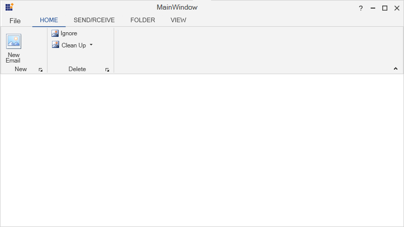

* Office2019HighContrast

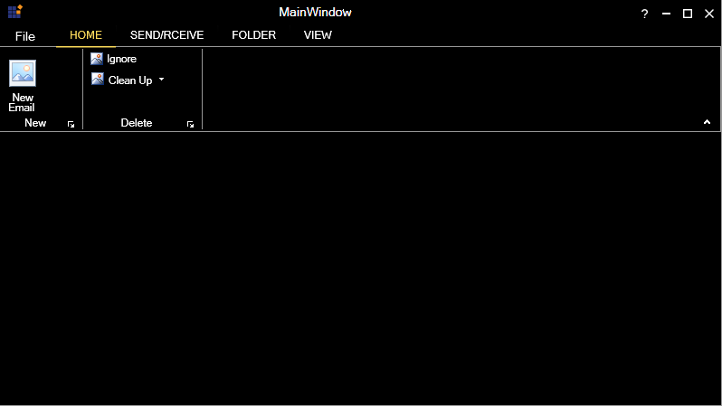

* VisualStudio2013

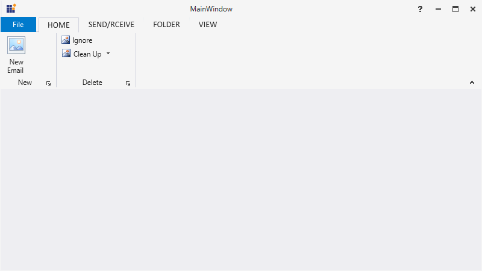

* Office2016Colorful

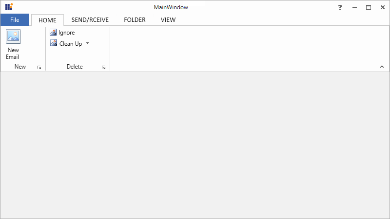

* Office2016White

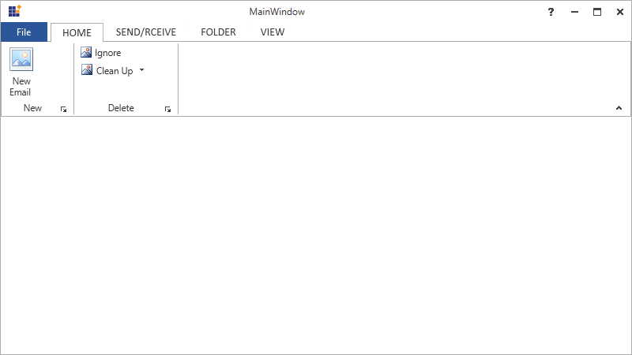

* Office2010Black

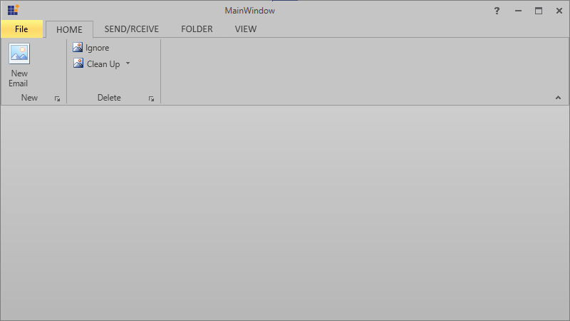

* Office2010Silver

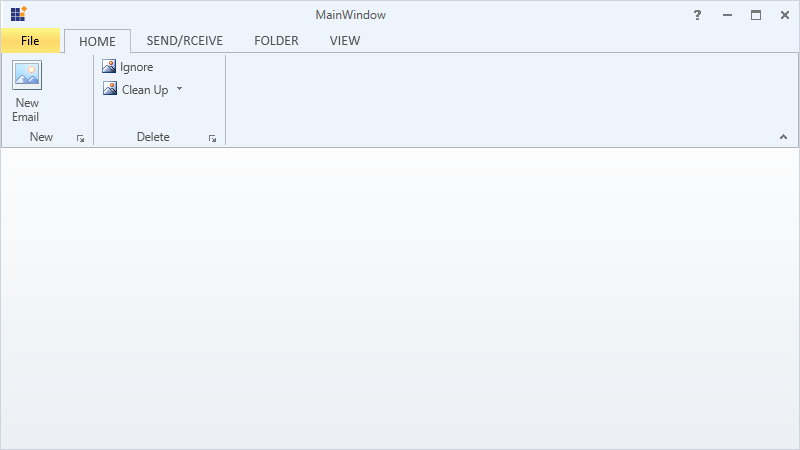

* Office2013DarkGray

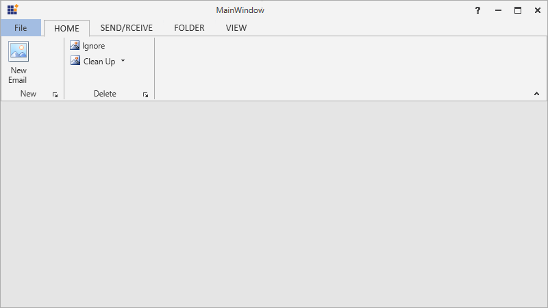

* Office2013White

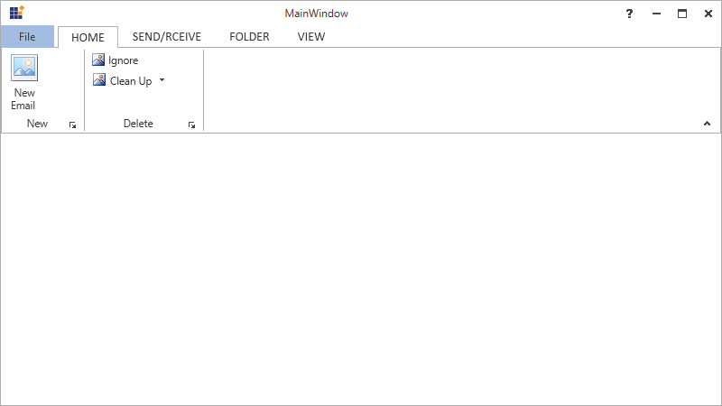

* Lime

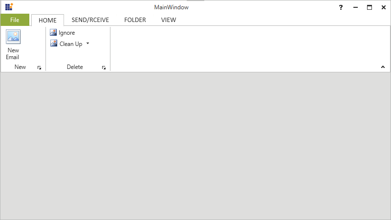

* Office365

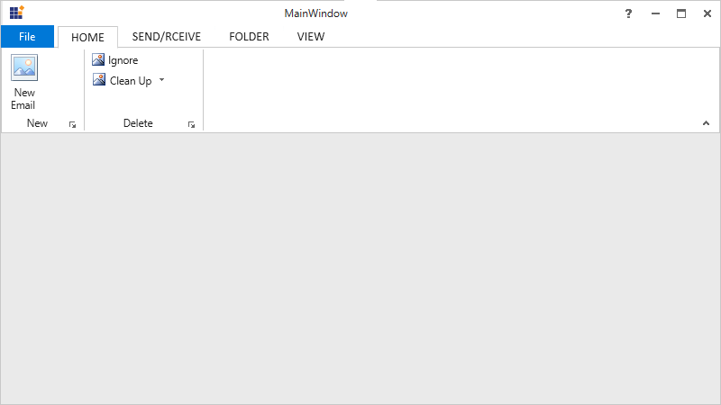

### Apply style using ResourceDictionary

To override the themes to the Ribbon control’s style, add ResourceDictionary in the sample and define new style with the BasedOn property. When the Resource Dictionary is added, all the properties of the base style can be acquired, then override them as desired. The same procedure can be used for overriding the other styles. Here an example is illustrated to set the BackStageColor for the Ribbon by customizing the RibbonStyle using the BasedOn property.

#### Syntax for ResourceDictionary





<ResourceDictionary Source="/Syncfusion.Tools.WPF;Component/FrameWork/Ribbon/themes/Office2013Style.xaml">
</ResourceDictionary>





#### Syntax for BasedOn





BasedOn="{StaticResource <StyleName><ControlName>Style}"









<syncfusion:RibbonWindow
        x:Class="RibbonVisualStyleSample.MainWindow"
        xmlns="http://schemas.microsoft.com/winfx/2006/xaml/presentation"
        xmlns:x="http://schemas.microsoft.com/winfx/2006/xaml"
        Title="MainWindow" Height="350" Width="525"
        xmlns:syncfusion="http://schemas.syncfusion.com/wpf"
        syncfusion:SkinStorage.VisualStyle="Office2013">
    <syncfusion:RibbonWindow.Resources>
        <ResourceDictionary>
            <ResourceDictionary.MergedDictionaries>
                <ResourceDictionary Source="/Syncfusion.Tools.WPF;Component/FrameWork/Ribbon/themes/Office2013Style.xaml"/>
            </ResourceDictionary.MergedDictionaries>
            
        </ResourceDictionary>
    </syncfusion:RibbonWindow.Resources>
    <Grid>
        <syncfusion:Ribbon x:Name="_ribbon" VerticalAlignment="Top"  Style="{StaticResource RibbonStyle}">
            <syncfusion:RibbonTab  Caption="Home" IsChecked="False">
                <syncfusion:RibbonBar Header="Respond" >
                    <syncfusion:RibbonButton  SizeForm="Large" Label="Large"/>
                    <syncfusion:RibbonButton SizeForm="Small" Label="Small"/>
                    <syncfusion:RibbonButton SizeForm="Small" Label="Forward"/>
                </syncfusion:RibbonBar>
            </syncfusion:RibbonTab>
            <syncfusion:RibbonTab Caption="Send/Receive" IsChecked="True">
                <syncfusion:RibbonBar Header="Download">
                    <syncfusion:RibbonButton SizeForm="Small" Label="Show Progress"/>
                    <syncfusion:RibbonButton SizeForm="Small" Label="CancelAll"/>
                    <syncfusion:RibbonButton SizeForm="Large" Label="Download Headers"/>
                    <syncfusion:DropDownButton SizeForm="Large" Label="Mark to Download">
                    <syncfusion:DropDownButton>
                </syncfusion:RibbonBar>
            </syncfusion:RibbonTab>
        </syncfusion:Ribbon>
    </Grid>
</syncfusion:RibbonWindow>





