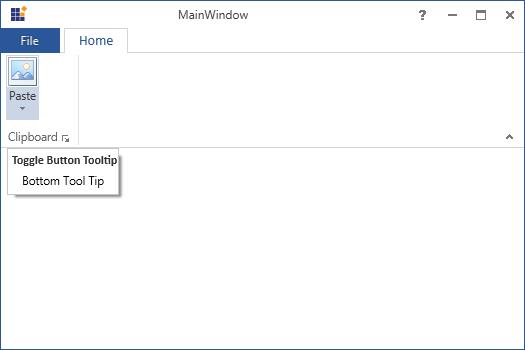

# UI for ToolTip

Tooltip is used to display small information about the specific element while hovering mouse on it and it is implemented as like in MS Outlook. 

Ribbon control supports ToolTips for its items in both normal and simplified layout. To know more about the simplified layout, refer [here](https://help.syncfusion.com/wpf/ribbon/simplifiedlayout).

`ScreenTip` is an enhanced ToolTip and it is used to show a popup window when the mouse cursor is hovered over `RibbonItem`. The popup is used to provide details of the `RibbonItem’s` function. The difference between ToolTip and ScreenTip is that, ToolTip hosts controls to show a small popup window, whereas ScreenTip includes predefined properties. With these predefined properties, you can create ScreenTip easily.

ScreenTip has four properties.

1.	Description - Specifies the description of the ScreenTip.
2.	Image - Specifies the image of the ScreenTip.
3.	Content - Specifies the content of the ScreenTip.
4.	HelpText - Specifies the HelpText of the ScreenTip.

## Adding tooltip for ribbon items

Ribbon ToolTip  can be set to each Ribbon items by defining ScreenTip inside the ToolTip.





<Syncfusion:Ribbon x:Name="_ribbon"   VerticalAlignment="Top">
<Syncfusion:RibbonTab  Caption="Home" IsChecked="False"  >
<Syncfusion:RibbonBar Header="Clipboard">
<Syncfusion:RibbonBar.ToolTip>
<Syncfusion:ScreenTip MinWidth="150" Description="ScreenTip Example" VerticalOffset="10" Content="Represent a ribbon simple buttons"/>
</Syncfusion:RibbonBar.ToolTip>
<Syncfusion:SplitButton  Name="paste" Label="Paste" SizeForm="Large"  LargeIcon="/Resources/Paste16.png">
<Syncfusion:SplitButton.ToolTip>
<Syncfusion:ScreenTip  Description="Paste (Ctrl+V)" Content="Paste the contents of clipboard."/>
</Syncfusion:SplitButton.ToolTip>
</Syncfusion:SplitButton>
<Syncfusion:RibbonButton   Label="Cut" SizeForm="Small"  SmallIcon="/Resources/Cut16.png" >
<Syncfusion:RibbonButton.ToolTip>
<Syncfusion:ScreenTip Description="Cut (Ctrl+X)" Content="Cut the selection and put it on the clipboard."/>
</Syncfusion:RibbonButton.ToolTip>
</Syncfusion:RibbonButton>
<Syncfusion:RibbonButton Name="copy"   Label="Copy" SizeForm="Small"   SmallIcon="/Resources/Copy16.png"  >
<Syncfusion:RibbonButton.ToolTip>
<Syncfusion:ScreenTip Content="Copy the selection and put it on the clipboard" Description="Copy (Ctrl+C)" HelpText="Press F1 for more help."/>
</Syncfusion:RibbonButton.ToolTip>
</Syncfusion:RibbonButton>
<Syncfusion:RibbonButton IsMultiLine="True"  Label="Format Painter" SizeForm="Small"  SmallIcon="/Resources/FormatPainter16.png" >
<Syncfusion:RibbonButton.ToolTip>
<Syncfusion:ScreenTip Content="Copy formatting from one place and apply it to another" Description="Format painter (Ctrl+Shift+C)" ImageSource="/Resources/FormatPainter16.png" HelpText="Press F1 for more help."/>
</Syncfusion:RibbonButton.ToolTip>
</Syncfusion:RibbonButton>
</Syncfusion:RibbonBar>
<Syncfusion:RibbonBar Header="BackStage Operations" >
<Syncfusion:RibbonCheckBox  Content="Cancel BackStage Opening" x:Name="BackStageOpeningCheckBox">
<Syncfusion:RibbonCheckBox.ToolTip>
<Syncfusion:ScreenTip Description="Cancel BackStage" Content="Restrict backstage opening"/>
</Syncfusion:RibbonCheckBox.ToolTip>
</Syncfusion:RibbonCheckBox>
<Syncfusion:RibbonComboBox SelectedIndex="0" FlowDirection="LeftToRight" Width="110">
<Syncfusion:RibbonComboBox.ToolTip>
<Syncfusion:ScreenTip Description="New Items" Content="Create a new item such as Meeting or contact."/>
</Syncfusion:RibbonComboBox.ToolTip>
<Syncfusion:RibbonComboBoxItem>Email_Message</Syncfusion:RibbonComboBoxItem>
<Syncfusion:RibbonComboBoxItem>Meeting</Syncfusion:RibbonComboBoxItem>
<Syncfusion:RibbonComboBoxItem>Appointment</Syncfusion:RibbonComboBoxItem>
</Syncfusion:RibbonComboBox>
</Syncfusion:RibbonBar>
</Syncfusion:RibbonTab>
</Syncfusion:Ribbon>





## Setting the ToolTip for the upper and lower half of the split button

The ToolTip property is used to set the tooltip for the upper half of the Split Button, while the ToggleButtonToolTip property is used to set the tooltip for the drop-down in the lower half of the split button.





<Syncfusion:SplitButton Label="Paste" SizeForm="Large" >
<Syncfusion:SplitButton.ToolTip>
<Syncfusion:ScreenTip Description="Split Button Tooltip" VerticalOffset="32">
<TextBlock Text="Top Tool Tip" />
</Syncfusion:ScreenTip>
</Syncfusion:SplitButton.ToolTip>
<Syncfusion:SplitButton.ToggleButtonToolTip>
<Syncfusion:ScreenTip Description="Toggle Button Tooltip" VerticalOffset="29">
<TextBlock Text="Bottom Tool Tip" />
</Syncfusion:ScreenTip>
</Syncfusion:SplitButton.ToggleButtonToolTip>
</Syncfusion:SplitButton>





## Options for inserting help text in ScreenTip

Essential Tool WPF is enhanced with HelpText option. Users can add help text in ScreenTip. A line separator separates the Screen tip information from help text.





<Syncfusion:RibbonButton IsMultiLine="True"  Label="Format Painter" SizeForm="Small"  SmallIcon="/Resources/FormatPainter16.png" >
<Syncfusion:RibbonButton.ToolTip>
<Syncfusion:ScreenTip Content="Copy formatting from one place and apply it to another" Description="Format painter (Ctrl+Shift+C)" ImageSource="/Resources/FormatPainter16.png" HelpText="Press F1 for more help."/>
</Syncfusion:RibbonButton.ToolTip>
</Syncfusion:RibbonButton>





N> When no HelpText is set to the HelpText area and line separator get automatically hidden
 

