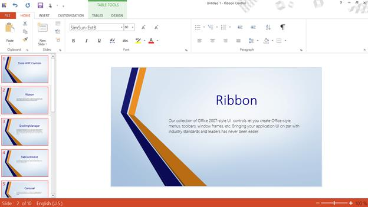
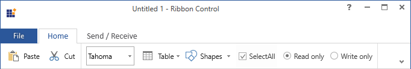

# Touch Support in WPF Ribbon    

Ribbon control have touch support and it provides Touch UI which is easy to access the element in Ribbon. 

### How to enable touch in RibbonWindow

To enable touch in the RibbonWindow, set `EnableTouch` property of the SkinStorage as `True`. The following code snippet illustrates this





<syncfusion:RibbonWindow
xmlns="http://schemas.microsoft.com/winfx/2006/xaml/presentation"
xmlns:x="http://schemas.microsoft.com/winfx/2006/xaml"
xmlns:syncfusion="http://schemas.syncfusion.com/wpf" x:Class="RibbonButtonPanel.MainWindow"
Title="MainWindow" Height="350" Width="525" syncfusion:SkinStorage.VisualStyle="Office2013"  x:Name="_ribbonWindow" syncfusion:SkinStorage.EnableTouch="True"/>





SkinStorage.SetEnableTouch(_ribbonWindow, true);





SkinStorage.SetEnableTouch(_ribbonWindow, True)





## Touch mode in Simplified layout

Touch mode for the simplified layout can be enabled, which is designed to display the most commonly used Ribbon commands in a single line interface, allowing more screen space for compact viewing of the content. To know more about the simplified layout, refer [here](https://help.syncfusion.com/wpf/ribbon/simplifiedlayout).





<syncfusion:RibbonWindow x:Class="RibbonButton_IconTemp.MainWindow"
        xmlns="http://schemas.microsoft.com/winfx/2006/xaml/presentation"
        xmlns:x="http://schemas.microsoft.com/winfx/2006/xaml"
        xmlns:d="http://schemas.microsoft.com/expression/blend/2008"
        xmlns:mc="http://schemas.openxmlformats.org/markup-compatibility/2006"
        xmlns:local="clr-namespace:RibbonButton_IconTemp"
        xmlns:syncfusion="http://schemas.syncfusion.com/wpf"
        mc:Ignorable="d" syncfusion:SkinStorage.EnableTouch="True"
        syncfusion:SkinStorage.VisualStyle="Office2013"
        Title="Untitled 1 - Ribbon Control" Height="450" Width="800">
    <Grid x:Name="grid">
        <syncfusion:Ribbon VerticalAlignment="Top" EnableSimplifiedLayoutMode="True" LayoutMode="Simplified">
            <syncfusion:RibbonTab Caption="Home" IsChecked="True">
                <syncfusion:RibbonBar Header="Clipboard">
                    <syncfusion:RibbonButton Label="Paste" MediumIcon="/Resources/Paste20.png"  />
                    <syncfusion:RibbonButton Label="Cut" SizeForm="Small" MediumIcon="/Resources/Cut_20.png" />
                </syncfusion:RibbonBar>
                <syncfusion:RibbonBar Header="Tables">
                    <syncfusion:RibbonComboBox Width="80">
                        <syncfusion:RibbonComboBoxItem>Arial</syncfusion:RibbonComboBoxItem>
                        <syncfusion:RibbonComboBoxItem IsSelected="True">Tahoma</syncfusion:RibbonComboBoxItem>
                        <syncfusion:RibbonComboBoxItem>Calibri</syncfusion:RibbonComboBoxItem>
                    </syncfusion:RibbonComboBox>
                    <syncfusion:DropDownButton
                                    Label="Table"
                                    LargeIcon="Resources/Table_32.png"
                                    MediumIcon="Resources/Table20.png"
                                    SizeForm="Large">
                    </syncfusion:DropDownButton>
                    <syncfusion:SplitButton
                                    Label="Shapes"
                                    MediumIcon="Resources/Insert Shapes20.png"
                                    SizeForm="Small">
                    </syncfusion:SplitButton>
                    <syncfusion:RibbonCheckBox Content="SelectAll" IsChecked="True"/>
                    <syncfusion:RibbonRadioButton GroupName="Mode" Content="Read only" IsChecked="True"></syncfusion:RibbonRadioButton>
                    <syncfusion:RibbonRadioButton GroupName="Mode" Content="Write only" ></syncfusion:RibbonRadioButton>
                </syncfusion:RibbonBar>
            </syncfusion:RibbonTab>
            <syncfusion:RibbonTab Caption="Send / Receive">
                <syncfusion:RibbonBar/>
            </syncfusion:RibbonTab>
        </syncfusion:Ribbon>
    </Grid>
</syncfusion:RibbonWindow>





Ribbon ribbon = new Ribbon();
ribbon.VerticalAlignment = VerticalAlignment.Top;
ribbon.EnableSimplifiedLayoutMode = true;
ribbon.LayoutMode = LayoutMode.Simplified;
// Creating new tabs
RibbonTab homeTab = new RibbonTab();
homeTab.Caption = "Home";
homeTab.IsChecked = true;

RibbonTab sendTab = new RibbonTab();
sendTab.Caption = "Send / Receive";
// Creating new bar
RibbonBar clipboardBar = new RibbonBar();
clipboardBar.Header = "Clipboard";
RibbonBar optionsBar = new RibbonBar();
clipboardBar.Header = "Options";
RibbonBar tablesBar = new RibbonBar();
tablesBar.Header = "Tables";
// Creating items
RibbonButton pasteButton = new RibbonButton();
pasteButton.Label = "Paste";
pasteButton.MediumIcon = new BitmapImage(new Uri(@"/Resources/Paste20.png", UriKind.RelativeOrAbsolute));
SimplifiedLayoutSettings.SetDisplayMode(pasteButton, DisplayMode.Simplified);
RibbonButton cutButton = new RibbonButton();
cutButton.Label = "Cut";
cutButton.SizeForm = SizeForm.Small;
cutButton.MediumIcon = new BitmapImage(new Uri(@"/Resources/Cut_20.png", UriKind.RelativeOrAbsolute));
cutButton.SmallIcon = new BitmapImage(new Uri(@"/Resources/Cut16.png", UriKind.RelativeOrAbsolute));

RibbonComboBox ribbonComboBox1 = new RibbonComboBox() { Width = 80 };
RibbonComboBox ribbonComboBox2 = new RibbonComboBox() { Width = 50 };
RibbonComboBoxItem comboBoxItem1 = new RibbonComboBoxItem() { Content = "Arial" };
RibbonComboBoxItem comboBoxItem2 = new RibbonComboBoxItem() { Content = "Calibri" };
RibbonComboBoxItem comboBoxItem3 = new RibbonComboBoxItem() { Content = "Tahoma", IsSelected = true };
ribbonComboBox1.Items.Add(comboBoxItem1);
ribbonComboBox1.Items.Add(comboBoxItem2);
ribbonComboBox1.Items.Add(comboBoxItem3);

DropDownButton tableButton = new DropDownButton();
tableButton.Label = "Table";
tableButton.SizeForm = SizeForm.Large;
tableButton.MediumIcon = new BitmapImage(new Uri(@"/Resources/Table20.png", UriKind.RelativeOrAbsolute));
tableButton.LargeIcon = new BitmapImage(new Uri(@"/Resources/Table_32.png", UriKind.RelativeOrAbsolute));

SplitButton shapesButton = new SplitButton();
shapesButton.Label = "Shapes";
shapesButton.SizeForm = SizeForm.Small;
shapesButton.MediumIcon = new BitmapImage(new Uri(@"/Resources/Insert Shapes20.png", UriKind.RelativeOrAbsolute));

RibbonCheckBox ribbonCheckBox = new RibbonCheckBox() { Content = "SelectAll", IsChecked = true };
RibbonRadioButton ribbonRadioButton = new RibbonRadioButton() { Content = "Read only", IsChecked = true, GroupName = "Mode" };
RibbonRadioButton ribbonRadioButton2 = new RibbonRadioButton() { Content = "Write only", GroupName = "Mode" };

clipboardBar.Items.Add(pasteButton);
clipboardBar.Items.Add(cutButton);
tablesBar.Items.Add(ribbonComboBox1);
tablesBar.Items.Add(tableButton);
tablesBar.Items.Add(shapesButton);
tablesBar.Items.Add(ribbonCheckBox);
tablesBar.Items.Add(ribbonRadioButton);
tablesBar.Items.Add(ribbonRadioButton2);
homeTab.Items.Add(clipboardBar);
homeTab.Items.Add(tablesBar);
sendTab.Items.Add(optionsBar);

ribbon.Items.Add(homeTab);
ribbon.Items.Add(sendTab);
grid.Children.Add(ribbon);

SkinStorage.SetVisualStyle(this, "Office2013");
SkinStorage.SetEnableTouch(this, true);





