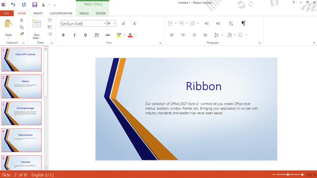

# Touch Support in WPF Ribbon Control

The WPF Ribbon Control includes touch support and provides a Touch UI for easy access to its elements.

## How to enable touch in RibbonWindow

To enable touch in the RibbonWindow, set `EnableTouch` property of the SkinStorage as `True`. The following code snippet illustrates this





<syncfusion:RibbonWindow
xmlns="http://schemas.microsoft.com/winfx/2006/xaml/presentation"
xmlns:x="http://schemas.microsoft.com/winfx/2006/xaml"
xmlns:syncfusion="http://schemas.syncfusion.com/wpf" x:Class="RibbonButtonPanel.MainWindow"
Title="MainWindow" Height="350" Width="525" syncfusion:SkinStorage.VisualStyle="Office2013"  x:Name="_ribbonWindow" syncfusion:SkinStorage.EnableTouch="True"/>





SkinStorage.SetEnableTouch(_ribbonWindow, true);





SkinStorage.SetEnableTouch(_ribbonWindow, True)





