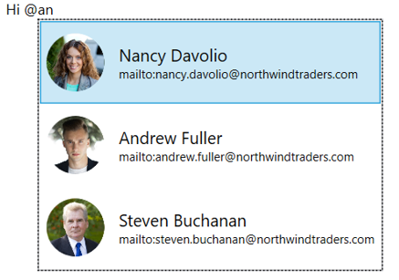
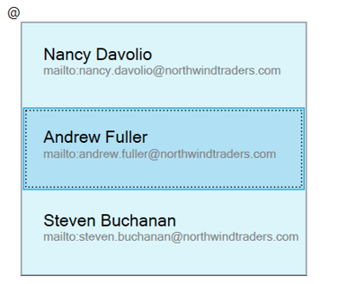
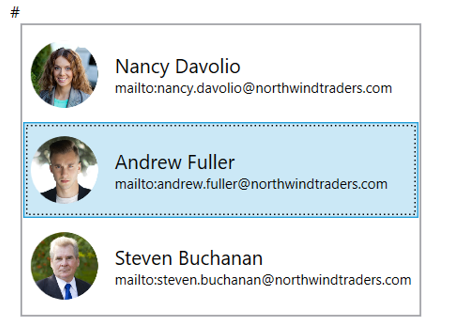
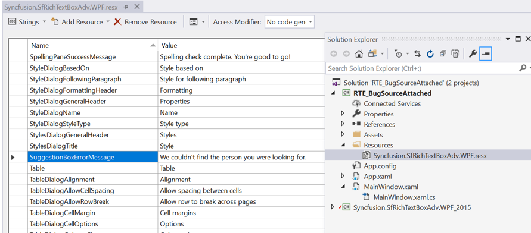
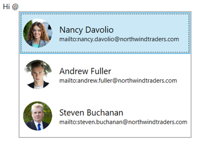

# Automatic Suggestion

### Automatic Suggestion functionality for using @mentions
SfRichTextBoxAdv control shows an inline dropdown with a list of suggested names while type the mention character (@ symbol). The list of names will filter as you type more letters. You can use up or down arrow key to move selection and Tab or Enter key to insert selected item in keyboard or use mouse to click any option in the list. The selected item from the suggestion list will be inserted as hyperlink with the display text and its respective link.

The following sample code demonstrates how to use @mentions in SfRichTextBoxAdv.


<Window.Resources>
        <x:Array Type="{x:Type RichTextBoxAdv:NameSuggestionItem}" x:Key="suggestionItems">
            <RichTextBoxAdv:NameSuggestionItem Name = "Nancy Davolio" Link="mailto:nancy.davolio@northwindtraders.com" ImageSource="/Assets/People_Circle0.png" />
            <RichTextBoxAdv:NameSuggestionItem Name = "Andrew Fuller" Link="mailto:andrew.fuller@northwindtraders.com" ImageSource="/Assets/People_Circle5.png"/>
            <RichTextBoxAdv:NameSuggestionItem Name = "Steven Buchanan" Link="mailto:steven.buchanan@northwindtraders.com" ImageSource="/Assets/People_Circle18.png"/>
        </x:Array>
</Window.Resources>
    <Grid>
        <RichTextBoxAdv:SfRichTextBoxAdv x:Name="richTextboxadv" LayoutType="Continuous">
            <RichTextBoxAdv:SfRichTextBoxAdv.SuggestionSettings>
                <RichTextBoxAdv:SuggestionSettings>
                    <RichTextBoxAdv:SuggestionSettings.SuggestionProviders>
                        <RichTextBoxAdv:NameSuggestionProvider     ItemsSource="{StaticResource suggestionItems}">
                        </RichTextBoxAdv:NameSuggestionProvider>
                    </RichTextBoxAdv:SuggestionSettings.SuggestionProviders>
                </RichTextBoxAdv:SuggestionSettings>
            </RichTextBoxAdv:SfRichTextBoxAdv.SuggestionSettings>
        </RichTextBoxAdv:SfRichTextBoxAdv>
    </Grid>


ISuggestionProvider suggestionProvider = new NameSuggestionProvider();
            List<NameSuggestionItem> suggestionItems = new List<NameSuggestionItem>();

            NameSuggestionItem suggestionItem = new NameSuggestionItem();
            suggestionItem.Name = "Nancy Davolio";
            suggestionItem.Link = "mailto:nancy.davolio@northwindtraders.com";
            BitmapImage bitmapImage = new BitmapImage(new Uri(new DirectoryInfo(@"..\..\Assets\People_Circle0.png").FullName));
            suggestionItem.ImageSource = bitmapImage;
            suggestionItems.Add(suggestionItem);

            suggestionItem = new NameSuggestionItem();
            suggestionItem.Name = "Andrew Fuller";
            suggestionItem.Link = "mailto:andrew.fuller@northwindtraders.com";
            bitmapImage = new BitmapImage(new Uri(new DirectoryInfo(@"..\..\Assets\People_Circle5.png").FullName));
            suggestionItem.ImageSource = bitmapImage;
            suggestionItems.Add(suggestionItem);

            suggestionItem = new NameSuggestionItem();
            suggestionItem.Name = "Steven Buchanan";
            suggestionItem.Link = "mailto:steven.buchanan@northwindtraders.com";
            bitmapImage = new BitmapImage(new Uri(new DirectoryInfo(@"..\..\Assets\People_Circle18.png").FullName));
            suggestionItem.ImageSource = bitmapImage;
            suggestionItems.Add(suggestionItem);

            (suggestionProvider as NameSuggestionProvider).ItemsSource = suggestionItems;
            richTextboxadv.SuggestionSettings.SuggestionProviders.Add(suggestionProvider);


Dim suggestionProvider As ISuggestionProvider = New NameSuggestionProvider()
	Dim suggestionItems As List<NameSuggestionItem> = New List<NameSuggestionItem>()
	
	Dim suggestionItem As NameSuggestionItem = New NameSuggestionItem()
	suggestionItem.Name = "Nancy Davolio"
	suggestionItem.Link = "mailto:nancy.davolio@northwindtraders.com"
	Dim bitmapImage As BitmapImage = New BitmapImage(New Uri(New DirectoryInfo("..\..\Assets\People_Circle0.png").FullName))
	suggestionItem.ImageSource = bitmapImage
	suggestionItems.Add(suggestionItem)
	
	suggestionItem = New NameSuggestionItem()
	suggestionItem.Name = "Andrew Fuller"
	suggestionItem.Link = "mailto:andrew.fuller@northwindtraders.com"
	bitmapImage = New BitmapImage(New Uri(New DirectoryInfo("..\..\Assets\People_Circle5.png").FullName))
	suggestionItem.ImageSource = bitmapImage
	suggestionItems.Add(suggestionItem)
	
	suggestionItem = New NameSuggestionItem()
	suggestionItem.Name = "Steven Buchanan"
	suggestionItem.Link = "mailto:steven.buchanan@northwindtraders.com"
	bitmapImage = New BitmapImage(New Uri(New DirectoryInfo("..\..\Assets\People_Circle18.png").FullName))
	suggestionItem.ImageSource = bitmapImage
	suggestionItems.Add(suggestionItem)
	
	TryCast(suggestionProvider, NameSuggestionProvider).ItemsSource = suggestionItems
    richTextBoxAdv.SuggestionSettings.SuggestionProviders.Add(suggestionProvider)



N> [View example in GitHub](https://github.com/SyncfusionExamples/WPF-RichTextBox-Examples/tree/main/Samples/Automatic%20Suggestion/Automatic%20Suggestion)

### Customize the SuggestionBox ItemTemplate and Style
By default, the drop-down window lists the filtered items as an image, display text and link. If you want to remove the image or link. You can write your own item Template.

The following sample code demonstrates how to modify the suggestion box item template and style.


<Window.Resources>
        <x:Array Type="{x:Type RichTextBoxAdv:NameSuggestionItem}" x:Key="suggestionItems">
            <RichTextBoxAdv:NameSuggestionItem Name = "Nancy Davolio" Link="mailto:nancy.davolio@northwindtraders.com"  />
            <RichTextBoxAdv:NameSuggestionItem Name = "Andrew Fuller" Link="mailto:andrew.fuller@northwindtraders.com" />
            <RichTextBoxAdv:NameSuggestionItem Name = "Steven Buchanan" Link="mailto:steven.buchanan@northwindtraders.com"/>
        </x:Array>
        
</Window.Resources>
    <Grid>
        <RichTextBoxAdv:SfRichTextBoxAdv x:Name="richTextboxadv" LayoutType="Continuous">
            <RichTextBoxAdv:SfRichTextBoxAdv.SuggestionSettings>
                <RichTextBoxAdv:SuggestionSettings>
                    <RichTextBoxAdv:SuggestionSettings.SuggestionProviders>
                        <RichTextBoxAdv:NameSuggestionProvider ItemsSource="{StaticResource suggestionItems}" 
                                                               SuggestionBoxStyle="{StaticResource SuggestionBoxStyle}">
                        </RichTextBoxAdv:NameSuggestionProvider>
                    </RichTextBoxAdv:SuggestionSettings.SuggestionProviders>
                </RichTextBoxAdv:SuggestionSettings>
            </RichTextBoxAdv:SfRichTextBoxAdv.SuggestionSettings>
        </RichTextBoxAdv:SfRichTextBoxAdv>
    </Grid>



### Custom mention character
By default, **@** is a mention character. But any character can be used as mention character.

The following sample code demonstrates how to use ‘#’ as mention character.


<Grid>
        <RichTextBoxAdv:SfRichTextBoxAdv x:Name="richTextboxadv" LayoutType="Continuous">
            <RichTextBoxAdv:SfRichTextBoxAdv.SuggestionSettings>
                <RichTextBoxAdv:SuggestionSettings>
                    <RichTextBoxAdv:SuggestionSettings.SuggestionProviders>
                        <RichTextBoxAdv:NameSuggestionProvider MentionCharacter="#" 
                                                               ItemsSource="{StaticResource suggestionItems}">
                        </RichTextBoxAdv:NameSuggestionProvider>
                    </RichTextBoxAdv:SuggestionSettings.SuggestionProviders>
                </RichTextBoxAdv:SuggestionSettings>
            </RichTextBoxAdv:SfRichTextBoxAdv.SuggestionSettings>
        </RichTextBoxAdv:SfRichTextBoxAdv>
    </Grid>


ISuggestionProvider suggestionProvider = new NameSuggestionProvider();
suggestionProvider.MentionCharacter = '#';
richTextboxadv.SuggestionSettings.SuggestionProviders.Add(suggestionProvider);



### Multiple Suggestion provider
Two or more suggestion providers can be used at a time but, each suggestion provider should have different mention character. And each suggestion provider can have different item source and suggestion box style.

<table><tr><td> </td><td> </td></tr></table>

The following sample code demonstrates how to use two suggestion providers. Here we have used ‘@’ and ‘#’ as mentions characters.


<Window.Resources>
        
        
        <x:Array Type="{x:Type RichTextBoxAdv:NameSuggestionItem}" x:Key="suggestionItems">
            <RichTextBoxAdv:NameSuggestionItem Name = "Nancy Davolio" Link="mailto:nancy.davolio@northwindtraders.com" ImageSource="/Assets/People_Circle0.png" />
            <RichTextBoxAdv:NameSuggestionItem Name = "Andrew Fuller" Link="mailto:andrew.fuller@northwindtraders.com" ImageSource="/Assets/People_Circle5.png"/>
            <RichTextBoxAdv:NameSuggestionItem Name = "Steven Buchanan" Link="mailto:steven.buchanan@northwindtraders.com" ImageSource="/Assets/People_Circle18.png"/>
        </x:Array>

        <x:Array Type="{x:Type RichTextBoxAdv:NameSuggestionItem}" x:Key="suggestionItems01">
            <RichTextBoxAdv:NameSuggestionItem Name = "Desktop App" Link="10 queries"  />
            <RichTextBoxAdv:NameSuggestionItem Name = "Mobile App" Link="13 queries" />
            <RichTextBoxAdv:NameSuggestionItem Name = "Web App" Link="15 queries"/>
        </x:Array>
</Window.Resources>
    <Grid>
        <RichTextBoxAdv:SfRichTextBoxAdv x:Name="richTextboxadv" LayoutType="Continuous">
            <RichTextBoxAdv:SfRichTextBoxAdv.SuggestionSettings>
                <RichTextBoxAdv:SuggestionSettings>
                    <RichTextBoxAdv:SuggestionSettings.SuggestionProviders>
                        <RichTextBoxAdv:NameSuggestionProvider 
                                                               ItemsSource="{StaticResource suggestionItems}">
                        </RichTextBoxAdv:NameSuggestionProvider>
                        <RichTextBoxAdv:NameSuggestionProvider MentionCharacter="#" 
                                                               ItemsSource="{StaticResource suggestionItems01}"
                                                               SuggestionBoxStyle="{StaticResource SuggestionBoxStyle}">
                        </RichTextBoxAdv:NameSuggestionProvider>
                    </RichTextBoxAdv:SuggestionSettings.SuggestionProviders>
                </RichTextBoxAdv:SuggestionSettings>
            </RichTextBoxAdv:SfRichTextBoxAdv.SuggestionSettings>
        </RichTextBoxAdv:SfRichTextBoxAdv>
    </Grid>


ISuggestionProvider suggestionProvider = new NameSuggestionProvider();
            List<NameSuggestionItem> suggestionItems = new List<NameSuggestionItem>();

            NameSuggestionItem suggestionItem1 = new NameSuggestionItem();
            suggestionItem1.Name = "Nancy Davolio";
            suggestionItem1.Link = "mailto:nancy.davolio@northwindtraders.com";
            BitmapImage bitmapImage = new BitmapImage(new Uri(new DirectoryInfo(@"..\..\Assets\People_Circle0.png").FullName));
            suggestionItem1.ImageSource = bitmapImage;
            suggestionItems.Add(suggestionItem1);

            NameSuggestionItem suggestionItem2 = new NameSuggestionItem();
            suggestionItem2.Name = "Andrew Fuller";
            suggestionItem2.Link = "mailto:andrew.fuller@northwindtraders.com";
            bitmapImage = new BitmapImage(new Uri(new DirectoryInfo(@"..\..\Assets\People_Circle5.png").FullName));
            suggestionItem2.ImageSource = bitmapImage;
            suggestionItems.Add(suggestionItem2);

            NameSuggestionItem suggestionItem3 = new NameSuggestionItem();
            suggestionItem3.Name = "Steven Buchanan";
            suggestionItem3.Link = "mailto:steven.buchanan@northwindtraders.com";
            bitmapImage = new BitmapImage(new Uri(new DirectoryInfo(@"..\..\Assets\People_Circle18.png").FullName));
            suggestionItem3.ImageSource = bitmapImage;
            suggestionItems.Add(suggestionItem3);

            (suggestionProvider as NameSuggestionProvider).ItemsSource = suggestionItems;
            richTextboxadv.SuggestionSettings.SuggestionProviders.Add(suggestionProvider);

            ISuggestionProvider suggestionProviderAppType = new NameSuggestionProvider();
            suggestionProviderAppType.SuggestionBoxStyle = this.Resources["SuggestionBoxStyle"] as System.Windows.Style;
            suggestionProviderAppType.MentionCharacter = '#';
            List<NameSuggestionItem> appTypes = new List<NameSuggestionItem>();

            NameSuggestionItem desktopApp = new NameSuggestionItem();
            desktopApp.Name = "Desktop App";
            desktopApp.Link = "10 queries";
            desktopApp.ImageSource = bitmapImage;
            appTypes.Add(desktopApp);

            NameSuggestionItem mobileApp = new NameSuggestionItem();
            mobileApp.Name = "Mobile App";
            mobileApp.Link = "13 queries";
            mobileApp.ImageSource = bitmapImage;
            appTypes.Add(mobileApp);

            NameSuggestionItem webApp = new NameSuggestionItem();
            webApp.Name = "Web App";
            webApp.Link = "15 queries";
            webApp.ImageSource = bitmapImage;
            appTypes.Add(webApp);

            (suggestionProviderAppType as NameSuggestionProvider).ItemsSource = appTypes;
            richTextboxadv.SuggestionSettings.SuggestionProviders.Add(suggestionProviderAppType);



N> [View example in GitHub](https://github.com/SyncfusionExamples/WPF-RichTextBox-Examples/tree/main/Samples/Automatic%20Suggestion/Multiple%20Suggestion%20Provider)

### Display a message when suggestions are empty
When the entered item is not in the suggestion list, suggestion box displays a text indicating that “We couldn’t find the person you were looking for.”. The text to be displayed for this can be customized using the SuggestionBoxErrorMessage property in resource file (.resx). 
•	Right click your project and add new folder named Resources.
•	Add [default resource file](https://github.com/syncfusion/wpf-controls-localization-resx-files/tree/master/Syncfusion.SfRichTextBoxAdv.WPF) of SfRichTextBoxAdv control into Resources folder.

### Custom suggestion provider
By default, we have implemented [NameSuggestionProvider](https://help.syncfusion.com/cr/wpf/Syncfusion.Windows.Controls.RichTextBoxAdv.NameSuggestionProvider.html) as suggestion provider. But you can implement your own suggestion provider inheriting from [ISuggestionProvider](https://help.syncfusion.com/cr/wpf/Syncfusion.Windows.Controls.RichTextBoxAdv.ISuggestionProvider.html). Which helps you to customizing the search and insert selected item functionalities.

The following sample code demonstrates how to create own suggestion provider inherited from ISuggestionProvider.


internal class AppTypeSuggestionProvider : DependencyObject, ISuggestionProvider
    {
        #region Property
        public char MentionCharacter
        {
            get
            {
                return (char)GetValue(MentionCharacterProperty);
            }
            set
            {
                SetValue(MentionCharacterProperty, value);
            }
        }

        public Style SuggestionBoxStyle
        {
            get
            {
                return (Style)GetValue(SuggestionBoxStyleProperty);
            }
            set
            {
                SetValue(SuggestionBoxStyleProperty, value);
            }
        }

        public IEnumerable ItemsSource
        {
            get
            {
                return (IEnumerable)GetValue(ItemsSourceProperty);
            }
            set
            {
                SetValue(ItemsSourceProperty, value);
            }
        }

        public static DependencyProperty MentionCharacterProperty
        {
            get
            {
                return mentionCharacterProperty;
            }
        }

        public static DependencyProperty ItemsSourceProperty
        {
            get
            {
                return itemsSourceProperty;
            }
        }

        public static DependencyProperty SuggestionBoxStyleProperty
        {
            get
            {
                return suggestionBoxStyleProperty;
            }
        }
        #endregion

        #region Static Dependency Properties
        /// 

        /// Identifies the MentionCharacter dependency property.
        /// 

        private static DependencyProperty mentionCharacterProperty = DependencyProperty.Register("MentionCharacter", typeof(char), typeof(NameSuggestionProvider), new PropertyMetadata('@'));

        /// 

        /// Identifies the ItemSource dependency property.
        /// 

        private static DependencyProperty itemsSourceProperty = DependencyProperty.Register("ItemsSource", typeof(IEnumerable), typeof(NameSuggestionProvider), new PropertyMetadata(null));

        /// 

        /// Identifies the SuggestionBoxStyle dependency property.
        /// 

        private static DependencyProperty suggestionBoxStyleProperty = DependencyProperty.Register("SuggestionBoxStyle", typeof(Style), typeof(NameSuggestionProvider), new PropertyMetadata(null));
        #endregion

        public void Dispose()
        {
            ClearValue(mentionCharacterProperty);
            if (ItemsSource != null)
            {
                foreach (NameSuggestionItem itemSource in ItemsSource)
                {
                    itemSource.Dispose();
                }
                ClearValue(itemsSourceProperty);
            }
            ClearValue(suggestionBoxStyleProperty);
        }

        public void InsertSelectedItem(SfRichTextBoxAdv richTextBoxAdv, object selectedItem)
        {
            NameSuggestionItem nameSuggestionItem = selectedItem as NameSuggestionItem;
            richTextBoxAdv.Selection.InsertText(MentionCharacter + nameSuggestionItem.Name);
        }

        public List<object> Search(string searchText)
        {
            List<object> matchedItems = new List<object>();
            foreach (NameSuggestionItem item in ItemsSource)
            {
                if (item.Name.ToUpperInvariant().StartsWith(searchText.ToUpperInvariant()))
                {
                    matchedItems.Add(item);
                }
            }
            return matchedItems;
        }
    }



N> [View example in GitHub](https://github.com/SyncfusionExamples/WPF-RichTextBox-Examples/tree/main/Samples/Automatic%20Suggestion/Custom%20Suggestion%20Provider)

### Custom Search
In default searching, it lists the items which contains the typed text. But you can modify the searching like lists the items starts or ends with typed text, by implementing your own suggestion provider and overriding the Search method.

<table><tr><td>Search – contains</td><td>Search – starts with</td></tr><tr><td></td><td></td></tr></table>

The following sample code demonstrates how to override search operation in your suggestion provider.


public List<object> Search(string searchText)
        {
            List<object> matchedItems = new List<object>();
            foreach (NameSuggestionItem item in ItemsSource)
            {
                if (item.Name.ToUpperInvariant().StartsWith(searchText.ToUpperInvariant()))
                {
                    matchedItems.Add(item);
                }
            }
            return matchedItems;
        }



### Custom insert selected item
By default, the selected item from the suggestions list is inserted as hyperlink. But you can insert it as plain text or without link, by implementing your own suggestion provider and overriding the “InsertSelectedItem” method.

The following sample code demonstrates how to override insert selected item operation in your suggestion provider.


public void InsertSelectedItem(SfRichTextBoxAdv richTextBoxAdv, object selectedItem)
        {
            NameSuggestionItem nameSuggestionItem = selectedItem as NameSuggestionItem;
            richTextBoxAdv.Selection.InsertText(MentionCharacter + nameSuggestionItem.Name);
        }



N> This feature is supported from V18.4.0.30.

[View example in GitHub](https://github.com/SyncfusionExamples/WPF-RichTextBox-Examples/tree/main/Samples/Automatic%20Suggestion/Custom%20Suggestion%20Provider)
 

