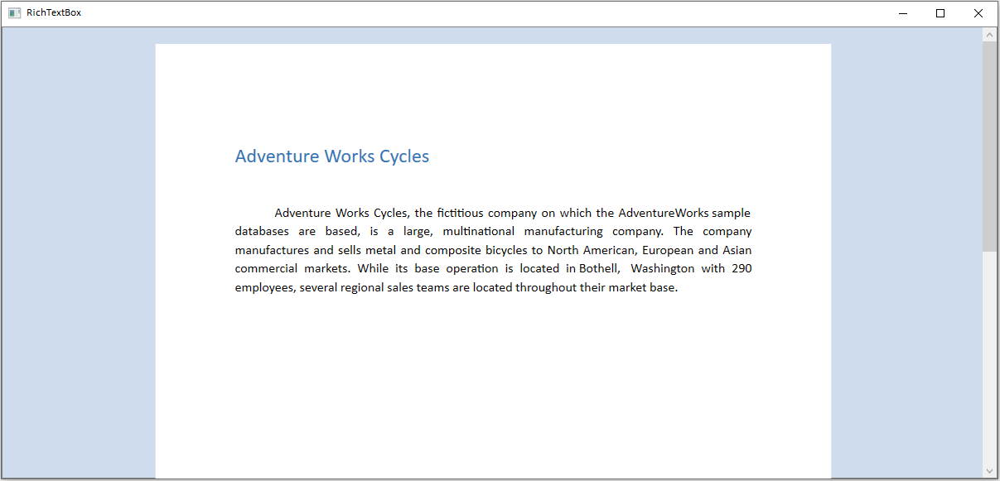
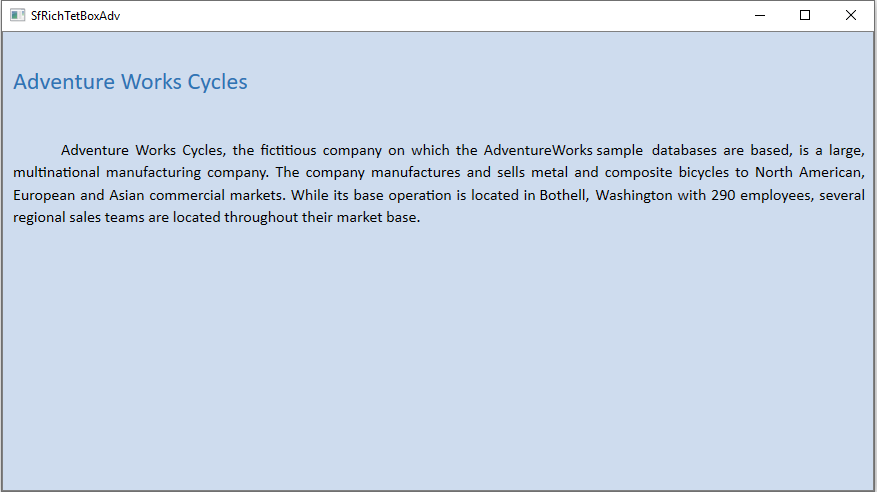
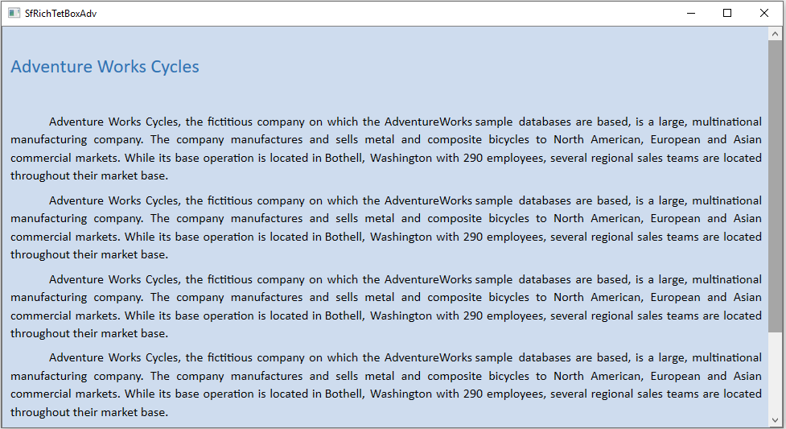
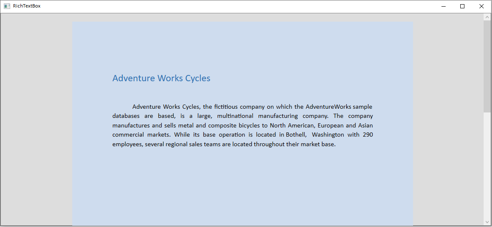

## Setting Background for RichTextBox
The RichTextBox control allows you to change background color of the control. A background of a control is represented by `Background` property of `SfRichTextBoxAdv` class. The default value of this property is black.

The following code illustrates how to apply color as background to the document.



<RichTextBoxAdv:SfRichTextBoxAdv x:Name="richTextBoxAdv" Background="#6699cc" />



// Initializes a new instance of RichTextBoxAdv.
SfRichTextBoxAdv richTextBoxAdv = new SfRichTextBoxAdv();
// Sets the control background color
richTextBoxAdv.Background = new SolidColorBrush(Color.FromRgb(102, 153, 204));



' Initializes a new instance of RichTextBoxAdv.
Dim richTextBoxAdv As New SfRichTextBoxAdv()

' Sets the control background color.
richTextBoxAdv.Background = new SolidColorBrush(Color.FromRgb(102, 153, 204))





Pages layout

Continuous layout

Block layout
The block layout always inherits the control background color.

### How to override the document background in continuous layout type?
By default, the document background properties will be applied when the `LayoutType` is continuous. You can suppress the document background and apply the control background by setting `OverridesDocumentBackground` property to true. The default value of this property is false.

N> This property is valid only when the `LayoutType` is continuous.

The following code illustrates how to override the document background color.



<RichTextBoxAdv:SfRichTextBoxAdv x:Name="richTextBoxAdv" LayoutType="Continuous" Background="#6699cc" OverridesDocumentBackground="True" />



// Initializes a new instance of RichTextBoxAdv.
SfRichTextBoxAdv richTextBoxAdv = new SfRichTextBoxAdv();
// Sets the control background color
richTextBoxAdv.Background = new SolidColorBrush(Color.FromRgb(102, 153, 204));
// Sets the layout type as continous 
richTextBoxAdv.LayoutType = LayoutType.Continuous;
//Enable the OverridesDocumentBackground property 
richTextBoxAdv.OverridesDocumentBackground = true;



' Initializes a new instance of RichTextBoxAdv.
Dim richTextBoxAdv As New SfRichTextBoxAdv()
' Sets the control background color.
richTextBoxAdv.Background = new SolidColorBrush(Color.FromRgb(102, 153, 204))
' Sets the layout type as continous 
richTextBoxAdv.LayoutType = LayoutType.Continuous
' Enable the OverridesDocumentBackground property
richTextBoxAdv.OverridesDocumentBackground = true





Continuous layout:

## Setting Background for Document Pages

The RichTextBox control allows you to change background color of the document pages. A background of a document is represented by `Background` property of `DocumentAdv` class. The default value of this property is white.

N> 1. This property is independent for a document. So the background will change when the document is changed.
N> 2. To maintain same background for all documents, you can reset this property in DocumentChanged event.

The following code illustrates how to apply color as background to the document pages.



// Initializes a new instance of RichTextBoxAdv.
SfRichTextBoxAdv richTextBoxAdv = new SfRichTextBoxAdv();
// Sets the document background color
richTextBoxAdv.Document.Background.Color = Color.FromRgb(102, 153, 204);



' Initializes a new instance of RichTextBoxAdv.
Dim richTextBoxAdv As New SfRichTextBoxAdv()
' Sets the document background color.
richTextBoxAdv.Document.Background.Color = Color.FromRgb(102, 153, 204)





Pages layout:

Continuous layout:

N> This API is supported starting from release version v17.4.0.X.
