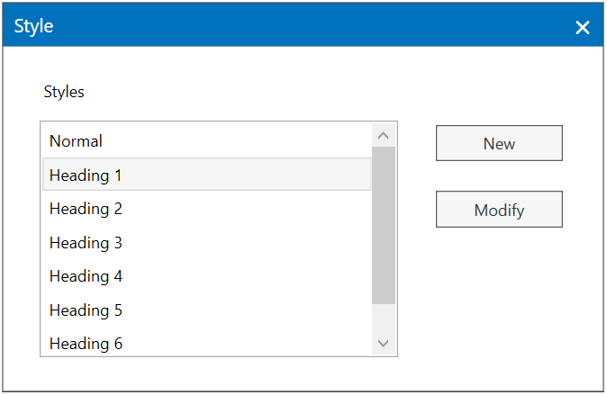

# Document Styles in WPF RichTextBox (SfRichTextBoxAdv)

A style is a predefined set of table, numbering, paragraph, and character formatting properties that can be applied to regions within a document.
In RichTextBoxAdv, styles are created and added to a document programmatically or using the built-in Styles dialog.

A style in a document should have the following properties:
### Name
Name of the style. All styles in a document have a unique name, which is used as an identifier when applying the style.

### Type
Specifies the document elements that the style will target. For example, paragraph or character.

### Next
Specifies the style that will be automatically applied to a new paragraph, which is created following a paragraph with the parent paragraph style applied.

### Link
Provides a relation between the paragraph and character style.

### CharacterFormat
Specifies the properties of paragraph and character style.

### ParagraphFormat
Specifies the properties of paragraph style.

### BasedOn
Specifies that the current style inherits the style set to this property. This is how hierarchical styles are defined. It can be optional.

N> The style type should match the inherited style type. For example, it is not possible to have a character style inherit a paragraph style.

## Default style
The default style for span and paragraph properties is normal. It internally inherits the default style of the document loaded or RichTextBoxAdv control.

## Style hierarchy
Each style initially checks its local value for the property that is being evaluated and turns to the style it is based on. If no local value is found, it turns to its default style.

Style inheritance of different styles are listed as follows:

### Character style
Character styles are based only on other character styles, and character properties are inherited from the base character style.

### Paragraph style
Paragraph styles are based on other paragraph styles or on linked styles.

When a paragraph style is based on another paragraph style, the inheritance of the properties is as follows:

* Paragraph properties are inherited from the base paragraph style.
* Span properties are inherited from the base paragraph style.

When a paragraph style is based on a linked style, the inheritance of the properties is as follows:

* Paragraph properties are inherited from the paragraph style part in its base linked style.
* Span properties are inherited from the span style part in its base linked style.

### Linked style
Linked styles are composite styles and their components are paragraph and character styles with link between them. To apply paragraph properties, take the properties from the linked paragraph style. Similarly, to apply character properties, take the properties from linked character style.
Linked styles are based on other linked styles or on paragraph styles.

When a linked style is based on a paragraph style, the hierarchy of the properties is as follows:

* Paragraph properties are inherited from its base paragraph style.
* Character properties are inherited from its base character style.

When a linked style is based on another linked style, the hierarchy of the properties is as follows:

* Paragraph properties are inherited from the paragraph style part in its base linked style.
* Span properties are inherited from the character style part in its base linked style.

SfRichTextBoxAdv provides the following functionalities related with styles:

* Create new style
* Modify an existing style
* Apply style
* Clear formatting

## Create new style
New styles are created and added to the style collection of the document. Here, you can create character, paragraph and linked type styles.

The following code example explains how to create new style dialog through command binding.


<Button Content="Create style" Command="Syncfusion:SfRichTextBoxAdv.ShowStyleDialogCommand" CommandTarget="{Binding ElementName=richTextBoxAdv}" ></Button>



## Modify an existing style
You can modify a style directly using the ShowStylesDialogCommand in SfRichTextBoxAdv.

The following code example explains how to modify the style dialog through command binding.


<Button Content="Modify style" Command="Syncfusion:SfRichTextBoxAdv.ShowStylesDialogCommand" CommandTarget="{Binding ElementName=richTextBoxAdv}"></Button>



From the styles list select a style you want to modify.

In the Formatting section, make any formatting changes you want, such as font style, size, or color, alignment, line spacing, or indentation.

## Apply style
The styles are applied using the ApplyStyleCommand in SfRichTextBoxAdv. The parameter should be passed is the Name of the Style.

The styles of the Character type are applied to the currently selected part of the document. If there is no selection, the values that will be applied to the word at caret position. The styles of Paragraph type follow the same logic and are applied to all paragraphs in the selection or the current paragraph.

When there is no selection, styles of Linked type will change the values of the paragraph and apply both the Paragraph and Character properties. When there is selection, Linked Style changes only the character properties of the selected text.

The following code example explains how to apply style through command binding.


<Button Content="Apply style" Command="Syncfusion:SfRichTextBoxAdv.ApplyStyleCommand" CommandTarget="{Binding ElementName=richTextBoxAdv}" CommandParameter="Heading 1"></Button>



## Clear formatting
It will remove all the formatting from the selection leaving only the normal unformatted text. But when there is no selection, it will remove only the formatting inherited from style.

The following code example explains how to clear the formatting of text through command binding.


<Button Content="Clear formatting" Command="Syncfusion:SfRichTextBoxAdv.ClearFormattingCommand" CommandTarget="{Binding ElementName=richTextBoxAdv}"></Button>


