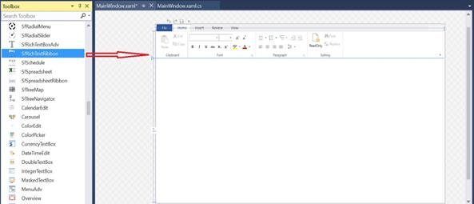

# Getting Started in WPF RichTextBox

This section describes how to get started with SfRichTextBoxAdv control.

## Assembly Reference

You can find SfRichTextBoxAdv control from the following assembly under the namespace Syncfusion.Windows.Controls.RichTextBoxAdv

* Syncfusion.SfRichTextBoxAdv.WPF

The following assembly references are required to deploy SfRichTextBoxAdv control in your application.

* Syncfusion.Compression.Base

* Syncfusion.OfficeChart.Base

* Syncfusion.Shared.WPF

* For 3.5 and 4.0 Frameworks – Syncfusion.DocIO.ClientProfile

* For 4.5 and higher Frameworks – Syncfusion.DocIO.Base

N> Starting with v16.2.0.41 (2018 Vol 2), if you reference Syncfusion assemblies from trial setup or from the NuGet feed, you also have to add "Syncfusion.Licensing" assembly reference and include a license key in your projects. Please refer to this [link](https://help.syncfusion.com/common/essential-studio/licensing/license-key) to know about registering Syncfusion license key in your WPF application to use our components.

## Adding SfRichTextBoxAdv to an application

After adding the aforementioned assembly references to your application, you can add SfRichTextBoxAdv as any normal control.
You can either drag the SfRichTextBoxAdv control from the toolbox window to the Design view or directly define the control in XAML view.



<RichTextBoxAdv:SfRichTextBoxAdv x:Name="richTextBoxAdv" xmlns:RichTextBoxAdv="clr-namespace:Syncfusion.Windows.Controls.RichTextBoxAdv;assembly=Syncfusion.SfRichTextBoxAdv.Wpf" />



// Initializes a new instance of RichTextBoxAdv.
SfRichTextBoxAdv richTextBoxAdv = new SfRichTextBoxAdv();





## Using SfRichTextBoxAdv as a standard RichTextBox

This section discusses about how to use the SfRichTextBoxAdv control as a standard RichTextBox control with rich text formatting options.



<Window x:Class="Sample.MainWindow"
        xmlns="http://schemas.microsoft.com/winfx/2006/xaml/presentation"
        xmlns:x="http://schemas.microsoft.com/winfx/2006/xaml"  
       xmlns:RichTextBoxAdv="clr-namespace:Syncfusion.Windows.Controls.RichTextBoxAdv;assembly=Syncfusion.SfRichTextBoxAdv.Wpf">
    
    
    <Window.Resources>
        <RichTextBoxAdv:UnderlineToggleConverter x:Key="UnderlineToggleConverter"/>
        <RichTextBoxAdv:LeftAlignmentToggleConverter x:Key="LeftAlignmentToggleConverter"/>
        <RichTextBoxAdv:CenterAlignmentToggleConverter x:Key="CenterAlignmentToggleConverter"/>
        <RichTextBoxAdv:RightAlignmentToggleConverter x:Key="RightAlignmentToggleConverter"/>
        <RichTextBoxAdv:JustifyAlignmentToggleConverter x:Key="JustifyAlignmentToggleConverter"/>
        
        
    </Window.Resources>

    <Grid Background="#F1F1F1">
        <Grid.RowDefinitions>
            <RowDefinition Height="Auto"/>
            <RowDefinition Height="*"/>
        </Grid.RowDefinitions>
        <Grid>
            <!-- Defines the data context as RichTextBoxAdv -->
            <StackPanel Orientation="Horizontal" DataContext="{Binding ElementName=richTextBoxAdv}">
                <!-- UI option to perform Undo/Redo using command binding -->
                <StackPanel Orientation="Horizontal">
                    <Button Command="RichTextBoxAdv:SfRichTextBoxAdv.UndoCommand" CommandTarget="{Binding ElementName=richTextBoxAdv}" Focusable="False">
                        <Image Source="/Images/Undo.png" Height="40" Width="40" />
                    </Button>
                    <Button Command="RichTextBoxAdv:SfRichTextBoxAdv.RedoCommand" CommandTarget="{Binding ElementName=richTextBoxAdv}" Focusable="False">
                        <Image Source="/Images/Redo.png" Height="40" Width="40" />
                    </Button>
                </StackPanel>
                <!-- UI option to perform Clipboard operations using command binding -->
                <Border Width="2" Height="46" Background="#1F1F1F"/>
                <StackPanel Orientation="Horizontal">
                    <Button Command="RichTextBoxAdv:SfRichTextBoxAdv.CutCommand" CommandTarget="{Binding ElementName=richTextBoxAdv}" Focusable="False">
                        <Image Source="/Images/Cut.png" Height="40" Width="40" />
                    </Button>
                    <Button Command="RichTextBoxAdv:SfRichTextBoxAdv.CopyCommand" CommandTarget="{Binding ElementName=richTextBoxAdv}" Focusable="False">
                        <Image Source="/Images/Copy.png" Height="40" Width="40" />
                    </Button>
                    <Button Command="RichTextBoxAdv:SfRichTextBoxAdv.PasteCommand" CommandTarget="{Binding ElementName=richTextBoxAdv}" Focusable="False">
                        <Image Source="/Images/Paste.png" Height="40" Width="40" />
                    </Button>
                </StackPanel>
                <!-- UI option to apply character formatting using property binding -->
                <Border Width="2" Height="46" Background="#1F1F1F"/>
                <StackPanel Orientation="Horizontal">
                    <ToggleButton IsChecked="{Binding Selection.CharacterFormat.Bold}" Focusable="False">
                        <Image Source="/Images/Bold.png" Height="40" Width="40" />
                    </ToggleButton>
                    <ToggleButton IsChecked="{Binding Selection.CharacterFormat.Italic}" Focusable="False">
                        <Image Source="/Images/Italic.png" Height="40" Width="40" />
                    </ToggleButton>
                    <ToggleButton IsChecked="{Binding Selection.CharacterFormat.Underline, Converter={StaticResource UnderlineToggleConverter}}" Focusable="False">
                        <Image Source="/Images/Underline.png" Height="40" Width="40" />
                    </ToggleButton>
                </StackPanel>
                <Border Width="2" Height="46" Background="#1F1F1F"/>
                <!-- UI option to apply paragraph formatting using property binding -->
                <StackPanel Orientation="Horizontal">
                    <ToggleButton IsChecked="{Binding Selection.ParagraphFormat.TextAlignment, Converter={StaticResource LeftAlignmentToggleConverter}}" Focusable="False">
                        <Image Source="/Images/Left.png" Height="40" Width="40" />
                    </ToggleButton>
                    <ToggleButton IsChecked="{Binding Selection.ParagraphFormat.TextAlignment, Converter={StaticResource CenterAlignmentToggleConverter}}" Focusable="False">
                        <Image Source="/Images/Center.png" Height="40" Width="40" />
                    </ToggleButton>
                    <ToggleButton IsChecked="{Binding Selection.ParagraphFormat.TextAlignment, Converter={StaticResource RightAlignmentToggleConverter}}" Focusable="False">
                        <Image Source="/Images/Right.png" Height="40" Width="40" />
                    </ToggleButton>
                    <ToggleButton IsChecked="{Binding Selection.ParagraphFormat.TextAlignment, Converter={StaticResource JustifyAlignmentToggleConverter}}" Focusable="False">
                        <Image Source="/Images/Justify.png" Height="40" Width="40" />
                    </ToggleButton>
                </StackPanel>
            </StackPanel>
        </Grid>
        <RichTextBoxAdv:SfRichTextBoxAdv x:Name="richTextBoxAdv" Grid.Row="1"  />
    </Grid>

</Window>





N> [View Standard RichTextBox example in GitHub](https://github.com/SyncfusionExamples/WPF-RichTextBox-Examples/tree/main/Samples/Standard%20RichTextBox)

## Creating Document editor with Ribbon

This section discusses about how to create document editor with ribbon similar to Microsoft Word. The SfRichTextRibbon is a Ribbon control customized to work with SfRichTextBoxAdv control, which gives you the look and feel of Microsoft Word.
You can find the SfRichTextRibbon control from the following assembly under the namespace Syncfusion.Windows.Controls.RichTextBoxAdv

* Syncfusion.SfRichTextRibbon.WPF

The following assembly reference are additionally required to deploy SfRichTextRibbon control along with aforementioned assemblies.

* Syncfusion.Tools.WPF

### Adding the Control via Designer

1.Create new WPF application in Visual Studio

2.Use the Syncfusion RibbonWindow instead of Window

3.Drag the SfRichTextRibbon control from the Toolbox window to the Design View. An instance of the SfRichTextRibbon control is created in the Design view

4.Drag the SfRichTextBoxAdv control from the Toolbox window to the Design View. An instance of the SfRichTextBoxAdv control is created in the Design view

5.To make an interaction between SfRichTextRibbon and SfRichTextBoxAdv, bind the SfRichTextBoxAdv as DataContext to the SfRichTextRibbon



<Syncfusion:SfRichTextRibbon x:Name="richTextRibbon SnapsToDevicePixels="True" DataContext="{Binding ElementName=richTextBoxAdv}" /> 





### Adding Control via code.

You can also add the SfRichTextRibbon and SfRichTextBoxAdv programmatically by using XAML



<Syncfusion:RibbonWindow x:Class="DocumentEditor.MainWindow"
        xmlns="http://schemas.microsoft.com/winfx/2006/xaml/presentation"
        xmlns:x="http://schemas.microsoft.com/winfx/2006/xaml"
        xmlns:d="http://schemas.microsoft.com/expression/blend/2008"
        xmlns:mc="http://schemas.openxmlformats.org/markup-compatibility/2006"
        xmlns:local="clr-namespace:DocumentEditor"
        mc:Ignorable="d"
        xmlns:Syncfusion="http://schemas.syncfusion.com/wpf"
        Title="MainWindow" Height="350" Width="525" Syncfusion:SkinStorage.VisualStyle="Office2013">
    <Grid>
        <Grid.RowDefinitions>
            <RowDefinition Height="Auto"/>
            <RowDefinition Height="*"/>
        </Grid.RowDefinitions>
        <Syncfusion:SfRichTextRibbon x:Name="richTextRibbon" SnapsToDevicePixels="True"/>
        <Syncfusion:SfRichTextBoxAdv x:Name="richTextBoxAdv" Background="#F1F1F1" Grid.Row="1"></Syncfusion:SfRichTextBoxAdv>
    </Grid>
</Syncfusion:RibbonWindow>





N> Prefer using `SfRichTextRibbon` within `RibbonWindow` in your application, since the backstage of Ribbon will be opened only when the ribbon is loaded under the `RibbonWindow`

Finally, you can get the following output similar to Microsoft Word on executing the application
