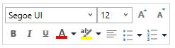

# Mini Toolbar in WPF RichTextBox (SfRichTextBoxAdv)

The SfRichTextBoxAdv supports built-in mini toolbar to provide rich text formatting options such as Bold, Italic etc. The following screenshot shows built-in mini toolbar of SfRichTextBoxAdv control.

## Enable/Disable Mini Toolbar

In SfRichTextBoxAdv, the built-in mini toolbar is enabled by default. It is possible to enable/disable the built-in mini toolbar. The following code example demonstrates how to disable the built-in mini toolbar in SfRichTextBoxAdv.


<RichTextBoxAdv:SfRichTextBoxAdv x:Name="richTextBoxAdv" EnableMiniToolBar="False" xmlns:RichTextBoxAdv="clr-namespace:Syncfusion.Windows.Controls.RichTextBoxAdv;assembly=Syncfusion.SfRichTextBoxAdv.Wpf" />



// Initializes a new instance of RichTextBoxAdv.
SfRichTextBoxAdv richTextBoxAdv = new SfRichTextBoxAdv();

//Disables the built-in mini tool bar in SfRichTextBoxAdv.
richTextBoxAdv.EnableMiniToolBar = false;



' Initializes a new instance of RichTextBoxAdv.
Dim richTextBoxAdv As New SfRichTextBoxAdv()

'Disables the built-in mini tool bar in SfRichTextBoxAdv.
richTextBoxAdv.EnableMiniToolBar = False




N> You can refer to our [WPF RichTextBox](https://www.syncfusion.com/wpf-controls/richtextbox) feature tour page for its groundbreaking feature representations.You can also explore our [WPF RichTextBox example](https://github.com/syncfusion/wpf-demos/tree/master/richtextbox) to knows how to render and configure the editing tools.