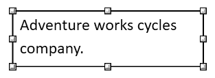

# Shapes in WPF RichTextBox (SfRichTextBoxAdv)
Shapes are drawing objects that include a text box, rectangles, lines, curves, circles, etc. It can be preset or custom geometry. At present, RichTextBox does not have support to insert shapes. however, if the document contains a shape while importing, it will be preserved properly.

N> Starting from v18.3.0.x, the shape preservation is supported.

## Supported shapes
The RichTextBox has preservation support for Text box and Rectangle shapes.

## Text box Shape
A text box is a rectangular area on the document where you can enter text. When you click in a text box, a flashing cursor will display indicating that you can begin typing. It allows you to enter multiple lines of text with all text formatting.

## Shape Resizer
The RichTextBox also supports a built-in shape resizer to resize the shapes present in the document. The shape resizer accepts both touch and mouse interactions.

## Text wrapping style
Text wrapping refers to how shapes fit with surrounding text in a document. Please [refer to this page](/wpf/richtextbox/text-wrapping) for more information about text wrapping styles available in Word documents.

## Positioning the shape
Starting from v19.1.0.x, RichTextBox preserves the position properties of the shape and displays the shape based on position properties. It does not support modifying the position properties. Whereas the shape will be automatically moved along with text edited if it is positioned relative to the line or paragraph.

N> At present, the shape with text wrapping style – `In-Line with Text` can only be dragged and dropped anywhere in the document.

