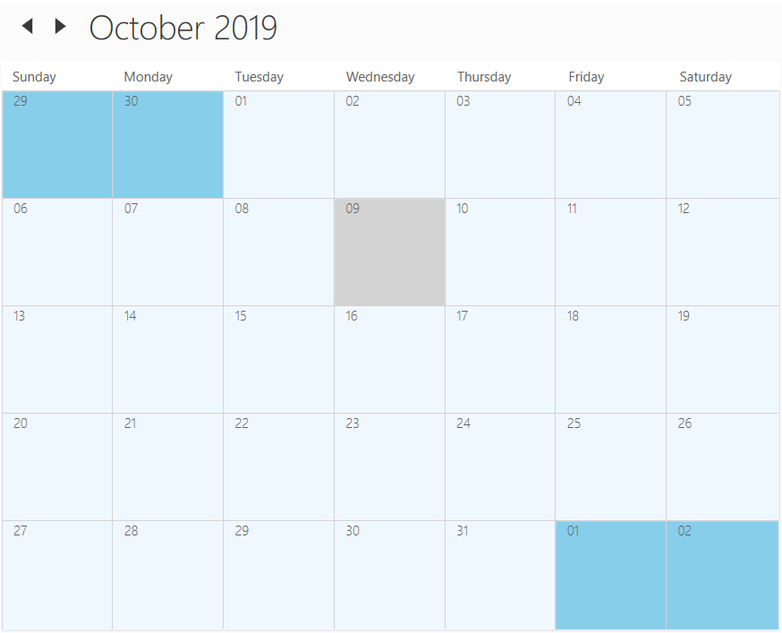
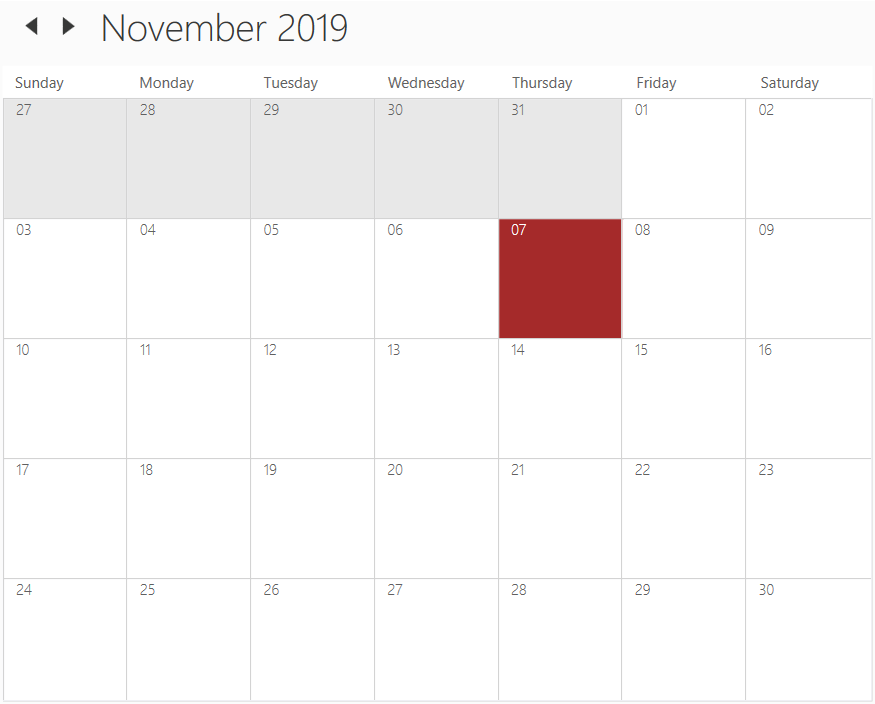

# Month view Of WPF SfSchedule
Scheduler used to display entire dates of the specific month, current month will be displayed by default initially. `Month` view displays the month of dates similar to calendar and displays appointments for each day in a cell similar to outlook. 

## Change header date format
Scheduler supports to change header format of the month view by using [MonthHeaderDateFormat](https://help.syncfusion.com/cr/cref_files/wpf/Syncfusion.SfSchedule.WPF~Syncfusion.UI.Xaml.Schedule.SfSchedule~MonthHeaderDateFormat.html) property.



<Schedule:SfSchedule ScheduleType="Month" MonthHeaderDateFormat="dd/MM"/>


this.schedule.ScheduleType = ScheduleType.Month;
this.schedule.HeaderDateFormat = "dd/MM;



## Change header background
Scheduler supports to change the header background by using [HeaderBackground](https://help.syncfusion.com/cr/cref_files/wpf/Syncfusion.SfSchedule.WPF~Syncfusion.UI.Xaml.Schedule.SfSchedule~HeaderBackground.html) property.



<Schedule:SfSchedule ScheduleType="Month" HeaderBackground="Cyan"/>


this.schedule.ScheduleType = ScheduleType.Month;
this.schedule.HeaderBackground = Brushes.Cyan;



## Change first day of week
Scheduler supports to change the first day of week by using [FirstDayOfWeek](https://help.syncfusion.com/cr/cref_files/wpf/Syncfusion.SfSchedule.WPF~Syncfusion.UI.Xaml.Schedule.SfSchedule~FirstDayOfWeek.html) property.



<Schedule:SfSchedule ScheduleType="Month" FirstDayOfWeek="Tuesday"/>


this.schedule.ScheduleType = ScheduleType.Month;
this.schedule.FirstDayOfWeek = DayOfWeek.Tuesday;



## Change active and inactive month dates background
Scheduler supports to change the active and inactive month background by using [FocusedMonth](https://help.syncfusion.com/cr/cref_files/wpf/Syncfusion.SfSchedule.WPF~Syncfusion.UI.Xaml.Schedule.SfSchedule~FocusedMonth.html) and [NonFocusedMonth](https://help.syncfusion.com/cr/cref_files/wpf/Syncfusion.SfSchedule.WPF~Syncfusion.UI.Xaml.Schedule.SfSchedule~NonFocusedMonth.html) property.



<Schedule:SfSchedule ScheduleType="Month" FocusedMonth="AliceBlue" NonFocusedMonth = "SkyBlue"/>


this.schedule.ScheduleType = ScheduleType.Month;
this.schedule.FocusedMonth = Brushes.AliceBlue;
this.schedule.NonFocusedMonth = Brushes.SkyBlue;



## Change the border color
Scheduler support to change the header items border color by using [MonthViewLineStroke](https://help.syncfusion.com/cr/wpf/Syncfusion.SfSchedule.WPF~Syncfusion.UI.Xaml.Schedule.SfSchedule~MonthViewLineStroke.html) property.



<Schedule:SfSchedule ScheduleType="Month" MonthViewLineStroke="BlueViolet"/>


this.schedule.ScheduleType = ScheduleType.Month;
this.schedule.MonthViewLineStroke = Brushes.BlueViolet;



## Change the selection background
Scheduler supports to change the selection background by using [CellSelectionBrush](https://help.syncfusion.com/cr/cref_files/wpf/Syncfusion.SfSchedule.WPF~Syncfusion.UI.Xaml.Schedule.SfSchedule~CellSelectionBrush.html)



<Schedule:SfSchedule ScheduleType="Month" CellSelectionBrush="SkyBlue"/>


this.schedule.ScheduleType = ScheduleType.Month;
this.schedule.CellSelectionBrush = Brushes.SkyBlue;



## Current day highlighting
Scheduler supports to change current day background and foreground for month view by using [CurrentDateBackground](https://help.syncfusion.com/cr/wpf/Syncfusion.SfSchedule.WPF~Syncfusion.UI.Xaml.Schedule.SfSchedule~CurrentDateBackground.html) and [CurrentDateForeground](https://help.syncfusion.com/cr/wpf/Syncfusion.SfSchedule.WPF~Syncfusion.UI.Xaml.Schedule.SfSchedule~CurrentDateForeground.html) property.



<syncfusion:SfSchedule ScheduleType="Month" CurrentDateBackground="Brown" CurrentDateForeground="White"/>


this.schedule.ScheduleType = ScheduleType.Month;
this.schedule.CurrentDateBackground = Brushes.Brown;
this.schedule.CurrentDateForeground = Brushes.White;



