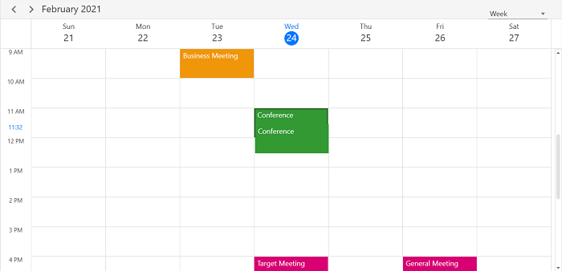

# Appointment drag and drop in WPF Scheduler (SfScheduler)
The Scheduler supports to reschedule the appointment by performing the drag and drop operation. 

## Disable drag and drop
The Scheduler supports to disable the appointment drag and drop by setting [AppointmentEditFlag](https://help.syncfusion.com/cr/wpf/Syncfusion.UI.Xaml.Scheduler.SfScheduler.html#Syncfusion_UI_Xaml_Scheduler_SfScheduler_AppointmentEditFlag) property except `DragDrop`. In this case, appointment drag & drop will not be able to perform. 



<syncfusion:SfScheduler x:Name="Schedule"
                        AppointmentEditFlag="Add,Edit,Resize">
 </syncfusion:SfScheduler>


this.Schedule.AppointmentEditFlag = AppointmentEditFlag.Add | AppointmentEditFlag.Edit | AppointmentEditFlag.Resize;



## Show/Hide the time indicator on appointment dragging
Show or hide the time indicator at a specific time when to drag the appointment by using the [ShowTimeIndicator](https://help.syncfusion.com/cr/wpf/Syncfusion.UI.Xaml.Scheduler.DragDropSettings.html#Syncfusion_UI_Xaml_Scheduler_DragDropSettings_ShowTimeIndicator) property of [DragDropSettings](https://help.syncfusion.com/cr/wpf/Syncfusion.UI.Xaml.Scheduler.DragDropSettings.html) is set to true. 



Schedule.ViewType = SchedulerViewType.Week;
Schedule.DragDropSettings.ShowTimeIndicator = true;



N>
* Not applicable for Month and Timeline Month views. 
* If the [TimeRulerSize](https://help.syncfusion.com/cr/wpf/Syncfusion.UI.Xaml.Scheduler.TimeSlotViewSettings.html#Syncfusion_UI_Xaml_Scheduler_TimeSlotViewSettings_TimeRulerSize) property value is zero to collapse the time ruler labels, then drag time indicator will not be shown.

## Appointment dragging time indicator text formatting
Customize the format for the appointment dragging time indicator format by setting the [TimeIndicatorFormat](https://help.syncfusion.com/cr/wpf/Syncfusion.UI.Xaml.Scheduler.DragDropSettings.html#Syncfusion_UI_Xaml_Scheduler_DragDropSettings_TimeIndicatorFormat) property of [DragDropSettings](https://help.syncfusion.com/cr/wpf/Syncfusion.UI.Xaml.Scheduler.DragDropSettings.html) in Scheduler.



Schedule.ViewType = SchedulerViewType.Week;
Schedule.DragDropSettings.TimeIndicatorFormat = "HH mm tt";



N>
* When dragging the appointment, the time indicator overlaps with the time ruler label position in the day, week and workweek views. 

## AppointmentDragOver event
Scheduler notifies by [AppointmentDragOver](https://help.syncfusion.com/cr/wpf/Syncfusion.UI.Xaml.Scheduler.SfScheduler.html) while dragging the appointment. [AppointmentDragOverEventArgs](https://help.syncfusion.com/cr/wpf/Syncfusion.UI.Xaml.Scheduler.AppointmentDragOverEventArgs.html) has following members which provides information for `AppointmentDragOver` event.

[Appointment](https://help.syncfusion.com/cr/wpf/Syncfusion.UI.Xaml.Scheduler.AppointmentDragOverEventArgs.html#Syncfusion_UI_Xaml_Scheduler_AppointmentDragOverEventArgs_Appointment) - Gets the Appointment that is dragging.

[DraggingPoint](https://help.syncfusion.com/cr/wpf/Syncfusion.UI.Xaml.Scheduler.AppointmentDragOverEventArgs.html#Syncfusion_UI_Xaml_Scheduler_AppointmentDragOverEventArgs_DraggingPoint) - Gets the dragging point of schedule appointment UI.

[DraggingTime](https://help.syncfusion.com/cr/wpf/Syncfusion.UI.Xaml.Scheduler.AppointmentDragOverEventArgs.html#Syncfusion_UI_Xaml_Scheduler_AppointmentDragOverEventArgs_DraggingTime) - Gets the dragging time of the dragging appointment object.

[SourceResource](https://help.syncfusion.com/cr/wpf/Syncfusion.UI.Xaml.Scheduler.AppointmentDragOverEventArgs.html#Syncfusion_UI_Xaml_Scheduler_AppointmentDragOverEventArgs_SourceResource) - Gets the [SchedulerResource](https://help.syncfusion.com/cr/wpf/Syncfusion.UI.Xaml.Scheduler.SchedulerResource.html) where the appointment was located before starting the dragging. 

[TargetResource](https://help.syncfusion.com/cr/wpf/Syncfusion.UI.Xaml.Scheduler.AppointmentDragOverEventArgs.html#Syncfusion_UI_Xaml_Scheduler_AppointmentDragOverEventArgs_TargetResource) - Gets the `SchedulerResource` where the appointment is currently being dragged over.



this.Schedule.AppointmentDragOver += Schedule_AppointmentDragOver;

private void Schedule_AppointmentDragOver(object sender, AppointmentDragEventArgs e)
{
   //To notify when dragging the appointment.
}

  

## AppointmentDragStarting event
Scheduler notifies by [AppointmentDragStarting](https://help.syncfusion.com/cr/wpf/Syncfusion.UI.Xaml.Scheduler.SfScheduler.html) when start to drag the appointment. 
[AppointmentDragStartingEventArgs](https://help.syncfusion.com/cr/wpf/Syncfusion.UI.Xaml.Scheduler.AppointmentDragStartingEventArgs.html) has following members which provides information for `AppointmentDragStarting` event.

[Appointment](https://help.syncfusion.com/cr/wpf/Syncfusion.UI.Xaml.Scheduler.AppointmentDragStartingEventArgs.html#Syncfusion_UI_Xaml_Scheduler_AppointmentDragStartingEventArgs_Appointment) - Get the selected appointment.

[Cancel](https://docs.microsoft.com/en-us/dotnet/api/system.componentmodel.canceleventargs.cancel?view=netcore-3.1) - To avoid appointment dragging by enabling this property.

[Resource](https://help.syncfusion.com/cr/wpf/Syncfusion.UI.Xaml.Scheduler.AppointmentDragStartingEventArgs.html#Syncfusion_UI_Xaml_Scheduler_AppointmentDragStartingEventArgs_Resource) - Gets the resource of an appointment under which the appointment is located.



this.Schedule.AppointmentDragStarting += Schedule_AppointmentDragStarting;

private void Schedule_AppointmentDragStarting(object sender, AppointmentDragStartingEventArgs e)
{
   //To notify when start to drag the appointment.
}



## AppointmentDropping event
Scheduler is notified by [AppointmentDropping](https://help.syncfusion.com/cr/wpf/Syncfusion.UI.Xaml.Scheduler.SfScheduler.html) when the appointment is dropped.
 [AppointmentDroppingEventArgs](https://help.syncfusion.com/cr/wpf/Syncfusion.UI.Xaml.Scheduler.AppointmentDroppingEventArgs.html) has following members which provides information for `AppointmentDropping` event.

[Appointment](https://help.syncfusion.com/cr/wpf/Syncfusion.UI.Xaml.Scheduler.AppointmentDroppingEventArgs.html#Syncfusion_UI_Xaml_Scheduler_AppointmentDroppingEventArgs_Appointment) - Gets the selected appointment that is dragged and dropped.

[DropTime](https://help.syncfusion.com/cr/wpf/Syncfusion.UI.Xaml.Scheduler.AppointmentDroppingEventArgs.html#Syncfusion_UI_Xaml_Scheduler_AppointmentDroppingEventArgs_DropTime) - Gets the dropped time of the dragged appointment.

[Cancel](https://docs.microsoft.com/en-us/dotnet/api/system.componentmodel.canceleventargs.cancel?view=netcore-3.1) - To avoid appointment dropping by enabling this property.

[SourceResource](https://help.syncfusion.com/cr/wpf/Syncfusion.UI.Xaml.Scheduler.AppointmentDroppingEventArgs.html#Syncfusion_UI_Xaml_Scheduler_AppointmentDroppingEventArgs_SourceResource) - Gets the `SchedulerResource` where the appointment was located before starting the dragging.

[TargetResource](https://help.syncfusion.com/cr/wpf/Syncfusion.UI.Xaml.Scheduler.AppointmentDroppingEventArgs.html#Syncfusion_UI_Xaml_Scheduler_AppointmentDroppingEventArgs_TargetResource) - Gets the `SchedulerResource` where the appointment is currently being dragged over.



this.Schedule.AppointmentDropping += Schedule_AppointmentDropping;

private void Schedule_AppointmentDropping(object sender, AppointmentDroppingEventArgs e)
{
  //To notify when the appointment is dropping.
}

 