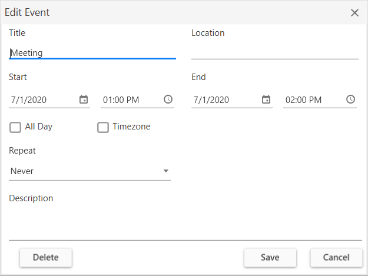
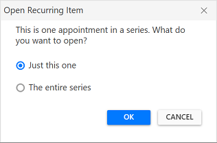
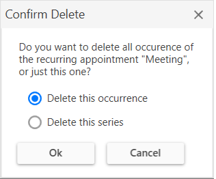

# Appointment Editing in WPF Scheduler (SfScheduler)
This section explains how to handle appointment editing in WPF scheduler and also explains about the appointment resizing.

## Adding appointments
Scheduler supports to add new appointment by using [Appointment Editor](https://help.syncfusion.com/cr/wpf/Syncfusion.UI.Xaml.Scheduler.SchedulerAppointmentEditorWindow.html) UI window. You can open this window by double click a time cell.

## Editing appointment
Scheduler supports to edit the appointment by using `Appointment Editor` UI window. You can open this window by double click over the appointment.

Appointment editor window

You can edit the appointments in appointment editor window. This changes will be saved back in appointment and mapped data object when using data binding. 

### Edit recurring appointment
Scheduler supports to edit the recurrence appointment. The following window will appear when you edit the recurrence appointment to select whether to edit only the particular occurrence or appointment series.

You can also handle the opening of recurrence popup window using [RecurringAppointmentEditMode](https://help.syncfusion.com/cr/wpf/Syncfusion.UI.Xaml.Scheduler.RecurringAppointmentEditMode.html) property in [AppointmentEditorOpeningEventArgs](https://help.syncfusion.com/cr/wpf/Syncfusion.UI.Xaml.Scheduler.AppointmentEditorOpeningEventArgs.html) by handling [AppointmentEditorOpening](https://help.syncfusion.com/cr/wpf/Syncfusion.UI.Xaml.Scheduler.SfScheduler.html) event.

### AppointmentEditorOpening event
When you opens the appointment editor UI window to add or update appointment, then Scheduler notifies by [AppointmentEditorOpening](https://help.syncfusion.com/cr/wpf/Syncfusion.UI.Xaml.Scheduler.SfScheduler.html) event.

[AppointmentEditorOpeningEventArgs](https://help.syncfusion.com/cr/wpf/Syncfusion.UI.Xaml.Scheduler.AppointmentEditorOpeningEventArgs.html) has following members which provides the information for [AppointmentEditorOpening](https://help.syncfusion.com/cr/wpf/Syncfusion.UI.Xaml.Scheduler.SfScheduler.html) event.

[Appointment](https://help.syncfusion.com/cr/wpf/Syncfusion.UI.Xaml.Scheduler.AppointmentEditorOpeningEventArgs.html#Syncfusion_UI_Xaml_Scheduler_AppointmentEditorOpeningEventArgs_Appointment) - Gets the selected appointment details which is being updated. It will be null when adding new appointment through appointment editor. 

[DateTime](https://help.syncfusion.com/cr/wpf/Syncfusion.UI.Xaml.Scheduler.AppointmentEditorOpeningEventArgs.html#Syncfusion_UI_Xaml_Scheduler_AppointmentEditorOpeningEventArgs_DateTime) - Get the DateTime of time slot or month cell where user double clicked.

[Cancel](https://docs.microsoft.com/en-us/dotnet/api/system.componentmodel.canceleventargs.cancel?view=netcore-3.1) - To avoid the default appointment editor showing by enabling this property.

[RecurrenceEditMode](https://help.syncfusion.com/cr/wpf/Syncfusion.UI.Xaml.Scheduler.AppointmentEditorOpeningEventArgs.html#Syncfusion_UI_Xaml_Scheduler_AppointmentEditorOpeningEventArgs_RecurrenceEditMode) - Get or Sets the edit mode to perform the edit option to edit the occurrence or series for recurrence appointment. The default value of `RecurrenceEditMode` is `User`.
* User - Default window dialog will appear when editing a recurrence appointment to select the edit option from the end-user itself.
* Occurrence - Edit the particular occurrence alone in recurrence appointment. Default window dialog will not appear.
* Series - Edit the entire series in recurrence appointment. Default window dialog will not appear.

For example, To use custom appointment editor window instead of default appointment editor window you can handle `AppointmentEditorOpening` event.



 this.Schedule.AppointmentEditorOpening += Schedule_AppointmentEditorOpening;

 private void Schedule_AppointmentEditorOpening(object sender, AppointmentEditorOpeningEventArgs e)
        {
            //To handle the default appointment editior window by setting the e.Cancel value as true.
            e.Cancel = true;
            if (e.Appointment != null)
            {
                //Display the custom appointment editor window to edit the appointment
            }
            else
            {
                //Display the custom appointment editor window to add new appointment
            }
        }    



### AppointmentEditorClosing event
When you close the appointment editor window after added or edited the schedule appointment, Scheduler notifies by [AppointmentEditorClosing](https://help.syncfusion.com/cr/wpf/Syncfusion.UI.Xaml.Scheduler.SfScheduler.html) event.

[AppointmentEditorClosingEventArgs](https://help.syncfusion.com/cr/wpf/Syncfusion.UI.Xaml.Scheduler.AppointmentEditorClosingEventArgs.html) has following members which provides the information for [AppointmentEditorClosing](https://help.syncfusion.com/cr/wpf/Syncfusion.UI.Xaml.Scheduler.SfScheduler.html) event.

[Handled](https://help.syncfusion.com/cr/wpf/Syncfusion.UI.Xaml.Scheduler.AppointmentEditorClosingEventArgs.html#Syncfusion_UI_Xaml_Scheduler_AppointmentEditorClosingEventArgs_Handled) - Gets or sets a value that indicates whether the scheduler can update the underlying appointments collection or appointment based on the action performed in appointment editor. If the value is true, scheduler does not perform the action and you have to write the code in the handler and perform the action. The default value of Handled is `false`.
       
[Appointment](https://help.syncfusion.com/cr/wpf/Syncfusion.UI.Xaml.Scheduler.AppointmentEditorClosingEventArgs.html#Syncfusion_UI_Xaml_Scheduler_AppointmentEditorClosingEventArgs_Appointment) - Gets the details of updated or newly added appointment.

[Cancel](https://docs.microsoft.com/en-us/dotnet/api/system.componentmodel.canceleventargs.cancel?view=netcore-3.1) - To avoid the default appointment editor closing by enabling this property.

[Action](https://help.syncfusion.com/cr/wpf/Syncfusion.UI.Xaml.Scheduler.AppointmentEditorClosingEventArgs.html#Syncfusion_UI_Xaml_Scheduler_AppointmentEditorClosingEventArgs_Action) - Gets the action of appointment which is Add, Edit, Delete or Cancel.

* Add - Specifies that appointment is newly added through appointment editor.
* Edit - Specifies that appointment is edited through appointment editor.
* Delete - Specifies that appointment is deleted through appointment editor.
* Cancel - Specifies that appointment editing is canceled through appointment editor.

For example, to handle the appointment adding for today's date, user can handle the `AppointmentEditorClosing` event.



this.Schedule.AppointmentEditorClosing += Schedule_AppointmentEditorClosing;

private void Schedule_AppointmentEditorClosing(object sender, AppointmentEditorClosingEventArgs e)
        {
            var appointment = e.Appointment as ScheduleAppointment;
            if (appointment != null)
            {
                if (appointment.StartTime.Day == DateTime.Now.Day)
                    e.Handled = true;
            }
        } 



## Disable appointment editing
To disable appointment editing functionality, Set [AppointmentEditFlag](https://help.syncfusion.com/cr/wpf/Syncfusion.UI.Xaml.Scheduler.SfScheduler.html#Syncfusion_UI_Xaml_Scheduler_SfScheduler_AppointmentEditFlag) property to `None`. In this case, you will not be able to perform add, edit, resize and drag & drop the appointments.



 <syncfusion:SfScheduler
            x:Name="Schedule"
           AppointmentEditFlag="None">
        </syncfusion:SfScheduler>



## Delete appointments
Scheduler supports two ways to remove the selected appointment.

1. Pressing <kbd>delete</kbd> key.
2. Using appointment editor window.

### Delete recurring appointment
Scheduler supports to delete the recurrence appointment. The following window will appear when user deletes the recurrence appointment. You can select the delete option to make the changes for occurrence or appointment series.

### AppointmentDeleting event 
Scheduler notifies by [AppointmentDeleting](https://help.syncfusion.com/cr/wpf/Syncfusion.UI.Xaml.Scheduler.SfScheduler.html) event, when user delete the appointment.

 [AppointmentDeletingEventArgs](https://help.syncfusion.com/cr/wpf/Syncfusion.UI.Xaml.Scheduler.AppointmentDeletingEventArgs.html) has following members which provides information for [AppointmentDeleting](https://help.syncfusion.com/cr/wpf/Syncfusion.UI.Xaml.Scheduler.SfScheduler.html) event.

[Appointment](https://help.syncfusion.com/cr/wpf/Syncfusion.UI.Xaml.Scheduler.AppointmentDeletingEventArgs.html#Syncfusion_UI_Xaml_Scheduler_AppointmentDeletingEventArgs_Appointment) - Gets the selected appointment to delete.

[Cancel](https://docs.microsoft.com/en-us/dotnet/api/system.componentmodel.canceleventargs.cancel?view=netcore-3.1) - To avoid appointment deleting by enabling this property.

[RecurrenceEditMode](https://help.syncfusion.com/cr/wpf/Syncfusion.UI.Xaml.Scheduler.AppointmentEditorOpeningEventArgs.html#Syncfusion_UI_Xaml_Scheduler_AppointmentEditorOpeningEventArgs_RecurrenceEditMode) - Gets or sets whether to delete series or occurrence when delete a recurrence appointment. The default value of RecurrenceEditMode is `User`.
* User - Default window dialog will appear when deleting a recurrence appointment to select the edit option from the end-user itself.
* Occurrence - Delete the particular occurrence alone in recurrence appointment. Default window dialog will not appear.
* Series - Delete the entire series in recurrence appointment. Default window dialog will not appear.



Schedule.AppointmentDeleting += Schedule_AppointmentDeleting;

private void Schedule_AppointmentDeleting(object sender, AppointmentDeletingEventArgs e)
{
  //To notify when restrict appointment delete
  e.Cancel = true;
}



## Appointment Resizing
Scheduler has support to resize the selected appointment. This support is available for all views except 'Month' view.

### Disable appointment resize
Scheduler supports to disable the appointment resizing by setting [AppointmentEditFlag](https://help.syncfusion.com/cr/wpf/Syncfusion.UI.Xaml.Scheduler.SfScheduler.html#Syncfusion_UI_Xaml_Scheduler_SfScheduler_AppointmentEditFlag) property except `Resize`. In this case, you will not be able to perform appointment resizing.



<syncfusion:SfScheduler x:Name="Schedule"
                        AppointmentEditFlag="Add,DragDrop,Edit">
 </syncfusion:SfScheduler>


 this.Schedule.AppointmentEditFlag = AppointmentEditFlag.Add | AppointmentEditFlag.DragDrop | AppointmentEditFlag.Edit;



### AppointmentResizing event
Scheduler notifies by [AppointmentResizing](https://help.syncfusion.com/cr/wpf/Syncfusion.UI.Xaml.Scheduler.SfScheduler.html) event when user resize an appointment.

[AppointmentResizingEventArgs](https://help.syncfusion.com/cr/wpf/Syncfusion.UI.Xaml.Scheduler.AppointmentResizingEventArgs.html) has following members which provides information for [AppointmentResizing](https://help.syncfusion.com/cr/wpf/Syncfusion.UI.Xaml.Scheduler.SfScheduler.html)  event.

[Appointment](https://help.syncfusion.com/cr/wpf/Syncfusion.UI.Xaml.Scheduler.AppointmentResizingEventArgs.html#Syncfusion_UI_Xaml_Scheduler_AppointmentResizingEventArgs_Appointment) - Gets the appointment being resized.

[Action](https://help.syncfusion.com/cr/wpf/Syncfusion.UI.Xaml.Scheduler.AppointmentResizingEventArgs.html#Syncfusion_UI_Xaml_Scheduler_AppointmentResizingEventArgs_Action) - Gets the current action being performed while resizing an appointment.
* Starting - Denotes event occurred when user mouse over the appointment to resize an appointment (before showing resize cursor).
* Progressing - Denotes event occurred when user resizing an appointment.
* Committing - Denotes event occurred when user ends the resizing by releasing pointer to commit the changed to underlying appointment.
* Canceling - Denotes the event occurred before canceling the resize operation when user press <kbd>Esc</kbd> key when resizing operation in progress.

[StartTime](https://help.syncfusion.com/cr/wpf/Syncfusion.UI.Xaml.Scheduler.AppointmentResizingEventArgs.html#Syncfusion_UI_Xaml_Scheduler_AppointmentResizingEventArgs_StartTime) - Gets the updated start time of appointment in resizing operation.

[EndTime](https://help.syncfusion.com/cr/wpf/Syncfusion.UI.Xaml.Scheduler.AppointmentResizingEventArgs.html#Syncfusion_UI_Xaml_Scheduler_AppointmentResizingEventArgs_EndTime) - Gets the updated end time of appointment in resizing operation.

[CanContinueResize](https://help.syncfusion.com/cr/wpf/Syncfusion.UI.Xaml.Scheduler.AppointmentResizingEventArgs.html#Syncfusion_UI_Xaml_Scheduler_AppointmentResizingEventArgs_CanContinueResize) - Gets or sets a value indicating whether resizing operation should be continued or canceled. You can set this property when Action is Starting, Progressing, Canceling.This property won’t have any effect for when Action is Committing.

[CanCommit](https://help.syncfusion.com/cr/wpf/Syncfusion.UI.Xaml.Scheduler.AppointmentResizingEventArgs.html#Syncfusion_UI_Xaml_Scheduler_AppointmentResizingEventArgs_CanCommit) - Gets or sets a value indicating whether to update underlying appointment when resizing operation is completed. You can set this property when Action is Canceling and Committing. This property won’t have any effect for when Action is Starting and Progressing.



this.Schedule.AppointmentResizing += Schedule_AppointmentResizing;

 private void Schedule_AppointmentResizing(object sender, AppointmentResizingEventArgs e)
        {
            //To notify when resizing the appointment. 
        }

