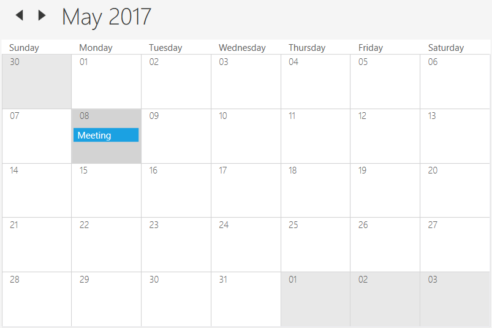
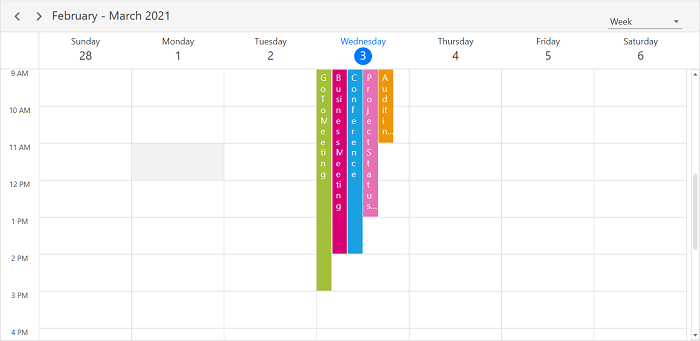
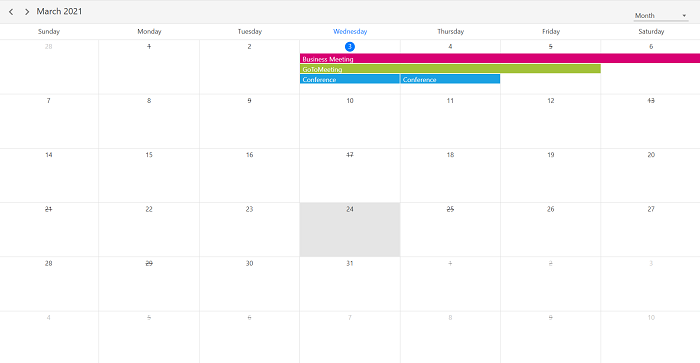
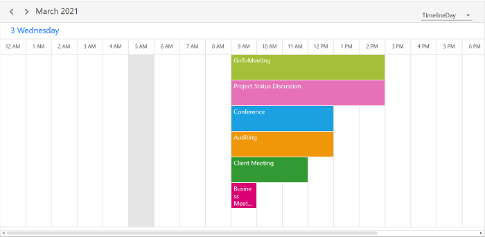
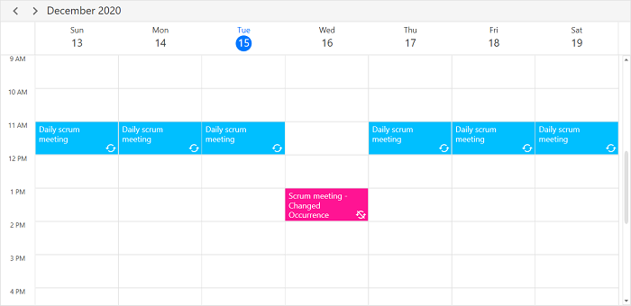

# Appointments in WPF Scheduler (SfScheduler)

The [SfScheduler](https://help.syncfusion.com/cr/wpf/Syncfusion.UI.Xaml.Scheduler.html) control has a built-in capability to handle the appointment arrangement internally based on the [ScheduleAppointmentCollection](https://help.syncfusion.com/cr/wpf/Syncfusion.UI.Xaml.Scheduler.ScheduleAppointmentCollection.html). The scheduler supports to render  normal, all-day appointments, spanned appointment, recurring appointments, and recurrence exception dates appointments.
The [ScheduleAppointment](https://help.syncfusion.com/cr/wpf/Syncfusion.UI.Xaml.Scheduler.ScheduleAppointment.html) is a class that includes the specific scheduled appointment. It has some basic properties such as [StartTime](https://help.syncfusion.com/cr/wpf/Syncfusion.UI.Xaml.Scheduler.ScheduleAppointment.html#Syncfusion_UI_Xaml_Scheduler_ScheduleAppointment_StartTime), [EndTime](https://help.syncfusion.com/cr/wpf/Syncfusion.UI.Xaml.Scheduler.ScheduleAppointment.html#Syncfusion_UI_Xaml_Scheduler_ScheduleAppointment_EndTime), [Subject](https://help.syncfusion.com/cr/wpf/Syncfusion.UI.Xaml.Scheduler.ScheduleAppointment.html#Syncfusion_UI_Xaml_Scheduler_ScheduleAppointment_Subject), and some additional information about the appointment can be added with [Notes](https://help.syncfusion.com/cr/wpf/Syncfusion.UI.Xaml.Scheduler.ScheduleAppointment.html#Syncfusion_UI_Xaml_Scheduler_ScheduleAppointment_Notes), [Location](https://help.syncfusion.com/cr/wpf/Syncfusion.UI.Xaml.Scheduler.ScheduleAppointment.html#Syncfusion_UI_Xaml_Scheduler_ScheduleAppointment_Location), and [IsAllDay](https://help.syncfusion.com/cr/wpf/Syncfusion.UI.Xaml.Scheduler.ScheduleAppointment.html#Syncfusion_UI_Xaml_Scheduler_ScheduleAppointment_IsAllDay) properties.



 <syncfusion:SfScheduler x:Name="Schedule"
                         ViewType="Week" 
                         ItemsSource="{Binding scheduleAppointmentCollection}">
 </syncfusion:SfScheduler


// Creating an instance for schedule appointment collection
var scheduleAppointmentCollection = new ScheduleAppointmentCollection();
//Adding schedule appointment in the schedule appointment collection 
scheduleAppointmentCollection.Add(new ScheduleAppointment()
{ 
	StartTime = new DateTime(2020, 12, 15, 10, 0, 0),
    EndTime = new DateTime(2020, 12, 15, 12, 0, 0),
	Subject = "Client Meeting", 
	Location = "Hutchison road", 
}); 

//Adding schedule appointment collection to the ItemSource of SfScheduler
Schedule.ItemsSource = scheduleAppointmentCollection;



N> [View sample in GitHub](https://github.com/SyncfusionExamples/adding-schedule-appointment-collection-to-the-itemsource-of-scheduler-wpf)

## Scheduler item source and Mapping
The `Scheduler` supports to bind any collection that implements the IEnumerable interface to populate appointments. You can map properties in business object to [ScheduleAppointment](https://help.syncfusion.com/cr/wpf/Syncfusion.UI.Xaml.Scheduler.ScheduleAppointment.html) by configuring the [AppointmentMapping](https://help.syncfusion.com/cr/wpf/Syncfusion.UI.Xaml.Scheduler.AppointmentMapping.html) property. The following table that property shows mapping property details to `ScheduleAppointment`.

<table>
<tr><th>Property Name</th><th>Description</th></tr>
<tr><td>{{'[StartTime](https://help.syncfusion.com/cr/wpf/Syncfusion.UI.Xaml.Scheduler.ScheduleAppointment.html#Syncfusion_UI_Xaml_Scheduler_ScheduleAppointment_StartTime)'| markdownify }}</td>
<td>Maps the property name of a custom class, which is equivalent to the StartTime of ScheduleAppointment.</td></tr>
<tr><td>{{'[EndTime](https://help.syncfusion.com/cr/wpf/Syncfusion.UI.Xaml.Scheduler.ScheduleAppointment.html#Syncfusion_UI_Xaml_Scheduler_ScheduleAppointment_EndTime)'| markdownify }}</td>
<td>Maps the property name of a custom class, which is equivalent to the EndTime of ScheduleAppointment.</td></tr>
<tr><td>{{'[StartTimeZone](https://help.syncfusion.com/cr/wpf/Syncfusion.UI.Xaml.Scheduler.ScheduleAppointment.html#Syncfusion_UI_Xaml_Scheduler_ScheduleAppointment_StartTimeZone)'| markdownify }}</td>
<td>Maps the property name of a custom class, which is equivalent to the StartTimeZone of ScheduleAppointment.</td></tr>
<tr><td>{{'[EndTimeZone](https://help.syncfusion.com/cr/wpf/Syncfusion.UI.Xaml.Scheduler.ScheduleAppointment.html#Syncfusion_UI_Xaml_Scheduler_ScheduleAppointment_EndTimeZone)'| markdownify }}</td>
<td>Maps the property name of a custom class, which is equivalent to the EndTimeZone of ScheduleAppointment.</td></tr>
<tr><td>{{'[Subject](https://help.syncfusion.com/cr/wpf/Syncfusion.UI.Xaml.Scheduler.ScheduleAppointment.html#Syncfusion_UI_Xaml_Scheduler_ScheduleAppointment_Subject)'| markdownify }}</td>
<td>Maps the property name of a custom class, which is equivalent to the Subject of ScheduleAppointment.</td></tr>
<tr><td>{{'[Id](https://help.syncfusion.com/cr/wpf/Syncfusion.UI.Xaml.Scheduler.ScheduleAppointment.html#Syncfusion_UI_Xaml_Scheduler_ScheduleAppointment_Id)'| markdownify }}</td>
<td>Maps the property name of a custom class, which is equivalent to the Id of ScheduleAppointment.</td></tr>
<tr><td>{{'[AppointmentBackground](https://help.syncfusion.com/cr/wpf/Syncfusion.UI.Xaml.Scheduler.ScheduleAppointment.html#Syncfusion_UI_Xaml_Scheduler_ScheduleAppointment_AppointmentBackground)'| markdownify }}</td>
<td>Maps the property name of a custom class, which is equivalent to the AppointmentBackground of ScheduleAppointment.</td></tr>
<tr><td>{{'[Foreground](https://help.syncfusion.com/cr/wpf/Syncfusion.UI.Xaml.Scheduler.ScheduleAppointment.html#Syncfusion_UI_Xaml_Scheduler_ScheduleAppointment_Foreground)'| markdownify }}</td>
<td>Maps the property name of a custom class, which is equivalent to the  Foreground of ScheduleAppointment.</td></tr>
<tr><td>{{'[IsAllDay](https://help.syncfusion.com/cr/wpf/Syncfusion.UI.Xaml.Scheduler.ScheduleAppointment.html#Syncfusion_UI_Xaml_Scheduler_ScheduleAppointment_IsAllDay)'| markdownify }}</td>
<td>Maps the property name of a custom class, which is equivalent to the IsAllDay of ScheduleAppointment.</td></tr>
<tr><td>{{'[RecurrenceRule](https://help.syncfusion.com/cr/wpf/Syncfusion.UI.Xaml.Scheduler.ScheduleAppointment.html#Syncfusion_UI_Xaml_Scheduler_ScheduleAppointment_RecurrenceRule)'| markdownify }}</td>
<td>Maps the property name of a custom class, which is equivalent to the RecurrenceRule of ScheduleAppointment.</td></tr>
<tr><td>{{'[RecurrenceId](https://help.syncfusion.com/cr/wpf/Syncfusion.UI.Xaml.Scheduler.ScheduleAppointment.html#Syncfusion_UI_Xaml_Scheduler_ScheduleAppointment_RecurrenceId)'| markdownify }}</td>
<td>Maps the property name of a custom class, which is equivalent to the RecurrenceId of ScheduleAppointment.</td></tr>
<tr><td>{{'[Notes](https://help.syncfusion.com/cr/wpf/Syncfusion.UI.Xaml.Scheduler.ScheduleAppointment.html#Syncfusion_UI_Xaml_Scheduler_ScheduleAppointment_Notes)'| markdownify }}</td>
<td>Maps the property name of a custom class, which is equivalent to the Notes of ScheduleAppointment.</td></tr>
<tr><td>{{'[Location](https://help.syncfusion.com/cr/wpf/Syncfusion.UI.Xaml.Scheduler.ScheduleAppointment.html#Syncfusion_UI_Xaml_Scheduler_ScheduleAppointment_Location)'| markdownify }}</td>
<td>Maps the property name of a custom class, which is equivalent to the Location of ScheduleAppointment.</td></tr>
<tr><td>{{'[RecurrenceExceptionDates](https://help.syncfusion.com/cr/wpf/Syncfusion.UI.Xaml.Scheduler.ScheduleAppointment.html#Syncfusion_UI_Xaml_Scheduler_ScheduleAppointment_RecurrenceExceptionDates)'| markdownify }}</td>
<td>Maps the property name of a custom class, which is equivalent to the RecurrenceExceptionDates of ScheduleAppointment.</td></tr>
<tr><td>{{'[ResourceIdCollection](https://help.syncfusion.com/cr/wpf/Syncfusion.UI.Xaml.Scheduler.ScheduleAppointment.html#Syncfusion_UI_Xaml_Scheduler_ScheduleAppointment_ResourceIdCollection)'| markdownify }}</td>
<td>Maps the property name of a custom class, which is equivalent to the ResourceIdCollection of ScheduleAppointment.</td></tr>
</table>

N>The CustomAppointment class should contain event start and end date time fields as mandatory

## Creating business objects
You can create a custom class `Meeting` with mandatory fields `From`, `To` and `EventName`.



/// 
   
/// Represents the custom data properties.   
/// 
 
public class Meeting
{
	public string EventName { get; set; }
	public DateTime From { get; set; }
	public DateTime To { get; set; }
    public Brush BackgroundColor { get; set; }
    public Brush ForegroundColor { get; set; }
}


N> You can map those properties of the `Meeting` class to schedule appointment by using the `AppointmentMapping` properties.


 <syncfusion:SfScheduler x:Name="Schedule"
                         ViewType="Week" 
                         ItemsSource="{Binding Meetings}">
    <syncfusion:SfScheduler.AppointmentMapping>
        <syncfusion:AppointmentMapping
            Subject="EventName"
            StartTime="From"
            EndTime="To"
            AppointmentBackground="BackgroundColor"
            Foreground="ForegroundColor"/>
    </syncfusion:SfScheduler.AppointmentMapping>
</syncfusion:SfScheduler>


//Schedule data mapping for custom appointments
AppointmentMapping dataMapping = new AppointmentMapping();
dataMapping.Subject = "EventName";
dataMapping.StartTime = "From";
dataMapping.EndTime = "To";
dataMapping.AppointmentBackground = "BackgroundColor";
dataMapping.Foreground = "ForegroundColor";
Schedule.AppointmentMapping = dataMapping;



You can schedule meetings for a day by setting `From` and `To` of Meeting class. Create meetings of type `ObservableCollection <Meeting>` and assign those appointments collection Meetings to the [ItemsSource](https://help.syncfusion.com/cr/wpf/Syncfusion.UI.Xaml.Scheduler.SfScheduler.html#Syncfusion_UI_Xaml_Scheduler_SfScheduler_ItemsSource) property which is of IEnumerable type.



//Creating an instance for the custom appointment class
Meeting meeting = new Meeting();
//Setting the start time of an event
meeting.From = new DateTime(2020, 12, 15, 10, 0, 0);
//Setting the end time of an event
meeting.To = meeting.From.AddHours(2);
//Setting the subject for an event
meeting.EventName = "Meeting";
//Setting the background color for an event
meeting.BackgroundColor = new SolidColorBrush(Colors.Green);
//Setting the foreground color for an event
meeting.ForegroundColor = new SolidColorBrush(Colors.White);
//Creating an instance for the collection of custom appointments
var Meetings = new ObservableCollection<Meeting>();
//Adding a custom appointment in the CustomAppointmentCollection
Meetings.Add(meeting);
//Adding custom appointments in the ItemsSource of SfScheduler
Schedule.ItemsSource = Meetings;



N> [View sample in GitHub](https://github.com/SyncfusionExamples/adding-custom-schedule-appointment-collection-to-the-itemsource-of-scheduler-wpf)

## Exact Time Rendering
`Scheduler` supports functionality to arrange appointments according to their start time and duration. Due to the great difference in the amount of time, which different time scales represent, appointments might become too small to render accurately in larger time scales.

### Week View

### Month View

### Timeline View

N> Note
Agenda view doesn't support exact time rendering since it uses GridView to display appointments.

## Spanned appointments

Spanned Appointment is an appointment that lasts more than 24 hours. It doesn’t block out time slots in the `SfScheduler`, it will render in [AllDayAppointmentPanel](https://help.syncfusion.com/cr/wpf/Syncfusion.UI.Xaml.Scheduler.AllDayAppointmentPanel.html) exclusively.



<syncfusion:SfScheduler x:Name="Schedule"
                        ViewType="Week"
                        ItemsSource="{Binding Meetings}">
    <syncfusion:SfScheduler.AppointmentMapping>
        <syncfusion:AppointmentMapping 
                Subject="EventName"
                StartTime="From"
                EndTime="To"
                AppointmentBackground="BackgroundColor"
                Foreground="ForegroundColor">
        </syncfusion:AppointmentMapping>
    </syncfusion:SfScheduler.AppointmentMapping>
</syncfusion:SfScheduler>


// Creating an instance for the collection of custom appointments
var Meetings = new ObservableCollection<Meeting>();
// Creating an instance for the custom appointment class
Meeting meeting = new Meeting();
// Setting the start time of an event
meeting.From = new DateTime(2020, 12, 15, 10, 0, 0);
// Setting the end time of an event
meeting.To = meeting.From.AddDays(2).AddHours(1);
// Setting the subject for an event
meeting.EventName = "Meeting";
// Setting the background color for an event
meeting.BackgroundColor = new SolidColorBrush(Colors.SlateBlue);
// Setting the foreground color for an event
meeting.ForegroundColor = new SolidColorBrush(Colors.White);
// Adding a custom appointment in the CustomAppointmentCollection
Meetings.Add(meeting);
//Adding schedule appointment collection to the  ItemsSource of SfSchedule
Schedule.ItemsSource = Meetings;



N> [View sample in GitHub](https://github.com/SyncfusionExamples/spanned-appointment-scheduler-wpf)

## All day appointments
The all-Day appointment is an appointment that is scheduled for a whole day. It can be set by using the [IsAllDay](https://help.syncfusion.com/cr/wpf/Syncfusion.UI.Xaml.Scheduler.ScheduleAppointment.html#Syncfusion_UI_Xaml_Scheduler_ScheduleAppointment_IsAllDay) property in the [ScheduleAppointment](https://help.syncfusion.com/cr/wpf/Syncfusion.UI.Xaml.Scheduler.ScheduleAppointment.html).



<syncfusion:SfScheduler x:Name="Schedule" 
                        ViewType="Week" 
                        ItemsSource="{Binding scheduleAppointmentCollection}">
</syncfusion:SfScheduler>


// Creating an instance for schedule appointment collection
var scheduleAppointmentCollection = new ScheduleAppointmentCollection();
//Adding schedule appointment in the schedule appointment collection 
scheduleAppointmentCollection.Add(new ScheduleAppointment()
{
    StartTime = new DateTime(2020, 12, 15, 10, 0, 0),
    EndTime = new DateTime(2020, 12, 15, 12, 0, 0),
    Subject = "Client Meeting",
    Location = "Hutchison road",
    AppointmentBackground = Brushes.Orange,
    Foreground = Brushes.White,
    IsAllDay = true,
});
//Adding the schedule appointment collection to the ItemsSource of SfScheduler
Schedule.ItemsSource = scheduleAppointmentCollection;



N> [View sample in GitHub](https://github.com/SyncfusionExamples/all-day-appointments-scheduler-xamarin)

N>Appointment that lasts through an entire day (exact 24 hours) will be considered as all day appointment without setting IsAllDay property. For example 06/29/2020 12:00AM to 06/30/2020 12:00AM.

## Recurrence Appointment
The recurring appointment on a daily, weekly, monthly, or yearly interval. Recurring appointments can be created by setting the [RecurrenceRule](https://help.syncfusion.com/cr/wpf/Syncfusion.UI.Xaml.Scheduler.ScheduleAppointment.html#Syncfusion_UI_Xaml_Scheduler_ScheduleAppointment_RecurrenceRule) property in [ScheduleAppointment](https://help.syncfusion.com/cr/wpf/Syncfusion.UI.Xaml.Scheduler.ScheduleAppointment.html).

### Recurrence rule
The [RecurrenceRule](https://help.syncfusion.com/cr/wpf/Syncfusion.UI.Xaml.Scheduler.ScheduleAppointment.html#Syncfusion_UI_Xaml_Scheduler_ScheduleAppointment_RecurrenceRule) is a string value (RRULE) that contains the details of the recurrence appointments such as repeat type - daily or weekly or monthly or yearly, how many times it needs to be repeated, the interval duration, also the time period to render the appointment, and more. The `RecurrenceRule` has the following properties and based on this property value, the recurrence appointments are rendered in the SfScheduler  with its respective time period.

<table>
<tr><th>PropertyName</th>
<th>Purpose</th></tr>
<tr><td>FREQ</td>
<td>Maintains the Repeat type value of the appointment. (Example: Daily, Weekly, Monthly, Yearly, Every week day) Example:FREQ=DAILY;INTERVAL=1</td></tr>
<tr><td>INTERVAL</td>
<td>Maintains the interval value of the appointments. For example, when you create the daily appointment at an interval of 2, the appointments are rendered on the days Monday, Wednesday and Friday. (creates the appointment on all days by leaving the interval of one day gap) Example:FREQ=DAILY;INTERVAL=1</td></tr>
<tr><td>COUNT</td>
<td>It holds the appointment’s count value. For example, when the recurrence appointment count value is 10, it means 10 appointments are created in the recurrence series. Example:FREQ=DAILY;INTERVAL=1;COUNT=10</td></tr>
<tr><td>UNTIL</td>
<td>This property is used to store the recurrence end date value. For example, when you set the end date of appointment as 6/30/2020, the UNTIL property holds the end date value when the recurrence actually ends. Example:FREQ=DAILY;INTERVAL=1;UNTIL=20200725</td></tr>
<tr><td>BYDAY</td>
<td>It holds the “DAY” values of an appointment to render.For example, when you create the weekly appointment, select the day(s) from the day options (Monday/Tuesday/Wednesday/Thursday/Friday/Saturday/Sunday). When Monday is selected, the first two letters of the selected day “MO” is stored in the “BYDAY” property. When you select multiple days, the values are separated by commas. Example:FREQ=WEEKLY;INTERVAL=1;BYDAY=MO,WE;COUNT=10</td></tr>
<tr><td>BYMONTHDAY</td>
<td>This property is used to store the date value of the Month while creating the Month recurrence appointment. For example, when you create a Monthly recurrence appointment in the date 3, it means the BYMONTHDAY holds the value 3 and creates the appointment on 3rd day of every month. Example:FREQ=MONTHLY;BYMONTHDAY=3;INTERVAL=1;COUNT=10</td></tr>
<tr><td>BYMONTH</td>
<td>This property is used to store the index value of the selected Month while creating the yearly appointments. For example, when you create the yearly appointment in the Month June, it means the index value for June month is 6 and it is stored in the BYMONTH field. The appointment is created on every 6th month of a year. Example:FREQ=YEARLY;BYMONTHDAY=16;BYMONTH=6;INTERVAL=1;COUNT=10</td></tr>
<tr><td>BYSETPOS</td>
<td>This property is used to store the index value of the week. For example, when you create the monthly appointment in second week of the month, the index value of the second week (2) is stored in BYSETPOS. Example:FREQ=MONTHLY;BYDAY=MO;BYSETPOS=2;UNTIL=20200725</td></tr>
</table>

### Adding recurrence appointment
The SfScheduler appointment recurrenceRule is used to populate the required recurring appointment collection in a specific pattern. The RRULE can be directly set to the [RecurrenceRule](https://help.syncfusion.com/cr/wpf/Syncfusion.UI.Xaml.Scheduler.ScheduleAppointment.html#Syncfusion_UI_Xaml_Scheduler_ScheduleAppointment_RecurrenceRule) property of [ScheduleAppointment](https://help.syncfusion.com/cr/wpf/Syncfusion.UI.Xaml.Scheduler.ScheduleAppointment.html).



<syncfusion:SfScheduler x:Name="Schedule" 
                        ViewType="Week" 
                        ItemsSource="{Binding scheduleAppointmentCollection}">
</syncfusion:SfScheduler>


// Creating an instance for schedule appointment collection
var scheduleAppointmentCollection = new ScheduleAppointmentCollection();
//Adding schedule appointment in schedule appointment collection 
var scheduleAppointment = new ScheduleAppointment()
{
    Id = 1,
    StartTime = new DateTime(2020, 12, 13, 11, 0, 0),
    EndTime = new DateTime(2020, 12, 13, 12, 0, 0),
    Subject = "Occurs every alternate day",
    AppointmentBackground = Brushes.RoyalBlue,
    Foreground = Brushes.White,
};
//Creating recurrence rule
scheduleAppointment.RecurrenceRule = "FREQ=DAILY;INTERVAL=2;COUNT=10";
//Adding schedule appointment to the schedule appointment collection
scheduleAppointmentCollection.Add(scheduleAppointment);
//Setting the schedule appointment collection to the ItemsSource of SfScheduler
Schedule.ItemsSource = scheduleAppointmentCollection;



N> [View sample in GitHub](https://github.com/SyncfusionExamples/adding-recurrence-appointment-scheduler-wpf)

### Creating the custom recurrence appointment
For creating the custom recurrence appointment, you need to create a custom class `Meeting` with mandatory fields `from`, `to`, and `recurrenceRule`.



/// 

/// Represents custom data properties.
/// 

public class Meeting
{
    public string EventName { get; set; }
    public DateTime From { get; set; }
    public DateTime To { get; set; }
    public Brush BackgroundColor { get; set; }
    public Brush ForegroundColor { get; set; }
    public string RecurrenceRule { get; set; }
    public object Id {get; set;}
}



N> You can map those properties of Meeting class to schedule appointment by using the `AppointmentMapping` properties.



<syncfusion:SfScheduler x:Name="Schedule" ItemsSource="{Binding Appointments}" ViewType="Week">
         <syncfusion:SfScheduler.AppointmentMapping>
            <syncfusion:AppointmentMapping
            	Subject="EventName"
           		StartTime="From"
            	EndTime="To"
                Id="Id"
            	AppointmentBackground="BackgroundColor"
                Foreground="ForegroundColor"
            	RecurrenceRule="RecurrenceRule"
            	IsAllDay="IsAllDay"/>
        </syncfusion:SfScheduler.AppointmentMapping>
</syncfusion:SfScheduler>


//Schedule data mapping for custom appointments
AppointmentMapping dataMapping = new AppointmentMapping();
dataMapping.Subject = "EventName";
dataMapping.StartTime = "From";
dataMapping.EndTime = "To";
dataMapping.Id = "Id";
dataMapping.AppointmentBackground = "BackgroundColor";
dataMapping.Foreground = "ForegroundColor";
dataMapping.RecurrenceRule = "RecurrenceRule";
Schedule.AppointmentMapping = dataMapping;



You can schedule the recurring meetings for daily, weekly, monthly, or yearly interval by setting the [RecurrenceRule](https://help.syncfusion.com/cr/wpf/Syncfusion.UI.Xaml.Scheduler.ScheduleAppointment.html#Syncfusion_UI_Xaml_Scheduler_ScheduleAppointment_RecurrenceRule) of Meeting class. Create meetings of type `ObservableCollection <Meeting>` and assign those appointments collection Meetings to the [ItemsSource](https://help.syncfusion.com/cr/wpf/Syncfusion.UI.Xaml.Scheduler.SfScheduler.html?tabs=tabid-1#Syncfusion_UI_Xaml_Scheduler_SfScheduler_ItemsSource) property which is of IEnumerable type.



// Creating an instance for the custom appointment class
Meeting meeting = new Meeting();
// Setting the start time of an event
meeting.From = new DateTime(2020, 12, 13, 10, 0, 0);
// Setting the end time of an event
meeting.To = meeting.From.AddHours(2);
// Setting the Id for an event
meeting.Id = 1;
// Setting the subject for an event
meeting.EventName = "Client Meeting";
// Setting the background color for an event
meeting.BackgroundColor = new SolidColorBrush(Colors.Gray);
 // Setting the foreground color for an event
meeting.ForegroundColor = new SolidColorBrush(Colors.White);
// Creating recurrence rule
meeting.RecurrenceRule = "FREQ=DAILY;INTERVAL=1;COUNT=10";
// Creating an instance for collection of custom appointments
var Meetings = new ObservableCollection<Meeting>();
// Adding a custom appointment in CustomAppointmentCollection
Meetings.Add(meeting);
// Adding custom appointments in ItemsSource of SfSchedule
Schedule.ItemsSource = Meetings;



N> [View sample in GitHub](https://github.com/SyncfusionExamples/adding-custom-recurrence-appointment-scheduler-wpf)

### How to get the Recurrence editor field values from RRULE?
You can get the Recurrence properties from the [RRULE](https://help.syncfusion.com/cr/wpf/Syncfusion.UI.Xaml.Scheduler.RecurrenceHelper.html#Syncfusion_UI_Xaml_Scheduler_RecurrenceHelper_CreateRRule_Syncfusion_UI_Xaml_Scheduler_RecurrenceProperties_System_DateTime_System_DateTime_) using the [RRuleParser](https://help.syncfusion.com/cr/wpf/Syncfusion.UI.Xaml.Scheduler.RecurrenceHelper.html#Syncfusion_UI_Xaml_Scheduler_RecurrenceHelper_RRuleParser_System_String_System_DateTime_) method of `SfScheduler`.



DateTime dateTime = new DateTime(2020, 6, 30, 10, 0, 0);
RecurrenceProperties recurrenceProperties = RecurrenceHelper.RRuleParser("FREQ=DAILY;INTERVAL=1;COUNT=3", dateTime);



Recurrence properties retrieved from above method,
recurrenceProperties.RecurrenceType = RecurrenceType.Daily;
recurrenceProperties.Interval = 1;
recurrenceProperties.RecurrenceCount = 3;
recurrenceProperties.RecurrenceRange = RecurrenceRange.Count;

### How to get the recurrence dates from RRULE?
You can get the occurrences date-time list of recurring appointment from the RRULE using the [GetRecurrenceDateTimeCollection](https://help.syncfusion.com/cr/wpf/Syncfusion.UI.Xaml.Scheduler.RecurrenceHelper.html#Syncfusion_UI_Xaml_Scheduler_RecurrenceHelper_GetRecurrenceDateTimeCollection_System_String_System_DateTime_System_Nullable_System_DateTime__System_Nullable_System_DateTime__) method of SfScheduler.



DateTime dateTime = new DateTime(2020, 6, 27, 9, 0, 0);
IEnumerable<DateTime> dateCollection = RecurrenceHelper.GetRecurrenceDateTimeCollection("FREQ=DAILY;INTERVAL=1;COUNT=3", dateTime);



The following occurrence dates can be retrieved from the given RRULE:
var date0 = 6/27/2020;
var date1 = 6/28/2020;
var date2 = 6/29/2020;

### How to get pattern appointment for the specified occurrence?
Gets the pattern appointment for the specified occurrence.

To get the pattern appointment by using the following event and passing a parameter as `Scheduler` and Specified `Appointment`.


Schedule.AppointmentTapped += Schedule_AppointmentTapped;

private void Schedule_AppointmentTapped(object sender, AppointmentTappedArgs e)
{
    if (e.Appointment != null)
    {
        var patternAppointment = RecurrenceHelper.GetPatternAppointment(this.Schedule, e.Appointment);
    }
}



N> For custom appointment, You can pass e.Appointment.Data as a param, you can get the custom appointment details from the `Data` property of `ScheduleAppointment`.
If a specified occurrence is changed, the `GetPatternAppointment` method returns the pattern appointment of exception appointment.

### How to get occurrence appointment at the specified date?
Gets an occurrence at the specified date within a series of recurring appointments.

To get a specific appointment by using the following event and passing a parameter as `Scheduler`, Specified `Appointment` and specified `DateTime`.



Schedule.AppointmentTapped += Schedule_AppointmentTapped;

private void Schedule_AppointmentTapped(object sender, AppointmentTappedArgs e)
{
    if (e.Appointment != null)
    {
        var occurrenceAppointment = RecurrenceHelper.GetOccurrenceAppointment(this.Schedule, e.Appointment, new DateTime(2020,12,20));
    }
}



N> If an occurrence at the specified date is deleted or not present,then the `GetOccurrenceAppointment` method returns null.

## Recurrence pattern exceptions
You can delete or change any recurrence pattern appointment by handling exception dates and exception appointments to that recurring appointment.

### Recurrence exception dates
You can delete any occurrence appointment, which is exception from the recurrence pattern appointment by adding exception dates to the recurring appointment.

### Recurrence exception appointment
You can also change any occurrence appointment which is exception from recurrence pattern appointment by adding the recurrence exception appointment in the SfScheduler [ItemsSource](https://help.syncfusion.com/cr/wpf/Syncfusion.UI.Xaml.Scheduler.SfScheduler.html?tabs=tabid-1#Syncfusion_UI_Xaml_Scheduler_SfScheduler_ItemsSource).

### Creating the recurrence exceptions for schedule appointment
You can add the recurrence exception appointments and recurrence exception dates to `ScheduleAppointment`  or remove them from the [ScheduleAppointment](https://help.syncfusion.com/cr/wpf/Syncfusion.UI.Xaml.Scheduler.ScheduleAppointment.html) by using its [RecurrenceExceptionDates](https://help.syncfusion.com/cr/wpf/Syncfusion.UI.Xaml.Scheduler.ScheduleAppointment.html#Syncfusion_UI_Xaml_Scheduler_ScheduleAppointment_RecurrenceExceptionDates) property.

### Delete occurrence from recurrence pattern appointment or adding exception dates to recurrence pattern appointment
You can delete any of occurrence which is exception from recurrence pattern appointment by using the `RecurrenceExceptionDates` property of `ScheduleAppointment`.The deleted occurrence date will be considered as recurrence exception date.



<syncfusion:SfScheduler x:Name="Schedule" 
                        ViewType="Week" 
                        ItemsSource="{Binding scheduleAppointmentCollection}">
</syncfusion:SfScheduler>


// Creating an instance for schedule appointment collection
var scheduleAppointmentCollection = new ScheduleAppointmentCollection();

// Recurrence and exception appointment
var scheduleAppointment = new ScheduleAppointment
{
    Id = 1,
    Subject = "Daily scrum meeting",
    StartTime = new DateTime(2020, 12, 13, 11, 0, 0),
    EndTime = new DateTime(2020, 12, 13, 12, 0, 0),
    AppointmentBackground = new SolidColorBrush(Colors.LimeGreen),
    Foreground = new SolidColorBrush(Colors.White),
    RecurrenceRule = "FREQ=DAILY;INTERVAL=1;COUNT=10"
};
//Adding the recurring or pattern appointment to the Schedule AppointmentCollection.
scheduleAppointmentCollection.Add(scheduleAppointment);

//Add the ExceptionDates to avoid occurrence on specific dates.
DateTime exceptionDate = scheduleAppointment.StartTime.AddDays(3).Date;
scheduleAppointment.RecurrenceExceptionDates = new ObservableCollection<DateTime>()
{
    exceptionDate,
};

//Setting AppointmentCollection as ItemSource of SfScheduler.
Schedule.ItemsSource = scheduleAppointmentCollection;



N> [View sample in GitHub](https://github.com/SyncfusionExamples/adding-the-recurring-or-pattern-appointment-to-the-schedule-wpf)

N>Exception dates should be Universal Time Coordinates (UTC) time zone.

### Add exception appointment to the recurrence pattern
You can also add an exception appointment which is changed or modified occurrence of the recurrence pattern appointment to the [ItemsSource](https://help.syncfusion.com/cr/wpf/Syncfusion.UI.Xaml.Scheduler.SfScheduler.html?tabs=tabid-1#Syncfusion_UI_Xaml_Scheduler_SfScheduler_ItemsSource) of Scheduler. To add a changed occurrence, ensure to set the [RecurrenceId](https://help.syncfusion.com/cr/wpf/Syncfusion.UI.Xaml.Scheduler.ScheduleAppointment.html#Syncfusion_UI_Xaml_Scheduler_ScheduleAppointment_RecurrenceId) of that occurrence and add the date of that occurrence to the [RecurrenceExceptionDates](https://help.syncfusion.com/cr/wpf/Syncfusion.UI.Xaml.Scheduler.ScheduleAppointment.html#Syncfusion_UI_Xaml_Scheduler_ScheduleAppointment_RecurrenceExceptionDates) of recurrence pattern appointment. The [RecurrenceId](https://help.syncfusion.com/cr/wpf/Syncfusion.UI.Xaml.Scheduler.ScheduleAppointment.html#Syncfusion_UI_Xaml_Scheduler_ScheduleAppointment_RecurrenceId) of changed occurrence should holds the exact recurrence pattern appointment [Id](https://help.syncfusion.com/cr/wpf/Syncfusion.UI.Xaml.Scheduler.ScheduleAppointment.html#Syncfusion_UI_Xaml_Scheduler_ScheduleAppointment_Id).



<syncfusion:SfScheduler x:Name="Schedule" 
                        ViewType="Week" 
                        ItemsSource="{Binding scheduleAppointmentCollection}">
</syncfusion:SfScheduler>


// Creating an instance for schedule appointment collection
var appointmentCollection = new ScheduleAppointmentCollection();
// Recurrence and exception appointment
var scheduleAppointment = new ScheduleAppointment
{
    Id = 1,
    Subject = "Daily scrum meeting",
    StartTime = new DateTime(2020, 12, 13, 11, 0, 0),
    EndTime = new DateTime(2020, 12, 13, 12, 0, 0),
    AppointmentBackground = new SolidColorBrush((Color)ColorConverter.ConvertFromString("#FF00BFFF")),
    Foreground = new SolidColorBrush((Color)ColorConverter.ConvertFromString("#FFFFFF")),
    RecurrenceRule = "FREQ=DAILY;INTERVAL=1;COUNT=10"
};
//Adding the recurring or pattern appointment to the AppointmentCollection.
appointmentCollection.Add(scheduleAppointment);

//Add ExceptionDates to avoid occurrence on specific dates.
DateTime changedExceptionDate = scheduleAppointment.StartTime.AddDays(3).Date;
scheduleAppointment.RecurrenceExceptionDates = new ObservableCollection<DateTime>()
{
    changedExceptionDate,
};

//Creating an exception occurence appointment by changing the start time or end time. 
// RecurrenceId is set to 1, so it will be the changed occurence for the above-created pattern appointment. 
var exceptionAppointment = new ScheduleAppointment()
{
    Id = 2,
    Subject = "Scrum meeting - Changed Occurrence",
    StartTime = new DateTime(changedExceptionDate.Year, changedExceptionDate.Month, changedExceptionDate.Day, 13, 0, 0),
    EndTime = new DateTime(changedExceptionDate.Year, changedExceptionDate.Month, changedExceptionDate.Day, 14, 0, 0),
    AppointmentBackground = new SolidColorBrush((Color)ColorConverter.ConvertFromString("#FFFF1493")),
    Foreground = new SolidColorBrush((Color)ColorConverter.ConvertFromString("#FFFFFF")),
    RecurrenceId = 1
};
// Adding an exception occurence appointment to the AppointmentCollection.
appointmentCollection.Add(exceptionAppointment);
//Setting the AppointmentCollection as a ItemSource of SfScheduler.
Schedule.ItemsSource = appointmentCollection;



N>• The `RecurrenceId` of an exception appointment and the `Id` of its pattern appointment should have the same value. 
• The Exception recurrence appointment does not have the `RecurrenceRule`, so for an exception appointment, it will be reset to empty.
• The exception appointment should have different `Id` with original pattern appointment `Id`.
• The exception appointment should be a normal appointment and should not be created as recurring appointment, since its occurrence is from recurrence pattern.
• The recurrenceExceptionDates should be in a Universal Time Coordinates (UTC) time zone.

N> [View sample in GitHub](https://github.com/SyncfusionExamples/adding-an-exception-occurence-appointment-to-the-appointment-collection-schedule-wpf)

### Create recurrence exceptions for custom appointment
You can add the recurrence exception appointments and recurrence exception dates to the CustomAppointment or remove them from CustomAppointment, you can create a custom class `Meeting` with mandatory fields [RecurrenceExceptionDates](https://help.syncfusion.com/cr/wpf/Syncfusion.UI.Xaml.Scheduler.ScheduleAppointment.html#Syncfusion_UI_Xaml_Scheduler_ScheduleAppointment_RecurrenceExceptionDates) and [RecurrenceId](https://help.syncfusion.com/cr/wpf/Syncfusion.UI.Xaml.Scheduler.ScheduleAppointment.html#Syncfusion_UI_Xaml_Scheduler_ScheduleAppointment_RecurrenceId).

### Delete occurrence from the recurrence pattern appointment or adding exception dates to recurrence pattern appointment
You can delete any occurrence which is an exception from the recurrence pattern appointment by using the [RecurrenceExceptionDates](https://help.syncfusion.com/cr/wpf/Syncfusion.UI.Xaml.Scheduler.ScheduleAppointment.html#Syncfusion_UI_Xaml_Scheduler_ScheduleAppointment_RecurrenceExceptionDates) property of [AppointmentMapping](https://help.syncfusion.com/cr/wpf/Syncfusion.UI.Xaml.Scheduler.AppointmentMapping.html) class which is used to map the exception dates to the schedule recurrence appointment. The deleted occurrence date will be considered as recurrence exception date.
To add the exception dates in the recurrence series of custom appointment, add the `RecurrenceExceptionDates`,`EventName`,`From`,`To`,`Color`,`RecurrenceRule`properties to the custom class `Meeting`.



public class Meeting
{
    public ObservableCollection<DateTime> RecurrenceExceptions { get; set; } = new ObservableCollection<DateTime>();
    public string EventName { get; set; }
    public DateTime From { get; set; }
    public DateTime To { get; set; }
    public object Id { get; set; }
    public Brush BackgroundColor { get; set; }
    public Brush ForegroundColor { get; set; }
    public string RecurrenceRule { get; set; }
    public object RecurrenceId { get; set; }
}



You should map this custom property `RecurrenceExceptionDates` of custom class with the `RecurrenceExceptionDates` property of `AppointmentMapping` class to map the exception dates to the scheduled appointment.



<syncfusion:SfScheduler x:Name="Schedule" 
                        ViewType="Week"
                        ItemsSource="{Binding customAppointmentCollection}>
    <syncfusion:SfScheduler.AppointmentMapping>
        <syncfusion:AppointmentMapping
            Subject="EventName"
            StartTime="From"
            EndTime="To"
            Id="Id"
            AppointmentBackground="BackgroundColor"
            Foreground="ForegroundColor"
            IsAllDay="IsAllDay"
            StartTimeZone="StartTimeZone"
            RecurrenceRule="RecurrenceRule"
            RecurrenceExceptionDates="RecurrenceExceptions"
            EndTimeZone="EndTimeZone"
            RecurrenceId="RecurrenceId"/>
    </syncfusion:SfScheduler.AppointmentMapping>
</syncfusion:SfScheduler>


// Creating an instance for custom appointment collection
ObservableCollection<Meeting> customAppointmentCollection = new ObservableCollection<Meeting>();
// data mapping for custom appointments.
AppointmentMapping dataMapping = new AppointmentMapping();
dataMapping.RecurrenceExceptionDates = "RecurrenceExceptionDates";
// Create the new exception date.
var exceptionDate = new DateTime(2020, 07, 09);
//Adding custom appointment in the custom appointment collection 
var recurrenceAppointment = new Meeting()
{
    From = new DateTime(2020, 07, 05, 10, 0, 0),
    To = new DateTime(2020, 07, 05, 11, 0, 0),
    EventName = "Occurs Daily",
    BackgroundColor = new SolidColorBrush(Colors.LightSeaGreen),
    ForegroundColor = new SolidColorBrush(Colors.White),
    Id = 1
};
// Creating recurrence rule
recurrenceAppointment.RecurrenceRule = "FREQ=DAILY;COUNT=20";
// Add RecurrenceExceptionDates to appointment.
recurrenceAppointment.RecurrenceExceptions = new ObservableCollection<DateTime>()
{
    exceptionDate
};
//Adding custom appointment in the custom appointment collection
customAppointmentCollection.Add(recurrenceAppointment);
//Adding custom appointment collection to the ItemsSource of SfScheduler
Schedule.ItemsSource = customAppointmentCollection;


 
N> Exception dates should be Universal Time Coordinates (UTC) time zone.

N> [View sample in GitHub](https://github.com/SyncfusionExamples/adding-the-recurring-or-pattern-appointment-to-the-custom-schedule-appointment-collection)

 
## Add an exception appointment to the recurrence pattern
You can also add an exception appointment which is changed or modified occurrence of the recurrence pattern appointment to the [ItemsSource](https://help.syncfusion.com/cr/wpf/Syncfusion.UI.Xaml.Scheduler.SfScheduler.html?tabs=tabid-1#Syncfusion_UI_Xaml_Scheduler_SfScheduler_ItemsSource) of Scheduler. To add the changed occurrence, ensure to set the [RecurrenceId](https://help.syncfusion.com/cr/wpf/Syncfusion.UI.Xaml.Scheduler.ScheduleAppointment.html#Syncfusion_UI_Xaml_Scheduler_ScheduleAppointment_RecurrenceId) of that occurrence and add the date of that occurrence to [RecurrenceExceptionDates](https://help.syncfusion.com/cr/wpf/Syncfusion.UI.Xaml.Scheduler.ScheduleAppointment.html#Syncfusion_UI_Xaml_Scheduler_ScheduleAppointment_RecurrenceExceptionDates) of recurrence pattern appointment. The [RecurrenceId](https://help.syncfusion.com/cr/wpf/Syncfusion.UI.Xaml.Scheduler.ScheduleAppointment.html#Syncfusion_UI_Xaml_Scheduler_ScheduleAppointment_RecurrenceId) of changed occurrence should holds the exact recurrence pattern appointment [Id](https://help.syncfusion.com/cr/wpf/Syncfusion.UI.Xaml.Scheduler.ScheduleAppointment.html#Syncfusion_UI_Xaml_Scheduler_ScheduleAppointment_Id)
You should map the equivalent properties of [Id](https://help.syncfusion.com/cr/wpf/Syncfusion.UI.Xaml.Scheduler.ScheduleAppointment.html#Syncfusion_UI_Xaml_Scheduler_ScheduleAppointment_Id), [RecurrenceId](https://help.syncfusion.com/cr/wpf/Syncfusion.UI.Xaml.Scheduler.ScheduleAppointment.html#Syncfusion_UI_Xaml_Scheduler_ScheduleAppointment_RecurrenceId) and [RecurrenceExceptionDates](https://help.syncfusion.com/cr/wpf/Syncfusion.UI.Xaml.Scheduler.ScheduleAppointment.html#Syncfusion_UI_Xaml_Scheduler_ScheduleAppointment_RecurrenceExceptionDates) properties from the business object to the [Id](https://help.syncfusion.com/cr/wpf/Syncfusion.UI.Xaml.Scheduler.ScheduleAppointment.html#Syncfusion_UI_Xaml_Scheduler_ScheduleAppointment_Id) and [RecurrenceExceptionDates](https://help.syncfusion.com/cr/wpf/Syncfusion.UI.Xaml.Scheduler.ScheduleAppointment.html#Syncfusion_UI_Xaml_Scheduler_ScheduleAppointment_RecurrenceExceptionDates) properties of [AppointmentMapping](https://help.syncfusion.com/cr/wpf/Syncfusion.UI.Xaml.Scheduler.AppointmentMapping.html).

You should add the created exception recurrence appointment to the SfScheduler `ItemsSource`.


//// Creating an instance for schedule appointment collection
public ObservableCollection<Meeting> RecursiveAppointmentCollection
{
    get;
    set;
}





<syncfusion:SfScheduler x:Name="Schedule" 
                        ViewType="Week" 
					    ItemsSource="{Binding RecursiveAppointmentCollection}">
    <syncfusion:SfScheduler.AppointmentMapping>
        <syncfusion:AppointmentMapping
            Subject="EventName"
            StartTime="From"
            EndTime="To"
            Id="Id"
            AppointmentBackground="BackgroundColor"
            Foreground="ForegroundColor"
            RecurrenceRule="RecurrenceRule"
            RecurrenceId="RecurrenceId"/>
    </syncfusion:SfScheduler.AppointmentMapping>
</syncfusion:SfScheduler>


this.RecursiveAppointmentCollection = new ObservableCollection<Meeting>();
//Adding custom appointment in the custom appointment collection 
Meeting dailyEvent = new Meeting
{
    EventName = "Daily scrum meeting",
    From = new DateTime(2020, 12, 13, 11, 0, 0),
    To = new DateTime(2020, 12, 13, 12, 0, 0),
    BackgroundColor = new SolidColorBrush((Color)ColorConverter.ConvertFromString("#FF00BFFF")),
    ForegroundColor = new SolidColorBrush((Color)ColorConverter.ConvertFromString("#FFFFFF")),
    RecurrenceRule = "FREQ=DAILY;INTERVAL=1;COUNT=10",
    Id = 1
};
//Adding custom appointment in the custom appointment collection
RecursiveAppointmentCollection.Add(dailyEvent);

//Add ExceptionDates to avoid occurrence on specific dates.
DateTime changedExceptionDate = DateTime.Now.AddDays(-1).Date;
dailyEvent.RecurrenceExceptions = new ObservableCollection<DateTime>()
{
    changedExceptionDate
};
//Change start time or end time of an occurrence.
Meeting changedEvent = new Meeting
{
    EventName = "Scrum meeting - Changed Occurrence",
    From = new DateTime(changedExceptionDate.Year, changedExceptionDate.Month, changedExceptionDate.Day, 13, 0, 0),
    To = new DateTime(changedExceptionDate.Year, changedExceptionDate.Month, changedExceptionDate.Day, 14, 0, 0),
    BackgroundColor = new SolidColorBrush((Color)ColorConverter.ConvertFromString("#FFFF1493")),
    ForegroundColor = new SolidColorBrush((Color)ColorConverter.ConvertFromString("#FFFFFF")),
    RecurrenceRule = "FREQ=DAILY;INTERVAL=1;COUNT=10",
    Id = 2,
    RecurrenceId = 1
};
RecursiveAppointmentCollection.Add(changedEvent);
//Adding custom appointment collection to the ItemsSource of SfScheduler
Schedule.ItemsSource = RecursiveAppointmentCollection;



N> The `RecurrenceId` of exception appointment and the `Id` of its pattern appointment should have same value. 
• The Exception recurrence appointment does not have the `RecurrenceRule`, so for an exception appointment, it will be reset to empty.
• The exception appointment should have different `Id` with original pattern appointment `Id`.
• The exception appointment should be a normal appointment and should not be created as recurring appointment, since its occurrence from the recurrence pattern.
• The recurrenceExceptions should be in a Universal Time Coordinates (UTC) time zone.

N> [View sample in GitHub](https://github.com/SyncfusionExamples/adding-an-exception-occurrence-appointment-to-the-custom-appointment-collection-schedule-wpf)

## Appearance customization
The default appearance of schedule appointment can be customized in all views by using the [AppointmentTemplate](https://help.syncfusion.com/cr/wpf/Syncfusion.UI.Xaml.Scheduler.ViewSettingsBase.html#Syncfusion_UI_Xaml_Scheduler_ViewSettingsBase_AppointmentTemplate) and [AppointmentTemplateSelector](https://help.syncfusion.com/cr/wpf/Syncfusion.UI.Xaml.Scheduler.ViewSettingsBase.html#Syncfusion_UI_Xaml_Scheduler_ViewSettingsBase_AppointmentTemplateSelector) properties of [ViewSettingsBase](https://help.syncfusion.com/cr/wpf/Syncfusion.UI.Xaml.Scheduler.ViewSettingsBase.html). You can use the [AllDayAppointmentTemplate](https://help.syncfusion.com/cr/wpf/Syncfusion.UI.Xaml.Scheduler.DaysViewSettings.html#Syncfusion_UI_Xaml_Scheduler_DaysViewSettings_AllDayAppointmentTemplate) property of [DaysViewSettings](https://help.syncfusion.com/cr/wpf/Syncfusion.UI.Xaml.Scheduler.DaysViewSettings.html) to customize the appearance of all day appointments in day, week and work week views.


<syncfusion:SfScheduler x:Name="Schedule" ViewType="Week" ItemsSource="{Binding Appointments}">
<syncfusion:SfScheduler.DaysViewSettings>
<syncfusion:DaysViewSettings>
    <syncfusion:DaysViewSettings.AppointmentTemplate>
        <DataTemplate>
            <StackPanel Background="{Binding Data.BackgroundColor}"  
            VerticalAlignment="Stretch" 
            HorizontalAlignment="Stretch"
            Orientation="Horizontal">
        <TextBlock Margin="5"
            VerticalAlignment="Center"
            Text="Meeting" 
            TextTrimming="CharacterEllipsis"
            Foreground="{Binding Data.ForegroundColor}"        TextWrapping="Wrap"
            FontStyle="Italic"                       
            TextAlignment="Left"
            FontWeight="Bold"/>
            </StackPanel>
        </DataTemplate>
    </syncfusion:DaysViewSettings.AppointmentTemplate>
    </syncfusion:DaysViewSettings>
    </syncfusion:SfScheduler.DaysViewSettings>
</syncfusion:SfScheduler>



>**Note**
•   By default, the `ScheduleAppointment` is set as the `DataContext` for the `AppointmentTemplate` and `AppointmentTemplateSelector` for both `ScheduleAppointment` and custom data object in the `ItemsSource` of `SfScheduler`.
•   The custom data object can be bound in the `AppointmentTemplate` and `AppointmentTemplateSelector` by using the property of [ScheduleAppointment.Data](https://help.syncfusion.com/cr/wpf/Syncfusion.UI.Xaml.Scheduler.ScheduleAppointment.html#Syncfusion_UI_Xaml_Scheduler_ScheduleAppointment_Data).   

N> [View sample in GitHub](https://github.com/SyncfusionExamples/wpf-scheduler-appearance-customization)