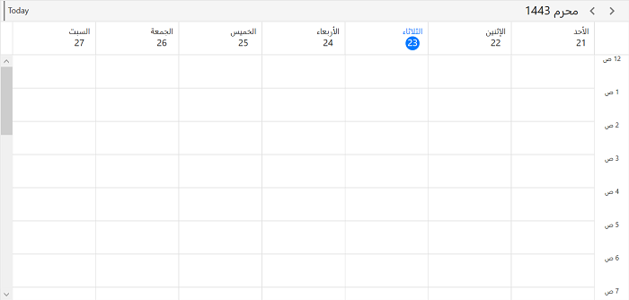

# Calendar Types in WPF Scheduler (SfScheduler)
This section describes how to change the calendar types of scheduler control using the `CalendarIdentifier.`

## Types of Calendar
The scheduler control supports the different types of calendars such as Gregorian, Korean, Hebrew, and more. You can change the calendar types by using the `CalendarIdentifier` property in Scheduler. The default value of the `CalendarIdentifier` property is `GregorianCalendar.`

<table>
<tr>
<th>Supported Calendars</th>
<th>UnSupported Calendars</th>
</tr>
<tr>
<td>

* GregorianCalendar
* HebrewCalendar
* HijriCalendar
* KoreanCalendar
* TaiwanCalendar
* ThaiCalendar
* UmAlQuraCalendar
* PersianCalendar
* JulianCalendar</td>
<td>

* JapaneseCalendar
* Lunar type calendars
</td>
</tr>
</table>

N> 
* When the `CalendarIdentifier` and `FlowDirection` properties are set, the `FlowDirection` property is given higher precedence. If you want to override this behavior set `FlowDirection` after `CalendarIdentifier.`
* The scheduler uses the `CalendarIdentifier` property to determine which calendar to use to localize and format the header date, view header day, and date, time ruler, and DatePicker, and TimePicker in the appointment editor.
* By default, the scheduler uses the `GregorianCalendar` for the app’s preferred language.
* If the scheduler is localized with the `CalendarIdentifier,` it will display in the app’s preferred language. For example, if you specify a `KoreanCalendar` and the app language is "en-us," the scheduler will display in English because there are translations applied for the Korean calendar.



<scheduler:SfScheduler x:Name="Schedule"
                       CalendarIdentifier="HebrewCalendar" />


this.Schedule.CalendarIdentifier = "HebrewCalendar";



## DateTime values in Calendar types
You can give all the DateTime values such as `DisplayDate,` `SelectedDate,` `BlackoutDates,` Appointment `StartTime,` and `EndTime,` `SpecialTimeRegion,` Start and End time values in two ways When calendar identifier is specified other than `GregorianCalendar.`

* A `DateTime` instance without specifying calendar type. A scheduler will handle the `DateTime` value for the specified calendar type.

* `DateTime` instance with specified calendar type. If calendar type is mentioned then the date should be respective to that calendar so that the date value will be converted to Gregorian DateTime and scheduler will handle that DateTime.