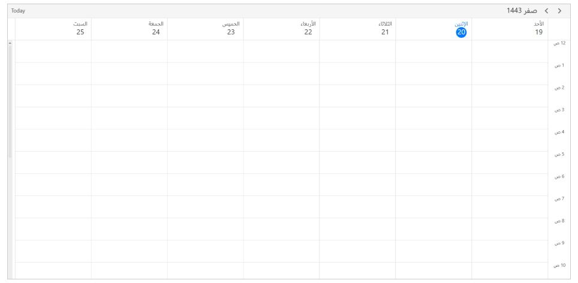

# Calendar Types in WPF Scheduler (SfScheduler)
This section describes how to change the calendar types of scheduler control using the `CalendarIdentifier.`

## Types of Calendar
The scheduler control supports the different types of calendars such as Gregorian, Korean, Hebrew, and more. You can change the calendar types by using the `CalendarIdentifier` property in Scheduler. The default value of the `CalendarIdentifier` property is `GregorianCalendar.`

<table>
<tr>
<th>Supported Calendars</th>
<th>UnSupported Calendars</th>
</tr>
<tr>
<td>
* GregorianCalendar 
* HebrewCalendar 
* HijriCalendar 
* KoreanCalendar 
* TaiwanCalendar 
* ThaiCalendar 
* UmAlQuraCalendar 
* PersianCalendar 
</td>
<td>
* JulianCalendar 
* JapaneseCalendar 
* Lunar type calendars 
</td>
</tr>
</table>

N> 
* When the `CalendarIdentifier` and `FlowDirection` properties are set, the `FlowDirection` property is given higher precedence. If you want to override this behavior set `FlowDirection` after `CalendarIdentifier.`
* The scheduler uses the `CalendarIdentifier` property to determine which calendar to use to localize and format the header date, view header day, and date, time ruler, and DatePicker, and TimePicker in the appointment editor.
* By default, the scheduler uses the `GregorianCalendar` for the app’s preferred language.
* The Scheduler Time mode (12 hour or 24 hour) does not change depending on the calendar type; however, the time format can be changed depending on the calendar type by using [Day view time text formatting](https://help.syncfusion.com/wpf/scheduler/daysview#time-text-formatting) and [Timeline view time text formatting](https://help.syncfusion.com/wpf/scheduler/timelineview#time-text-formatting).



<scheduler:SfScheduler x:Name="Schedule"
                       CalendarIdentifier="HijriCalendar" />


this.Schedule.CalendarIdentifier = "HijriCalendar";



## DateTime values in Calendar types
You can give all the DateTime values such as `DisplayDate,` `SelectedDate,` `BlackoutDates,` Appointment `StartTime,` and `EndTime,` `SpecialTimeRegion,` Start and End time values in two ways When calendar identifier is specified other than `GregorianCalendar.`

* Create appointment with start and end time value by declaring the calendar type and respective calendar type date.



// Creating an instance for the schedule appointment collection.
var appointments = new ScheduleAppointmentCollection();

// Adding schedule appointment in the schedule appointment collection.
appointments.Add(new ScheduleAppointment()
{
   Subject = "Meeting",
   // StartTime and EndTime value specified with calendar type and respective calendar date.
   StartTime = new DateTime (1443, 02, 22, 10, 0, 0, new HijriCalendar()),
   EndTime = new DateTime(1443, 02, 22, 11, 0, 0, new HijriCalendar()),
});

// Adding the schedule appointment collection to the ItemsSource.
this.scheduler.ItemsSource = appointments;



* Create an appointment with a start and end time by declaring a local system date; in that case, the system date will be converted to the relevant calendar type date.



// Creating an instance for the schedule appointment collection.
var appointments = new ScheduleAppointmentCollection();

// Adding schedule appointment in the schedule appointment collection.
appointments.Add(new ScheduleAppointment()
{
   Subject = "Meeting",
  // StartTime and EndTime values specified with local system date will be converted to the Hijiri calendar mentioned.
   StartTime = new DateTime(2021, 09, 29, 10, 0, 0, 0),
   EndTime = new DateTime(2021, 09, 29, 11, 0, 0, 0),
});

// Adding the schedule appointment collection to the ItemsSource.
this.scheduler.ItemsSource = appointments;



N> [View sample in GitHub](https://github.com/SyncfusionExamples/WPF-Scheduler-Examples/tree/main/CalendarTypes)