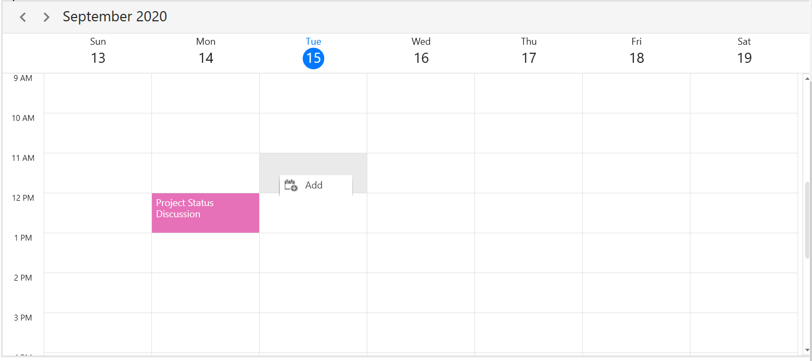
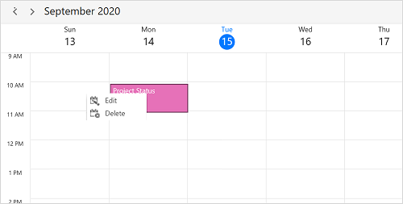

# Context Menu and Commands in WPF Scheduler (SfScheduler)

The WPF scheduler has support to define a context menu for appointments, time slots, and month cells are right-clicked. It will also have the built-in `RoutedUICommands` support for handling the context menu to add, edit, and delete appointments. There are two types of `ContextMenu`.

* [CellContextMenu](https://help.syncfusion.com/cr/wpf/Syncfusion.UI.Xaml.Scheduler.SfScheduler.html#Syncfusion_UI_Xaml_Scheduler_SfScheduler_CellContextMenu)
* [AppointmentContextMenu](https://help.syncfusion.com/cr/wpf/Syncfusion.UI.Xaml.Scheduler.SfScheduler.html#Syncfusion_UI_Xaml_Scheduler_SfScheduler_AppointmentContextMenu)

N>[View sample in GitHub](https://github.com/SyncfusionExamples/context-menu-support-in-wpf-scheduler)

## Cell context menu

You can set the context menu for time slot and month cells by using the [SfScheduler.CellContextMenu](https://help.syncfusion.com/cr/wpf/Syncfusion.UI.Xaml.Scheduler.SfScheduler.html#Syncfusion_UI_Xaml_Scheduler_SfScheduler_CellContextMenu) property. The `CellContextMenu` will appear only when the time slot or month cells are right-clicked.

N>
* The menu items which bind the [SchedulerCommands.Edit](https://help.syncfusion.com/cr/wpf/Syncfusion.UI.Xaml.Scheduler.SchedulerCommands.html#Syncfusion_UI_Xaml_Scheduler_SchedulerCommands_Edit) and [SchedulerCommands.Delete](https://help.syncfusion.com/cr/wpf/Syncfusion.UI.Xaml.Scheduler.SchedulerCommands.html#Syncfusion_UI_Xaml_Scheduler_SchedulerCommands_Delete) built-in commands will be disabled in the `CellContextMenu`.
* The `DataContext` for the context menu is [SchedulerContextMenuInfo](https://help.syncfusion.com/cr/wpf/Syncfusion.UI.Xaml.Scheduler.SchedulerContextMenuInfo.html) `CommandParameter` of menu item should bound to context menu's data context when using the commands in [SchedulerCommands](https://help.syncfusion.com/cr/wpf/Syncfusion.UI.Xaml.Scheduler.SchedulerCommands.html).
* By default, hold on any timeslot or month cell, The cell context menu will be opened, The appointment context menu will be open on holding if appointment drag and drop disabled by using the property [AppointmentEditFlag](https://help.syncfusion.com/cr/wpf/Syncfusion.UI.Xaml.Scheduler.SfScheduler.html#Syncfusion_UI_Xaml_Scheduler_SfScheduler_AppointmentEditFlag).



<syncfusion:SfScheduler x:Name="Schedule" ViewType="Week">
<syncfusion:SfScheduler.CellContextMenu>
<ContextMenu>
<MenuItem Command="{Binding Source={x:Static Member=syncfusion:SchedulerCommands.Add}}" CommandParameter ="{Binding}" CommandTarget="{Binding ElementName=Schedule}" Header="Add">
</MenuItem>
</ContextMenu>
</syncfusion:SfScheduler.CellContextMenu>
</syncfusion:SfScheduler>




## Appointment context menu

You can set the context menu for schedule appointments by using the [SfScheduler.AppointmentContextMenu](https://help.syncfusion.com/cr/wpf/Syncfusion.UI.Xaml.Scheduler.SfScheduler.html#Syncfusion_UI_Xaml_Scheduler_SfScheduler_AppointmentContextMenu) property. The `AppointmentContextMenu` will be displayed only on appointments that are right-clicked.

>**NOTE**
* The menu item which binds the [SchedulerCommands.Add](https://help.syncfusion.com/cr/wpf/Syncfusion.UI.Xaml.Scheduler.SchedulerCommands.html#Syncfusion_UI_Xaml_Scheduler_SchedulerCommands_Add) command will be disabled in the [SfScheduler.AppointmentContextMenu](https://help.syncfusion.com/cr/wpf/Syncfusion.UI.Xaml.Scheduler.SfScheduler.html#Syncfusion_UI_Xaml_Scheduler_SfScheduler_AppointmentContextMenu).
* The `DataContext` for the context menu is [SchedulerContextMenuInfo](https://help.syncfusion.com/cr/wpf/Syncfusion.UI.Xaml.Scheduler.SchedulerContextMenuInfo.html) Command parameter of menu item should bound to context menu's data context when using the commands in [SchedulerCommands](https://help.syncfusion.com/cr/wpf/Syncfusion.UI.Xaml.Scheduler.SchedulerCommands.html).
* In month view, the `AppointmentContextMenu` opens when the [MonthViewSettings.AppointmentDisplayMode](https://help.syncfusion.com/cr/wpf/Syncfusion.UI.Xaml.Scheduler.MonthViewSettings.html#Syncfusion_UI_Xaml_Scheduler_MonthViewSettings_AppointmentDisplayMode) is set to `AppointmentDisplayMode.Appointment`.
* To enable touch context menu for appointments in the scheduler,by disabling the appointment drag and drop to setting [AppointmentEditFlag](https://help.syncfusion.com/cr/wpf/Syncfusion.UI.Xaml.Scheduler.SfScheduler.html#Syncfusion_UI_Xaml_Scheduler_SfScheduler_AppointmentEditFlag) property except DragDrop. In this case, you will not be able to perform appointment drag & drop. The [AppointmentContextMenu](https://help.syncfusion.com/cr/wpf/Syncfusion.UI.Xaml.Scheduler.SfScheduler.html#Syncfusion_UI_Xaml_Scheduler_SfScheduler_AppointmentContextMenu) will be displayed only on appointments and appointment selection should be performed. 



<syncfusion:SfScheduler x:Name="Schedule" ViewType="Week">
<syncfusion:SfScheduler.AppointmentContextMenu>
<ContextMenu>
<MenuItem Command="{Binding Source={x:Static Member=syncfusion:SchedulerCommands.Edit}}"
                    CommandParameter ="{Binding}" CommandTarget="{Binding ElementName=Schedule}"
                    Header="Edit">
</MenuItem>
<MenuItem Command="{Binding Source={x:Static Member=syncfusion:SchedulerCommands.Delete}}"
CommandParameter ="{Binding}"
Header="Delete">
</MenuItem>
</ContextMenu>
</syncfusion:SfScheduler.AppointmentContextMenu>
</syncfusion:SfScheduler>




## SchedulerContextMenuOpening event

The [SchedulerContextMenuInfo](https://help.syncfusion.com/cr/wpf/Syncfusion.UI.Xaml.Scheduler.SchedulerContextMenuInfo.html) event occurs while opening the [AppointmentContextMenu](https://help.syncfusion.com/cr/wpf/Syncfusion.UI.Xaml.Scheduler.SfScheduler.html#Syncfusion_UI_Xaml_Scheduler_SfScheduler_AppointmentContextMenu) or [CellContextMenu](https://help.syncfusion.com/cr/wpf/Syncfusion.UI.Xaml.Scheduler.SfScheduler.html#Syncfusion_UI_Xaml_Scheduler_SfScheduler_CellContextMenu) in the SfScheduler. 

`SchedulerContextMenuOpeningEventArgs` has the following members which provides the information about the `SchedulerContextMenuOpening` event.

* `MenuInfo` – Returns the `SchedulerContextMenuInfo` which contains the information about date time, appointment of the element opens the context menu. The `AppointmentContextMenu` and `CellContextMenu` received this information as a DataContext.

* `MenuType` – Gets the element type for which the context menu opens.

* `ContextMenu` – It represents a shortcut context menu that is being opened.

