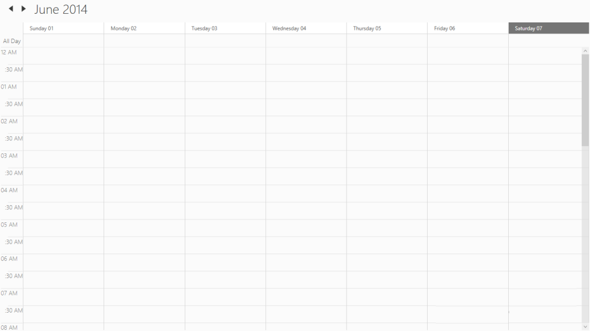

# Custom Date Format

## DayHeaderFormat

The default Header date format of the Day and Week view can be customized by using the HeaderDateFormat property. 

The HeaderDateFormat is a String type, used to customize or override the default format of the Header date format.

The Header background can be changed by HeaderBackground property.



<Grid Background="White">

<Schedule:SfSchedule  ScheduleType="Week"

HeaderDateFormat="dd-MMMM-yyyy"   HeaderBackground="Red" >

</Schedule:SfSchedule>

</Grid>




SfSchedule schedule = new SfSchedule();

schedule.ScheduleType = ScheduleType.Week;

schedule.HeaderDateFormat = "dd-MMMM-yyyy";

schedule.HeaderBackground = new SolidColorBrush(Colors.Red);

this.grid.Children.Add(schedule);




## Time tick Format

The default timespan format in Day, Week and Timeline view can be customized by using the MajorTickTimeFormat and MinorTickTimeFormat properties. 



<Grid Background="White"  Name="grid">

<Schedule:SfSchedule  ScheduleType="Week"

MajorTickTimeFormat="hh tt" TimeInterval="ThirtyMin"  MinorTickVisibility=" Visible"  MajorTickVisibility="Visible"       MinorTickTimeFormat=":mm tt" />

</Grid>





SfSchedule schedule = new SfSchedule();

schedule.ScheduleType = ScheduleType.Week;

schedule.MajorTickTimeFormat = "hh tt";

schedule.TimeInterval = TimeInterval.ThirtyMin;

schedule.MajorTickVisibility=Visibility.Visible;

schedule.MinorTickVisibility=Visibility.Visible;

schedule.MinorTickTimeFormat = ":mm tt";

this.grid.Children.Add(schedule);




### Month Date Format

The default date format of month view can be customized by using the MonthHeaderDateFormat property.                              



<Grid Background="White">

<Schedule:SfSchedule  ScheduleType="Month"

MonthHeaderDateFormat="dd MMM" >   

</Schedule:SfSchedule>

</Grid>




SfSchedule schedule = new SfSchedule();

schedule.ScheduleType = ScheduleType.Month;

schedule.HeaderDateFormat = "dd MMM";

this.grid.Children.Add(schedule);




