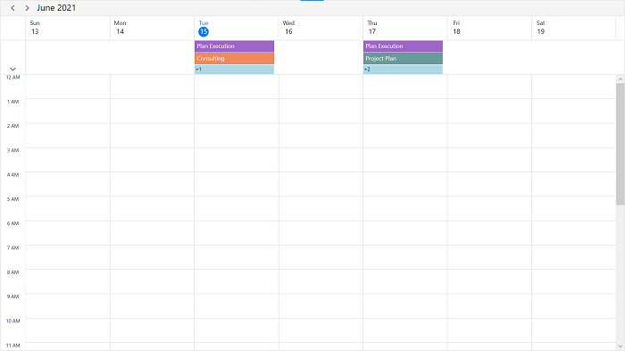

# Day and Week Views in WPF Scheduler (SfScheduler)
[Scheduler](https://help.syncfusion.com/cr/wpf/Syncfusion.UI.Xaml.Scheduler.html) supports to display the day, week, work week views and current day will be visible by default. Appointments on a specific day will be arranged in respective timeslots based on its duration.

## Change time interval
Customize the interval of timeslots in all the day, week, work week views by using the [TimeInterval](https://help.syncfusion.com/cr/wpf/Syncfusion.UI.Xaml.Scheduler.TimeSlotViewSettings.html#Syncfusion_UI_Xaml_Scheduler_TimeSlotViewSettings_TimeInterval) property of [DaysViewSettings](https://help.syncfusion.com/cr/wpf/Syncfusion.UI.Xaml.Scheduler.SfScheduler.html#Syncfusion_UI_Xaml_Scheduler_SfScheduler_DaysViewSettings).


Schedule.ViewType = SchedulerViewType.Week;
Schedule.DaysViewSettings.TimeInterval = new System.TimeSpan(0, 120, 0);



N>If the timeInterval value is modified (in minutes), the time labels format needs to be changed by setting the timeFormat value to hh:mm.

## Change time interval height
Customize the interval height of timeslots in day, week, work week views by setting [TimeIntervalSize](https://help.syncfusion.com/cr/wpf/Syncfusion.UI.Xaml.Scheduler.TimeSlotViewSettings.html#Syncfusion_UI_Xaml_Scheduler_TimeSlotViewSettings_TimeIntervalSize) property of [DaysViewSettings](https://help.syncfusion.com/cr/wpf/Syncfusion.UI.Xaml.Scheduler.SfScheduler.html#Syncfusion_UI_Xaml_Scheduler_SfScheduler_DaysViewSettings).


<syncfusion:SfScheduler x:Name="Schedule" ViewType="Week">
    <syncfusion:SfScheduler.DaysViewSettings>
        <syncfusion:DaysViewSettings 
            TimeIntervalSize="120"/>
    </syncfusion:SfScheduler.DaysViewSettings>
</syncfusion:SfScheduler>


Schedule.ViewType = SchedulerViewType.Week;
Schedule.DaysViewSettings.TimeIntervalSize = 120;



## Flexible working days and working hours
The default values for [StartHour](https://help.syncfusion.com/cr/wpf/Syncfusion.UI.Xaml.Scheduler.TimeSlotViewSettings.html#Syncfusion_UI_Xaml_Scheduler_TimeSlotViewSettings_StartHour) and [EndHour](https://help.syncfusion.com/cr/wpf/Syncfusion.UI.Xaml.Scheduler.TimeSlotViewSettings.html#Syncfusion_UI_Xaml_Scheduler_TimeSlotViewSettings_EndHour) are 0 and 24 to show all the timeslots in day, week and work week views. Set the `StartHour` and `EndHour` properties of [DaysViewSettings](https://help.syncfusion.com/cr/wpf/Syncfusion.UI.Xaml.Scheduler.DaysViewSettings.html) to show only the required time duration for users. Set `StartHour` and `EndHour` in time duration to show the required time duration in minutes.



 <syncfusion:SfScheduler x:Name="Schedule" ViewType="Week">
    <syncfusion:SfScheduler.DaysViewSettings>
        <syncfusion:DaysViewSettings 
            StartHour="8"
            EndHour="15"/>
    </syncfusion:SfScheduler.DaysViewSettings>
</syncfusion:SfScheduler>


Schedule.ViewType = SchedulerViewType.Week;
Schedule.DaysViewSettings.StartHour = 8;
Schedule.DaysViewSettings.EndHour = 15;



N>
* The [NonWorkingDays](https://help.syncfusion.com/cr/wpf/Syncfusion.UI.Xaml.Scheduler.TimeSlotViewSettings.html#Syncfusion_UI_Xaml_Scheduler_TimeSlotViewSettings_NonWorkingDays) property will be applicable only for `workWeek` and `TimelineWorkWeek` views only, and not applicable for the remaining views.
* Scheduler Appointments UI, which does not fall within the `StartHour` and `EndHour` will not be visible and if it falls partially, it will be clipped.
* No need to specify the decimal point values for `StartHour` and `EndHour`, if you don’t want to set the minutes.
* The number of time slots will be calculated based on total minutes of a day and time interval (total minutes of a day ((start hour - end hour) * 60) / time interval).
* If custom timeInterval is given, then the number of time slots calculated based on the given `TimeInterval` should result in integer value (total minutes % timeInterval = 0), otherwise next immediate time interval that result in integer value when divided by total minutes of a day will be considered. For example, if TimeInterval = 2 Hours 15 minutes and total minutes = 1440 (24 Hours per day), then `TimeInterval` will be changed to ‘144’ (1440%144=0) by considering (total minutes % TimeInterval = 0), it will return integer value for time slots rendering.
* If the custom `StartHour` and `EndHour` are given, then the number of time slots calculated based on the given `StartHour` and `EndHour` should result in integer value, otherwise next immediate `TimeInterval` will be considered until the result is integer value. For example, if `StartHour` is 9 (09:00AM), `EndHour` is 18.25 (06:15 PM), `TimeInterval` is 30 minutes, and total minutes = 555 ((18.25-9)*60), then the `TimeInterval` will be changed to ’37 minutes’ (555%37=0) by considering (total minutes % timeInterval = 0). It will return integer value for time slots rendering.

## Special time regions
Restrict the user interaction such as selection and highlights specific regions of time in day, week, work week views by adding the [SpecialTimeRegions](https://help.syncfusion.com/cr/wpf/Syncfusion.UI.Xaml.Scheduler.TimeSlotViewSettings.html#Syncfusion_UI_Xaml_Scheduler_TimeSlotViewSettings_SpecialTimeRegions) property of `SfScheduler`. Set the [StartTime](https://help.syncfusion.com/cr/wpf/Syncfusion.UI.Xaml.Scheduler.SpecialTimeRegion.html#Syncfusion_UI_Xaml_Scheduler_SpecialTimeRegion_StartTime) and [EndTime](https://help.syncfusion.com/cr/wpf/Syncfusion.UI.Xaml.Scheduler.SpecialTimeRegion.html#Syncfusion_UI_Xaml_Scheduler_SpecialTimeRegion_EndTime) properties of [SpecialTimeRegion](https://help.syncfusion.com/cr/wpf/Syncfusion.UI.Xaml.Scheduler.SpecialTimeRegion.html) to create a `SpecialTimeRegion`, use the timeZone property to set the specific timezone for Start and end time of `SpecialTimeRegion`. The `SpecialTimeRegion` will display the text or image on it that set to the text or icon property of `SpecialTimeRegion`.

Enable merges adjacent region of `SpecialTimeRegion` and show them as a single region instead of showing them separately for each day using the [CanMergeAdjacentRegions](https://help.syncfusion.com/cr/wpf/Syncfusion.UI.Xaml.Scheduler.SpecialTimeRegion.html#Syncfusion_UI_Xaml_Scheduler_SpecialTimeRegion_CanMergeAdjacentRegions) property of [SpecialTimeRegion](https://help.syncfusion.com/cr/wpf/Syncfusion.UI.Xaml.Scheduler.SpecialTimeRegion.html#properties) in the week and workweek views. By default, its value is false.

### Selection restriction in timeslots
Enable or disable the touch interaction of `SpecialTimeRegion` using the [CanEdit](https://help.syncfusion.com/cr/wpf/Syncfusion.UI.Xaml.Scheduler.SpecialTimeRegion.html#Syncfusion_UI_Xaml_Scheduler_SpecialTimeRegion_CanEdit) property of [SpecialTimeRegion](https://help.syncfusion.com/cr/wpf/Syncfusion.UI.Xaml.Scheduler.SpecialTimeRegion.html#properties). By default, its value is true.


<syncfusion:SfScheduler x:Name="Schedule" ViewType="Week" >
<syncfusion:SfScheduler.DaysViewSettings>
    <syncfusion:DaysViewSettings>
        <syncfusion:DaysViewSettings.SpecialTimeRegions>
            <syncfusion:SpecialTimeRegion
                StartTime="2020/12/15 13:0:0"
                EndTime="2020/12/15 14:0:0"
                CanEdit="False"
                Text="Lunch"
                Background="Gray"
                Foreground="White"/>
            </syncfusion:DaysViewSettings.SpecialTimeRegions>
        </syncfusion:DaysViewSettings>
    </syncfusion:SfScheduler.DaysViewSettings>
</syncfusion:SfScheduler>


Schedule.DaysViewSettings.SpecialTimeRegions.Add(new SpecialTimeRegion
{
    StartTime = new System.DateTime(2020,12,15,13,0,0),
    EndTime = new System.DateTime(2020,12,15,14,0,0),
    Text = "Lunch",
    CanEdit = false,
    Background = Brushes.Black,
    Foreground = Brushes.White
});



N> NOTE
This property only restricts the interaction on region and it does not restrict the following:
* Programmatic selection (if the user updates the selected date value dynamically)
* Does not clear the selection when the user selects the region and dynamically change
the `CanEdit` property to false
* It does not restrict appointment interaction when the appointment placed
in the region
* It does not restrict the appointment rendering on a region, when appointments are loaded from data services or adding programmatically.

### Recurring time region
The recurring time region on a daily, weekly, monthly, or yearly interval. The recurring special time regions can be created by setting the [RecurrenceRule](https://help.syncfusion.com/cr/wpf/Syncfusion.UI.Xaml.Scheduler.SpecialTimeRegion.html#Syncfusion_UI_Xaml_Scheduler_SpecialTimeRegion_RecurrenceRule) property in [SpecialTimeRegion](https://help.syncfusion.com/cr/wpf/Syncfusion.UI.Xaml.Scheduler.SpecialTimeRegion.html#properties).

Enable merges adjacent region of `SpecialTimeRegion` and show them as a single region instead of showing them separately for each day using the [CanMergeAdjacentRegions](https://help.syncfusion.com/cr/wpf/Syncfusion.UI.Xaml.Scheduler.SpecialTimeRegion.html#Syncfusion_UI_Xaml_Scheduler_SpecialTimeRegion_CanMergeAdjacentRegions) property of [SpecialTimeRegion](https://help.syncfusion.com/cr/wpf/Syncfusion.UI.Xaml.Scheduler.SpecialTimeRegion.html#properties) in the week and workweek views. By default, its value is false.



 <syncfusion:SfScheduler x:Name="Schedule" ViewType="Week">
<syncfusion:SfScheduler.DaysViewSettings>
    <syncfusion:DaysViewSettings>
        <syncfusion:DaysViewSettings.SpecialTimeRegions>
            <syncfusion:SpecialTimeRegion
                StartTime="2020/12/13 13:0:0"
                EndTime="2020/12/13 14:0:0"
                CanEdit="False"
                Text="Lunch"
                CanMergeAdjacentRegions="True"
                RecurrenceRule="FREQ=DAILY;INTERVAL=1"/>
            </syncfusion:DaysViewSettings.SpecialTimeRegions>
        </syncfusion:DaysViewSettings>
    </syncfusion:SfScheduler.DaysViewSettings>
</syncfusion:SfScheduler>


Schedule.ViewType = SchedulerViewType.Week;
Schedule.DaysViewSettings.SpecialTimeRegions.Add(new SpecialTimeRegion
{
    StartTime = new System.DateTime(2020, 12, 13, 13, 0, 0),
    EndTime = new System.DateTime(2020, 12, 13, 14, 0, 0),
    Text = "Lunch",
    CanEdit = false,
    Background = Brushes.Black,
    Foreground = Brushes.White,
    CanMergeAdjacentRegions=true,
    RecurrenceRule = "FREQ=DAILY;INTERVAL=1"
});



If the [CanMergeAdjacentRegions](https://help.syncfusion.com/cr/wpf/Syncfusion.UI.Xaml.Scheduler.SpecialTimeRegion.html#Syncfusion_UI_Xaml_Scheduler_SpecialTimeRegion_CanMergeAdjacentRegions) of [SpecialTimeRegion](https://help.syncfusion.com/cr/wpf/Syncfusion.UI.Xaml.Scheduler.SpecialTimeRegion.html#properties) is set to false. The SpecialTimeRegion will be rendering on Date basis.

### Recurrence exception dates
Delete any of the occurrence that is an exception from the recurrence pattern time region by using the [RecurrenceExceptionDates](https://help.syncfusion.com/cr/wpf/Syncfusion.UI.Xaml.Scheduler.SpecialTimeRegion.html#Syncfusion_UI_Xaml_Scheduler_SpecialTimeRegion_RecurrenceExceptionDates) property of [SpecialTimeRegion](https://help.syncfusion.com/cr/wpf/Syncfusion.UI.Xaml.Scheduler.SpecialTimeRegion.html#properties). The deleted occurrence date will be considered as a recurrence exception date.


Schedule.ViewType = SchedulerViewType.Week;
DateTime recurrenceExceptionDates = DateTime.Now.Date.AddDays(-1);
DateTime recurrenceExceptionDates1 = DateTime.Now.Date.AddDays(2);
Schedule.DaysViewSettings.SpecialTimeRegions.Add(new SpecialTimeRegion
{
    StartTime = new System.DateTime(2020, 12, 13, 13, 0, 0),
    EndTime = new System.DateTime(2020, 12, 13, 14, 0, 0),
    Text = "Lunch",
    CanEdit = false,
    RecurrenceRule = "FREQ=DAILY;INTERVAL=1",
    CanMergeAdjacentRegions= true,
    Background = Brushes.Black,
    Foreground = Brushes.White,
RecurrenceExceptionDates = new ObservableCollection<DateTime>()
{
    recurrenceExceptionDates,
    recurrenceExceptionDates1,
}
});



The [SpecialTimeRegion](https://help.syncfusion.com/cr/wpf/Syncfusion.UI.Xaml.Scheduler.SpecialTimeRegion.html#properties) in Date basis by setting the value of [CanMergeAdjacentRegions](https://help.syncfusion.com/cr/wpf/Syncfusion.UI.Xaml.Scheduler.SpecialTimeRegion.html#Syncfusion_UI_Xaml_Scheduler_SpecialTimeRegion_CanMergeAdjacentRegions) is false.

### Special time region customization
The `SpecialTimeRegion` background color can be customized by using the [Background](https://help.syncfusion.com/cr/wpf/Syncfusion.UI.Xaml.Scheduler.SpecialTimeRegion.html#Syncfusion_UI_Xaml_Scheduler_SpecialTimeRegion_Background) and [SpecialTimeRegionTemplate](https://help.syncfusion.com/cr/wpf/Syncfusion.UI.Xaml.Scheduler.TimeSlotViewSettings.html#Syncfusion_UI_Xaml_Scheduler_TimeSlotViewSettings_SpecialTimeRegionTemplate) properties of [SpecialTimeRegion](https://help.syncfusion.com/cr/wpf/Syncfusion.UI.Xaml.Scheduler.SpecialTimeRegion.html#properties) that is used to customize the text style for the image of the `SpecialTimeRegion`.


<Window.Resources>
    <DataTemplate x:Key="specialRegionTemplate">
        <Grid Background="{Binding Background}"
            Opacity="0.5"
            HorizontalAlignment="Stretch"
            VerticalAlignment="Stretch">
        <Path x:Name="Fork" Data="M11,0 C11.553001,0 12,0.4469986 12,1 L12,15 C12,15.553001 11.553001,16 11,16 10.446999,16 10,15.553001 10,15 L10,7 9,7 C8.4469986,7 8,6.5530014 8,6 L8,3 C8,1.3429985 9.3429985,0 11,0 z M0,0 L1,0 1.2340002,4 1.7810001,4 2,0 3,0 3.2340002,4 3.7810001,4 4,0 5,0 5,4 C5,4.9660001 4.3140001,5.7727499 3.4029064,5.9593439 L3.4007993,5.9597201 3.9114671,14.517 C3.9594617,15.321 3.3195295,16 2.5136147,16 L2.5076156,16 C1.6937013,16 1.0517693,15.309 1.1107631,14.497 L1.7400641,5.9826035 1.6955509,5.9769421 C0.73587513,5.8301721 0,5.0005002 0,4 z" Fill="Black" HorizontalAlignment="Center" Height="16"  Stretch="Fill" VerticalAlignment="Center" Width="12"/>
        </Grid>
    </DataTemplate>
</Window.Resources>





<syncfusion:SfScheduler x:Name="Schedule" ViewType="Week">
<syncfusion:SfScheduler.DaysViewSettings>
    <syncfusion:DaysViewSettings  SpecialTimeRegionTemplate="{StaticResource specialRegionTemplate}">
        <syncfusion:DaysViewSettings.SpecialTimeRegions>
            <syncfusion:SpecialTimeRegion
                StartTime="2020/12/13 13:0:0"
                EndTime="2020/12/13 14:0:0"
                CanEdit="False"
                RecurrenceRule="FREQ=DAILY;INTERVAL=1"
                CanMergeAdjacentRegions="True"
                Foreground="Black"
                Background="#FFF5F5F5"/>
        </syncfusion:DaysViewSettings.SpecialTimeRegions>
    </syncfusion:DaysViewSettings>
</syncfusion:SfScheduler.DaysViewSettings>



The [SpecialTimeRegion](https://help.syncfusion.com/cr/wpf/Syncfusion.UI.Xaml.Scheduler.SpecialTimeRegion.html#properties) can be customized in a Date basis by setting the value of [CanMergeAdjacentRegions](https://help.syncfusion.com/cr/wpf/Syncfusion.UI.Xaml.Scheduler.SpecialTimeRegion.html#Syncfusion_UI_Xaml_Scheduler_SpecialTimeRegion_CanMergeAdjacentRegions) is false.

## Full screen scheduler
Scheduler time interval height can be adjusted based on screen height by changing the value of `TimeIntervalSize` property to -1. It will auto-fit to the screen height and width.


<syncfusion:SfScheduler x:Name="Schedule" ViewType="Week">
    <syncfusion:SfScheduler.DaysViewSettings>
        <syncfusion:DaysViewSettings 
            TimeIntervalSize="-1"/>
    </syncfusion:SfScheduler.DaysViewSettings>
</syncfusion:SfScheduler>


Schedule.ViewType = SchedulerViewType.Week;
Schedule.DaysViewSettings.TimeIntervalSize = -1;



## Change time ruler size
Customize the size of the time ruler view where the labels mentioning the time are placed by using the [TimeRulerSize](https://help.syncfusion.com/cr/wpf/Syncfusion.UI.Xaml.Scheduler.TimeSlotViewSettings.html#Syncfusion_UI_Xaml_Scheduler_TimeSlotViewSettings_TimeRulerSize) property of `DayViewSettings`.


<syncfusion:SfScheduler x:Name="Schedule" ViewType="Week" >
    <syncfusion:SfScheduler.DaysViewSettings>
        <syncfusion:DaysViewSettings   
            TimeRulerSize="100">
        </syncfusion:DaysViewSettings>
    </syncfusion:SfScheduler.DaysViewSettings>
</syncfusion:SfScheduler>


Schedule.ViewType = SchedulerViewType.Week;
Schedule.DaysViewSettings.TimeRulerSize = 100;



## Minimum appointment duration
The [MinimumAppointmentDuration](https://help.syncfusion.com/cr/wpf/Syncfusion.UI.Xaml.Scheduler.TimeSlotViewSettings.html#Syncfusion_UI_Xaml_Scheduler_TimeSlotViewSettings_MinimumAppointmentDuration) property in `DayViewSettings` is to set an arbitrary height to appointments when it has minimum duration in day, week, work week views, so that the subject can be readable.


Schedule.ViewType = SchedulerViewType.Week;
Schedule.DaysViewSettings.MinimumAppointmentDuration = new System.TimeSpan(0, 120, 0);



N>NOTE
* The `MinimumAppointmentDuration` value will be set, when an appointment duration value lesser than `MinimumAppointmentDuration`.
* Appointment duration value will be set, when the appointment duration value greater than `MinimumAppointmentDuration`.
* `TimeInterval` value will be set, when `MinimumAppointmentDuration` greater than `TimeInterval` with lesser appointment duration.
* All day Appointment does not support `MinimumAppointmentDuration`.

## Minimum display appointments count in all day panel
You can Customize the number of appointments displayed in a all-day panel using the `MinimumAllDayAppointmentsCount` property of `DaysViewSettings` in Scheduler. By default, the appointment display count is 2 and all-day panel have more than 2 appointments, two appointment will be displayed and remaining appointments will be displayed as appointment counts.



<syncfusion:SfScheduler x:Name="Schedule" ViewType="Week">
    <syncfusion:SfScheduler.DaysViewSettings>
        <syncfusion:DaysViewSettings MinimumAllDayAppointmentsCount="3"/>
    </syncfusion:SfScheduler.DaysViewSettings>
</syncfusion:SfScheduler>


this.Schedule.ViewType = SchedulerViewType.Week;
this.Schedule.DaysViewSettings.MinimumAllDayAppointmentsCount = 3;



### Customize more appointments indicator in all day panel
You can customize the default appearance of more appointments indicator in all day panel by using the `AllDayMoreAppointmentsIndicatorTemplate` property of `DaysViewSettings`.



<syncfusion:SfScheduler x:Name="Schedule" ViewType="Week">
    <syncfusion:SfScheduler.DaysViewSettings>
        <syncfusion:DaysViewSettings>
            <syncfusion:DaysViewSettings.AllDayMoreAppointmentsIndicatorTemplate>
                <DataTemplate >
                    <TextBlock Text="{Binding StringFormat=+{0}}" Background="LightBlue" Foreground="Black"
                               HorizontalAlignment="Stretch" TextAlignment="Left" VerticalAlignment="Stretch" Padding="2,3,0,0">
                    </TextBlock>
                </DataTemplate>
            </syncfusion:DaysViewSettings.AllDayMoreAppointmentsIndicatorTemplate>
        </syncfusion:DaysViewSettings>
    </syncfusion:SfScheduler.DaysViewSettings>
</syncfusion:SfScheduler>



## Time text formatting
Customize the format for the labels mentioning the time, by setting the [TimeRulerFormat](https://help.syncfusion.com/cr/wpf/Syncfusion.UI.Xaml.Scheduler.TimeSlotViewSettings.html#Syncfusion_UI_Xaml_Scheduler_TimeSlotViewSettings_TimeRulerFormat) property of `DayViewSettings` in `Scheduler`.


Schedule.ViewType = SchedulerViewType.Week;
Schedule.DaysViewSettings.TimeRulerFormat = "hh mm";
Schedule.DaysViewSettings.TimeInterval = new System.TimeSpan(0, 30, 0);



N>
* You can customize appointment editor time format based on scheduler time ruler format and culture.
* By default, the scheduler time ruler formar is `hh:mm tt` and appointment editor time picker format `h tt.` 

## View header
Customize the default appearance of view header in day, week, work week views by setting [ViewHeaderDateFormat](https://help.syncfusion.com/cr/wpf/Syncfusion.UI.Xaml.Scheduler.TimeSlotViewSettings.html#Syncfusion_UI_Xaml_Scheduler_TimeSlotViewSettings_ViewHeaderDateFormat), [ViewHeaderHeight](https://help.syncfusion.com/cr/wpf/Syncfusion.UI.Xaml.Scheduler.ViewSettingsBase.html#Syncfusion_UI_Xaml_Scheduler_ViewSettingsBase_ViewHeaderHeight), [ViewHeaderDayFormat](https://help.syncfusion.com/cr/wpf/Syncfusion.UI.Xaml.Scheduler.ViewSettingsBase.html#Syncfusion_UI_Xaml_Scheduler_ViewSettingsBase_ViewHeaderDayFormat) and  [ViewHeaderTemplate](https://help.syncfusion.com/cr/wpf/Syncfusion.UI.Xaml.Scheduler.ViewSettingsBase.html#Syncfusion_UI_Xaml_Scheduler_ViewSettingsBase_ViewHeaderTemplate) of `DaysViewSettings`.

### View header text formatting
Customize the date and day format of ViewHeader by using the `ViewHeaderDateFormat` and `ViewHeaderDayFormat` properties of `DaysViewSettings`.


<syncfusion:SfScheduler x:Name="Schedule" ViewType="Week">
    <syncfusion:SfScheduler.DaysViewSettings>
        <syncfusion:DaysViewSettings 
            ViewHeaderDayFormat="dddd"
            ViewHeaderDateFormat="dd"/>
        </syncfusion:SfScheduler.DaysViewSettings>
</syncfusion:SfScheduler>


Schedule.ViewType = SchedulerViewType.Week;
Schedule.DaysViewSettings.ViewHeaderDateFormat = "dd";
Schedule.DaysViewSettings.ViewHeaderDayFormat = "dddd";



### View header height
Customize the height of the ViewHeader in a day ,week ,work week views by setting `ViewHeaderHeight` property of `DaysViewSettings` in `SfScheduler`.


<syncfusion:SfScheduler x:Name="Schedule" ViewType="Week">
    <syncfusion:SfScheduler.DaysViewSettings>
        <syncfusion:DaysViewSettings
            ViewHeaderHeight="100"/>
        </syncfusion:SfScheduler.DaysViewSettings>
</syncfusion:SfScheduler>


Schedule.ViewType = SchedulerViewType.Week;
Schedule.DaysViewSettings.ViewHeaderHeight = 100;



### View header appearance customization
Customize the default appearance of view header by setting `ViewHeaderTemplate` property of `DaysViewSettings` in `SfScheduler`.


<Window.Resources>
<DataTemplate x:Key="viewHeaderTemplate">
    <StackPanel Background="Green"  
        Width="2000"
        VerticalAlignment="Stretch" 
        HorizontalAlignment="Stretch"
        Orientation="Vertical">
    <TextBlock 
        HorizontalAlignment="Left" 
        Margin="20,0,0,0" 
        Foreground="#FFFFFF"
        FontFamily="Arial"
        Text="{Binding DateText}"
        FontSize="25"
        TextTrimming="CharacterEllipsis"
        TextWrapping="Wrap" />
    <TextBlock 
        HorizontalAlignment="Left"  Margin="20,0,0,0" 
        Foreground="#FFFFFF"
        FontFamily="Arial"
        Text="{Binding DayText}"
        FontSize="10"
        TextTrimming="CharacterEllipsis"
        TextWrapping="Wrap" />
    </StackPanel>
</DataTemplate>
</Window.Resources>




<syncfusion:SfScheduler x:Name="Schedule" ViewType="Week">
    <syncfusion:SfScheduler.DaysViewSettings>
        <syncfusion:DaysViewSettings 
            ViewHeaderTemplate="{StaticResource viewHeaderTemplate}" />
        </syncfusion:SfScheduler.DaysViewSettings>
</syncfusion:SfScheduler>



