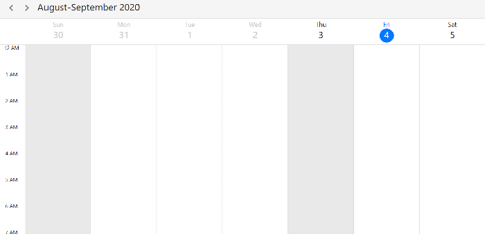
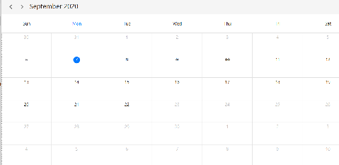
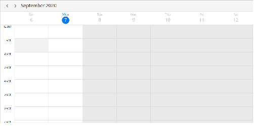

# Disabled Dates in WPF Scheduler (SfScheduler)

Support used to disable the dates or hour beyond the Scheduler `MinimumDate` and `MaximumDate`  in current view.

>**NOTE**
You can refer `date-navigations` how to set `MinimumDate` and `MaximumDate` in Xaml page and C#.

## Month view

* Beyond `MinimumDate` and `MaximumDate` tapped events, editor, date selection should be disabled by setting `IsEnabled` as False to the MonthCell control.
* Cell date foreground color to be disabled with disable color follow the below priority, add Trigger to set foreground for `IsEnabled` is False.

## Week, Work week, Timeline week, Timeline work week views beyond scheduler min and max dates
* In day, week, work week and Timeline view beyond min and max date in special time region will be added internally in current view and region can edit will be disabled. 
* Beyond minimum and maximum range view header date text to be disabled by setting `IsEnabled` as false to the ViewHeaderBase control. ViewHeader to be disabled if complete day is beyond `MinimumDate` and `MaximumDate`, if min and max date start like in between time of day (2020 -27-7 , 10,0,0) no need to disable view header. 

