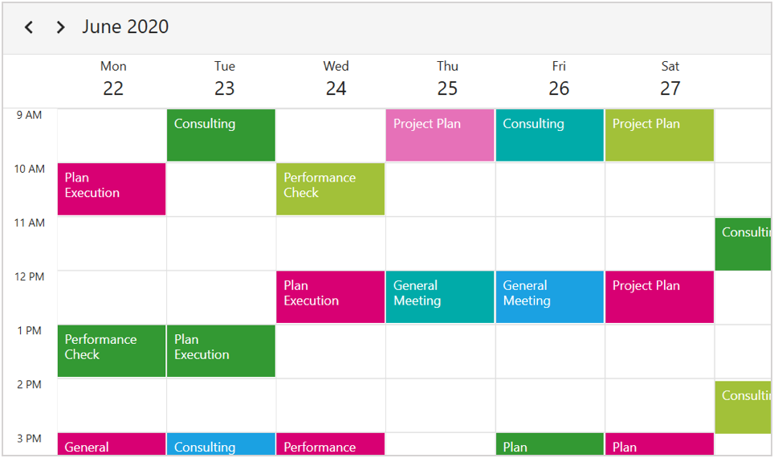

---
layout: post   
title: Getting Started with WPF Scheduler control | Syncfusion
description: Learn here about getting started with Syncfusion WPF Scheduler (SfScheduler) control, its elements and more.
platform: WPF   
control: SfScheduler   
documentation: ug   
---   
    
# Getting Started with WPF Scheduler (SfScheduler)
    
This section provides an overview for working with SfScheduler for WPF and also provides a walk through to configure SfScheduler control in the real time scenario.   

## Assembly deployment
Refer to the section on [control dependencies](https://help.syncfusion.com/wpf/control-dependencies#sfscheduler) for a list of assemblies or NuGet Packages to be used as a guide for using control in any application. Further information on installing the NuGet package can be found in the following link in a WPF application: [How to install nuget packages](https://help.syncfusion.com/wpf/nuget-packages) . Use [Syncfusion Reference Manager](https://help.syncfusion.com/wpf/visual-studio-integration/visual-studio-extensions/add-references) to refer the scheduler's dependent assemblies.

## Create simple application with SfScheduler

In this section, create WPF application with SfScheduler control.

* [Creating project](#creating-project)
* [Adding control via Designer](#adding-control-via-designer)
* [Adding control manually in XAML](#adding-control-manually-in-xaml)
* [Adding control manually in C#](#adding-control-manually-in-c)  

### Creating project
In Visual Studio, create a new WPF project to show the features of the SfScheduler control and add the following namespace to the added assemblies.

Assembly: `Syncfusion.SfScheduler.WPF`

Namespace: `Syncfusion.UI.Xaml.Scheduler`

### Adding control via Designer

[SfScheduler](https://help.syncfusion.com/cr/wpf/Syncfusion.UI.Xaml.Scheduler.html) control can be added to the application by dragging it from Toolbox and dropping it in a Designer view. The required assembly references will be added automatically.

### Adding control manually in XAML

To add the control manually in XAML page, follow the given steps:

1. Add the `Syncfusion.SfScheduler.WPF` assembly reference to the project.
2. Import WPF schema `http://schemas.syncfusion.com/wpf` in the XAML page.
3. Declare the `SfScheduler` control in XAML page.



<Window
    x:Class="GettingStarted.MainWindow"
    xmlns="http://schemas.microsoft.com/winfx/2006/xaml/presentation"
    xmlns:x="http://schemas.microsoft.com/winfx/2006/xaml"
    xmlns:local="clr-namespace:GettingStarted"
    xmlns:syncfusion="http://schemas.syncfusion.com/wpf"
    xmlns:system="clr-namespace:System;assembly=mscorlib"  
    WindowStartupLocation="CenterScreen">
<Grid>
    <syncfusion:SfScheduler x:Name="Schedule" ViewType="Month"/>
</Grid>
</Window>



### Adding control manually in C#

To add the control manually in C# page, add the `Syncfusion.SfScheduler.WPF` assembly reference to the project.



using Syncfusion.UI.Xaml.Scheduler;
namespace GettingStarted
{
    public partial class MainWindow : Window
    {
       SfScheduler schedule = new SfScheduler();
       this.Content = schedule;
    }
}


   

## Change different SfScheduler Views  
    
[SfScheduler](https://help.syncfusion.com/cr/wpf/Syncfusion.UI.Xaml.Scheduler.html) control provides five different types of views to display dates and it can be assigned to the control by using [ViewType](https://help.syncfusion.com/cr/wpf/Syncfusion.UI.Xaml.Scheduler.SfScheduler.html#Syncfusion_UI_Xaml_Scheduler_SfScheduler_ViewType) property. By default the control is assigned with `MonthView`. Current date will be displayed initially for all the Schedule views.  

   

<syncfusion:SfScheduler x:Name="Schedule" ViewType="Month">
  

Schedule.ViewType =SchedulerViewType.Month;
   
   

## Appointments
[SfScheduler](https://help.syncfusion.com/cr/wpf/Syncfusion.UI.Xaml.Scheduler.html) has a built-in capability to handle the appointment arrangement internally based on the [ScheduleAppointment](https://help.syncfusion.com/cr/wpf/Syncfusion.UI.Xaml.Scheduler.ScheduleAppointment.html) collections. Allocate the collection generated to `Appointments` property.

### Adding Appointments
The [ScheduleAppointment](https://help.syncfusion.com/cr/wpf/Syncfusion.UI.Xaml.Scheduler.ScheduleAppointment.html) is a class that includes the specific scheduled appointment. It has some basic properties such as [StartTime](https://help.syncfusion.com/cr/wpf/Syncfusion.UI.Xaml.Scheduler.ScheduleAppointment.html#Syncfusion_UI_Xaml_Scheduler_ScheduleAppointment_StartTime), [EndTime](https://help.syncfusion.com/cr/wpf/Syncfusion.UI.Xaml.Scheduler.ScheduleAppointment.html#Syncfusion_UI_Xaml_Scheduler_ScheduleAppointment_EndTime), [Subject](https://help.syncfusion.com/cr/wpf/Syncfusion.UI.Xaml.Scheduler.ScheduleAppointment.html#Syncfusion_UI_Xaml_Scheduler_ScheduleAppointment_Subject), and some additional information about the appointment can be added with [Notes](https://help.syncfusion.com/cr/wpf/Syncfusion.UI.Xaml.Scheduler.ScheduleAppointment.html#Syncfusion_UI_Xaml_Scheduler_ScheduleAppointment_Notes), [Location](https://help.syncfusion.com/cr/wpf/Syncfusion.UI.Xaml.Scheduler.ScheduleAppointment.html#Syncfusion_UI_Xaml_Scheduler_ScheduleAppointment_Location), and [IsAllDay](https://help.syncfusion.com/cr/wpf/Syncfusion.UI.Xaml.Scheduler.ScheduleAppointment.html#Syncfusion_UI_Xaml_Scheduler_ScheduleAppointment_IsAllDay) properties.

   

<schedule:SfSchedule x:Name="schedule" ViewType="Month"/>
  
 
//Creating new event   
ScheduleAppointmentCollection appointmentCollection = new ScheduleAppointmentCollection();

//Creating new event   
ScheduleAppointment clientMeeting = new ScheduleAppointment();
DateTime currentDate = DateTime.Now;
DateTime startTime = new DateTime(currentDate.Year, currentDate.Month, currentDate.Day, 10, 0, 0);
DateTime endTime = new DateTime(currentDate.Year, currentDate.Month, currentDate.Day, 12, 0, 0);
clientMeeting.StartTime = startTime;
clientMeeting.EndTime = endTime;
clientMeeting.Subject = "ClientMeeting";
appointmentCollection.Add(clientMeeting);
Schedule.ItemsSource = appointmentCollection;
   
 

Download the entire source code of this demo for WPF from
here [SchedulerGettingStarted](https://github.com/SyncfusionExamples/wpf-scheduler-getting-started-demo)

### Events/Appointments data mapping

Map the custom appointments data to the scheduler.

Here are the steps to render meetings using [SfScheduler](https://help.syncfusion.com/cr/wpf/Syncfusion.UI.Xaml.Scheduler.html) control with respective custom data properties created in a class `Meeting`.

* [Create an event Data Model](#create-an-event-data-model) 
* [Create view model](#create-view-model)
* [Bind to SfScheduler appointment](#bind-to-sfscheduler-appointment)  
* [Bind item source for Scheduler](#bind-item-source-for-sfscheduler)
  
#### Create an event Data Model 
  
Create a custom class `Meeting` with mandatory fields `From`, `To` and `EventName` that is used to map the information of the appointment.

  
    public class Meeting : INotifyPropertyChanged
    {
        DateTime from, to;
        string eventName;
        bool isAllDay;
        string startTimeZone, endTimeZone;
        Brush color;
        public Meeting()
        {
        }

        public DateTime From
        {
            get { return from; }
            set
            {
                from = value;
                RaisePropertyChanged("From");
            }
        }

        public DateTime To
        {
            get { return to; }
            set
            {
                to = value;
                RaisePropertyChanged("To");
            }
        }

        public bool IsAllDay
        {
            get { return isAllDay; }
            set
            {
                isAllDay = value;
                RaisePropertyChanged("IsAllDay");
            }
        }
        public string EventName
        {
            get { return eventName; }
            set
            {
                eventName = value;
                RaisePropertyChanged("EventName");
            }
        }
        public string StartTimeZone
        {
            get { return startTimeZone; }
            set
            {
                startTimeZone = value;
                RaisePropertyChanged("StartTimeZone");
            }
        }
        public string EndTimeZone
        {
            get { return endTimeZone; }
            set
            {
                endTimeZone = value;
                RaisePropertyChanged("EndTimeZone");
            }
        }

        public Brush Color
        {
            get { return color; }
            set
            {
                color = value;
                RaisePropertyChanged("Color");
            }
        }

        public event PropertyChangedEventHandler PropertyChanged;
        protected virtual void RaisePropertyChanged(string propertyName, object oldValue = null)
        {
            this.PropertyChanged?.Invoke(this, new PropertyChangedEventArgs(propertyName));
        }

    }

  

#### Create view model 

By setting `From` and `To` of the `Meeting` class, schedule the meetings for a specific day. Change the subject and color of the appointment using `EventName` and `Color` property. Define the list of custom appointments in a separate class of `ViewModel`.

   
 
   public class ScheduleViewModel
    {
        private List<string> currentDayMeetings;
        private List<string> minTimeMeetings;
        private List<Brush> colorCollection;

        public ScheduleViewModel()
        {
            this.Events = new ObservableCollection<Meeting>();
            this.InitializeDataForBookings();
            this.IntializeAppoitments();
        }

        public ObservableCollection<Meeting> Events
        {
            get;
            set;
        }

        private List<Point> GettingTimeRanges()
        {
            List<Point> randomTimeCollection = new List<Point>();
            randomTimeCollection.Add(new Point(9, 11));
            randomTimeCollection.Add(new Point(12, 14));
            randomTimeCollection.Add(new Point(15, 17));

            return randomTimeCollection;
        }

        private void InitializeDataForBookings()
        {
            this.currentDayMeetings = new List<string>();
            this.currentDayMeetings.Add("General Meeting");
            this.currentDayMeetings.Add("Plan Execution");

            this.minTimeMeetings = new List<string>();
            this.minTimeMeetings.Add("Client Metting");
            this.minTimeMeetings.Add("Birthday wish alert");

            this.colorCollection = new List<Brush>();
            this.colorCollection.Add(new SolidColorBrush((Color)ColorConverter.ConvertFromString("#FF339933")));
            this.colorCollection.Add(new SolidColorBrush((Color)ColorConverter.ConvertFromString("#FF00ABA9")));
            this.colorCollection.Add(new SolidColorBrush((Color)ColorConverter.ConvertFromString("#FFE671B8")));
            this.colorCollection.Add(new SolidColorBrush((Color)ColorConverter.ConvertFromString("#FF1BA1E2")));
            this.colorCollection.Add(new SolidColorBrush((Color)ColorConverter.ConvertFromString("#FFD80073")));
        }
        private void IntializeAppoitments()
        {
            Random randomTime = new Random();
            List<Point> randomTimeCollection = this.GettingTimeRanges();

            DateTime date;
            DateTime dateFrom = DateTime.Now.AddDays(-100);
            DateTime dateTo = DateTime.Now.AddDays(100);
            var random = new Random();
            var dateCount = random.Next(4);
            DateTime dateRangeStart = DateTime.Now.AddDays(0);
            DateTime dateRangeEnd = DateTime.Now.AddDays(1);

            for (date = dateFrom; date < dateTo; date = date.AddDays(1))
            {
                if (date.Day % 7 != 0)
                {
                    for (int additionalAppointmentIndex = 0; additionalAppointmentIndex < 1; additionalAppointmentIndex++)
                    {
                        Meeting meeting = new Meeting();
                        int hour = randomTime.Next((int)randomTimeCollection[additionalAppointmentIndex].X, (int)randomTimeCollection[additionalAppointmentIndex].Y);
                        meeting.From = new DateTime(date.Year, date.Month, date.Day, hour, 0, 0);
                        meeting.To = meeting.From.AddHours(1);
                        meeting.EventName = this.currentDayMeetings[randomTime.Next(2)];
                        meeting.Color = this.colorCollection[randomTime.Next(2)];
                        meeting.IsAllDay = false;
                        meeting.StartTimeZone = string.Empty;
                        meeting.EndTimeZone = string.Empty;
                        this.Events.Add(meeting);
                    }
                }
                else
                {
                    Meeting meeting = new Meeting();
                    meeting.From = new DateTime(date.Year, date.Month, date.Day, randomTime.Next(9, 11), 0, 0);
                    meeting.To = meeting.From.AddDays(2).AddHours(1);
                    meeting.EventName = this.currentDayMeetings[randomTime.Next(2)];
                    meeting.Color = this.colorCollection[randomTime.Next(2)];
                    meeting.IsAllDay = true;
                    meeting.StartTimeZone = string.Empty;
                    meeting.EndTimeZone = string.Empty;
                    this.Events.Add(meeting);
                }
            }
            DateTime minDate;
            DateTime minDateFrom = DateTime.Now.AddDays(-2);
            DateTime minDateTo = DateTime.Now.AddDays(2);

            for (minDate = minDateFrom; minDate < minDateTo; minDate = minDate.AddDays(1))
            {
                Meeting meeting = new Meeting();
                meeting.From = new DateTime(minDate.Year, minDate.Month, minDate.Day, randomTime.Next(9, 18), 30, 0);
                meeting.To = meeting.From;
                meeting.EventName = this.minTimeMeetings[randomTime.Next(0, 1)];
                meeting.Color = this.colorCollection[randomTime.Next(0, 2)];
                meeting.StartTimeZone = string.Empty;
                meeting.EndTimeZone = string.Empty;
                
                this.Events.Add(meeting);
            }
        }
    }
}


   

#### Bind to SfScheduler appointment

Map those properties of the `Meeting` class with our `SfScheduler` control by using the [AppointmentMapping](https://help.syncfusion.com/cr/wpf/Syncfusion.UI.Xaml.Scheduler.SfScheduler.html#Syncfusion_UI_Xaml_Scheduler_SfScheduler_AppointmentMappingProperty) property.



<syncfusion:SfScheduler x:Name="Schedule">
<syncfusion:SfScheduler.AppointmentMapping>
<syncfusion:AppointmentMapping
    Subject="EventName"
    StartTime="From"
    EndTime="To"
    AppointmentBackground="Color"
    IsAllDay="IsAllDay"
    StartTimeZone="StartTimeZone"
    EndTimeZone="EndTimeZone"/>
</syncfusion:SfScheduler.AppointmentMapping>
</syncfusion:SfScheduler>

  
  AppointmentMapping appointmentMapping = new AppointmentMapping();
  appointmentMapping.IsAllDay = "AllDay";
  appointmentMapping.StartTime = "From";
  appointmentMapping.EndTime = "To";
  appointmentMapping.Subject = "Event name";
  appointmentMapping.AppointmentBackground = "color";
  appointmentMapping.StartTimeZone = "StartTimeZone";
  appointmentMapping.EndTimeZone = "EndTimeZone";
  Schedule.AppointmentMapping = appointmentMapping;



#### Bind item source for SfScheduler
Create meetings of type `ObservableCollection<Events>` and assign those appointments collection [Events](https://help.syncfusion.com/cr/wpf/Syncfusion.UI.Xaml.Scheduler.SfScheduler.html#events) to the [ItemsSource](https://help.syncfusion.com/cr/wpf/Syncfusion.UI.Xaml.Scheduler.SfScheduler.html#Syncfusion_UI_Xaml_Scheduler_SfScheduler_ItemsSource) property of SfScheduler.



    <Window.DataContext>
        <local:ScheduleViewModel/>
    </Window.DataContext>
      <syncfusion:SfScheduler x:Name="Schedule"
                ItemsSource="{Binding Events}"
                ViewType="Month">
      </syncfusion:SfScheduler>


 ScheduleViewModel viewModel = new ScheduleViewModel();
 Schedule.ItemsSource = viewModel.Events;



N> [View sample in GitHub](https://github.com/SyncfusionExamples/wpf-scheduler-data-binding-demo)

## Change first day of week

SfScheduler control will be rendered with `Sunday` as the first day of the week, but it can be customized to any day by using [FirstDayOfWeek](https://help.syncfusion.com/cr/wpf/Syncfusion.UI.Xaml.Scheduler.SfScheduler.html#Syncfusion_UI_Xaml_Scheduler_SfScheduler_FirstDayOfWeek) property of `SfScheduler`.
    
  

<syncfusion:SfScheduler x:Name="Schedule" FirstDayOfWeek="Tuesday"/> 
   

//setting first day of the week    
Schedule.FirstDayOfWeek = DayOfWeek.Tuesday;   
  
   

## Show busy indicator
The Scheduler supports to show the busy indicator by using the [ShowBusyIndicator](https://help.syncfusion.com/cr/wpf/Syncfusion.UI.Xaml.Scheduler.SfScheduler.html#Syncfusion_UI_Xaml_Scheduler_SfScheduler_ShowBusyIndicator) property. The default value is set to false, if the value is set to `true` then the busy indicator will be loaded on view or visible date changed.

   

       <syncfusion:SfScheduler x:Name="Schedule"
                ShowBusyIndicator="True"
                ViewType="Month">
        </syncfusion:SfScheduler>
  
 

## Theme

SfScheduler supports various built-in themes. Refer to the below links to apply themes for the SfScheduler,

  * [Apply theme using SfSkinManager](https://help.syncfusion.com/wpf/themes/skin-manager)
	
  * [Create a custom theme using ThemeStudio](https://help.syncfusion.com/wpf/themes/theme-studio#creating-custom-theme)

  