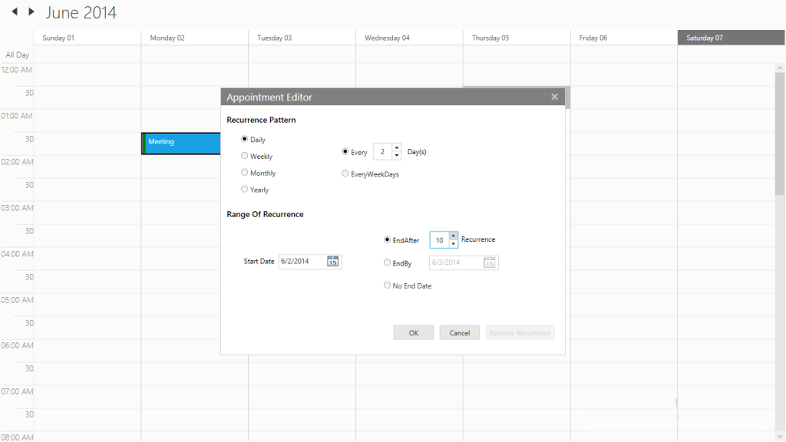

# Adding Recurrence Appointment

In order to add recurrence appointments, the “Recurrence Enabled” option needs to be Click in the Appointment Editor as shown below. Refer the below images, Once the Recurrence Enabled option is clicked, the sub-options available within the recurrence are shown in the Appointment Editor as shown below,

The required recurrence pattern can be then chosen from the available options and then the “Save” button is clicked. Now the main appointment pop-up will appear as shown below with the chosen options,

Click “Done” now and then the recurrence appointment with daily pattern is created for every two days, which will end after 10 occurrences.

The Recurrence option that are chosen in the above cases, are usually stored in a RecurrenceRule field in a string format. Also, the Recurrence field indicates whether the appointments created are of normal or recurrence type. 

