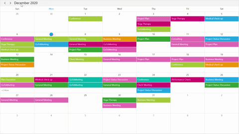

# Load On Demand in WPF Scheduler (SfScheduler)
The [WPF Scheduler](https://www.syncfusion.com/scheduler-sdk/wpf-scheduler) supports loading appointments on demand with a loading indicator and improves the loading performance when there are appointments ranging over multiple years.

## QueryAppointments event
The [QueryAppointments](https://help.syncfusion.com/cr/wpf/Syncfusion.UI.Xaml.Scheduler.SfScheduler.html#Syncfusion_UI_Xaml_Scheduler_SfScheduler_QueryAppointments) event is used to load appointments in on-demand for the visible date range. Start and stop the loading indicator animation before and after the appointments are loaded using the [ShowBusyIndicator](https://help.syncfusion.com/cr/wpf/Syncfusion.UI.Xaml.Scheduler.SfScheduler.html#Syncfusion_UI_Xaml_Scheduler_SfScheduler_ShowBusyIndicator).
The [QueryAppointmentsEventArgs](https://help.syncfusion.com/cr/wpf/Syncfusion.UI.Xaml.Scheduler.QueryAppointmentsEventArgs.html) has the following members which provides information for the `QueryAppointments` event.

[VisibleDateRange](https://help.syncfusion.com/cr/wpf/Syncfusion.UI.Xaml.Scheduler.DateRange.html) - Gets the current visible date range of scheduler that is used to load the appointments.



<Window
    x:Class="GettingStarted.MainWindow"
    xmlns="http://schemas.microsoft.com/winfx/2006/xaml/presentation"
    xmlns:x="http://schemas.microsoft.com/winfx/2006/xaml"
    xmlns:syncfusion="http://schemas.syncfusion.com/wpf">
    <Grid>
      <syncfusion:SfScheduler x:Name="Scheduler"
                              ViewType="Month" QueryAppointments="Scheduler_QueryAppointments">
      </syncfusion:SfScheduler>
    </Grid>
</Window>


using Syncfusion.UI.Xaml.Scheduler;

namespace GettingStarted
{
    public partial class MainWindow : Window
    {
        public MainWindow()
        {
            InitializeComponent();
            this.Scheduler.QueryAppointments += Scheduler_QueryAppointments;
        }

        private void Scheduler_QueryAppointments(object sender, QueryAppointmentsEventArgs e)
        {
        this.Scheduler.ShowBusyIndicator = true;
        this.Scheduler.ItemsSource = this.GenerateSchedulerAppointments(e.VisibleDateRange);
        this.Scheduler.ShowBusyIndicator = false;
        }

        private IEnumerable GenerateSchedulerAppointments(DateRange dateRange)
        {
          Random ran = new Random();
          int daysCount = (dateRange.ActualEndDate - dateRange.ActualStartDate).Days;
          var appointments = new ObservableCollection<SchedulerModel>();
              
          for (int i = 0; i < 50; i++)
          {
            var startTime = dateRange.ActualStartDate.AddDays(ran.Next(0, daysCount + 1)).AddHours(ran.Next(0, 24));
            appointments.Add(new SchedulerModel
            {
            From = startTime,
            To = startTime.AddHours(1),
            EventName = subjectCollection[ran.Next(0, subjectCollection.Count)],
            Color = brush[ran.Next(0, brush.Count)],
            });
          }
          return appointments;
        }
    }
}



The [QueryAppointments](https://help.syncfusion.com/cr/wpf/Syncfusion.UI.Xaml.Scheduler.SfScheduler.html#Syncfusion_UI_Xaml_Scheduler_SfScheduler_QueryAppointments) will be raised once any one of the following action is taken.

 * Once the [ViewChanged](https://help.syncfusion.com/cr/wpf/Syncfusion.UI.Xaml.Scheduler.SfScheduler.html#Syncfusion_UI_Xaml_Scheduler_SfScheduler_ViewChanged) event is raised, the `QueryAppointments` will be raised.

* If the appointment has been added, removed, or changed (Resize, drag, and drop) in the current time visible date range, then the `QueryAppointments` event will not be triggered. Since the appointments for that visible date range have been loaded already.

* The `QueryAppointments` event is triggered when the Schedule [ResourceCollection](https://help.syncfusion.com/cr/wpf/Syncfusion.UI.Xaml.Scheduler.SfScheduler.html#Syncfusion_UI_Xaml_Scheduler_SfScheduler_ResourceCollection) is updated to load appointments based on the changed resource collection.

* The `QueryAppointments` event will be triggered when the [ResourceGroupType](https://help.syncfusion.com/cr/wpf/Syncfusion.UI.Xaml.Scheduler.SfScheduler.html#Syncfusion_UI_Xaml_Scheduler_SfScheduler_ResourceGroupType) is changed.

## Load On Demand command
The Scheduler notifies by [LoadOnDemandCommand](https://help.syncfusion.com/cr/wpf/Syncfusion.UI.Xaml.Scheduler.SfScheduler.html#Syncfusion_UI_Xaml_Scheduler_SfScheduler_LoadOnDemandCommand) when the user changes the visible date range. Get a visible date range from the [QueryAppointmentsEventArgs](https://help.syncfusion.com/cr/wpf/Syncfusion.UI.Xaml.Scheduler.QueryAppointmentsEventArgs.html). The default value for this `ICommand` is null. The `QueryAppointmentsEventArgs` passed as a command parameter.

Define a ViewModel class that implements command and handle it by the CanExecute and Execute methods to check and execute on-demand loading. In the execute method, perform the following operations,
* Start and stop the loading indicator animation before and after the appointments are loaded using the [ShowBusyIndicator](https://help.syncfusion.com/cr/wpf/Syncfusion.UI.Xaml.Scheduler.SfScheduler.html#Syncfusion_UI_Xaml_Scheduler_SfScheduler_ShowBusyIndicator).
* Once the appointment collection is obtained, load it into the scheduler's Itemsource.



<Window
    x:Class="GettingStarted.MainWindow"
    xmlns="http://schemas.microsoft.com/winfx/2006/xaml/presentation"
    xmlns:x="http://schemas.microsoft.com/winfx/2006/xaml"
    xmlns:syncfusion="http://schemas.syncfusion.com/wpf">
    <Grid>
      <syncfusion:SfScheduler x:Name="Scheduler"
                              ViewType="Month" 
                              ShowBusyIndicator="{Binding ShowBusyIndicator}"
                              LoadOnDemandCommand="{Binding LoadOnDemandCommand}"
                              ItemsSource="{Binding Events}">
      </syncfusion:SfScheduler>
    </Grid>
</Window>


using System;
using System.Collections;
using System.ComponentModel;

namespace GettingStarted
{
    public class LoadOnDemandViewModel : NotificationObject
      {
        public ICommand LoadOnDemandCommand { get; set; }
        private IEnumerable events;
        public IEnumerable Events
          {
            get { return events; }
            set
              {
                events = value;
                this.RaisePropertyChanged("Events");
              }
          }

        private bool showBusyIndicator;
        public bool ShowBusyIndicator
        {
          get { return showBusyIndicator; }
          set
              {
                showBusyIndicator = value;
                this.RaisePropertyChanged("ShowBusyIndicator");
              }
        }
        public LoadOnDemandViewModel()
        {
          this.LoadOnDemandCommand = new DelegateCommand(ExecuteOnDemandLoading, CanExecuteOnDemandLoading);
        }
          
        public event PropertyChangedEventHandler PropertyChanged;
        public async void ExecuteOnDemandLoading(object parameter)
        {
          this.ShowBusyIndicator = true;
          await Task.Delay(1000);
          await Application.Current.MainWindow.Dispatcher.BeginInvoke(DispatcherPriority.ApplicationIdle, new Action(() =>
                {
                    this.Events = this.GenerateSchedulerAppointments((parameter as QueryAppointmentsEventArgs).VisibleDateRange);
                }));
          this.ShowBusyIndicator = false;
        }

        private bool CanExecuteOnDemandLoading(object sender)
        {
          return true;
        }

        private IEnumerable GenerateSchedulerAppointments(DateRange dateRange)
        {
          Random ran = new Random();
          int daysCount = (dateRange.ActualEndDate - dateRange.ActualStartDate).Days;
          var appointments = new ObservableCollection<SchedulerModel>();
          for (int i = 0; i < 50; i++)
          {
            var startTime = dateRange.ActualStartDate.AddDays(ran.Next(0, daysCount + 1)).AddHours(ran.Next(0, 24));appointments.Add(new SchedulerModel
            {
              From = startTime,
              To = startTime.AddHours(1),
              EventName = subjectCollection[ran.Next(0, subjectCollection.Count)],
              Color = brush[ran.Next(0, brush.Count)],
            });
          }
          return appointments;
        }
      }
}



The [LoadOnDemandCommand](https://help.syncfusion.com/cr/wpf/Syncfusion.UI.Xaml.Scheduler.SfScheduler.html#Syncfusion_UI_Xaml_Scheduler_SfScheduler_LoadOnDemandCommand) will be invoked once any one of the following actions is taken.

* Once the [ViewChanged](https://help.syncfusion.com/cr/wpf/Syncfusion.UI.Xaml.Scheduler.SfScheduler.html#Syncfusion_UI_Xaml_Scheduler_SfScheduler_ViewChanged) event is raised, the `LoadOnDemandCommand` will also be invoked.

* If the appointment has been added, removed, or changed (Resize, drag, and drop) in the current time visible date range, then the `LoadOnDemandCommand` will not be triggered, since the appointments for that visible date range have been loaded already.

* The `LoadOnDemandCommand` is triggered when the Schedule [ResourceCollection](https://help.syncfusion.com/cr/wpf/Syncfusion.UI.Xaml.Scheduler.SfScheduler.html#Syncfusion_UI_Xaml_Scheduler_SfScheduler_ResourceCollection) is updated to load the appointments based on the changed resource collection.

* The `LoadOnDemandCommand` will be triggered when the [ResourceGroupType](https://help.syncfusion.com/cr/wpf/Syncfusion.UI.Xaml.Scheduler.SfScheduler.html#Syncfusion_UI_Xaml_Scheduler_SfScheduler_ResourceGroupType) is changed.

## Load On Demand for recurring appointment
The scheduler will add the occurrences of recurrence series based on the visible date range, use the [RecurrenceHelper.GetRecurrenceDateTimeCollection](https://help.syncfusion.com/cr/wpf/Syncfusion.UI.Xaml.Scheduler.RecurrenceHelper.html#Syncfusion_UI_Xaml_Scheduler_RecurrenceHelper_GetRecurrenceDateTimeCollection_System_String_System_DateTime_System_Nullable_System_DateTime__System_Nullable_System_DateTime__) to compare and load the recurrence appointment on demand in the ItemsSource.

* The recurrence appointment should be added to the Scheduler [ItemsSource](https://help.syncfusion.com/cr/wpf/Syncfusion.UI.Xaml.Scheduler.SfScheduler.html#Syncfusion_UI_Xaml_Scheduler_SfScheduler_ItemsSource) until the date of recurrence ends.

* If [RecurrenceRule](https://help.syncfusion.com/cr/wpf/Syncfusion.UI.Xaml.Scheduler.ScheduleAppointment.html#Syncfusion_UI_Xaml_Scheduler_ScheduleAppointment_RecurrenceRule) added with count or end date, use the [RecurrenceHelper.GetRecurrenceDateTimeCollection](https://help.syncfusion.com/cr/wpf/Syncfusion.UI.Xaml.Scheduler.RecurrenceHelper.html#Syncfusion_UI_Xaml_Scheduler_RecurrenceHelper_GetRecurrenceDateTimeCollection_System_String_System_DateTime_System_Nullable_System_DateTime__System_Nullable_System_DateTime__) method to get the recurrence date collection and compare recursive dates in the current visible date range. Then add the recurrence appointment in the scheduler [ItemsSource](https://help.syncfusion.com/cr/wpf/Syncfusion.UI.Xaml.Scheduler.SfScheduler.html#Syncfusion_UI_Xaml_Scheduler_SfScheduler_ItemsSource) If the recursive dates are in the current visible date range.

* If the `RecurrenceRule` is added without an end date, then the recurrence appointment should be added in the scheduler `ItemsSource` when all the visible dates changed from the recurrence start date.

N> [View sample in GitHub](https://github.com/SyncfusionExamples/load-on-demand-appointments-wpf-scheduler). For more information on appointments, see [Appointments](appointments.md).
