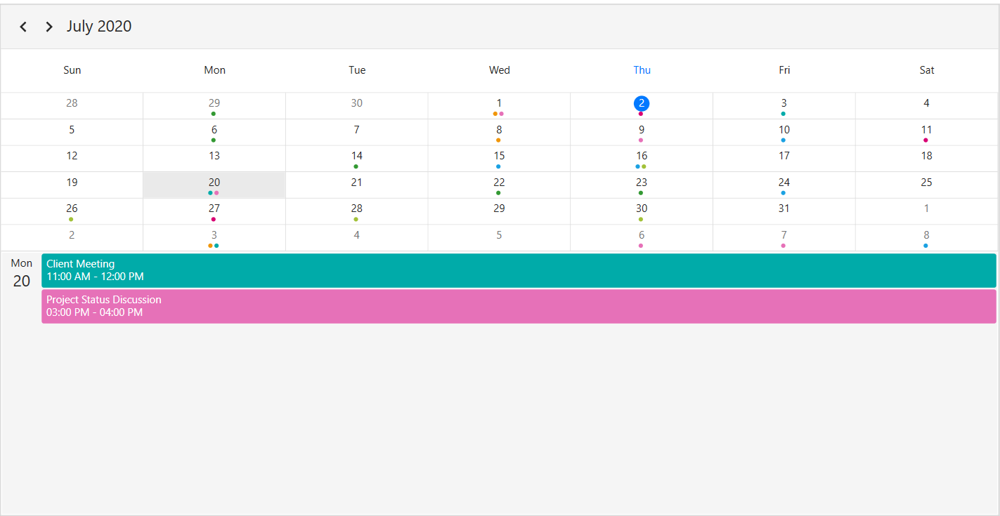
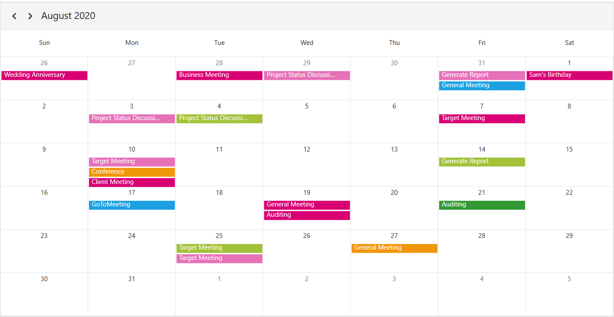
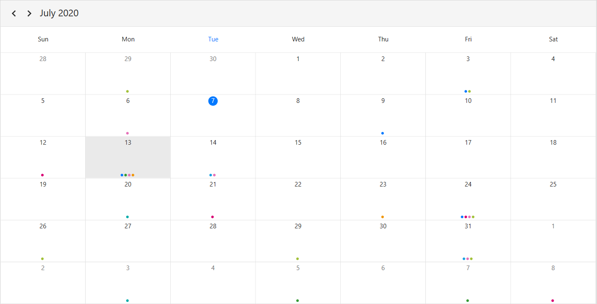
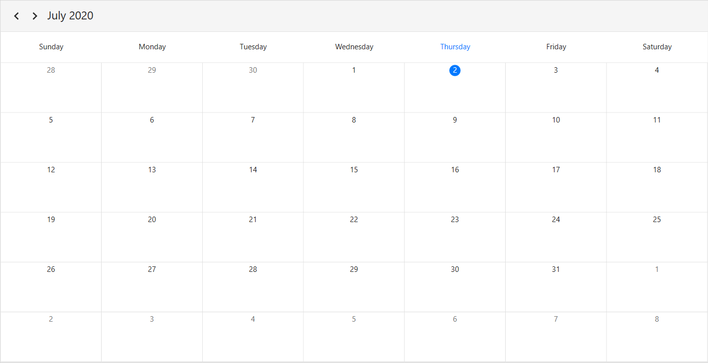
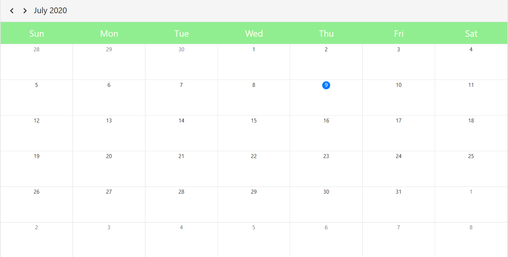
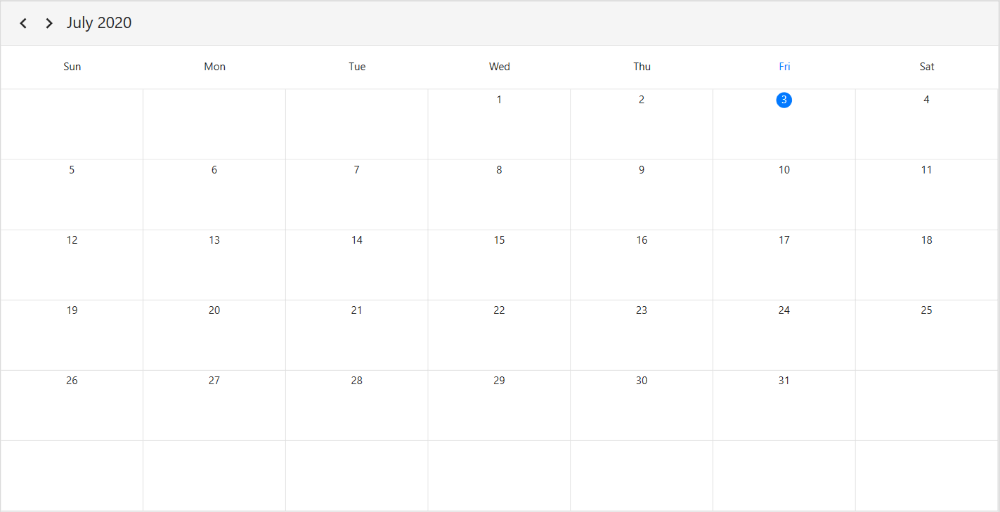
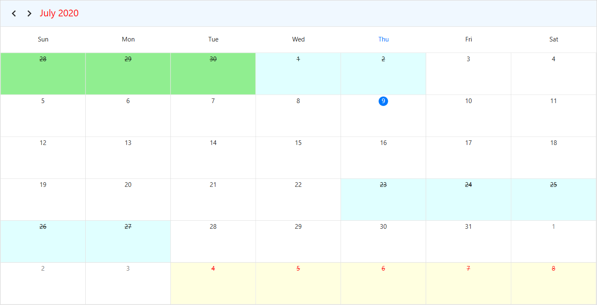
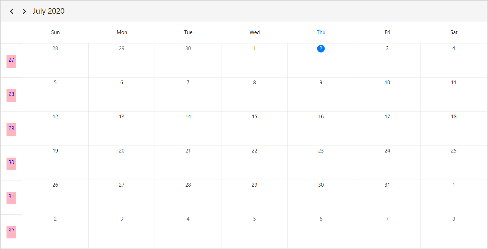
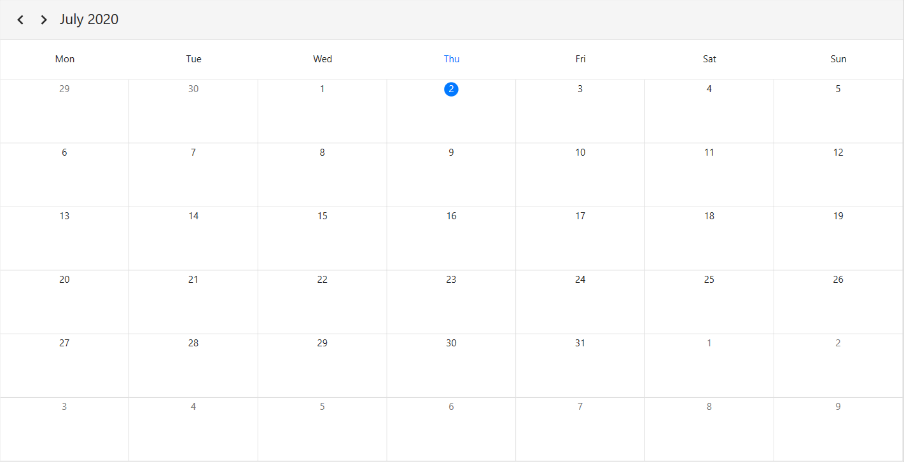
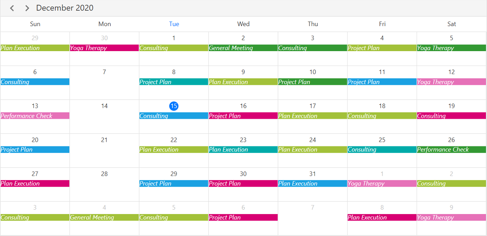

# Month View in WPF Scheduler (SfScheduler)
The Month view of scheduler used to display entire dates of the specific month and current month by default initially. Current date color is differentiated with other dates of the current month.

## Month agenda view
The Scheduler month view displays a divided agenda view that is used to show the selected date’s appointments below the month. You can show the agenda view by setting the [ShowAgendaView](https://help.syncfusion.com/cr/wpf/Syncfusion.SfScheduler.WPF~Syncfusion.UI.Xaml.Scheduler.MonthViewSettings~ShowAgendaView.html) property to `true` in [MonthViewSettings](https://help.syncfusion.com/cr/wpf/Syncfusion.SfScheduler.WPF~Syncfusion.UI.Xaml.Scheduler.MonthViewSettings.html).



<syncfusion:SfScheduler x:Name="Schedule"
                        ViewType="Month" >
    <syncfusion:SfScheduler.MonthViewSettings>
        <syncfusion:MonthViewSettings ShowAgendaView="True"/>
    </syncfusion:SfScheduler.MonthViewSettings>
</syncfusion:SfScheduler>


this.Schedule.ViewType = SchedulerViewType.Month;
this.Schedule.MonthViewSettings.ShowAgendaView = true;



>**NOTE**
* An agenda view displays text as `No Selected Date` until no date is selected.
* If there is no appointment in a selected day, agenda view displays the text as`No Events`.

### Agenda view height
You can customize the month agenda view height from Scheduler by using the [AgendaViewHeight](https://help.syncfusion.com/cr/wpf/Syncfusion.SfScheduler.WPF~Syncfusion.UI.Xaml.Scheduler.MonthViewSettings~AgendaViewHeight.html) property of MonthViewSettings. By default, the agenda view will occupy the 30% height of the Scheduler height.



<syncfusion:SfScheduler x:Name="Schedule"
                        ViewType="Month" >
    <syncfusion:SfScheduler.MonthViewSettings>
        <syncfusion:MonthViewSettings AppointmentDisplayMode="Indicator"
        ShowAgendaView="True"
        AgendaViewHeight="300"/>
    </syncfusion:SfScheduler.MonthViewSettings>
</syncfusion:SfScheduler>   


this.Schedule.ViewType = SchedulerViewType.Month;
this.Schedule.MonthViewSettings.AppointmentDisplayMode = AppointmentDisplayMode.Indicator;
this.Schedule.MonthViewSettings.ShowAgendaView = true;
this.Schedule.MonthViewSettings.AgendaViewHeight = 300;



## Appointment display mode
You can handle the Scheduler month view appointment display by using the [AppointmentDisplayMode](https://help.syncfusion.com/cr/wpf/Syncfusion.SfScheduler.WPF~Syncfusion.UI.Xaml.Scheduler.MonthViewSettings~AppointmentDisplayMode.html) property of `MonthViewSettings`. By default, `AppointmentDisplayMode` is set to `Appointment`, using the `AppointmentDisplayMode` you can set the month view appointments display as follows.
* `None` - appointment will not be displayed.
* `Indicator` - appointment will be denoted as the circle.
* `Appointment` - appointment subject will be displayed in month cell.



<syncfusion:SfScheduler x:Name="Schedule"
                        ViewType="Month" >
       <syncfusion:SfScheduler.MonthViewSettings>
            <syncfusion:MonthViewSettings AppointmentDisplayMode="Appointment"/>
       </syncfusion:SfScheduler.MonthViewSettings>
</syncfusion:SfScheduler>


this.Schedule.ViewType = SchedulerViewType.Month; 
this.Schedule.MonthViewSettings.AppointmentDisplayMode = AppointmentDisplayMode.Appointment;



## Appointment display count
You can customize the number of appointments displayed in month cell using the [AppointmentDisplayCount](https://help.syncfusion.com/cr/wpf/Syncfusion.SfScheduler.WPF~Syncfusion.UI.Xaml.Scheduler.MonthViewSettings~AppointmentDisplayCount.html) property of `MonthViewSettings` in Scheduler, by default the appointment display count is 3.



<syncfusion:SfScheduler x:Name="Schedule"
                        ViewType="Month" >
    <syncfusion:SfScheduler.MonthViewSettings>
        <syncfusion:MonthViewSettings AppointmentDisplayMode="Indicator"    AppointmentDisplayCount="4"
        />
    </syncfusion:SfScheduler.MonthViewSettings>
</syncfusion:SfScheduler>


this.Schedule.ViewType = SchedulerViewType.Month;
this.Schedule.MonthViewSettings.AppointmentDisplayMode = AppointmentDisplayMode.Indicator;
this.Schedule.MonthViewSettings.AppointmentDisplayCount = 4;



## Month navigation direction
Month view of Scheduler can be navigated in both horizontal and vertical direction. You can change the direction of navigation using the [MonthNavigationDirection](https://help.syncfusion.com/cr/wpf/Syncfusion.SfScheduler.WPF~Syncfusion.UI.Xaml.Scheduler.MonthViewSettings~MonthNavigationDirection.html) property of `MonthViewSettings`, by default the month navigation direction is `Horizontal`.



<syncfusion:SfScheduler x:Name="Schedule"
                        ViewType="Month" >
    <syncfusion:SfScheduler.MonthViewSettings>
        <syncfusion:MonthViewSettings MonthNavigationDirection="Vertical"/>
    </syncfusion:SfScheduler.MonthViewSettings>
 </syncfusion:SfScheduler>


this.Schedule.ViewType = SchedulerViewType.Month;
this.Schedule.MonthViewSettings.MonthNavigationDirection = MonthNavigationDirection.Vertical;



## View header day format
You can customize the day format of Scheduler view header by using the [ViewHeaderDayFormat](https://help.syncfusion.com/cr/wpf/Syncfusion.SfScheduler.WPF~Syncfusion.UI.Xaml.Scheduler.ViewSettingsBase~ViewHeaderDayFormat.html) property of `MonthViewSettings`, by default the month view header day format is `ddd`.



<syncfusion:SfScheduler x:Name="Schedule"
                        ViewType="Month" >
    <syncfusion:SfScheduler.MonthViewSettings>
        <syncfusion:MonthViewSettings ViewHeaderDayFormat="dddd"/>
    </syncfusion:SfScheduler.MonthViewSettings>
</syncfusion:SfScheduler>


this.Schedule.ViewType = SchedulerViewType.Month;
this.Schedule.MonthViewSettings.ViewHeaderDayFormat = "dddd";



## View header height
You can customize the view header height by using [ViewHeaderHeight](https://help.syncfusion.com/cr/wpf/Syncfusion.SfScheduler.WPF~Syncfusion.UI.Xaml.Scheduler.ViewSettingsBase~ViewHeaderHeight.html) property of `MonthViewSettings`, by default the `ViewHeaderHeight` is 50.



<syncfusion:SfScheduler x:Name="Schedule"
                        ViewType="Month" >
    <syncfusion:SfScheduler.MonthViewSettings>
        <syncfusion:MonthViewSettings ViewHeaderHeight="100"/>
    </syncfusion:SfScheduler.MonthViewSettings>
</syncfusion:SfScheduler>


this.Schedule.ViewType = SchedulerViewType.Month;
this.Schedule.MonthViewSettings.ViewHeaderHeight = 100;



## View header template
You can customize the default appearance of month view header by using the [ViewHeaderTemplate](https://help.syncfusion.com/cr/wpf/Syncfusion.SfScheduler.WPF~Syncfusion.UI.Xaml.Scheduler.ViewSettingsBase~ViewHeaderTemplate.html) property of `MonthViewSettings`.



<Window.Resources>
    
</Window.Resources>
<syncfusion:SfScheduler x:Name="Schedule"
                        ViewType="Month" >
    <syncfusion:SfScheduler.MonthViewSettings>
        <syncfusion:MonthViewSettings>
            <syncfusion:MonthViewSettings.ViewHeaderTemplate>
                <DataTemplate>
                    <TextBlock FontFamily="Segoe UI"
                                FontSize="20"
                                FontStyle="Italic"
                                Foreground="Red"
                                Background="AntiqueWhite"
                                Text="{Binding DayText}"/>
                </DataTemplate>
            </syncfusion:MonthViewSettings.ViewHeaderTemplate>
        </syncfusion:MonthViewSettings>
    </syncfusion:SfScheduler.MonthViewSettings>
</syncfusion:SfScheduler>



## Date format
You can customize the date format of scheduler month view by using the [DateFormat](https://help.syncfusion.com/cr/wpf/Syncfusion.SfScheduler.WPF~Syncfusion.UI.Xaml.Scheduler.MonthViewSettings~DateFormat.html) property of `MonthViewSettings`, by default the month date format is `d`.



<syncfusion:SfScheduler x:Name="Schedule"
                        ViewType="Month" >
    <syncfusion:SfScheduler.MonthViewSettings>
        <syncfusion:MonthViewSettings DateFormat="dd"/>
    </syncfusion:SfScheduler.MonthViewSettings>
</syncfusion:SfScheduler>


this.Schedule.ViewType = SchedulerViewType.Month;
this.Schedule.MonthViewSettings.DateFormat = "dd";



## Leading and Trailing days visibility
You can customize leading and trailing days visibility of scheduler month view by using the [LeadingDaysVisibility](https://help.syncfusion.com/cr/wpf/Syncfusion.SfScheduler.WPF~Syncfusion.UI.Xaml.Scheduler.MonthViewSettings~LeadingDaysVisibility.html) and [TrailingDaysVisibility](https://help.syncfusion.com/cr/wpf/Syncfusion.SfScheduler.WPF~Syncfusion.UI.Xaml.Scheduler.MonthViewSettings~TrailingDaysVisibility.html) property of `MonthViewSettings`. By default `LeadingDaysVisibility` and `TrailingDaysVisibility` is `Visible`.



<syncfusion:SfScheduler x:Name="Schedule"
                        ViewType="Month" >
    <syncfusion:SfScheduler.MonthViewSettings>
        <syncfusion:MonthViewSettings
         LeadingDaysVisibility="Collapsed"
         TrailingDaysVisibility="Collapsed"/>
    </syncfusion:SfScheduler.MonthViewSettings>
</syncfusion:SfScheduler>


this.Schedule.ViewType = SchedulerViewType.Month;
this.Schedule.MonthViewSettings.LeadingDaysVisibility = Collapsed.
this.Schedule.MonthViewSettings.TrailingDaysVisibility = Collapsed.Collapsed;



## Blackout dates
You can disable the interaction for certain dates in scheduler month view by adding that specific dates to [BlackoutDates](https://help.syncfusion.com/cr/wpf/Syncfusion.SfScheduler.WPF~Syncfusion.UI.Xaml.Scheduler.MonthViewSettings~BlackoutDates.html) collection property of `MonthViewSettings`, using this you can allocate / restrict the specific date for predefined events.



this.Schedule.ViewType = SchedulerViewType.Month;
this.Schedule.MonthViewSettings.BlackoutDates = GetBlackoutDates();

private ObservableCollection<DateTime> GetBlackoutDates()
        {
            var blackoutDateCollection = new ObservableCollection<DateTime>()
            {
                DateTime.Now.Date.AddDays(1),
                DateTime.Now.Date.AddDays(2),
                DateTime.Now.Date.AddDays(3),
                DateTime.Now.Date.AddDays(4),
                DateTime.Now.Date.AddDays(5)
            };
            return blackoutDateCollection;
        }



### Customize blackout dates appearance 
 we can customize the blackout dates (trailing, leading, normal days, current date) by using setting style.
 >Download demo application from [GitHub]



<Window.Resources>
    
</Window.Resources>



## Show week number
You can display the week number of the year in scheduler month view by setting [ShowWeekNumber](https://help.syncfusion.com/cr/wpf/Syncfusion.SfScheduler.WPF~Syncfusion.UI.Xaml.Scheduler.MonthViewSettings~ShowWeekNumber.html) property of `MonthViewSettings` as `true`, by default it is `false`.



<syncfusion:SfScheduler x:Name="Schedule"
                        ViewType="Month" >
    <syncfusion:SfScheduler.MonthViewSettings>
        <syncfusion:MonthViewSettings ShowWeekNumber="True"/>
    </syncfusion:SfScheduler.MonthViewSettings>
</syncfusion:SfScheduler>


this.Schedule.ViewType = SchedulerViewType.Month;
this.Schedule.MonthViewSettings.ShowWeekNumber = true;



## Customize week number template
You can customize the default appearance of the week number template in month view by using the [WeekNumberTemplate](https://help.syncfusion.com/cr/wpf/Syncfusion.SfScheduler.WPF~Syncfusion.UI.Xaml.Scheduler.MonthViewSettings~WeekNumberTemplate.html) property of `MonthViewSettings`.



<syncfusion:SfScheduler x:Name="Schedule"
                        ViewType="Month" >
    <syncfusion:SfScheduler.MonthViewSettings>
                <syncfusion:MonthViewSettings ShowWeekNumber="True">
                    <syncfusion:MonthViewSettings.WeekNumberTemplate>
                        <DataTemplate>
                             <Grid >
                                <Label  Foreground="Red"
                                        Content="{Binding}"
                                        VerticalAlignment="Center"
                                        HorizontalAlignment="Center"/>
                            </Grid>
                        </DataTemplate>
                    </syncfusion:MonthViewSettings.WeekNumberTemplate>
                </syncfusion:MonthViewSettings>
    </syncfusion:SfScheduler.MonthViewSettings>
</syncfusion:SfScheduler>



## First day of week
You can set first day of week using [FirstDayOfWeek](https://help.syncfusion.com/cr/wpf/Syncfusion.SfScheduler.WPF~Syncfusion.UI.Xaml.Scheduler.SfScheduler~FirstDayOfWeek.html) property of Scheduler in month view, by default `Sunday` as the first day of the week in Scheduler.



<syncfusion:SfScheduler x:Name="Schedule"
                        ViewType="Month" 
                        FirstDayOfWeek="Monday"/>


this.Schedule.ViewType = SchedulerViewType.Month;
this.Schedule.FirstDayOfWeek = DayOfWeek.Monday;



## Customize month cell appearance 

### Using DataTemplate 
You can customize the default appearance of the month cell by using the [MonthCellTemplate](https://help.syncfusion.com/cr/wpf/Syncfusion.SfScheduler.WPF~Syncfusion.UI.Xaml.Scheduler.MonthViewSettings~MonthCellTemplate.html) property of `MonthViewSettings`.



<syncfusion:SfScheduler x:Name="Schedule"
                        ViewType="Month">
    <syncfusion:SfScheduler.MonthViewSettings>
        <syncfusion:MonthViewSettings>
             <syncfusion:MonthViewSettings.MonthCellTemplate>
                <DataTemplate>
                    <Border Background="BlueViolet">
                        <TextBlock HorizontalAlignment="Center" Foreground="White" Text="{Binding DateTime.Day}"/>
                    </Border>
                </DataTemplate>
             </syncfusion:MonthViewSettings.MonthCellTemplate>
        </syncfusion:MonthViewSettings>
    </syncfusion:SfScheduler.MonthViewSettings>
</syncfusion:SfScheduler>



### Using DataTemplateSelector 
You can customize the default appearance of the month cell by using the [MonthCellTemplateSelector](https://help.syncfusion.com/cr/wpf/Syncfusion.SfScheduler.WPF~Syncfusion.UI.Xaml.Scheduler.MonthViewSettings~MonthCellTemplateSelector.html) property of `MonthViewSettings`.
You can use `DataTemplateSelector` to choose a DataTemplate at runtime based on the value of a data-bound to Scheduler month cell through MonthCellTemplate. It lets you choose a different data template for each month cell, customizing the appearance of a particular month cell based on certain conditions.

>Download demo application from [GitHub]



<Window.Resources>
        <local:MonthCellTemplateSelector x:Key="monthCellTemplateSelector"/>
</Window.Resources>   
<syncfusion:SfScheduler x:Name="Schedule" 
                        ViewType="Month"
                        ItemsSource="{Binding Appointments}">          
    <syncfusion:SfScheduler.MonthViewSettings>
        <syncfusion:MonthViewSettings AppointmentDisplayMode="Indicator" 
                                      MonthCellTemplateSelector="{StaticResource monthCellTemplateSelector}">
        </syncfusion:MonthViewSettings>
    </syncfusion:SfScheduler.MonthViewSettings>
</syncfusion:SfScheduler>     


 public class MonthCellTemplateSelector : DataTemplateSelector
    {
        public MonthCellTemplateSelector()
        {
            var mainWindow = App.Current.MainWindow as Window;
            this.MonthAppointmentTemplate = mainWindow.Resources["monthAppointmentTemplate"] as DataTemplate;
            this.MonthCellDatesTemplate = mainWindow.Resources["monthCellTemplate"] as DataTemplate;
        }

        public DataTemplate MonthAppointmentTemplate { get; set; }
        public DataTemplate MonthCellDatesTemplate { get; set; }
        public override DataTemplate SelectTemplate(object item, DependencyObject container)
        {
            var appointments = item as List<ScheduleAppointment>;
            var cell = container as MonthCell;
            if (cell.DateTime.Date == DateTime.Now.Date)
                cell.Foreground = Brushes.Black;

            if (appointments == null || appointments.Count == 0)
            {
                cell.DataContext = cell;
                return MonthCellDatesTemplate;
            }
            else
            {
                MonthCellViewModel monthCellViewModel = new MonthCellViewModel();
                monthCellViewModel.Foreground = cell.Foreground;
                monthCellViewModel.DateText = cell.DateText;
                monthCellViewModel.MonthCellAppointments = appointments;
                cell.DataContext = monthCellViewModel;
                return MonthAppointmentTemplate;
            }
        }
    }



## Customize month view appointments

### Using DataTemplate
You can customize the default appearance of the month cell appointment by using the [AppointmentTemplate](https://help.syncfusion.com/cr/wpf/Syncfusion.SfScheduler.WPF~Syncfusion.UI.Xaml.Scheduler.ViewSettingsBase~AppointmentTemplate.html) property of `MonthViewSettings`

 

<syncfusion:SfScheduler x:Name="Schedule"
                        ViewType="Month" >
    <syncfusion:SfScheduler.MonthViewSettings>
        <syncfusion:MonthViewSettings>
            <syncfusion:MonthViewSettings.AppointmentTemplate>
                <DataTemplate >
                    <TextBlock Margin="5,0,0,0"
                                Foreground="White"
                                FontStyle="Italic"
                                HorizontalAlignment="Stretch"
                                Text="{Binding Subject}" 
                                TextTrimming="CharacterEllipsis"/>
                </DataTemplate>
            </syncfusion:MonthViewSettings.AppointmentTemplate>
        </syncfusion:MonthViewSettings>
    </syncfusion:SfScheduler.MonthViewSettings>
</syncfusion:SfScheduler>



### Using DataTemplateSelector
You can customize the default appearance of the month view appointments by using [AppointmentTemplateSelector](https://help.syncfusion.com/cr/wpf/Syncfusion.SfScheduler.WPF~Syncfusion.UI.Xaml.Scheduler.ViewSettingsBase~AppointmentTemplateSelector.html) property of `MonthViewSettings`.
You can use `DataTemplateSelector` to choose a DataTemplate at runtime based on the value of a data-bound to Scheduler month appointments through `AppointmentTemplate`. It lets you choose a different data template for each month cell, customizing the appearance of a particular appointment based on certain conditions.



<Window.Resources>
    <local:MonthViewAppointmentTemplateSelector x:Key="appointmentTemplateSelector">
        <local:MonthViewAppointmentTemplateSelector.CurrentDayAppointmentTemplate>
             <DataTemplate>
                <Border>
                    <TextBlock Text="{Binding Subject}" 
                                FontStyle="Italic" 
                                Foreground="Red" 
                                TextWrapping="Wrap" 
                                TextTrimming="WordEllipsis"/>
                </Border>
            </DataTemplate>
        </local:MonthViewAppointmentTemplateSelector.CurrentDayAppointmentTemplate>
        <local:MonthViewAppointmentTemplateSelector.DefaultAppointmentTemplate>
            <DataTemplate>
                <TextBlock Text="{Binding Subject}"
                            TextWrapping="Wrap" 
                            TextTrimming="WordEllipsis"/>
            </DataTemplate>
        </local:MonthViewAppointmentTemplateSelector.DefaultAppointmentTemplate>
    </local:MonthViewAppointmentTemplateSelector>
</Window.Resources>

<syncfusion:SfScheduler x:Name="Schedule"
                        ViewType="Month" >
    <syncfusion:SfScheduler.MonthViewSettings>
        <syncfusion:MonthViewSettings AppointmentTemplateSelector="{StaticResource appointmentTemplateSelector}"/>
    </syncfusion:SfScheduler.MonthViewSettings>
</syncfusion:SfScheduler>



public class MonthViewAppointmentTemplateSelector : DataTemplateSelector
{
    public DataTemplate CurrentDayAppointmentTemplate { get; set; }
    public DataTemplate DefaultAppointmentTemplate { get; set; }

    public override DataTemplate SelectTemplate(object item, DependencyObject container)
    {
            var app = item as ScheduleAppointment;
            if (app.StartTime.Date == DateTime.Today.Date)
                return this.CurrentDayAppointmentTemplate;
            else
                return this.DefaultAppointmentTemplate;
    }
}



