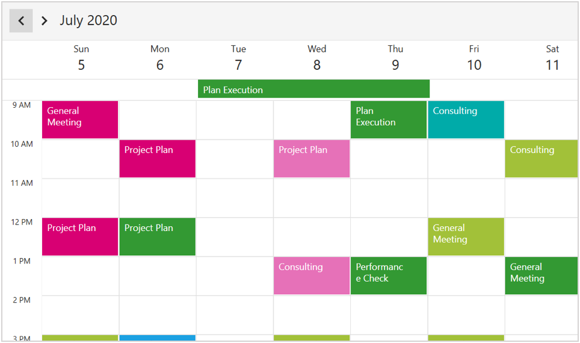
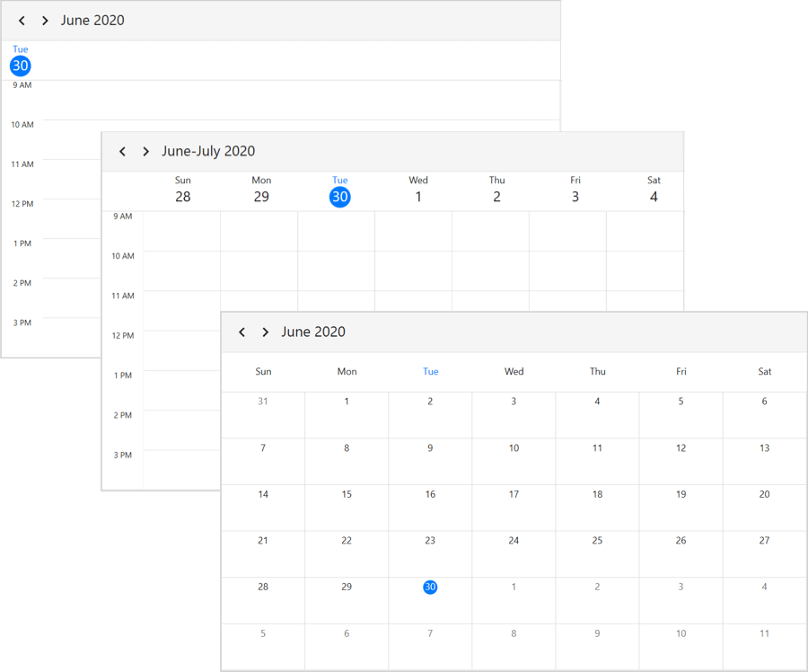
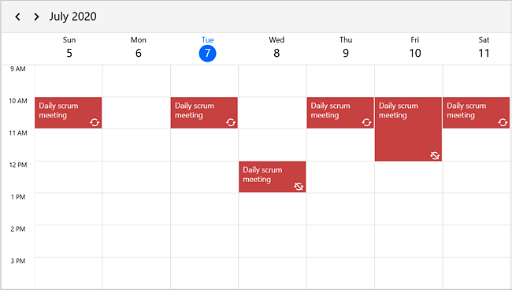

# WPF Scheduler (SfScheduler) Overview

The WPF SfScheduler control is used to schedule and manage appointments through an intuitive user interface, similar to the Outlook calendar.

## Key features

**Built-in Views** - The SfScheduler provides eight different types of views such as Day, WorkWeek, Week, TimelineDay, TimelineWeek, TimelineWorkWeek, TimelineMonth, and Month.

**Events** - Appointments contain information on events scheduled at specific times. In addition to default appointments, the users can use their own collections to connect a business entity to an appointment by mapping their fields, such as start time, end time, subject, notes, and recurrence.

**Recurrence Events** — Easily configure recurring events on a daily, weekly, monthly, or yearly basis. You can also skip or change the occurrence of a recurring appointment.

**Appointment Mapping** - SfScheduler control supports to map any collection that implements the IEnumerable interface to populate appointments.

**Appointment Editor** - You can easily create, edit, or delete appointments using the built-in appointment editor.

**Timezone** - Display appointments created in various time zones in the system time zone. Appointment start and end times are also automatically adjusted and displayed based on the daylight savings time.

**First day of the week** - Customize the first day of the week as needed. The default first day is Sunday.

**Flexible working days** - Customize the workdays in a workweek so that the remaining days will be hidden from view.

**Appearance Customization** — Provide a unique look to your scheduler with the event appearance customization.

**Localization** — Display the current date and time by following the globalized date and time formats, and localize all available static texts in the SfScheduler.

**Reminder** - You can use reminders to organize your appointments in your scheduler. The Scheduler reminds you of the appointment at the specified time.

**LoadOnDemand** - The SfScheduler supports loading appointments on-demand with loading indicator and it improves the loading performance when you have appointments range for multiple years.