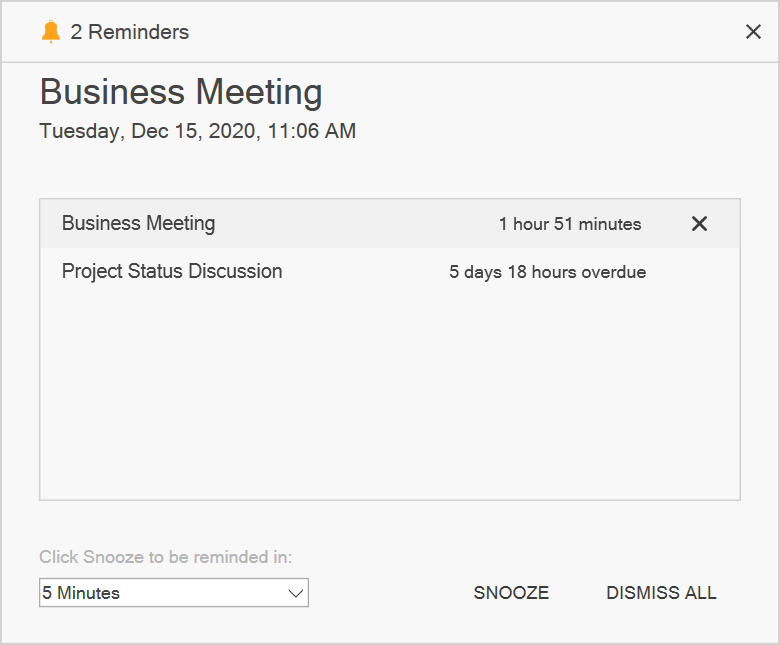

# Reminder in WPF Scheduler (SfScheduler)
Scheduler alerts you for a particular appointment with a reminder window when enabling the [EnableReminder](https://help.syncfusion.com/cr/wpf/Syncfusion.UI.Xaml.Scheduler.SfScheduler.html#Syncfusion_UI_Xaml_Scheduler_SfScheduler_EnableReminder) property. Reminder window supports to `Dismiss` or `DismissAll` or set the `SnoozeTime` for the reminder appointments.

## Enable reminder
Reminder can be set by setting the [EnableReminder](https://help.syncfusion.com/cr/wpf/Syncfusion.UI.Xaml.Scheduler.SfScheduler.html#Syncfusion_UI_Xaml_Scheduler_SfScheduler_EnableReminder) property to `true.` The reminder time can be set using the [Reminders](https://help.syncfusion.com/cr/wpf/Syncfusion.UI.Xaml.Scheduler.ScheduleAppointment.html#Syncfusion_UI_Xaml_Scheduler_ScheduleAppointment_Reminders) property of [ScheduleAppointment](https://help.syncfusion.com/cr/wpf/Syncfusion.UI.Xaml.Scheduler.ScheduleAppointment.html).



<syncfusion:SfScheduler x:Name="Scheduler"
                        ViewType="Week"
                         EnableReminder="True" >
</syncfusion:SfScheduler>



## Adding reminders
Configure the appointment reminders with [SchedulerReminder](https://help.syncfusion.com/cr/wpf/Syncfusion.UI.Xaml.Scheduler.SchedulerReminder.html). The `SchedulerReminder` has the following properties for reminder alert,

<table>
<tr>
<th>Properties</th>
<th>Description</th>
</tr>
<tr>
<td>{{'[ReminderTimeInterval](https://help.syncfusion.com/cr/wpf/Syncfusion.UI.Xaml.Scheduler.SchedulerReminder.html#Syncfusion_UI_Xaml_Scheduler_SchedulerReminder_ReminderTimeInterval)'| markdownify }}</td>
<td>Gets or sets the time interval that decides to open the reminder alert window before the appointment’s start time.
</td>
</tr>
<tr>
<td>{{'[ReminderAlertTime](https://help.syncfusion.com/cr/wpf/Syncfusion.UI.Xaml.Scheduler.SchedulerReminder.html#Syncfusion_UI_Xaml_Scheduler_SchedulerReminder_ReminderAlertTime)'| markdownify }}</td>
<td>Gets the reminder time that decides when to show a reminder alert of the appointment.</td>
</tr>
<tr>
<td>{{'[Appointment](https://help.syncfusion.com/cr/wpf/Syncfusion.UI.Xaml.Scheduler.SchedulerReminder.html#Syncfusion_UI_Xaml_Scheduler_SchedulerReminder_Appointment)'| markdownify }}</td>
<td>Gets the appointment details for which the reminder is created.</td>
</tr>
<tr>
<td>{{'[Data](https://help.syncfusion.com/cr/wpf/Syncfusion.UI.Xaml.Scheduler.SchedulerReminder.html#Syncfusion_UI_Xaml_Scheduler_SchedulerReminder_Data)'| markdownify }}</td>
<td>Gets the reminder data object associated with the `SchedulerReminder.`</td>
</tr>
<tr>
<td>{{'[IsDismissed](https://help.syncfusion.com/cr/wpf/Syncfusion.UI.Xaml.Scheduler.SchedulerReminder.html#Syncfusion_UI_Xaml_Scheduler_SchedulerReminder_IsDismissed)' | markdownify }}</td>
<td> Gets or sets whether the reminder is dismissed. </td>
</tr>
</table>



 <Grid.DataContext>
    <local:ReminderViewModel/>
 </Grid.DataContext>
 <syncfusion:SfScheduler x:Name="Schedule" 
                ItemsSource="{Binding Events}"
                EnableReminder="True">
  </syncfusion:SfScheduler>


 public class ReminderViewModel 
 {
    ...
    public ScheduleAppointmentCollection Events { get; set; } = new ScheduleAppointmentCollection();
    this.Events.Add(new ScheduleAppointment()
    {
        StartTime = DateTime.Now,
        EndTime = DateTime.Now.AddHours(1),
        AppointmentBackground = new SolidColorBrush((Color)ColorConverter.ConvertFromString("#FF339933")),
        Subject = "Conference",
        Reminders = new ObservableCollection<SchedulerReminder>
        {
            new SchedulerReminder { ReminderTimeInterval = new TimeSpan(0)},
        }
    });
 }



N> [View sample in GitHub](https://github.com/SyncfusionExamples/appointment-reminders-wpf-scheduler)

## Creating business object for reminder  
`Reminders` supports to map the custom object with the [ScheduleAppointment.Reminders](https://help.syncfusion.com/cr/wpf/Syncfusion.UI.Xaml.Scheduler.ScheduleAppointment.html#Syncfusion_UI_Xaml_Scheduler_ScheduleAppointment_Reminders).



/// 

/// Represents custom data properties.
/// 

 public class Event
    {
        public Event()
        {
        }

        public DateTime From { get; set; }
        public DateTime To { get; set; }
        public bool IsAllDay { get; set; }
        public string EventName { get; set; }
        public string Notes { get; set; }
        public string StartTimeZone { get; set; }
        public string EndTimeZone { get; set; }
        public Brush Color { get; set; }
        public object RecurrenceId { get; set; }
        public object Id { get; set; }
        public string RecurrenceRule { get; set; }
        public ObservableCollection<DateTime> RecurrenceExceptions { get; set; }
        public ObservableCollection<Reminder> Reminders { get; set; }
    }



The [ReminderMapping](https://help.syncfusion.com/cr/wpf/Syncfusion.UI.Xaml.Scheduler.ReminderMapping.html) provides the mapping information about the [SchedulerReminder](https://help.syncfusion.com/cr/wpf/Syncfusion.UI.Xaml.Scheduler.SchedulerReminder.html) properties to the `Data` object. ReminderMapping has the following properties for reminder alert,

* [ReminderTimeInterval](https://help.syncfusion.com/cr/wpf/Syncfusion.UI.Xaml.Scheduler.ReminderMapping.html#Syncfusion_UI_Xaml_Scheduler_ReminderMapping_ReminderTimeInterval) - Maps the property name of custom class, which is equivalent for the `SchedulerReminder.ReminderTimeInterval.`
* [IsDismissed](https://help.syncfusion.com/cr/wpf/Syncfusion.UI.Xaml.Scheduler.ReminderMapping.html#Syncfusion_UI_Xaml_Scheduler_ReminderMapping_IsDismissed) - Maps the property name of custom class, which is equivalent for the `SchedulerReminder.IsDismissed.`



/// 

/// Represents custom data properties.
/// 

public class Reminder
{
    /// 

    /// Gets or sets the value indicating whether the reminder is dismissed or not. 
    /// 

    public bool Dismissed { get; set; }

    /// 

    /// Gets or sets the value to display reminder alert before appointment start time.
    /// 

    public TimeSpan TimeInterval { get; set; }

}




Map those properties of the `Meeting` class with the [SfScheduler](https://help.syncfusion.com/cr/wpf/Syncfusion.UI.Xaml.Scheduler.SfScheduler.html) control by using the [AppointmentMapping](https://help.syncfusion.com/cr/wpf/Syncfusion.UI.Xaml.Scheduler.AppointmentMapping.html) and map `CustomReminder` properties with `SchedulerReminder` by using the `ReminderMapping.`



 <syncfusion:SfScheduler x:Name="Schedule" 
                ItemsSource="{Binding Events}"
                EnableReminder="True">
            <syncfusion:SfScheduler.AppointmentMapping>
                <syncfusion:AppointmentMapping
                    Subject="EventName"
                    StartTime="From"
                    EndTime="To"
                    AppointmentBackground="Color"
                    IsAllDay="IsAllDay"
                    StartTimeZone="StartTimeZone"
                    EndTimeZone="EndTimeZone"
                    RecurrenceExceptionDates="RecurrenceExceptions"
                    RecurrenceRule="RecurrenceRule"
                    RecurrenceId="RecurrenceId"
                    Reminders="Reminders">
                    <syncfusion:AppointmentMapping.ReminderMapping>
                        <syncfusion:ReminderMapping IsDismissed="Dismissed"
                                                    ReminderTimeInterval="TimeInterval"/>
                    </syncfusion:AppointmentMapping.ReminderMapping>
                </syncfusion:AppointmentMapping>
            </syncfusion:SfScheduler.AppointmentMapping>
        </syncfusion:SfScheduler>


public class ReminderViewModel 
{
  ...
  public ObservableCollection<Event> Events { get; set; } = new ObservableCollection<Event>();
  this.Events.Add(new Event()
  {
    From = DateTime.Now,
    To = DateTime.Now.AddHours(1),
    Color = new SolidColorBrush((Color)ColorConverter.ConvertFromString("#FF339933")),
    EventName = "Conference",
    Reminders = new ObservableCollection<Reminder>
    {
        new Reminder { TimeInterval = new TimeSpan(0)},
    }
    });
}



N> [View sample in GitHub](https://github.com/SyncfusionExamples/appointment-reminders-wpf-scheduler)

## ReminderAlertOpening event
Scheduler notifies by the [ReminderAlertOpening](https://help.syncfusion.com/cr/wpf/Syncfusion.UI.Xaml.Scheduler.SfScheduler.html#Syncfusion_UI_Xaml_Scheduler_SfScheduler_ReminderAlertOpening) event when appearing in the reminder window. The [ReminderAlertOpeningEventArgs](https://help.syncfusion.com/cr/wpf/Syncfusion.UI.Xaml.Scheduler.ReminderAlertOpeningEventArgs.html) has following properties,
* [Reminders](https://help.syncfusion.com/cr/wpf/Syncfusion.UI.Xaml.Scheduler.ScheduleAppointment.html#Syncfusion_UI_Xaml_Scheduler_ScheduleAppointment_Reminders)  - Gets a list of reminders that are used to display the appointment reminders in the reminder alert window.
* [Cancel](https://docs.microsoft.com/en-us/dotnet/api/system.componentmodel.canceleventargs.cancel?view=netcore-3.1) - To avoid the reminder window opening by enabling this property.



scheduler.ReminderAlertOpening += Scheduler_ReminderAlertOpening;

private void Scheduler_ReminderAlertOpening(object sender, ReminderAlertOpeningEventArgs e)
{
    var reminders = e.Reminders;
    var appointment = e.Reminders[0].Appointment;
}



## ReminderAlertActionChanged events

The Scheduler notifies by the `ReminderAlertActionChangedevent` when an appointment reminder’s dismiss, dismiss all, or snooze action is changed in the Scheduler reminder alert window.
The `ReminderAlertActionChangedEventArgs` has following properties which provides information for `ReminderAlertActionChanged` event.

`ReminderAction`: Gets the appointment reminder actions such as dismiss, dismiss all, and snooze performed in the reminder alert window and specifies the appointment reminder that was dismissed in the reminder alert window, the reminders for all appointments were dismissed in the reminder alert window and the appointment reminder is snoozed in the reminder alert window.

`Reminders`: Gets the reminders collection where dismiss, dismiss all or snooze action is performed in the reminder alert window.

`SnoozeTime`: Gets the snooze time value of an appointment in the reminder alert window.



this.Schedule.ReminderAlertActionChanged += OnScheduleReminderAlertActionChanged;

private void OnScheduleReminderAlertActionChanged(object sender, Syncfusion.UI.Xaml.Scheduler.ReminderAlertActionChangedEventArgs e)
{
    if (e.ReminderAction == ReminderAction.Dismiss)
    {
        var reminder = e.Reminders[0];
    }
    else if (e.ReminderAction == ReminderAction.DismissAll)
    {
        var reminders = e.Reminders;
    }
    else if (e.ReminderAction == ReminderAction.Snooze)
    {
        var reminder = e.Reminders[0];
        var snoozeTime = e.SnoozeTime;
    }
}

