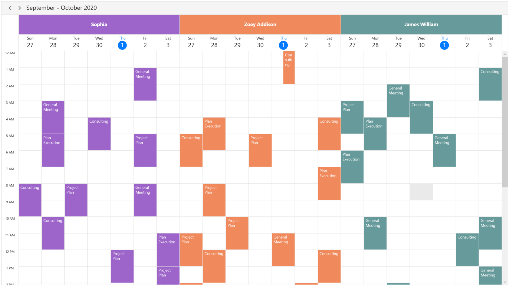
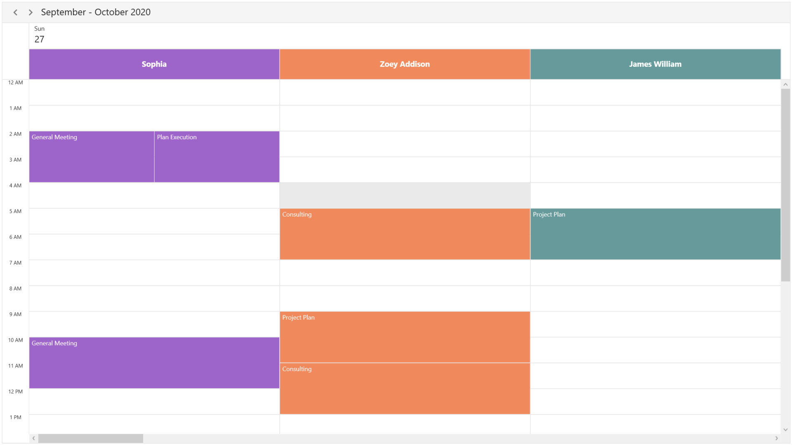
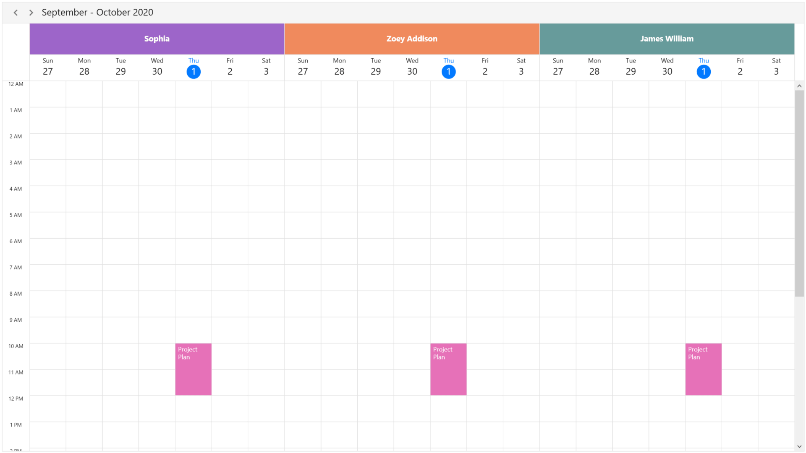
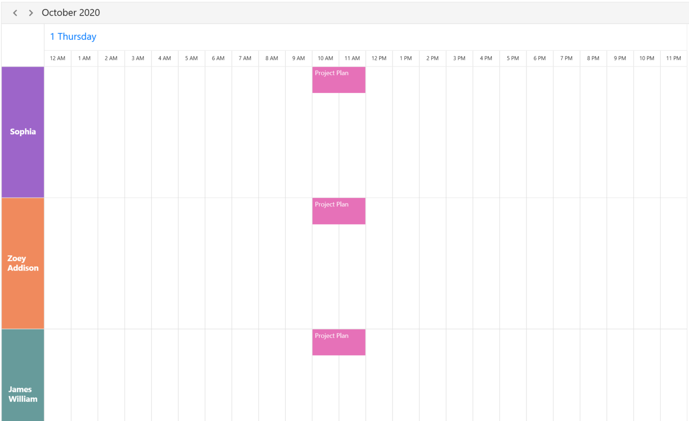
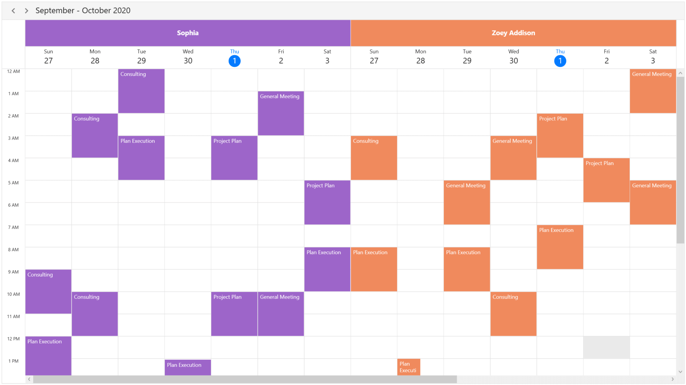
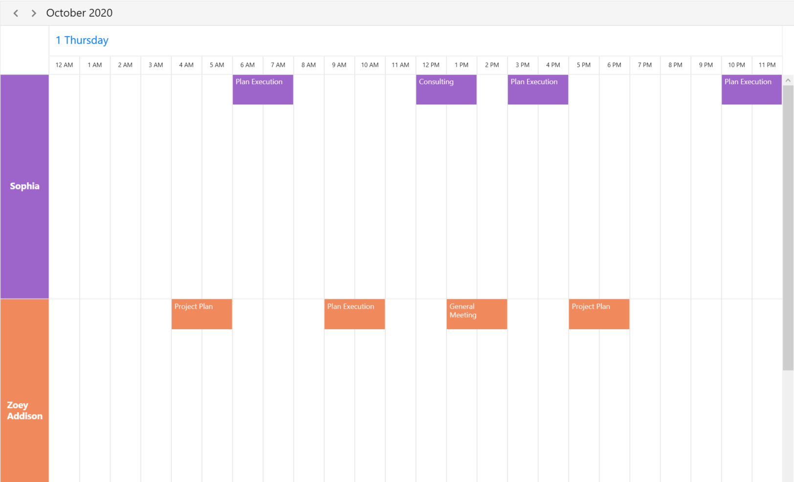
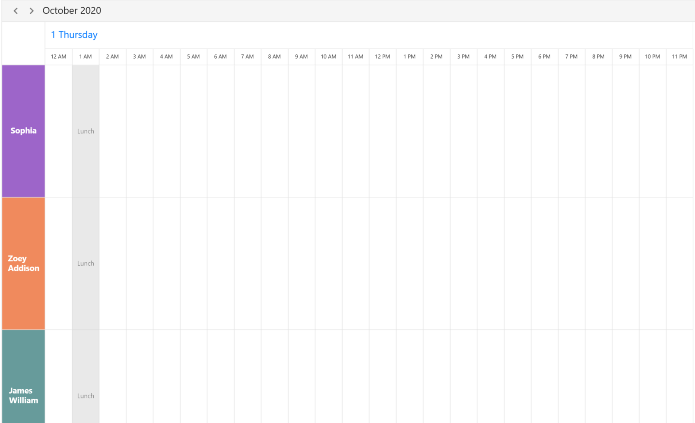
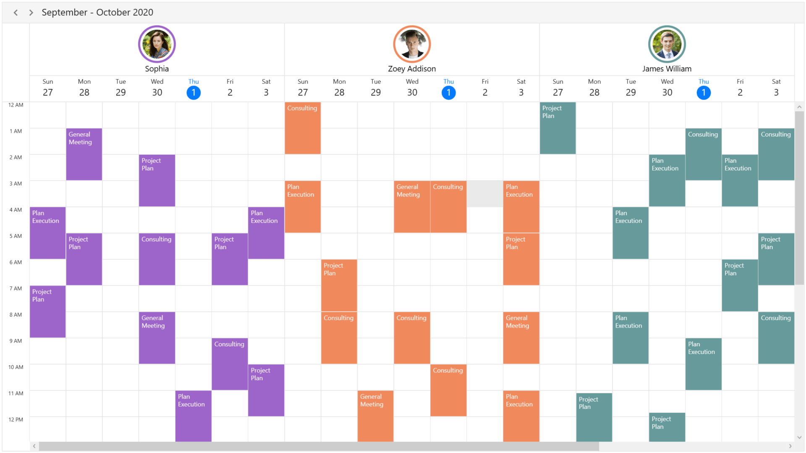
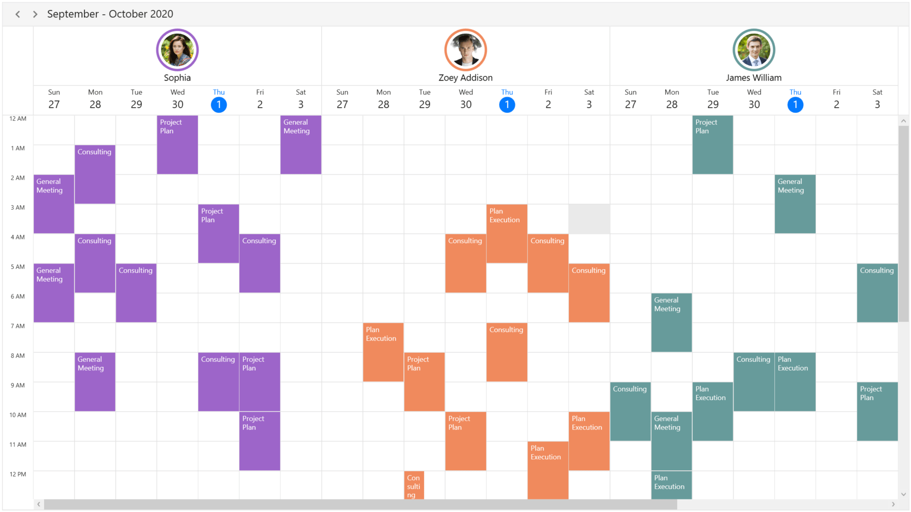

# Resource Grouping in WPF Scheduler (SfScheduler)

The scheduler resource view will allow you to group appointments based on the resources or dates, arranged by the column or row in the day, week, workweek, timeline day, timeline week, timeline workweek and timeline month views. It also allows you to share the events or appointments to the multiple resources and resource appointment details can be edited by using a built-in appointment editor.

## Grouping by Resources

Resources can be added to the scheduler by setting the [ResourceGroupType](https://help.syncfusion.com/cr/wpf/Syncfusion.UI.Xaml.Scheduler.ResourceGroupType.html) property as `Resource` in `SfScheduler.` You need to set the [Id](https://help.syncfusion.com/cr/wpf/Syncfusion.UI.Xaml.Scheduler.SchedulerResource.html#Syncfusion_UI_Xaml_Scheduler_SchedulerResource_Id), [Name](https://help.syncfusion.com/cr/wpf/Syncfusion.UI.Xaml.Scheduler.SchedulerResource.html#Syncfusion_UI_Xaml_Scheduler_SchedulerResource_Name), [Foreground](https://help.syncfusion.com/cr/wpf/Syncfusion.UI.Xaml.Scheduler.SchedulerResource.html#Syncfusion_UI_Xaml_Scheduler_SchedulerResource_Foreground) and [Background](https://help.syncfusion.com/cr/wpf/Syncfusion.UI.Xaml.Scheduler.SchedulerResource.html#Syncfusion_UI_Xaml_Scheduler_SchedulerResource_Background) properties of [SchedulerResource](https://help.syncfusion.com/cr/wpf/Syncfusion.UI.Xaml.Scheduler.SchedulerResource.html) to create a resource. You can add the resource to the scheduler by using the [ResourceCollection](https://help.syncfusion.com/cr/wpf/Syncfusion.UI.Xaml.Scheduler.SfScheduler.html#Syncfusion_UI_Xaml_Scheduler_SfScheduler_ResourceCollection) property of `SfScheduler` and you can also add or remove the scheduler resources dynamically.

N>No resource view will be displayed, even a resource added using the `ResourceCollection` property when the `ResourceGroupType` property value is set to `None`.




// Adding schedule resource in the scheduler resource collection.
var ResourceCollection = new ObservableCollection<SchedulerResource>()
{
   new SchedulerResource() { Name = "Sophia", Background = new SolidColorBrush(Colors.Red), Id = "1000" },
   new SchedulerResource() { Name = "Zoey Addison", Background = new SolidColorBrush(Colors.Blue), Id = "1001" },
   new SchedulerResource() { Name = "James William", Background = new SolidColorBrush(Colors.Yellow), Id = "1002" },
};

// Adding the scheduler resource collection to the schedule resources of SfSchedule.
schedule.ResourceCollection = ResourceCollection;


<syncfusion:SfScheduler x:Name="Schedule" ViewType="Week" ResourceGroupType="resource" ResourceCollection="{Binding ResourceCollection}">



N>[View sample in GitHub](https://github.com/SyncfusionExamples/resource-view-support-in-wpf-scheduler/tree/main/ResourceGroupTypeDemo)

## Resource Grouping types

You can group the resource order by `Date` or order by `Resource` using the [ResourceGroupType](https://help.syncfusion.com/cr/wpf/Syncfusion.UI.Xaml.Scheduler.ResourceGroupType.html) property of `SfScheduler`.

N>You can group the resource order in the day, week, work week, timeline day, timeline week, timeline workweek and timeline month views.

### Resource

The `ResourceGroupType` is set to `Resource` to group the number of dates under each resource.



<Schedule:SfScheduler Name="schedule" ViewType="Week" ResourceGroupType="Resource"/>


schedule.ViewType = SchedulerViewType.Week;
schedule.ResourceGroupType = ResourceGroupType.Resource;



### Date

The `ResourceGroupType` is set to `Date` to group the number of resources under each date.



<Schedule:SfScheduler Name="schedule" ViewType="Week" ResourceGroupType="Date"/>


schedule.ViewType = SchedulerViewType.Week;
schedule.ResourceGroupType = ResourceGroupType.Date;



## Assigning resources to appointments

Appointments associated with scheduler `ResourceCollection` will be displayed when set schedule resource `Id` in the [ScheduleAppointment](https://help.syncfusion.com/cr/wpf/Syncfusion.UI.Xaml.Scheduler.ScheduleAppointment.html) by using the [ResourceIdCollection](https://help.syncfusion.com/cr/wpf/Syncfusion.UI.Xaml.Scheduler.ScheduleAppointment.html#Syncfusion_UI_Xaml_Scheduler_ScheduleAppointment_ResourceIdCollection) for `ResourceGroupType` set as `Resource` or `Date`. You can also assign resources to [recurrence appointments](https://help.syncfusion.com/wpf/scheduler/appointments#recurrence-appointment).  



ScheduleAppointmentCollection scheduleAppointmentCollection = new ScheduleAppointmentCollection();
var appointments = new ScheduleAppointment()
{
   StartTime = DateTime.Now.AddMinutes(20),
   EndTime = DateTime.Now.AddHours(2),
   Subject = "General Meeting",
   ResourceIdCollection = new ObservableCollection<object> () { "1000", "1001" }
};

scheduleAppointmentCollection.Add(appointments);
this.schedule.ItemsSource = scheduleAppointmentCollection;




N>• When `ResourceIdCollection` not added to 'ScheduleAppointment' then the appointment will not be displayed in when `ResourceGroupType` set as `Resource` or `Date`.
• When `ResourceGroupType` set as `None`, resource view will be collapsed and all scheduler DataSource events will be displayed.
• You can also add or remove the appointment resources dynamically.

### Multiple resource sharing

Multiple resources can share the same events or appointments. If the appointment details edited or updated, then the changes will reflect on all other shared instances simultaneously.




ScheduleAppointmentCollection scheduleAppointmentCollection = new ScheduleAppointmentCollection();
var appointments = new ScheduleAppointment()
{
   StartTime = new DateTime(2020, 10, 01, 10, 0, 0),
   EndTime = new DateTime(2020, 10, 01, 12, 0, 0),
   Subject = "Project Plan",
   ResourceIdCollection = new ObservableCollection<object>() { "1000", "1001","1002" }
   AppointmentBackground = new SolidColorBrush((Color)ColorConverter.ConvertFromString("#FFE671B8")),
};

scheduleAppointmentCollection.Add(appointments);
this.schedule.ItemsSource = scheduleAppointmentCollection;




## Scheduler Resource Mapping

Schedule supports full data binding to [ResourceCollection](https://help.syncfusion.com/cr/wpf/Syncfusion.UI.Xaml.Scheduler.SfScheduler.html#Syncfusion_UI_Xaml_Scheduler_SfScheduler_ResourceCollection). Specify the [ResourceMapping](https://help.syncfusion.com/cr/wpf/Syncfusion.UI.Xaml.Scheduler.ResourceMapping.html) attribute to map the properties in the underlying data source to the schedule resource.

| Property Name | Description |
|-------------------------------------------------------------------------------------------------------------------------------------------------------------------------------------------------------|--------------------------------------------------------------------------------------------------------------------------|
| Name | Maps the property name of custom class, which is equivalent to Name in ScheduleResource. |
| Id | Maps the property name of custom class, which is equivalent to Id in ScheduleResource. |
| Background | Maps the property name of custom class, which is equivalent to Background in ScheduleResource. |
| Foreground | Maps the property name of custom class, which is equivalent to Foreground in ScheduleResource. |

N>Custom resource class should contain a mandatory field for resource `Id`.

## Create business object for Resource
You can create a custom class `Employee` with mandatory fields `Name`, `Id`, `ForegroundColor` and `BackgroundColor`.You can also assign resources to [recurrence appointments](https://help.syncfusion.com/wpf/scheduler/appointments#recurrence-appointment). 



public class Employee
{
   public string Name {get; set;}

   public string Id {get; set;}

   public Brush BackgroundColor {get; set; }

   public Brush ForegroundColor {get; set; }
}




N>• You can inherit this class from `INotifyPropertyChanged` for dynamic changes in custom data.
• [SchedulerResource.Data](https://help.syncfusion.com/cr/wpf/Syncfusion.UI.Xaml.Scheduler.SchedulerResource.html#Syncfusion_UI_Xaml_Scheduler_SchedulerResource_Data) property is used to get the deatils of custom data.

You can map the properties of `Employee` class with `SfScheduler` control using Scheduler `ResourceMapping`.




<Schedule:SfScheduler Name="schedule" ViewType="Week" ResourceGroupType="Resource">
    <Schedule:SfScheduler.ResourceMapping>
       <Schedule:ResourceMapping Id="Id" Name="Name" Background="BackgroundColor" Foreground="ForegroundColor"/>
    </Schedule:SfScheduler.ResourceMapping>
</Schedule:SfScheduler>


 // Schedule data mapping for custom resource.
ResourceMapping resourceMapping = new ResourceMapping();
resourceMapping.Name = "Name";
resourceMapping.Id = "Id";
resourceMapping.Background = "BackgroundColor";
resourceMapping.Foreground = "ForegroundColor";
schedule.ResourceMapping = resourceMapping;



### Assign resource object collection

You can add resources of `Employee` collection that can be assigned to scheduler using the `ResourceCollection` property which is of `IEnumerable` type. You can also add or remove scheduler resources dynamically.



// Creating and Adding custom resource in scheduler resource collection.
var ResourceCollection = new ObservableCollection<Employee>()
{
   new Employee () {Name = "Sophia", BackgroundColor = new SolidColorBrush(Colors.Red), Id = "1000", ForegroundColor = new SolidColorBrush(Colors.White) },
   new Employee () {Name = "Zoey Addison", BackgroundColor = new SolidColorBrush(Colors.Blue), Id = "1001" , ForegroundColor = new SolidColorBrush(Colors.Red)},
   new Employee () {Name = "James William", BackgroundColor = new SolidColorBrush(Colors.Yellow), Id = "1002" , ForegroundColor = new SolidColorBrush(Colors.Yellow)},
};

//Adding schedule resource collection to schedule resources.
schedule.ResourceCollection = ResourceCollection;




### Assign the resource objects to appointment business object

You can associate scheduler `ResourceMapping` to the custom appointment by mapping resource `Id` in the `ResourceIdCollection` property of [AppointmentMapping](https://help.syncfusion.com/cr/wpf/Syncfusion.UI.Xaml.Scheduler.AppointmentMapping.html). Custom appointments associated with the scheduler resources will be displayed when `ResourceGroupType` set as `Resource` or `Date`. You can also assign resources to recurrence appointments.



/// 
   
/// Represents the custom data properties.   
/// 
 
public class Meeting
{
	public string EventName {get; set;}
	public DateTime From {get; set;}
	public DateTime To {get; set;}
    public ObservableCollection<object> Resources {get; set;}
}



N>You can inherit this class from the `INotifyPropertyChanged` for dynamic changes in custom data.

You can map those properties of `Meeting` class to schedule appointment by using `AppointmentMapping` properties.


<syncfusion:SfScheduler x:Name="Schedule" ItemsSource="{Binding Appointments}" ViewType="Week">
         <syncfusion:SfScheduler.AppointmentMapping>
            <syncfusion:AppointmentMapping
            Subject="EventName"
            StartTime="From"
            EndTime="To"
            ResourceIdCollection ="Resources"/>
        </syncfusion:SfScheduler.AppointmentMapping>
</syncfusion:SfScheduler>


//Schedule data mapping for custom appointments
AppointmentMapping dataMapping = new AppointmentMapping();
dataMapping.Subject = "EventName";
dataMapping.StartTime = "From";
dataMapping.EndTime = "To";
dataMapping.AppointmentBackground = "Color";
dataMapping.ResourceIdCollection= "Resources";
Schedule.AppointmentMapping = dataMapping;



You can schedule meetings for a Resource by setting `From`, `To` and `Resources` of Meeting class.



Meeting meeting = new Meeting ();
meeting.From = new DateTime(2020, 07, 01, 10, 0, 0);
meeting.To = meeting.From.AddHours(1);
meeting.EventName = "Meeting";
meeting.Resources = new ObservableCollection<object> { (Resources[0] as Employee).Id, (Resources[1] as Employee).Id };
var Meetings = new ObservableCollection<Meeting> ();
Meetings.Add(meeting);
schedule.ItemsSource = Meetings;



N>[View sample in GitHub](https://github.com/SyncfusionExamples/resource-view-support-in-wpf-scheduler/tree/main/ResourceMappingDemo)

## Resource header size 

You can customize the resource header size in the day, week, workweek, timeline day, timeline week, timeline workweek and timeline month views by using the [ResourceHeaderSize](https://help.syncfusion.com/cr/wpf/Syncfusion.UI.Xaml.Scheduler.ViewSettingsBase.html#Syncfusion_UI_Xaml_Scheduler_ViewSettingsBase_ResourceHeaderSize) property of [DaysViewSettings](https://help.syncfusion.com/cr/wpf/Syncfusion.UI.Xaml.Scheduler.SfScheduler.html#Syncfusion_UI_Xaml_Scheduler_SfScheduler_DaysViewSettings)  or [TimelineViewSettings](https://help.syncfusion.com/cr/wpf/Syncfusion.UI.Xaml.Scheduler.SfScheduler.html#Syncfusion_UI_Xaml_Scheduler_SfScheduler_TimelineViewSettings) in `SfScheduler`. 

### Resource header size in days view

`DaysViewSettings` applicable for `Day`, `Week` and `WorkWeek` views. By default, value of this property is set to 50.



<Schedule:SfScheduler Name="schedule" ViewType="Week" ResourceGroupType="Resource">
   <Schedule:SfScheduler.DaysViewSettings>
      <Schedule:DaysViewSettings ResourceHeaderSize="100"/>
   </Schedule:SfScheduler.DaysViewSettings>
</Schedule:SfScheduler>


schedule.DaysViewSettings.ResourceHeaderSize = 100;



### Resource header size in timeline view

`TimelineViewSettings` applicable for timeline day, timeline week, timeline workweek and timeline month views. By default, value of this property is set to 50.



<Schedule:SfScheduler Name="schedule" ViewType="TimelineWeek" ResourceGroupType="Resource">
   <Schedule:SfScheduler.TimelineViewSettings>
      <Schedule:TimelineViewSettings ResourceHeaderSize="100"/>
   </Schedule:SfScheduler.TimelineViewSettings>
</Schedule:SfScheduler>


 schedule.TimelineViewSettings.ResourceHeaderSize = 80;



## Visible resource count

You can customize the number of visible resources in day, week, workweek, timeline day, timeline week, timeline workweek and timeline month views by using the [VisibleResourceCount](https://help.syncfusion.com/cr/wpf/Syncfusion.UI.Xaml.Scheduler.ViewSettingsBase.html#Syncfusion_UI_Xaml_Scheduler_ViewSettingsBase_VisibleResourceCount) property of `DaysViewSettings`  or `TimelineViewSettings` in `SfScheduler`.

N> Visible resource count exceed count of schedule `ResourceCollection` count then schedule `ResourceCollection` count will be displayed. 

### Visible resource count in days view

`DaysViewSettings` applicable for `Day`, `Week` and `WorkWeek` views. By default, value of this property is set to 3.


<Schedule:SfScheduler Name="schedule" ViewType="Week" ResourceGroupType="Resource">
   <Schedule:SfScheduler.DaysViewSettings>
      <Schedule:DaysViewSettings VisibleResourceCount="2"/>
   </Schedule:SfScheduler.DaysViewSettings>
</Schedule:SfScheduler>


schedule.DaysViewSettings.VisibleResourceCount = 2;



### Visible resource count in timeline views

`TimelineViewSettings` applicable for timeline day, timeline week, timeline workweek and timeline month views. By default, value of this property is set to 3.


<Schedule:SfScheduler Name="schedule" ViewType="TimelineDay" ResourceGroupType="Resource">
   <Schedule:SfScheduler.TimelineViewSettings>
      <Schedule:TimelineViewSettings VisibleResourceCount="2"/>
   </Schedule:SfScheduler.TimelineViewSettings>
</Schedule:SfScheduler>


schedule.TimelineViewSettings.VisibleResourceCount = 2;



## Assign resources to special time regions 

Special time region can be created based on the resources in day, week, workweek, timeline day, timeline week, timeline workweek and timeline month views.

### Assign resources to special time regions in days view




Schedule.DaysViewSettings.SpecialTimeRegions.Add(new SpecialTimeRegion
{
    StartTime = new System.DateTime(2020, 12, 13, 13, 0, 0),
    EndTime = new System.DateTime(2020, 12, 13, 14, 0, 0),
    Text = "Lunch",
    CanEdit = false,
    Background = Brushes.Black,
    Foreground = Brushes.White,
    RecurrenceRule = "FREQ=DAILY;INTERVAL=1",
    CanMergeAdjacentRegions =false,
    ResourceIdCollection = new ObservableCollection<object>() { "0", "1", "2" }
});




The [SpecialTimeRegion](https://help.syncfusion.com/cr/wpf/Syncfusion.UI.Xaml.Scheduler.SpecialTimeRegion.html) in a Time basis by setting the value of [CanMergeAdjacentRegions](https://help.syncfusion.com/cr/wpf/Syncfusion.UI.Xaml.Scheduler.SpecialTimeRegion.html#Syncfusion_UI_Xaml_Scheduler_SpecialTimeRegion_CanMergeAdjacentRegions) to True.

### Assign resources to special time regions in timeline view




this.schedule.TimelineViewSettings.SpecialTimeRegions.Add(new SpecialTimeRegion
{
   StartTime = new System.DateTime(2020, 09, 27, 1, 0, 0),
   EndTime = new System.DateTime(2020, 09, 27, 2, 0, 0),
   Text = "Lunch",
   CanEdit = false,
   Background = new SolidColorBrush((Color)ColorConverter.ConvertFromString("#D3D3D3"),
   Foreground = new SolidColorBrush((Color)ColorConverter.ConvertFromString("#000000"),
   RecurrenceRule = "FREQ=DAILY;INTERVAL=1",
   ResourceIdCollection = new ObservableCollection<object>() { "1001", "1002", "1003" }
});




N>[View sample in GitHub](https://github.com/SyncfusionExamples/resource-view-support-in-wpf-scheduler/tree/main/ResourceGroupTypeDemo)

## Appearance customization

Resource UI customization using a template and template selectors support.

### Customize resource appearance using ResourceHeaderTemplate



<Window.Resources>
<DataTemplate  x:Key="DayViewResourceTemplate">
    <Grid Background="Transparent">
        <Border BorderThickness="0.3,0.3,0,0.3" BorderBrush="Gray" >
            <StackPanel VerticalAlignment="Center" Orientation="Vertical">
                <Border CornerRadius="36" Height="72" Width="72" BorderThickness="4" BorderBrush="{Binding Data.BackgroundBrush}">
                <Border CornerRadius="36" Height="64" Width="64" BorderThickness="4" BorderBrush="White">
                <Image HorizontalAlignment="Center" VerticalAlignment="Center" Width="55"
                          Height="55" Source="{Binding Data.ImageSource}" />
                </Border>
                </Border>
                <TextBlock HorizontalAlignment="Center" VerticalAlignment="Center" FontSize="15"
                Foreground="Black" Text="{Binding Data.Name}" />
            </StackPanel>
        </Border>
    </Grid>
</DataTemplate>
</Window.Resources>

//used to find Image Source and Name properties
<Window.DataContext>
<local:Employee />
</Window.DataContext>

<Grid Name="grid">
   <syncfusion:SfScheduler x:Name="Schedule" ViewType="Week" ResourceGroupType="Resource" ResourceCollection="{Binding ResourceCollection}"
                           ResourceHeaderTemplate="{StaticResource DayViewResourceTemplate}">
                           <syncfusion:SfScheduler.ResourceMapping>
        <syncfusion:ResourceMapping Id="Id" Name="Name" Background="BackgroundBrush" Foreground="ForegroundBrush"/>
        </syncfusion:SfScheduler.ResourceMapping>
   </syncfusion:SfScheduler>
</Grid>




>**Note** 
•   By default, the `SchedulerResource` is set as the `DataContext` for the `ResourceHeaderTemplate` for both `SchedulerResource` and custom data object in the `ResourceCollection`.
•   The custom data object can be bound in the `ResourceHeaderTemplate` by using the property of [SchedulerResource.Data](https://help.syncfusion.com/cr/wpf/Syncfusion.UI.Xaml.Scheduler.SchedulerResource.html#Syncfusion_UI_Xaml_Scheduler_SchedulerResource_Data).

N>[View sample in GitHub](https://github.com/SyncfusionExamples/resource-view-support-in-wpf-scheduler/tree/main/ResourceHeaderTemplateDemo)

### Customize resource appearance using ResourceHeaderTemplateSelector




    <Window.Resources>
        <DataTemplate  x:Key="DayViewResourceTemplate">
            <Grid Background="Transparent">
                <Border BorderThickness="0.3,0.3,0,0.3" BorderBrush="Gray" >
                    <StackPanel VerticalAlignment="Center" Orientation="Vertical">
                        <Border CornerRadius="36" Height="72" Width="72" BorderThickness="4" BorderBrush="{Binding Data.BackgroundBrush}">
                            <Border CornerRadius="36" Height="64" Width="64" BorderThickness="4" BorderBrush="White">
                                <Image HorizontalAlignment="Center" VerticalAlignment="Center" Width="55"
                          Height="55" Source="{Binding Data.ImageSource}" />
                            </Border>
                        </Border>
                        <TextBlock HorizontalAlignment="Center" VerticalAlignment="Center" FontSize="15"
                   Foreground="Black" Text="{Binding Data.Name}" />
                    </StackPanel>
                </Border>
            </Grid>
        </DataTemplate>

        <DataTemplate x:Key="TimelineViewResourceTemplate">
            <Grid Background="Transparent">
                <StackPanel VerticalAlignment="Center" Orientation="Vertical">
                    <Border CornerRadius="36" Height="72" Width="72" BorderThickness="4" BorderBrush="{Binding Data.BackgroundBrush}">
                        <Border CornerRadius="36" Height="64" Width="64" BorderThickness="4" BorderBrush="Transparent">
                            <Image HorizontalAlignment="Center" VerticalAlignment="Center"
                                   Width="55"
                                   Height="55"
                                   Source="{Binding Data.ImageSource}" />
                        </Border>
                    </Border>
                    <TextBlock HorizontalAlignment="Center"
                               VerticalAlignment="Center"
                               FontSize="15"
                               Text="{Binding Data.Name}"/>
                </StackPanel>
            </Grid>
        </DataTemplate>
    <Window.Resources>

    <Grid>
        <Grid.DataContext>
            <local:BindingViewModel/>
        </Grid.DataContext>
        <Grid.Resources>
            <local:ResourceTemplateSelector x:Key="resourceTemplateSelector" DayViewResourceTemplate="{StaticResource DaysViewResourceTemplate}" TimelineViewResourceTemplate="{StaticResource TimelineResourceTemplate}"/>
        </Grid.Resources>

        <syncfusion:SfScheduler x:Name="Schedule"
                                ViewType="Week"
                                ResourceGroupType="Resource}"
                                ResourceCollection="{Binding Resources}"
                                ItemsSource="{Binding ResourceAppointments}" HeaderHeight="32"
                                DisplayDate="{Binding DisplayDate}" ResourceHeaderTemplateSelector="{StaticResource resourceTemplateSelector}">
    
    </Grid>




### Creating a ResourceHeaderTemplateSelector




    public class ResourceTemplateSelector : DataTemplateSelector
    {
        /// 

        /// Initializes a new instance of the <see cref="ResourceTemplateSelector" /> class.
        /// 

        public ResourceTemplateSelector()
        {
        }

        public DataTemplate DayViewResourceTemplate {get; set;}

        public DataTemplate TimelineViewResourceTemplate {get; set;}

        /// 

        /// Template selection method
        /// 

        /// <param name="item">return the object</param>
        /// <param name="container">return the bindable object</param>
        /// <returns>return the template</returns>
        public override DataTemplate SelectTemplate(object item, DependencyObject container)
        {
            var schedule = Syncfusion.Windows.Shared.VisualUtils.FindVisualParent<SfScheduler>(container);
			if (schedule == null)
                return null;
			if (schedule.ViewType == SchedulerViewType.Day || schedule.ViewType == SchedulerViewType.Week || schedule.ViewType == SchedulerViewType.WorkWeek)
                return DayViewResourceTemplate;
            else
                return TimelineViewResourceTemplate;
        }
    }



>**Note**
•   By default, the `SchedulerResource` is set as the `DataContext` for the `ResourceHeaderTemplateSelector` for both `SchedulerResource` and custom data object in the `ResourceCollection`.
•   The custom data object can be bound in the `ResourceHeaderTemplateSelector` by using the property of [SchedulerResource.Data](https://help.syncfusion.com/cr/wpf/Syncfusion.UI.Xaml.Scheduler.SchedulerResource.html#Syncfusion_UI_Xaml_Scheduler_SchedulerResource_Data).

N>[View sample in GitHub](https://github.com/SyncfusionExamples/resource-view-support-in-wpf-scheduler/tree/main/ResourceHeaderTemplateSelectorDemo)