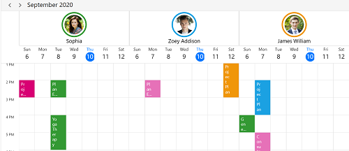
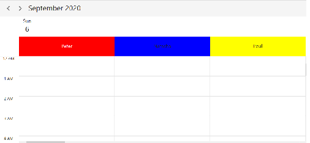
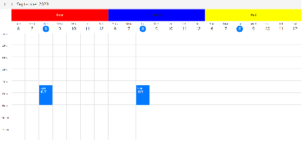
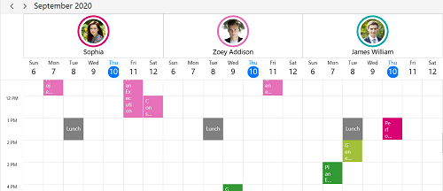

# Resource in WPF Scheduler (SfScheduler)

The Scheduler resource view will allow you to group appointments based on the resources or dates, arranged by column or row in the day, week, workweek, and timeline views. It’s also allows to share events or appointments to multiple resources and resource appointment details can be edited by using in-built appointment editor.

## Scheduler grouping by Resources

Resources can be added to the Scheduler by setting `ResourceGroupType` property as `Resource` in `SfScheduler`.You need to set the `Id`, `Name` , `Foreground` and `Background` properties of `SchedulerResource` to create a resource. You can add the resource to the Scheduler by using `ResourceCollection` property of `SfScheduler` and you can also add or scheduler resources dynamically.




// Adding schedule resource in scheduler resource collection.
var ResourceCollection = new ObservableCollection<SchedulerResource>()
{
new SchedulerResource() { Name = "Sophia", Background = new SolidColorBrush(Colors.Red), Id = "1000" },
new SchedulerResource() { Name = "Zoey Addison", Background = new SolidColorBrush(Colors.Blue), Id = "1001" },
new SchedulerResource() { Name = "James William", Background = new SolidColorBrush(Colors.Yellow), Id = "1002" },
};

// Adding scheduler resource collection to schedule resources of SfSchedule.
schedule.ResourceCollection = ResourceCollection;


<syncfusion:SfScheduler x:Name="Schedule" ViewType="Week" ResourceGroupType="resource" ResourceCollection="{Binding ResourceCollection}">



N>`ResourceGroupType` property value is `None` no resource view displayed in schedule even resource added using the `ResourceCollection` property in scheduler.

## Resource Grouping type in day,week,work week views.

You can group the resource order by `Date` or order by `Resource` using the `ResourceGroupType` property of `SfScheduler` in day,week,work week views. 

### Resource

`ResourceGroupType` as `Resource` used to groups the number of dates under each resource.



<Schedule:SfScheduler Name="schedule" ViewType="Week" ResourceGroupType="Resource"/>


schedule.ViewType = SchedulerViewType.Week;
schedule.ResourceGroupType = ResourceGroupType.Resource;



### Date
`ResourceGroupType` as `Date` used to groups the number of resources under each date.



<Schedule:SfScheduler Name="schedule" ViewType="Week" ResourceGroupType="Date"/>


schedule.ViewType = SchedulerViewType.Week;
schedule.ResourceGroupType = ResourceGroupType.Date;



## Assign resources to appointments

Appointments associated with scheduler `ResourceCollection` will be displayed when set schedule resource `Id` in the `ScheduleAppointment` by using the `ResourceIdCollection` for `ResourceGroupType` set as `Resource` or `Date’. You can also assign resources to [recurrence appointments](https://help.syncfusion.com/wpf/scheduler/appointments#recurrence-appointment).  



ScheduleAppointmentCollection scheduleAppointmentCollection = new ScheduleAppointmentCollection();
var appointments = new ScheduleAppointment()
{
StartTime = DateTime.Now.AddMinutes(20),
EndTime = DateTime.Now.AddHours(2),
Subject = "General Meeting",
ResourceIdCollection = new ObservableCollection<object>() { "1000", "1001" }
};

scheduleAppointmentCollection.Add(appointments);
this.schedule.ItemsSource = scheduleAppointmentCollection;




>**NOTE**
•When `ResourceIdCollection` not added to 'ScheduleAppointment' then the appointment will not be displayed in when `ResourceGroupType` set as `Resource` or `Date`.
•When `ResourceGroupType` set as `None`, then ‘ScheduleAppointment' associated with `ResourceIdCollection` appointment will be displayed in scheduler.
•You can also add or remove appointment resources dynamically.

### Multiple resources appointment sharing
Multiple resources can share the same events or appointments, If appointment details edited or updated then the changes will reflect on all other shared instances simultaneously.




ScheduleAppointmentCollection scheduleAppointmentCollection = new ScheduleAppointmentCollection();
var appointments = new ScheduleAppointment()
{
StartTime = DateTime.Now.AddMinutes(20),
EndTime = DateTime.Now.AddHours(2),
Subject = "General Meeting",
ResourceIdCollection = new ObservableCollection<object>() { "1000", "1001","1002" }
};

scheduleAppointmentCollection.Add(appointments);
this.schedule.ItemsSource = scheduleAppointmentCollection;




## Scheduler Resource Mapping

Schedule supports full data binding to `ResourceCollection`. Specify the `ResourceMapping` attribute to map the properties in the underlying data source to the schedule resource.

| Property Name | Description |
|-------------------------------------------------------------------------------------------------------------------------------------------------------------------------------------------------------|--------------------------------------------------------------------------------------------------------------------------|
| `Name` | Maps the property name of custom class, which is equivalent to Name in ScheduleResource. |
| `Id` | Maps the property name of custom class, which is equivalent to Id in ScheduleResource. |
| `Background` | Maps the property name of custom class, which is equivalent to Background in ScheduleResource. |
| `Foreground`| Maps the property name of custom class, which is equivalent to Foreground in ScheduleResource. |

>**NOTE**
Custom resource class should contain a mandatory field for resource `Id`.

## Create business object for Resource
You can create a custom class `Employee` with mandatory fields `Name`, `Id`, `ForegroundColor` and `BackgroundColor`.You can also assign resources to [recurrence appointments](https://help.syncfusion.com/wpf/scheduler/appointments#recurrence-appointment). 



public class Employee
{
public string Name { get; set; }

public string Id { get; set; }

public Brush BackgroundColor { get; set; }

public Brush ForegroundColor { get; set; }
}

>**NOTE**

* You can inherit this class from `INotifyPropertyChanged` for dynamic changes in custom data.

You can map the properties of `Employee` class with `SfScheduler` control using Scheduler `ResourceMapping`.




<Schedule:SfScheduler Name="schedule" ViewType="Week" ResourceGroupType="Resource">
<Schedule:SfScheduler.ResourceMapping>
<Schedule:ResourceMapping Id="Id" Name="Name" Background="BackgroundColor" Foreground="ForegroundColor"/>
</Schedule:SfScheduler.ResourceMapping>
</Schedule:SfScheduler>


 // Schedule data mapping for custom resource.
ResourceMapping resourceMapping = new ResourceMapping();
resourceMapping.Name = "Name";
resourceMapping.Id = "Id";
resourceMapping.Background = "BackgroundColor";
resourceMapping.Foreground = "ForegroundColor";
schedule.ResourceMapping = resourceMapping;



### Assign custom resource collection in scheduler

You can add resources of `Employee` collection that can be assigned to scheduler using the `ResourceCollection` property which is of `IEnumerable` type. You can also add or remove scheduler resources dynamically.



// Creating and Adding custom resource in scheduler resource collection.
var ResourceCollection = new ObservableCollection<Employee>()
{
new Employee () { Name = "Sophia", BackgroundColor = new SolidColorBrush(Colors.Red), Id = "1000", ForegroundColor = new SolidColorBrush(Colors.White) },
new Employee () { Name = " Kinsley Elena", BackgroundColor = new SolidColorBrush(Colors.Blue), Id = "1001" , ForegroundColor = new SolidColorBrush(Colors.Red)},
new Employee () { Name = " Adeline Ruby", BackgroundColor = new SolidColorBrush(Colors.Yellow), Id = "1002" , ForegroundColor = new SolidColorBrush(Colors.Yellow)},
};

//Adding schedule resource collection to schedule resources.
schedule.ResourceCollection = ResourceCollection;




### Assign custom resource to appointment business object 

You can associate scheduler `ResourceMapping` to the custom appointment by mapping resource `Id` in the `ResourceIdCollection` property of `AppointmentMapping`. Custom appointments associated with the scheduler resources will be displayed when `ResourceGroupType` set as `Resource` or `Date`. You can also assign resources to recurrence appointments.



/// 
   
/// Represents the custom data properties.   
/// 
 
public class Meeting
{
	public string EventName { get; set; }
	public DateTime From { get; set; }
	public DateTime To { get; set; }
    public ObservableCollection<object> Resources { get; set;}
}



N>You can inherit this class from the INotifyPropertyChanged for dynamic changes in custom data.

You can map those properties of `Meeting` class to schedule appointment by using `AppointmentMapping` properties.


<syncfusion:SfScheduler x:Name="Schedule" ItemsSource="{Binding Appointments}" ViewType="Week">
         <syncfusion:SfScheduler.AppointmentMapping>
            <syncfusion:AppointmentMapping
            Subject="EventName"
            StartTime="From"
            EndTime="To"
            ResourceIdCollection ="Resources"/>
        </syncfusion:SfScheduler.AppointmentMapping>
</syncfusion:SfScheduler>


//Schedule data mapping for custom appointments
AppointmentMapping dataMapping = new AppointmentMapping();
dataMapping.Subject = "EventName";
dataMapping.StartTime = "From";
dataMapping.EndTime = "To";
dataMapping.AppointmentBackground = "Color";
dataMapping.ResourceIdCollection= "Resources";
Schedule.AppointmentMapping = dataMapping;



You can schedule meetings for a Resource by setting `From`, `To` and `Resources` of Meeting class.



Meeting meeting = new Meeting();
meeting.From = new DateTime(2020, 07, 01, 10, 0, 0);
meeting.To = meeting.From.AddHours(1);
meeting.EventName = "Meeting";
meeting.Resources = new ObservableCollection<object> { (Resources[0] as Employee).Id, (Resources[1] as Employee).Id };
var Meetings = new ObservableCollection<Meeting>();
Meetings.Add(meeting);
schedule.ItemsSource = Meetings;



## Visible resource count

You can customize the number of visible resources in the day, week , work week and timeline views by using the `VisibleResourceCount` property of `DaysViewSettings`  or `TimelineViewSettings` in `SfScheduler`.

N> Visible resource count exceed count of schedule `ResourceCollection` count then schedule `ResourceCollection` count will be displayed. 

### Visible resource count in days view

`DaysViewSetting` applicable for `Day`, `Week` and `WorkWeek` views. By default, value of this property is set to 3.


<Schedule:SfScheduler Name="schedule" ViewType="Week" ResourceGroupType="Resource">
<Schedule:SfScheduler.DaysViewSettings>
<Schedule:DaysViewSettings VisibleResourceCount="2"/>
</Schedule:SfScheduler.DaysViewSettings>
</Schedule:SfScheduler>


schedule.DaysViewSettings.VisibleResourceCount = 2;



### Visible resource count in timeline view
`TimelineViewSetting` applicable for Timeline views. By default, value of this property is set to 3.


<Schedule:SfScheduler Name="schedule" ViewType="Week" ResourceGroupType="Resource">
<Schedule:SfScheduler.TimelineViewSettings>
<Schedule:TimelineViewSettings VisibleResourceCount="2"/>
</Schedule:SfScheduler.TimelineViewSettings>
</Schedule:SfScheduler>


schedule.TimelineViewSettings.VisibleResourceCount = 2;



## Assign resources to special time regions 

Special time region can be created based on the resources in day, week , work week and timeline views.

### Assign resources to special time regions in days view




this.Schedule.DaysViewSettings.SpecialTimeRegions.Add(new SpecialTimeRegion
{
StartTime = new System.DateTime(2020, 09, 15, 13, 0, 0),
EndTime = new System.DateTime(2020, 09, 08, 15, 0, 0),
Text = "Lunch",
CanEdit = false,
Background = Brushes.Black,
Foreground = Brushes.White,
ResourceIdCollection = new ObservableCollection<object>() {"1001", "1002", "1003"}
});




### Assign resources to special time regions in timeline view




this.schedule.TimelineViewSettings.SpecialTimeRegions.Add(new SpecialTimeRegion
{
StartTime = new System.DateTime(2020, 09, 15, 13, 0, 0),
EndTime = new System.DateTime(2020, 09, 08, 15, 0, 0),
Text = "Lunch",
CanEdit = false,
Background = Brushes.Black,
Foreground = Brushes.White,
ResourceIdCollection = new ObservableCollection<object>() { "1001", "1002", "1003" }
});




## Resource appearance customization

Resource UI customization using a template and template selectors support.

### Customize resource appearance using ResourceHeaderTemplate




<Window.Resources>
<DataTemplate  x:Key="DayViewResourceTemplate">
<Grid Background="Transparent">
<Border BorderThickness="0.3,0.3,0,0.3" BorderBrush="Gray" >
<StackPanel VerticalAlignment="Center" Orientation="Vertical">
<Border CornerRadius="36" Height="72" Width="72" BorderThickness="4" BorderBrush="{Binding BackgroundBrush}">
<Border CornerRadius="36" Height="64" Width="64" BorderThickness="4" BorderBrush="White">
<Image HorizontalAlignment="Center" VerticalAlignment="Center" Width="55"
Height="55" Source="{Binding ImageSource}" />
</Border>
</Border>
<TextBlock HorizontalAlignment="Center" VerticalAlignment="Center" FontSize="15"
Foreground="Black"  Text="{Binding Name}" />
</StackPanel>
</Border>
</Grid>
</DataTemplate>
</Window.Resources>

//used to find Image Source and Name properties
<Window.DataContext>
<local:Employee />
</Window.DataContext>

<Grid Name="grid">
<syncfusion:SfScheduler x:Name="Schedule" ViewType="Week" ResourceGroupType="Resource" ResourceCollection="{Binding ResourceCollection}"
ResourceHeaderTemplate="{StaticResource DayViewResourceTemplate}">
</syncfusion:SfScheduler>
</Grid>




### Customize resource appearance using ResourceHeaderTemplateSelector




    <Window.Resources>
        <DataTemplate x:Key="DayResourcetemplate">
            <Grid Background="Transparent">
                <StackPanel VerticalAlignment="Center" Orientation="Vertical">
                    <Border CornerRadius="36" Height="72" Width="72" BorderThickness="4" BorderBrush="{Binding BackgroundBrush}">
                        <Border CornerRadius="36" Height="64" Width="64" BorderThickness="4" BorderBrush="Transparent">
                            <Image HorizontalAlignment="Center" VerticalAlignment="Center"
                                   Width="55"
                                   Height="55"
                                   Source="{Binding ImageSource}" />
                        </Border>
                    </Border>
                    <TextBlock HorizontalAlignment="Center"
                               VerticalAlignment="Center"
                               FontSize="15"
                               Text="{Binding Name}"/>
                </StackPanel>
            </Grid>
        </DataTemplate>

        <DataTemplate x:Key="TimeResourcetemplate">
            <Grid Background="Transparent">
                <StackPanel VerticalAlignment="Center" Orientation="Vertical">
                    <Border CornerRadius="36" Height="72" Width="72" BorderThickness="4" BorderBrush="Black">
                        <Border CornerRadius="36" Height="64" Width="64" BorderThickness="4" BorderBrush="Transparent">
                            <Image HorizontalAlignment="Center" VerticalAlignment="Center"
                                   Width="55"
                                   Height="55"
                                   Source="{Binding ImageSource}" />
                        </Border>
                    </Border>
                    <TextBlock HorizontalAlignment="Center"
                               VerticalAlignment="Center"
                               FontSize="15"
                               Text="{Binding Name}"/>
                </StackPanel>
            </Grid>
        </DataTemplate>
    <Window.Resources>

    <Grid>
        <Grid.DataContext>
            <local:BindingViewModel/>
        </Grid.DataContext>
        <Grid.Resources>
            <local:ResourceTemplateSelector x:Key="resourceTemplateSelector" DayResourceTemplate="{StaticResource DayResourcetemplate}" TimeResourceTemplate="{StaticResource TimeResourcetemplate}"/>
        </Grid.Resources>

        <syncfusion:SfScheduler x:Name="Schedule"
                                ViewType="Week"
                                ResourceGroupType="Resource}"
                                ResourceCollection="{Binding Resources}"
                                ItemsSource="{Binding ResourceAppointments}" HeaderHeight="32"
                                DisplayDate="{Binding DisplayDate}" ResourceHeaderTemplateSelector="{StaticResource resourceTemplateSelector}">
    
    </Grid>




### Creating a ResourceHeaderTemplateSelector




    public class ResourceTemplateSelector : DataTemplateSelector
    {
        /// 

        /// Initializes a new instance of the <see cref="ResourceTemplateSelector" /> class.
        /// 

        public ResourceTemplateSelector()
        {
        }

        public DataTemplate DayResourceTemplate { get; set; }

        public DataTemplate TimeResourceTemplate { get; set; }

        /// 

        /// Template selection method
        /// 

        /// <param name="item">return the object</param>
        /// <param name="container">return the bindable object</param>
        /// <returns>return the template</returns>
        public override DataTemplate SelectTemplate(object item, DependencyObject container)
        {
            var resource = item as Employee;
            if (resource.ID.Equals("1000"))
                return DayResourceTemplate;
            else
                return TimeResourceTemplate;
        }
    }


