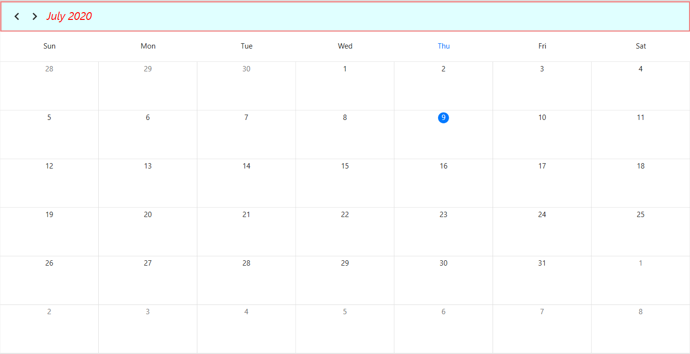
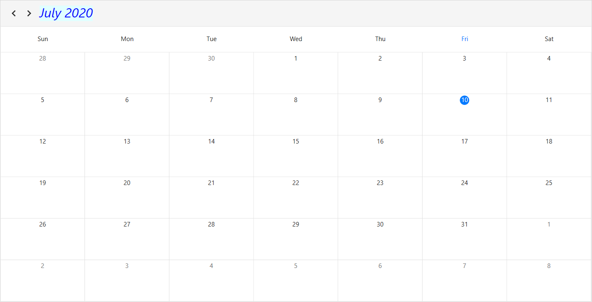

# Headers in WPF scheduler (SfScheduler)
You can change the header height, date format and appearance of [SfScheduler](https://help.syncfusion.com/cr/wpf/Syncfusion.SfScheduler.WPF~Syncfusion.UI.Xaml.Scheduler.SfScheduler.html).

## Header height
You can change the scheduler header height by using [HeaderHeight](https://help.syncfusion.com/cr/wpf/Syncfusion.SfScheduler.WPF~Syncfusion.UI.Xaml.Scheduler.SfScheduler~HeaderHeight.html) property of SfScheduler. by default the header height is 50.



<syncfusion:SfScheduler x:Name="Schedule"
                        HeaderHeight="100" >
</syncfusion:SfScheduler>


this.Schedule.HeaderHeight = 100;



## Header date format
You can change the Scheduler header date format of scheduler by using the  [HeaderDateFormat](https://help.syncfusion.com/cr/wpf/Syncfusion.SfScheduler.WPF~Syncfusion.UI.Xaml.Scheduler.SfScheduler~HeaderDateFormat.html) property of SfScheduler. by default the header date format is `MMMM yyyy`.



<syncfusion:SfScheduler x:Name="Schedule"
                        HeaderDateFormat="MMM/yyyy">   
</syncfusion:SfScheduler>


this.Schedule.HeaderDateFormat = "MMM/yyyy";



## Appearance

### Customize header appearance using Style
You can style Scheduler header appearance using [SchedulerHeaderControl](https://help.syncfusion.com/cr/wpf/Syncfusion.SfScheduler.WPF~Syncfusion.UI.Xaml.Scheduler.SchedulerHeaderControl.html) in scheduler. You can change the background color, textStyle, and borderBrush etc. by setting style property for `SchedulerHeaderControl`.







### Customize header appearance using DataTemplate
You can customize header appearance of scheduler by using [HeaderTemplate](https://help.syncfusion.com/cr/wpf/Syncfusion.SfScheduler.WPF~Syncfusion.UI.Xaml.Scheduler.SfScheduler~HeaderTemplate.html) property of SfScheduler.



<syncfusion:SfScheduler x:Name="Schedule">
    <syncfusion:SfScheduler.HeaderTemplate>
        <DataTemplate >
                <TextBlock FontStyle="Italic"
                           Foreground="Blue"
                           FontSize="25"
                           Text="{Binding}"/>
        </DataTemplate>
    </syncfusion:SfScheduler.HeaderTemplate>
</syncfusion:SfScheduler>



