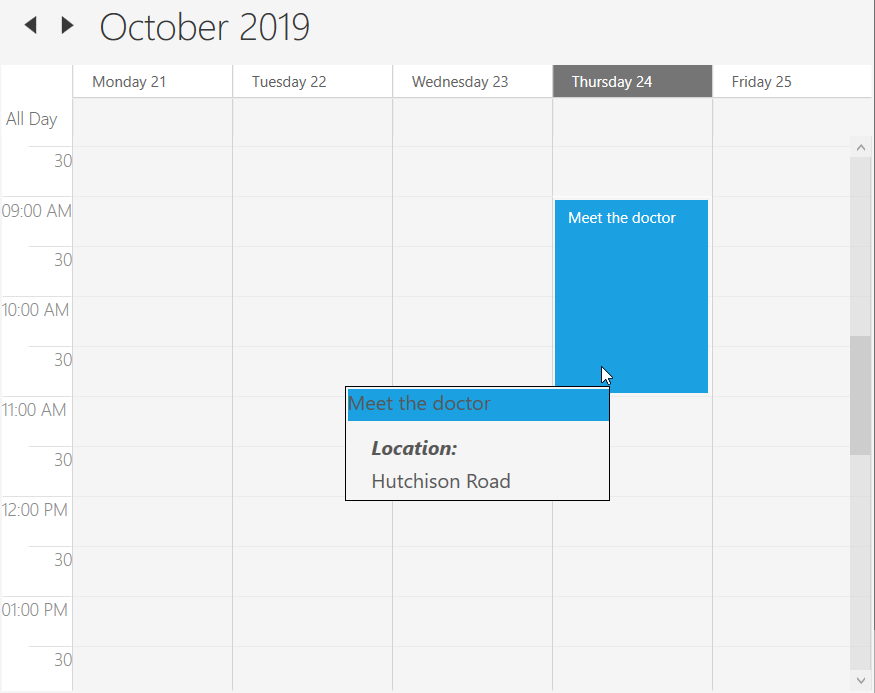

## Appointments

Scheduler control has a built-in capability to handle the appointment arrangement internally based on the [ScheduleAppointmentCollection](https://help.syncfusion.com/cr/wpf/Syncfusion.SfSchedule.WPF~Syncfusion.UI.Xaml.Schedule.ScheduleAppointmentCollection.html). [ScheduleAppointment](https://help.syncfusion.com/cr/wpf/Syncfusion.SfSchedule.WPF~Syncfusion.UI.Xaml.Schedule.ScheduleAppointment.html) is a class that contains the details of the scheduled appointment.



<syncfusion:SfSchedule.Appointments>
    <syncfusion:ScheduleAppointment StartTime="05/08/2017 10:0:0" EndTime="05/08/2017 11:0:0" Subject="Meeting" Location="Hutchison road"/>
</syncfusion:SfSchedule.Appointments>


// Creating an instance for schedule appointment collection
ScheduleAppointmentCollection scheduleAppointmentCollection = new ScheduleAppointmentCollection();
//Adding schedule appointment in schedule appointment collection 
scheduleAppointmentCollection.Add(new ScheduleAppointment()
{
    StartTime = new DateTime(2017, 05, 08, 10, 0, 0),
    EndTime = new DateTime(2017, 05, 08, 11, 0, 0),
    Subject = "Meeting",
    Location = "Hutchison road",
});

//Adding schedule appointment collection to Appointments of SfSchedule
this.Schedule.Appointments = scheduleAppointmentCollection;



## Appointment mapping

Schedule supports full data binding to any type of IEnumerable source. Specify the [AppointmentMapping](https://help.syncfusion.com/cr/wpf/Syncfusion.SfSchedule.WPF~Syncfusion.UI.Xaml.Schedule.SfSchedule~AppointmentMapping.html) attributes to map the properties in the underlying data source to the schedule appointments.

<table>
<tr><th>Property Name</th><th>Description</th></tr>
<tr><td><a href="https://help.syncfusion.com/cr/cref_files/wpf/Syncfusion.SfSchedule.WPF~Syncfusion.UI.Xaml.Schedule.ScheduleAppointmentMapping~StartTimeMapping.html">StartTimeMapping</a></td><td>This property is intended to map the custom class property name that is identical to ScheduleAppointment's StartTime.</td></tr>
<tr><td><a href="https://help.syncfusion.com/cr/cref_files/wpf/Syncfusion.SfSchedule.WPF~Syncfusion.UI.Xaml.Schedule.ScheduleAppointmentMapping~StartTimeZoneMapping.html">StartTimeZoneMapping</a></td><td>This property is intended to map the custom class property name that is identical to ScheduleAppointment's StartTimeZone.</td></tr>
<tr><td><a href="https://help.syncfusion.com/cr/wpf/Syncfusion.SfSchedule.WPF~Syncfusion.UI.Xaml.Schedule.ScheduleAppointmentMapping~EndTimeMapping.html">EndTimeMapping</a></td><td>This property is intended to map the custom class property name that is identical to ScheduleAppointment's EndTime.</td></tr>
<tr><td><a href="https://help.syncfusion.com/cr/wpf/Syncfusion.SfSchedule.WPF~Syncfusion.UI.Xaml.Schedule.ScheduleAppointmentMapping~EndTimeZoneMapping.html">EndTimeZoneMapping</a></td><td>This property is intended to map the custom class property name that is identical to ScheduleAppointment's EndTimeZone.</td></tr>
<tr><td><a href="https://help.syncfusion.com/cr/cref_files/wpf/Syncfusion.SfSchedule.WPF~Syncfusion.UI.Xaml.Schedule.ScheduleAppointmentMapping~SubjectMapping.html">SubjectMapping</a></td><td>This property is intended to map the custom class property name that is identical to ScheduleAppointment's Subject .</td></tr>
<tr><td><a href="https://help.syncfusion.com/cr/wpf/Syncfusion.SfSchedule.WPF~Syncfusion.UI.Xaml.Schedule.ScheduleAppointmentMapping~AppointmentBackgroundMapping.html">AppointmentBackgroundMapping</a></td><td>This property is intended to map the custom class property name that is identical to ScheduleAppointment's AppointmentBackground.</td></tr>
<tr><td><a href="https://help.syncfusion.com/cr/wpf/Syncfusion.SfSchedule.WPF~Syncfusion.UI.Xaml.Schedule.ScheduleAppointmentMapping~AllDayMapping.html">AllDayMapping</a></td><td>This property is intended to map the custom class property name that is identical to ScheduleAppointment's all day.</td></tr>
<tr><td><a href="https://help.syncfusion.com/cr/cref_files/wpf/Syncfusion.SfSchedule.WPF~Syncfusion.UI.Xaml.Schedule.ScheduleAppointmentMapping~RecurrenceRuleMapping.html">RecurrenceRuleMapping</a></td><td>This property is intended to map the custom class property name that is identical to ScheduleAppointment's RecurrenceRule.</td></tr>
<tr><td><a href="https://help.syncfusion.com/cr/cref_files/wpf/Syncfusion.SfSchedule.WPF~Syncfusion.UI.Xaml.Schedule.ScheduleAppointmentMapping~RecurrenceTypeMapping.html">RecurrenceTypeMapping</a></td><td>This property is intended to map the custom class property name that is identical to ScheduleAppointment's RecurrenceType.</td></tr>
<tr><td><a href="https://help.syncfusion.com/cr/cref_files/wpf/Syncfusion.SfSchedule.WPF~Syncfusion.UI.Xaml.Schedule.ScheduleAppointmentMapping~RecurrenceProperitesMapping.html">RecurrenceProperitesMapping</a></td><td>This property is intended to map the custom class property name that is identical to ScheduleAppointment's RecurrenceProperites.</td></tr>
<tr><td><a href="https://help.syncfusion.com/cr/cref_files/wpf/Syncfusion.SfSchedule.WPF~Syncfusion.UI.Xaml.Schedule.ScheduleAppointmentMapping~RecursiveExceptionDatesMapping.html">RecursiveExceptionDatesMapping</a></td><td>This property is intended to map the custom class property name that is identical to ScheduleAppointment's RecursiveExceptionDates.</td></tr>
<tr><td><a href="https://help.syncfusion.com/cr/cref_files/wpf/Syncfusion.SfSchedule.WPF~Syncfusion.UI.Xaml.Schedule.ScheduleAppointmentMapping~ReminderTimeMapping.html">ReminderTimeMapping</a></td><td>This property is intended to map the custom class property name that is identical to ScheduleAppointment's ReminderTime.</td></tr>
<tr><td><a href="https://help.syncfusion.com/cr/cref_files/wpf/Syncfusion.SfSchedule.WPF~Syncfusion.UI.Xaml.Schedule.ScheduleAppointmentMapping~IsRecursiveMapping.html">IsRecursiveMapping</a></td><td>This property is intended to map the custom class property name that is identical to ScheduleAppointment's IsRecursive.</td></tr>
<tr><td><a href="https://help.syncfusion.com/cr/cref_files/wpf/Syncfusion.SfSchedule.WPF~Syncfusion.UI.Xaml.Schedule.ScheduleAppointmentMapping~NotesMapping.html">NotesMapping</a></td><td>This property is intended to map the custom class property name that is identical to ScheduleAppointment's Notes.</td></tr>
<tr><td><a href="https://help.syncfusion.com/cr/cref_files/wpf/Syncfusion.SfSchedule.WPF~Syncfusion.UI.Xaml.Schedule.ScheduleAppointmentMapping~LocationMapping.html">LocationMapping</a></td><td>This property is intended to map the custom class property name that is identical to ScheduleAppointment's Location.</td></tr>
<tr><td><a href="https://help.syncfusion.com/cr/cref_files/wpf/Syncfusion.SfSchedule.WPF~Syncfusion.UI.Xaml.Schedule.ScheduleAppointmentMapping~StatusMapping.html">StatusMapping</a></td><td>This property is intended to map the custom class property name that is identical to ScheduleAppointment's Status.</td></tr>
<tr><td><a href="https://help.syncfusion.com/cr/cref_files/wpf/Syncfusion.SfSchedule.WPF~Syncfusion.UI.Xaml.Schedule.ScheduleAppointmentMapping~ResourceCollectionMapping.html">ResourceCollectionMapping</a></td><td>This property is intended to map the custom class property name that is identical to ScheduleAppointment's ResourceCollection.</td></tr>
<tr><td><a href="https://help.syncfusion.com/cr/cref_files/wpf/Syncfusion.SfSchedule.WPF~Syncfusion.UI.Xaml.Schedule.ScheduleAppointmentMapping~ResourceNameMapping.html">ResourceNameMapping</a></td><td>This property is intended to map the custom class property name that is identical to ScheduleAppointment's ResourceName.</td></tr>
<tr><td><a href="https://help.syncfusion.com/cr/wpf/Syncfusion.SfSchedule.WPF~Syncfusion.UI.Xaml.Schedule.ScheduleAppointmentMapping~DisplayNameMapping.html">DisplayNameMapping</a></td><td>This property is intended to map the custom class property name that is identical to ScheduleAppointment's DisplayName.</td></tr>
<tr><td><a href="https://help.syncfusion.com/cr/cref_files/wpf/Syncfusion.SfSchedule.WPF~Syncfusion.UI.Xaml.Schedule.ScheduleAppointmentMapping~TypeNameMapping.html">TypeNameMapping</a></td><td>This property is intended to map the custom class property name that is identical to ScheduleAppointment's TypeName.</td></tr>
<tr><td><a href="https://help.syncfusion.com/cr/cref_files/wpf/Syncfusion.SfSchedule.WPF~Syncfusion.UI.Xaml.Schedule.ScheduleAppointmentMapping~ReadOnlyMapping.html">ReadOnlyMapping</a></td><td>This property is intended to map the custom class property name that is identical to ScheduleAppointment's ReadOnly.</td></tr>
</table>

N> Custom appointment class should contain two DateTime fields and a string field as mandatory.

### Creating custom appointments
Scheduler supports to create a custom appointment by using property. You can create a custom class `MappedAppointment` with mandatory fields `MappedStartTime`, `MappedEndTime` and `MappedSubject`.



/// 
   
/// Represents custom data properties.   
/// 
 
public class MappedAppointment
{
    public string MappedSubject { get; set; }
    public DateTime MappedStartTime { get; set; }
    public DateTime MappedEndTime { get; set; }
}



N> You can inherit this class from `INotifyPropertyChanged` for dynamic changes in custom data.

You can map those properties of `MappedAppointment` class with our Scheduler control by using [AppointmentMapping](https://help.syncfusion.com/cr/wpf/Syncfusion.SfSchedule.WPF~Syncfusion.UI.Xaml.Schedule.SfSchedule~AppointmentMapping.html) and bind the mapping collection with scheduler control using [ItemSource](https://help.syncfusion.com/cr/wpf/Syncfusion.SfSchedule.WPF~Syncfusion.UI.Xaml.Schedule.SfSchedule~ItemsSource.html) property.

 

<Window x:Class="SfSch eduleWpf.MainWindow"
    xmlns="http://schemas.microsoft.com/winfx/2006/xaml/presentation"
    xmlns:x="http://schemas.microsoft.com/winfx/2006/xaml"
    xmlns:schedule="http://schemas.syncfusion.com/wpf"
    Title="MainWindow" Height="350" Width="525"
    WindowState="Maximized">

    <Grid Name="grid"}">
    <Schedule:SfSchedule Name="schedule" ScheduleType="Day" ItemsSource="{Binding MappedAppointments}">
    <Schedule:SfSchedule.AppointmentMapping>
    <Schedule:ScheduleAppointmentMapping
    SubjectMapping="MappedSubject"
    StartTimeMapping="MappedStartTime"
    EndTimeMapping="MappedEndTime"/>
    </Schedule:SfSchedule.AppointmentMapping>
    </Schedule:SfSchedule>
    </Grid>
</Window>


public partial class MainWindow : Window
{
    public ObservableCollection<MappedAppointment> MappedAppointments { get; set; }
    public MainWindow()
    {
        InitializeComponent();
        MappedAppointments = new ObservableCollection<MappedAppointment>
        {
            new MappedAppointment{MappedSubject = "Meeting", MappedStartTime = DateTime.Now.Date.AddHours(10), MappedEndTime = DateTime.Now.Date.AddHours(11)},
            new MappedAppointment{MappedSubject = "Conference", MappedStartTime = DateTime.Now.Date.AddHours(15), MappedEndTime = DateTime.Now.Date.AddHours(16)},
        };
        this.DataContext = this;
    }
}




### AppointmentCollectionChanged
Scheduler notifies changes of `Appointments` collection by [AppointmentCollectionChanged](https://help.syncfusion.com/cr/wpf/Syncfusion.SfSchedule.WPF~Syncfusion.UI.Xaml.Schedule.SfSchedule~AppointmentCollectionChanged_EV.html) event.
This event triggers with default [NotifyCollectionChangedEventArgs](https://docs.microsoft.com/en-us/dotnet/api/system.collections.specialized.notifycollectionchangedeventargs).



this.schedule.AppointmentCollectionChanged += Schedule_AppointmentCollectionChanged;
private void Schedule_AppointmentCollectionChanged(object sender, System.Collections.Specialized.NotifyCollectionChangedEventArgs e)
{
    //To notify whenever make the changes in Appointments collection.
}



### ItemSourceChanged event
Scheduler notifies changes to the `ItemSource` by [ItemSourceChanged](https://help.syncfusion.com/cr/wpf/Syncfusion.SfSchedule.WPF~Syncfusion.UI.Xaml.Schedule.SfSchedule~ItemsSourceChanged_EV.html) event in custom binding. 



this.schedule.ItemsSourceChanged += Schedule_ItemsSourceChanged;
private void Schedule_ItemsSourceChanged(object sender, EventArgs e)
{
    //To notify when changing the ItemSource.
}



## Recurrence Appointment
This section has briefly explained in following [link](https://help.syncfusion.com/wpf/scheduler/recurrence)

## Edititng Appointemnt
Scheduler support to edit the appointment in UI by using 'AppointmentEditor' window. You can use this winow by double click on the appointment or right click on the appointment and select the edit option from the contextmenu.

ContextMenu edit option

Appointment editor window

### Event

#### AppointmentEditorOpening
Scheduler notifies by  [AppointmentEditorOpening]() when open the appointment editor to edit the event. 
[AppointmentEditorOpeningEventArgs](https://help.syncfusion.com/cr/cref_files/wpf/Syncfusion.SfSchedule.WPF~Syncfusion.UI.Xaml.Schedule.AppointmentEditorOpeningEventArgs.html) has following members which provides information for `AppointmentEditorOpening` event.

[Action](https://help.syncfusion.com/cr/cref_files/wpf/Syncfusion.SfSchedule.WPF~Syncfusion.UI.Xaml.Schedule.AppointmentEditorOpeningEventArgs~Action.html) - Get the action(add or delete or edit) for the selected appointment.

[Appointment](https://help.syncfusion.com/cr/cref_files/wpf/Syncfusion.SfSchedule.WPF~Syncfusion.UI.Xaml.Schedule.AppointmentEditorOpeningEventArgs~Appointment.html) - Get the selected appointment details.

[SelectedResource](https://help.syncfusion.com/cr/cref_files/wpf/Syncfusion.SfSchedule.WPF~Syncfusion.UI.Xaml.Schedule.AppointmentEditorOpeningEventArgs~SelectedResource.html) - Get the selected appointment resource details if scheduler does have the resource.

[StartTime](https://help.syncfusion.com/cr/cref_files/wpf/Syncfusion.SfSchedule.WPF~Syncfusion.UI.Xaml.Schedule.AppointmentEditorOpeningEventArgs~StartTime.html) - Get the appointment start time

[Cancel](https://docs.microsoft.com/en-us/dotnet/api/system.componentmodel.canceleventargs.cancel) - To avoid the default appointment editor showing by enabling this property. 

For example, to use custom the appointment editor window instead of default appointment editor window you can handle [AppointmentEditorOpening](https://help.syncfusion.com/cr/wpf/Syncfusion.SfSchedule.WPF~Syncfusion.UI.Xaml.Schedule.SfSchedule~AppointmentEditorOpening_EV.html) event.



this.schedule.AppointmentEditorOpening += Schedule_AppointmentEditorOpening;
private void Schedule_AppointmentEditorOpening(object sender, AppointmentEditorOpeningEventArgs e)
{
    //To handle the default appointment editior window by setting the e.Cancel value as true.
    e.Cancel = true;
    if (e.Appointment != null)
    {
        //Display the custom appointment editor window to edit the appointment
    }
    else
    {
        //Display the custom appointment editor window to add new appointment
    }
}



#### AppointmentEditorClosed
Scheduler notifies by [AppointmentEditorClosed](https://help.syncfusion.com/cr/cref_files/wpf/Syncfusion.SfSchedule.WPF~Syncfusion.UI.Xaml.Schedule.SfSchedule~AppointmentEditorClosed_EV.html) when close the appointment editor window.
[AppointmentEditorClosedEventArgs](https://help.syncfusion.com/cr/cref_files/wpf/Syncfusion.SfSchedule.WPF~Syncfusion.UI.Xaml.Schedule.AppointmentEditorClosedEventArgs.html) event has following members which provides information for `AppointmentEditorClosed` event.

[Action](https://help.syncfusion.com/cr/cref_files/wpf/Syncfusion.SfSchedule.WPF~Syncfusion.UI.Xaml.Schedule.AppointmentEditorClosedEventArgs~Action.html) - Gets the action of appointment which is add or delete or edit.

[EditedAppointment](https://help.syncfusion.com/cr/cref_files/wpf/Syncfusion.SfSchedule.WPF~Syncfusion.UI.Xaml.Schedule.AppointmentEditorClosedEventArgs~EditedAppointment.html) - Gets the edited appointment details if appointment editor closed with edit action.

[OriginalAppointment](https://help.syncfusion.com/cr/cref_files/wpf/Syncfusion.SfSchedule.WPF~Syncfusion.UI.Xaml.Schedule.AppointmentEditorClosedEventArgs~OriginalAppointment.html) - Gets the selected appointment details.

[IsNew](https://help.syncfusion.com/cr/cref_files/wpf/Syncfusion.SfSchedule.WPF~Syncfusion.UI.Xaml.Schedule.AppointmentEditorClosedEventArgs~IsNew.html) - Gets the appointment is new or not. 

[Handled](https://help.syncfusion.com/cr/cref_files/wpf/Syncfusion.SfSchedule.WPF~Syncfusion.UI.Xaml.Schedule.AppointmentEditorClosedEventArgs~Handled.html) - To handle appointment editor changes update into the Scheduler `Appointments` collection.

For example, to handle the appointment adding for today's date, you can handle the `AppointmentEditorClosed` event.



this.schedule.AppointmentEditorClosed += Schedule_AppointmentEditorClosed;
private void Schedule_AppointmentEditorClosed(object sender, AppointmentEditorClosedEventArgs e)
{
    var appointment = e.EditedAppointment as ScheduleAppointment;
    if (appointment != null)
    {
        if (appointment.StartTime.Day == DateTime.Now.Day)
            e.Handled = true;
    }
}



## Appointment deleting
Scheduler supports three ways to remove the selected appointment
1. Pressing Delete key
2. Using contextmenu delete option.
3. Using AppointmentEditor.

### Events

#### AppointmentDeleting
Scheduler notifies by [AppointmentDeleting](https://help.syncfusion.com/cr/cref_files/wpf/Syncfusion.SfSchedule.WPF~Syncfusion.UI.Xaml.Schedule.SfSchedule~AppointmentDeleting_EV.html) event when delete the appointment.
[AppointmentDeletingEventArgs](https://help.syncfusion.com/cr/cref_files/wpf/Syncfusion.SfSchedule.WPF~Syncfusion.UI.Xaml.Schedule.AppointmentDeletingEventArgs.html) has following memebers which provides information for `AppointmentDeleting` event.

`Appointment` - Get the selected appointment
`MappedObject` - Get the binding object detalis of selected appointment if schedule appointments are mapped with custom object.
`RecurrenceEditMode` - Gets or sets whether to delete particular occurrence or appointment sequence when delete a recurrence appointment. You can let end-user handle this option (using built-in dialog shown in scheduler) or define it by yourself using `AppointmentDeleting` event. 
[Cancel](https://docs.microsoft.com/en-us/dotnet/api/system.componentmodel.canceleventargs.cancel) - By enabling this property, avoid deleting the appointment. 

## Disable appointment editing
Scheduler supports to prevent the editing for appointments by using [AllowEditing](https://help.syncfusion.com/cr/wpf/Syncfusion.SfSchedule.WPF~Syncfusion.UI.Xaml.Schedule.SfSchedule~AllowEditing.html) property.



<Schedule:SfSchedule x:Name="schedule" AllowEditing="False"/>


this.Schedule.AllowEditing = false;



## Appointemnt resizing
Scheduler supports resizing the appointment using the option `Resize`option from the `ScheduleAppointemnt` context menu. This support is available for all views except 'Month' view.

### Events

#### AppointmentStartResizing
Scheduler notifies by [AppointmentStartResizing](https://help.syncfusion.com/cr/wpf/Syncfusion.SfSchedule.WPF~Syncfusion.UI.Xaml.Schedule.SfSchedule~AppointmentStartResizing_EV.html) event when start to resize the appointment.

[AppointmentStartResizingEventArgs](https://help.syncfusion.com/cr/wpf/Syncfusion.SfSchedule.WPF~Syncfusion.UI.Xaml.Schedule.AppointmentStartResizingEventArgs.html) has following members which provides information for `AppointmentStartResizing` event.

[Appointment](https://help.syncfusion.com/cr/cref_files/wpf/Syncfusion.SfSchedule.WPF~Syncfusion.UI.Xaml.Schedule.AppointmentStartResizingEventArgs~Appointment.html) - Get the appointment details that is start to resize.
[Cancel](https://help.syncfusion.com/cr/cref_files/wpf/Syncfusion.SfSchedule.WPF~Syncfusion.UI.Xaml.Schedule.AppointmentStartResizingEventArgs~Appointment.html) - Setting value to true, cancels the triggered action.



this.schedule.AppointmentStartResizing += Schedule_AppointmentStartResizing;
private void Schedule_AppointmentStartResizing(object sender, AppointmentStartResizingEventArgs e)
{
    //To notify when start to resize the appointment.    
}



#### AppointmentResizing
Scheduler notifies by [AppointmentResizing](https://help.syncfusion.com/cr/wpf/Syncfusion.SfSchedule.WPF~Syncfusion.UI.Xaml.Schedule.SfSchedule~AppointmentResizing_EV.html) event when resize the appointment.

[AppointmentResizingEventArgs](https://help.syncfusion.com/cr/wpf/Syncfusion.SfSchedule.WPF~Syncfusion.UI.Xaml.Schedule.AppointmentResizingEventArgs.html) has following members which provides information for `AppointmentResizing` event.

[Appointment](https://help.syncfusion.com/cr/cref_files/wpf/Syncfusion.SfSchedule.WPF~Syncfusion.UI.Xaml.Schedule.AppointmentStartResizingEventArgs~Appointment.html) - Get the resizing appointment details.

[From](https://help.syncfusion.com/cr/cref_files/wpf/Syncfusion.SfSchedule.WPF~Syncfusion.UI.Xaml.Schedule.AppointmentResizingEventArgs~From.html) - Get the appointment start time.

[To](https://help.syncfusion.com/cr/cref_files/wpf/Syncfusion.SfSchedule.WPF~Syncfusion.UI.Xaml.Schedule.AppointmentResizingEventArgs~To.html) - Get the appointment end time.

[ResizeType](https://help.syncfusion.com/cr/cref_files/wpf/Syncfusion.SfSchedule.WPF~Syncfusion.UI.Xaml.Schedule.AppointmentResizingEventArgs~ResizeType.html) - Get the resize type for appointment whether it is resizing from start or end.

[RefreshAppointment](https://help.syncfusion.com/cr/cref_files/wpf/Syncfusion.SfSchedule.WPF~Syncfusion.UI.Xaml.Schedule.AppointmentResizingEventArgs~RefreshAppointment.html) - Get or Sets appointment need to be refresh or not. 



this.schedule.AppointmentResizing += Schedule_AppointmentResizing;
private void Schedule_AppointmentStartResizing(object sender, AppointmentResizingEventArgs e)
{
    //To notify when resizing the appointment.    
}



#### AppointmentEndResizing
Scheduler notifies by [AppointmentEndResizing](https://help.syncfusion.com/cr/wpf/Syncfusion.SfSchedule.WPF~Syncfusion.UI.Xaml.Schedule.SfSchedule~AppointmentEndResizing_EV.html) event when end the appointment resizing.

[AppointmentEndResizingEventArgs](https://help.syncfusion.com/cr/wpf/Syncfusion.SfSchedule.WPF~Syncfusion.UI.Xaml.Schedule.AppointmentEndResizingEventArgs.html) has following members which provides information for `AppointmentEndResizing` event.

[Appointment](https://help.syncfusion.com/cr/cref_files/wpf/Syncfusion.SfSchedule.WPF~Syncfusion.UI.Xaml.Schedule.AppointmentEndResizingEventArgs~Appointment.html) - Get the resizing appointment details.

[From](https://help.syncfusion.com/cr/cref_files/wpf/Syncfusion.SfSchedule.WPF~Syncfusion.UI.Xaml.Schedule.AppointmentEndResizingEventArgs~From.html) - Get the appointment start time.

[To](https://help.syncfusion.com/cr/cref_files/wpf/Syncfusion.SfSchedule.WPF~Syncfusion.UI.Xaml.Schedule.AppointmentEndResizingEventArgs~To.html) - Get the appointment end time.

[ResizeType](https://help.syncfusion.com/cr/cref_files/wpf/Syncfusion.SfSchedule.WPF~Syncfusion.UI.Xaml.Schedule.AppointmentEndResizingEventArgs~ResizeType.html) - Get the resize type for appointment whether it is resizing from start or end.

[Cancel](https://help.syncfusion.com/cr/cref_files/wpf/Syncfusion.SfSchedule.WPF~Syncfusion.UI.Xaml.Schedule.AppointmentStartResizingEventArgs~Appointment.html) - Setting value to true, cancels the triggered action.



this.schedule.AppointmentEndResizing += Schedule_AppointmentResizing;
private void Schedule_AppointmentStartResizing(object sender, AppointmentEndResizingEventArgs e)
{
    //To notify when resizing is completed for an appointment.    
}



## Appointment template customization
The default appearance of the appointment can be customized by using the [AppointmentTemplate](https://help.syncfusion.com/cr/wpf/Syncfusion.SfSchedule.WPF~Syncfusion.UI.Xaml.Schedule.SfSchedule~AppointmentTemplate.html) property. The `AppointmentTemplate` is a `ControlTemplate` type, used to customize or override the default template of the appointments.



<Schedule:SfSchedule>
    <Schedule:SfSchedule.AppointmentTemplate>
        <ControlTemplate>
            <Grid>
            <Rectangle Fill="{Binding AppointmentBackground}"/>
                <Grid>
                    <Grid.RowDefinitions>
                        <RowDefinition Height="0.25*"/>
                        <RowDefinition Height="0.75*"/>
                    </Grid.RowDefinitions>
                    <Grid.ColumnDefinitions>
                        <ColumnDefinition/>
                        <ColumnDefinition/>
                    </Grid.ColumnDefinitions>
                    <TextBlock Margin="10,2,0,0" Text="{Binding Subject}" Grid.Row="0" Grid.Column="0" Grid.ColumnSpan="2" HorizontalAlignment="Left" VerticalAlignment="Center" FontSize="20" Foreground="White" FontWeight="Light" FontFamily="Segoe UI"/>
                    <Image Source="../Assets/Team.png" Grid.Row="1" HorizontalAlignment="Left" VerticalAlignment="Center" Stretch="Fill" />
                    <TextBlock Text="{Binding StartTime}" Grid.Row="1" Grid.Column="1" HorizontalAlignment="Left" VerticalAlignment="Center" FontSize="20" Foreground="White" FontWeight="Light" FontFamily="Segoe UI" TextWrapping="NoWrap"/>
                </Grid>
            </Grid>
        </ControlTemplate>
    </Schedule:SfSchedule.AppointmentTemplate>
</Schedule:SfSchedule>


schedule.Appointments.Add(new ScheduleAppointment()
{
    StartTime = DateTime.Now.Date.AddHours(9),
    EndTime = DateTime.Now.Date.AddHours(11),
    Subject = "Meet the doctor",
    Location = "Hutchison road",
});



## All day appointments
Appointments can be scheduled for an entire day by using [AllDay](https://help.syncfusion.com/cr/wpf/Syncfusion.SfSchedule.WPF~Syncfusion.UI.Xaml.Schedule.ScheduleAppointment~AllDay.html) property in `ScheduleAppointment`.



<syncfusion:SfSchedule.Appointments>
    <syncfusion:ScheduleAppointment StartTime="05/08/2017 10:0:0" EndTime="05/08/2017 11:0:0" Subject="Meeting" AllDay="True" Location="Hutchison road"/>
</syncfusion:SfSchedule.Appointments>


// Creating an instance for schedule appointment collection
ScheduleAppointmentCollection scheduleAppointmentCollection = new ScheduleAppointmentCollection();
//Adding schedule appointment in schedule appointment collection 
scheduleAppointmentCollection.Add(new ScheduleAppointment()
{
    StartTime = new DateTime(2017, 05, 08, 10, 0, 0),
    EndTime = new DateTime(2017, 05, 08, 11, 0, 0),
    Subject = "Meeting",
    AllDay = true,
    Location = "Hutchison road",
});

//Adding schedule appointment collection to Appointments of Scheduler
this.Schedule.Appointments = scheduleAppointmentCollection;



N> Appointment which lasts through an entire day (exact 24 hours) will be considered as all day appointment without setting `AllDay` property. For example 06/09/2018 12:00AM to 06/10/2018 12:00AM.

## All day appointment panel
All-day appointment and Spanned appointment doesn’t block out entire time slot in Scheduler, rather it will render in separate layout exclusively for all-day appointment. It can be enabled by setting [ShowAllDay](https://help.syncfusion.com/cr/wpf/Syncfusion.SfSchedule.WPF~Syncfusion.UI.Xaml.Schedule.SfSchedule~ShowAllDay.html) property.



<Schedule:SfSchedule x:Name="schedule" ShowAllDay="False"/>


this.Schedule.ShowAllDay = false;



## Appointment tooltip
Scheduler supports to show the tooltip for appointment with the details of appointment. The appointment tooltip will be displayed by using the [AppointmentTooltipVisibility](https://help.syncfusion.com/cr/wpf/Syncfusion.SfSchedule.WPF~Syncfusion.UI.Xaml.Schedule.SfSchedule~AppointmentTooltipVisibility.html) property.



<Schedule:SfSchedule x:Name="schedule" AppointmentTooltipVisibility="Visible" ScheduleType="Day"/>


this.Schedule.AppointmentTooltipVisibility = Visibility.Visible;



### Appointment tooltip template customization
Scheduler supports to customize the tooltip by using [AppointmentToolTipTemplate](https://help.syncfusion.com/cr/wpf/Syncfusion.SfSchedule.WPF~Syncfusion.UI.Xaml.Schedule.SfSchedule~AppointmentToolTipTemplate.html) property.



<schedule:SfSchedule x:Name="schedule" ScheduleType="WorkWeek" AppointmentTooltipVisibility="Visible" Background="WhiteSmoke" >
    <schedule:SfSchedule.AppointmentToolTipTemplate>
        <ControlTemplate>
            <Border BorderBrush="Black" BorderThickness="1">
                <Grid Background="WhiteSmoke"  Height="90" Width="210">
                <Grid.RowDefinitions>
                    <RowDefinition/>
                    <RowDefinition Height="10"/>
                    <RowDefinition/>
                    <RowDefinition />
                </Grid.RowDefinitions>
                <Border Grid.Row="0">
                    <TextBlock Margin="1,1,0,0" Background="{Binding AppointmentBackground}"  FontSize="16" Text="{Binding Subject}" Grid.Row="0"/>
                </Border>
                <TextBlock FontSize="16" FontWeight="Bold" FontStyle="Italic" Margin="20,0,0,0" Text="Location: " Grid.Row="2"/>
                <TextBlock FontSize="16" Margin="20,0,0,0" Text="{Binding Location}" Grid.Row="3"/>
                </Grid>
            </Border>
        </ControlTemplate>
    </schedule:SfSchedule.AppointmentToolTipTemplate>
</schedule:SfSchedule>


schedule.Appointments.Add(new ScheduleAppointment()
{
    StartTime = DateTime.Now.Date.AddHours(9),
    EndTime = DateTime.Now.Date.AddHours(11),
    Subject = "Meet the doctor",
    Location = "Hutchison Road"
});



## Change the appointment selection color
Scheduler supports to change the appointment selection background by using [AppointmentSelectionBrush](https://help.syncfusion.com/cr/wpf/Syncfusion.SfSchedule.WPF~Syncfusion.UI.Xaml.Schedule.SfSchedule~AppointmentSelectionBrush.html) property.



<Schedule:SfSchedule x:Name="schedule" AppointmentSelectionBrush ="DarkGreen"/>


this.schedule.AppointmentSelectionBrush = Brushes.DarkGreen;



