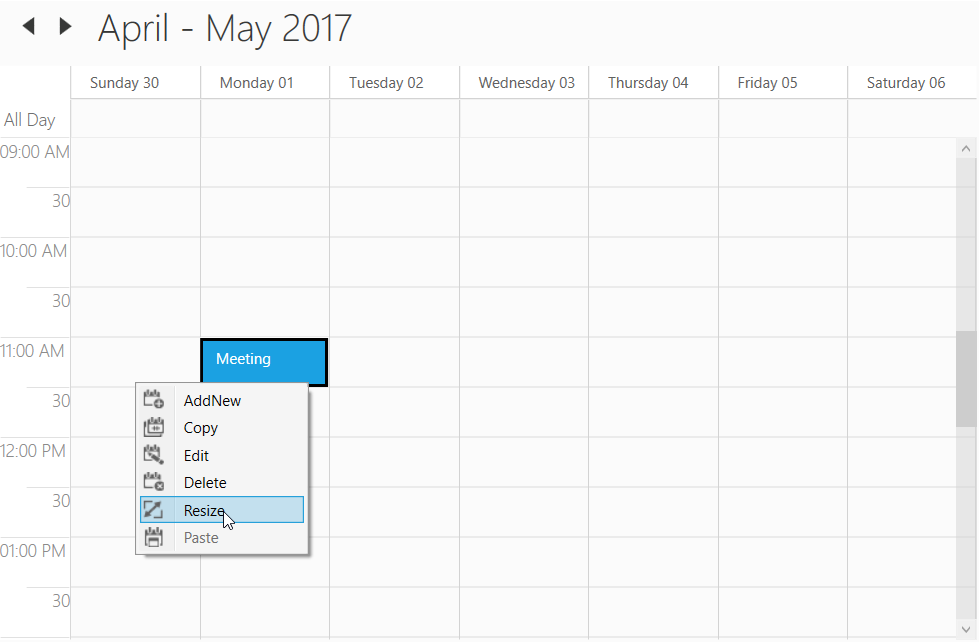

# Editing
This section gives you editing details of scheduler appointments and also explained about the appointment resizing, drag and drop.

## Editing Appointment
Scheduler supports to edit the appointment in UI by using 'AppointmentEditor' window. You can use this window by double click on the appointment or right click on the appointment and select the edit option from the `ContextMenu`.

ContextMenu edit option

Appointment editor window

### Event

#### AppointmentEditorOpening
Scheduler notifies by  [AppointmentEditorOpening](https://help.syncfusion.com/cr/cref_files/wpf/Syncfusion.SfSchedule.WPF~Syncfusion.UI.Xaml.Schedule.SfSchedule~AppointmentEditorOpening_EV.html) when open the appointment editor to edit the event. 
[AppointmentEditorOpeningEventArgs](https://help.syncfusion.com/cr/cref_files/wpf/Syncfusion.SfSchedule.WPF~Syncfusion.UI.Xaml.Schedule.AppointmentEditorOpeningEventArgs.html) has following members which provides information for `AppointmentEditorOpening` event.

[Action](https://help.syncfusion.com/cr/cref_files/wpf/Syncfusion.SfSchedule.WPF~Syncfusion.UI.Xaml.Schedule.AppointmentEditorOpeningEventArgs~Action.html) - Get the action(add or delete or edit) for the selected appointment.

[Appointment](https://help.syncfusion.com/cr/cref_files/wpf/Syncfusion.SfSchedule.WPF~Syncfusion.UI.Xaml.Schedule.AppointmentEditorOpeningEventArgs~Appointment.html) - Get the selected appointment details.

[SelectedResource](https://help.syncfusion.com/cr/cref_files/wpf/Syncfusion.SfSchedule.WPF~Syncfusion.UI.Xaml.Schedule.AppointmentEditorOpeningEventArgs~SelectedResource.html) - Get the selected appointment resource details if scheduler does have the resource.

[StartTime](https://help.syncfusion.com/cr/cref_files/wpf/Syncfusion.SfSchedule.WPF~Syncfusion.UI.Xaml.Schedule.AppointmentEditorOpeningEventArgs~StartTime.html) - Get the appointment start time

[Cancel](https://docs.microsoft.com/en-us/dotnet/api/system.componentmodel.canceleventargs.cancel) - To avoid the default appointment editor showing by enabling this property. 

For example, to use custom the appointment editor window instead of default appointment editor window you can handle [AppointmentEditorOpening](https://help.syncfusion.com/cr/wpf/Syncfusion.SfSchedule.WPF~Syncfusion.UI.Xaml.Schedule.SfSchedule~AppointmentEditorOpening_EV.html) event.



this.schedule.AppointmentEditorOpening += Schedule_AppointmentEditorOpening;
private void Schedule_AppointmentEditorOpening(object sender, AppointmentEditorOpeningEventArgs e)
{
    //To handle the default appointment editior window by setting the e.Cancel value as true.
    e.Cancel = true;
    if (e.Appointment != null)
    {
        //Display the custom appointment editor window to edit the appointment
    }
    else
    {
        //Display the custom appointment editor window to add new appointment
    }
}



#### AppointmentEditorClosed
Scheduler notifies by [AppointmentEditorClosed](https://help.syncfusion.com/cr/cref_files/wpf/Syncfusion.SfSchedule.WPF~Syncfusion.UI.Xaml.Schedule.SfSchedule~AppointmentEditorClosed_EV.html) when close the appointment editor window.
[AppointmentEditorClosedEventArgs](https://help.syncfusion.com/cr/cref_files/wpf/Syncfusion.SfSchedule.WPF~Syncfusion.UI.Xaml.Schedule.AppointmentEditorClosedEventArgs.html) event has following members which provides information for `AppointmentEditorClosed` event.

[Action](https://help.syncfusion.com/cr/cref_files/wpf/Syncfusion.SfSchedule.WPF~Syncfusion.UI.Xaml.Schedule.AppointmentEditorClosedEventArgs~Action.html) - Gets the action of appointment which is add or delete or edit.

[EditedAppointment](https://help.syncfusion.com/cr/cref_files/wpf/Syncfusion.SfSchedule.WPF~Syncfusion.UI.Xaml.Schedule.AppointmentEditorClosedEventArgs~EditedAppointment.html) - Gets the edited appointment details if appointment editor closed with edit action.

[OriginalAppointment](https://help.syncfusion.com/cr/cref_files/wpf/Syncfusion.SfSchedule.WPF~Syncfusion.UI.Xaml.Schedule.AppointmentEditorClosedEventArgs~OriginalAppointment.html) - Gets the selected appointment details.

[IsNew](https://help.syncfusion.com/cr/cref_files/wpf/Syncfusion.SfSchedule.WPF~Syncfusion.UI.Xaml.Schedule.AppointmentEditorClosedEventArgs~IsNew.html) - Gets the appointment is new or not. 

[Handled](https://help.syncfusion.com/cr/cref_files/wpf/Syncfusion.SfSchedule.WPF~Syncfusion.UI.Xaml.Schedule.AppointmentEditorClosedEventArgs~Handled.html) - To handle appointment editor changes update into the Scheduler `Appointments` collection.

For example, to handle the appointment adding for today's date, you can handle the `AppointmentEditorClosed` event.



this.schedule.AppointmentEditorClosed += Schedule_AppointmentEditorClosed;
private void Schedule_AppointmentEditorClosed(object sender, AppointmentEditorClosedEventArgs e)
{
    var appointment = e.EditedAppointment as ScheduleAppointment;
    if (appointment != null)
    {
        if (appointment.StartTime.Day == DateTime.Now.Day)
            e.Handled = true;
    }
}



## Appointment deleting
Scheduler supports three ways to remove the selected appointment
1. Pressing Delete key
2. Using `ContextMenu` delete option.
3. Using AppointmentEditor.

### Events

#### AppointmentDeleting
Scheduler notifies by [AppointmentDeleting](https://help.syncfusion.com/cr/cref_files/wpf/Syncfusion.SfSchedule.WPF~Syncfusion.UI.Xaml.Schedule.SfSchedule~AppointmentDeleting_EV.html) event when delete the appointment.
[AppointmentDeletingEventArgs](https://help.syncfusion.com/cr/cref_files/wpf/Syncfusion.SfSchedule.WPF~Syncfusion.UI.Xaml.Schedule.AppointmentDeletingEventArgs.html) has following members which provides information for `AppointmentDeleting` event.

`Appointment` - Get the selected appointment
`MappedObject` - Get the binding object details of selected appointment if schedule appointments are mapped with custom object.
`RecurrenceEditMode` - Gets or sets whether to delete particular occurrence or appointment sequence when delete a recurrence appointment. You can let end-user handle this option (using built-in dialog shown in scheduler) or define it by yourself using `AppointmentDeleting` event. 
[Cancel](https://docs.microsoft.com/en-us/dotnet/api/system.componentmodel.canceleventargs.cancel) - By enabling this property, avoid deleting the appointment. 

## Disable appointment editing
Scheduler supports to prevent the editing for appointments by using [AllowEditing](https://help.syncfusion.com/cr/wpf/Syncfusion.SfSchedule.WPF~Syncfusion.UI.Xaml.Schedule.SfSchedule~AllowEditing.html) property.



<Schedule:SfSchedule x:Name="schedule" AllowEditing="False"/>


this.Schedule.AllowEditing = false;



## Appointment resizing
Scheduler supports resizing the appointment using the option `Resize`option from the `ScheduleAppointment` context menu. This support is available for all views except 'Month' view.

### Events

#### AppointmentStartResizing
Scheduler notifies by [AppointmentStartResizing](https://help.syncfusion.com/cr/wpf/Syncfusion.SfSchedule.WPF~Syncfusion.UI.Xaml.Schedule.SfSchedule~AppointmentStartResizing_EV.html) event when start to resize the appointment.

[AppointmentStartResizingEventArgs](https://help.syncfusion.com/cr/wpf/Syncfusion.SfSchedule.WPF~Syncfusion.UI.Xaml.Schedule.AppointmentStartResizingEventArgs.html) has following members which provides information for `AppointmentStartResizing` event.

[Appointment](https://help.syncfusion.com/cr/cref_files/wpf/Syncfusion.SfSchedule.WPF~Syncfusion.UI.Xaml.Schedule.AppointmentStartResizingEventArgs~Appointment.html) - Get the appointment details that is start to resize.
[Cancel](https://docs.microsoft.com/en-us/dotnet/api/system.componentmodel.canceleventargs.cancel) - Setting value to true, cancels the triggered action.



this.schedule.AppointmentStartResizing += Schedule_AppointmentStartResizing;
private void Schedule_AppointmentStartResizing(object sender, AppointmentStartResizingEventArgs e)
{
    //To notify when start to resize the appointment.    
}



#### AppointmentResizing
Scheduler notifies by [AppointmentResizing](https://help.syncfusion.com/cr/wpf/Syncfusion.SfSchedule.WPF~Syncfusion.UI.Xaml.Schedule.SfSchedule~AppointmentResizing_EV.html) event when resize the appointment.

[AppointmentResizingEventArgs](https://help.syncfusion.com/cr/wpf/Syncfusion.SfSchedule.WPF~Syncfusion.UI.Xaml.Schedule.AppointmentResizingEventArgs.html) has following members which provides information for `AppointmentResizing` event.

[Appointment](https://help.syncfusion.com/cr/cref_files/wpf/Syncfusion.SfSchedule.WPF~Syncfusion.UI.Xaml.Schedule.AppointmentStartResizingEventArgs~Appointment.html) - Get the resizing appointment details.

[From](https://help.syncfusion.com/cr/cref_files/wpf/Syncfusion.SfSchedule.WPF~Syncfusion.UI.Xaml.Schedule.AppointmentResizingEventArgs~From.html) - Get the appointment start time.

[To](https://help.syncfusion.com/cr/cref_files/wpf/Syncfusion.SfSchedule.WPF~Syncfusion.UI.Xaml.Schedule.AppointmentResizingEventArgs~To.html) - Get the appointment end time.

[ResizeType](https://help.syncfusion.com/cr/cref_files/wpf/Syncfusion.SfSchedule.WPF~Syncfusion.UI.Xaml.Schedule.AppointmentResizingEventArgs~ResizeType.html) - Get the resize type for appointment whether it is resizing from start or end.

[RefreshAppointment](https://help.syncfusion.com/cr/cref_files/wpf/Syncfusion.SfSchedule.WPF~Syncfusion.UI.Xaml.Schedule.AppointmentResizingEventArgs~RefreshAppointment.html) - Get or Sets appointment need to be refresh or not. 



this.schedule.AppointmentResizing += Schedule_AppointmentResizing;
private void Schedule_AppointmentStartResizing(object sender, AppointmentResizingEventArgs e)
{
    //To notify when resizing the appointment.    
}



#### AppointmentEndResizing
Scheduler notifies by [AppointmentEndResizing](https://help.syncfusion.com/cr/wpf/Syncfusion.SfSchedule.WPF~Syncfusion.UI.Xaml.Schedule.SfSchedule~AppointmentEndResizing_EV.html) event when end the appointment resizing.

[AppointmentEndResizingEventArgs](https://help.syncfusion.com/cr/wpf/Syncfusion.SfSchedule.WPF~Syncfusion.UI.Xaml.Schedule.AppointmentEndResizingEventArgs.html) has following members which provides information for `AppointmentEndResizing` event.

[Appointment](https://help.syncfusion.com/cr/cref_files/wpf/Syncfusion.SfSchedule.WPF~Syncfusion.UI.Xaml.Schedule.AppointmentEndResizingEventArgs~Appointment.html) - Get the resizing appointment details.

[From](https://help.syncfusion.com/cr/cref_files/wpf/Syncfusion.SfSchedule.WPF~Syncfusion.UI.Xaml.Schedule.AppointmentEndResizingEventArgs~From.html) - Get the appointment start time.

[To](https://help.syncfusion.com/cr/cref_files/wpf/Syncfusion.SfSchedule.WPF~Syncfusion.UI.Xaml.Schedule.AppointmentEndResizingEventArgs~To.html) - Get the appointment end time.

[ResizeType](https://help.syncfusion.com/cr/cref_files/wpf/Syncfusion.SfSchedule.WPF~Syncfusion.UI.Xaml.Schedule.AppointmentEndResizingEventArgs~ResizeType.html) - Get the resize type for appointment whether it is resizing from start or end.

[Cancel](https://docs.microsoft.com/en-us/dotnet/api/system.componentmodel.canceleventargs.cancel) - Setting value to true, cancels the triggered action.



this.schedule.AppointmentEndResizing += Schedule_AppointmentResizing;
private void Schedule_AppointmentStartResizing(object sender, AppointmentEndResizingEventArgs e)
{
    //To notify when resizing is completed for an appointment.    
}



## Drag and drop
Scheduler supports to reschedule the appointment by using drag and drop operation. In order to perform the drag and drop operation `ScheduleAppointment.ReadOnly` property should be `false`. 

### Events

#### DragStarting
Scheduler notifies by [DragStarting](https://help.syncfusion.com/cr/wpf/Syncfusion.SfSchedule.WPF~Syncfusion.UI.Xaml.Schedule.SfSchedule~DragStarting_EV.html) when start to drag the appointment.
[DragStartingEventArgs](https://help.syncfusion.com/cr/wpf/Syncfusion.SfSchedule.WPF~Syncfusion.UI.Xaml.Schedule.DragStartingEventArgs.html) has following members which provides information for `DragStarting` event.

[Appointment](https://help.syncfusion.com/cr/wpf/Syncfusion.SfSchedule.WPF~Syncfusion.UI.Xaml.Schedule.DragStartingEventArgs~Appointment.html) - Get the selected appointment.
[Cancel](https://docs.microsoft.com/en-us/dotnet/api/system.componentmodel.canceleventargs.cancel) - Setting the value as `true` to prevent the drag and drop operation.



this.schedule.DragStarting += Schedule_DragStarting;
private void Schedule_DragStarting(object sender, DragStartingEventArgs e)
{
    //To notify when start to drag the appointment.
}



#### AppointmentDragging
Scheduler notifies by [AppointmentDragging]() when drag the appointment.
[AppointmentDraggingEventArgs](https://help.syncfusion.com/cr/wpf/Syncfusion.SfSchedule.WPF~Syncfusion.UI.Xaml.Schedule.AppointmentDraggingEventArgs.html) has following members which provides information for `AppointmentDragging` event.

[Appointment](https://help.syncfusion.com/cr/wpf/Syncfusion.SfSchedule.WPF~Syncfusion.UI.Xaml.Schedule.AppointmentDraggingEventArgs~Appointment.html) - Gets the selected appointment.
[From](https://help.syncfusion.com/cr/wpf/Syncfusion.SfSchedule.WPF~Syncfusion.UI.Xaml.Schedule.AppointmentDraggingEventArgs~From.html) - Gets the selected appointment start time.
[RefreshAppointment](https://help.syncfusion.com/cr/wpf/Syncfusion.SfSchedule.WPF~Syncfusion.UI.Xaml.Schedule.AppointmentDraggingEventArgs~RefreshAppointment.html) - Gets or sets the bool value to update the appointment `StartTime` and `EndTime` while dragging the appointment or not. 
[Resource](https://help.syncfusion.com/cr/wpf/Syncfusion.SfSchedule.WPF~Syncfusion.UI.Xaml.Schedule.AppointmentDraggingEventArgs~Resources.html) - Gets the resource details if the selected appointment presenting the resource.
[To](https://help.syncfusion.com/cr/wpf/Syncfusion.SfSchedule.WPF~Syncfusion.UI.Xaml.Schedule.AppointmentDraggingEventArgs~To.html) - Gets the selected appointment end time.



this.Schedule.AppointmentDragging += Schedule_AppointmentDragging;
private void Schedule_AppointmentDragging(object sender, AppointmentDraggingEventArgs e)
{
    //To notify when dragging the appointment.
}



#### AppointmentStartDragging
Scheduler notifies by [AppointmentStartDragging](https://help.syncfusion.com/cr/wpf/Syncfusion.SfSchedule.WPF~Syncfusion.UI.Xaml.Schedule.SfSchedule~AppointmentStartDragging_EV.html) when drag start to the appointment.
[AppointmentStartDraggingEventArgs](https://help.syncfusion.com/cr/wpf/Syncfusion.SfSchedule.WPF~Syncfusion.UI.Xaml.Schedule.AppointmentStartDraggingEventArgs.html) has following members which provides information for `AppointmentStartDragging` event.

[Appointment](https://help.syncfusion.com/cr/wpf/Syncfusion.SfSchedule.WPF~Syncfusion.UI.Xaml.Schedule.AppointmentStartDraggingEventArgs~Appointment.html) - Gets the selected appointment.



this.schedule.AppointmentStartDragging += Schedule_AppointmentStartDragging;
private void Schedule_AppointmentStartDragging(object sender, AppointmentStartDraggingEventArgs e)
{
    //To notify when start to drag the appointment        
}


#### AppointmentEndDragging
Scheduler notifies by [AppointmentEndDragging](https://help.syncfusion.com/cr/wpf/Syncfusion.SfSchedule.WPF~Syncfusion.UI.Xaml.Schedule.SfSchedule~AppointmentEndDragging_EV.html) when dragging end to the appointment.
[AppointmentEndDraggingEventArgs](https://help.syncfusion.com/cr/wpf/Syncfusion.SfSchedule.WPF~Syncfusion.UI.Xaml.Schedule.AppointmentEndDraggingEventArgs.html) has following members which provides information for `AppointmentEndDragging` event.

[Appointment](https://help.syncfusion.com/cr/wpf/Syncfusion.SfSchedule.WPF~Syncfusion.UI.Xaml.Schedule.AppointmentEndDraggingEventArgs~Appointment.html) - Gets the selected appointment.
[From](https://help.syncfusion.com/cr/wpf/Syncfusion.SfSchedule.WPF~Syncfusion.UI.Xaml.Schedule.AppointmentEndDraggingEventArgs~From.html) - Gets the selected appointment start time.
[Resource](https://help.syncfusion.com/cr/wpf/Syncfusion.SfSchedule.WPF~Syncfusion.UI.Xaml.Schedule.AppointmentEndDraggingEventArgs~Resources.html) - Gets the resource details if the selected appointment does have added in resource.
[To](https://help.syncfusion.com/cr/wpf/Syncfusion.SfSchedule.WPF~Syncfusion.UI.Xaml.Schedule.AppointmentEndDraggingEventArgs~To.html) - Gets the selected appointment end time.



this.schedule.AppointmentEndDragging += Schedule_AppointmentEndDragging;
private void Schedule_AppointmentEndDragging(object sender, AppointmentEndDraggingEventArgs e)
{
    //To notify when the appointment dragging is end.
}

