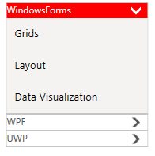
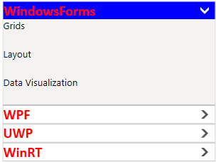
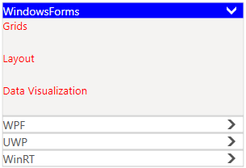
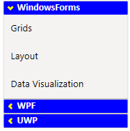
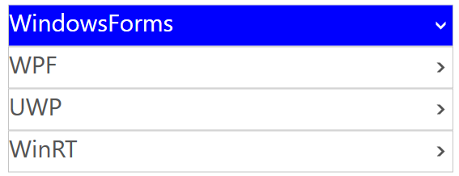
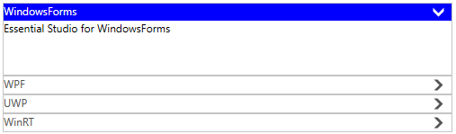
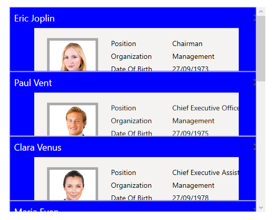

## Applying Accent Colors

SfAccordion support accent colors to highlight the hot spots of the control. You can customize the accent colors using [AccentBrush](https://help.syncfusion.com/cr/cref_files/wpf/Syncfusion.SfAccordion.WPF~Syncfusion.Windows.Controls.Layout.SfAccordion~AccentBrush.html) property.



<syncfusion:SfAccordion x:Name="accordion"  AccentBrush="Red"  HorizontalAlignment="Center" VerticalAlignment="Center"/>


accordion.AccentBrush = new SolidColorBrush() { Color = Windows.UI.Colors.Red };



## Accordion Header Style

You can customize the appearance of SfAccordionItem header by setting the [HeaderTemplate](https://help.syncfusion.com/cr/wpf/Syncfusion.SfAccordion.WPF~Syncfusion.Windows.Controls.Layout.SfAccordion~HeaderTemplate.html) of SfAccordion.



<syncfusion:SfAccordion HorizontalAlignment="Center" Height="250"  VerticalAlignment="Center" Width="300">
	<!-- For customizinng header -->
	<syncfusion:SfAccordion.HeaderTemplate>
		<DataTemplate>
			<TextBlock Text="{Binding}" Foreground="Red" Opacity="1" FontFamily="Calibri" FontWeight="Bold" FontSize="20"/>
		</DataTemplate>
	</syncfusion:SfAccordion.HeaderTemplate>
	<syncfusion:SfAccordionItem Header="WindowsForms"/>
	<syncfusion:SfAccordionItem Header="WPF"/>
	<syncfusion:SfAccordionItem Header="UWP"/>
	<syncfusion:SfAccordionItem Header="WinRT"/>
</syncfusion:SfAccordion>



## AccordionItem Style

You can customize the appearance of SfAccordionItem content by setting [ItemContainerStyle](https://help.syncfusion.com/cr/wpf/Syncfusion.SfAccordion.WPF~Syncfusion.Windows.Controls.Layout.SfAccordion~ItemContainerStyle.html) property of SfAccordion.



<syncfusion:SfAccordion  Width="300"  HorizontalAlignment="Center" VerticalAlignment="Center">
	<syncfusion:SfAccordion.ItemContainerStyle>
		
	</syncfusion:SfAccordion.ItemContainerStyle>
	<syncfusion:SfAccordionItem Header="WPF" Content="Essential Studio for WPF"/>
	<syncfusion:SfAccordionItem Header="Silverlight" Content="Essential Studio for Silverlight"/>
	<syncfusion:SfAccordionItem Header="WinRT" Content="Essential Studio for WinRT"/>
	<syncfusion:SfAccordionItem Header="Windows Phone" Content="Essential Studio for Windows Phone"/>
	<syncfusion:SfAccordionItem Header="Universal"  Content="Essential Studio for Universal"/>
</syncfusion:SfAccordion>



## Accordion Expander Style

You can customize the appearance of expander button by writing the style of TargetType [AccordionButton](https://help.syncfusion.com/cr/wpf/Syncfusion.SfAccordion.WPF~Syncfusion.Windows.Controls.Layout.AccordionButton.html), the edited style can be applied to accordion item by setting [AccordionButtonStyle](https://help.syncfusion.com/cr/wpf/Syncfusion.SfAccordion.WPF~Syncfusion.Windows.Controls.Layout.SfAccordionItem~AccordionButtonStyle.html) property of SfAccordionItem.



<Window.Resources>
    <!--  AccordionButton Style -->
	
</Window.Resources>

<!--SfAccordion Control -->
<syncfusion:SfAccordion x:Name="accordion1" HorizontalAlignment="Right" VerticalAlignment="Center" Width="180">
    <syncfusion:SfAccordionItem Header="WindowsForms" AccordionButtonStyle="{StaticResource expanderButtonStyle}">
		<Grid  Background="#FFF4F3F2">
			<Grid.RowDefinitions>
	    		<RowDefinition Height="40"/>
				<RowDefinition Height="40"/>
				<RowDefinition Height="40"/>
			</Grid.RowDefinitions>
			<TextBlock Text="Grids" Margin="10,10,10,2" FontSize="13.333" Grid.Row="0"/>
			<TextBlock Text="Layout" Margin="10,10,10,2" FontSize="13.333" Grid.Row="1"/>
			<TextBlock Text="Data Visualization" Margin="10,10,10,2" FontSize="13.333" Grid.Row="2"/>
		</Grid>
    </syncfusion:SfAccordionItem>
	<syncfusion:SfAccordionItem Header="WPF" AccordionButtonStyle="{StaticResource expanderButtonStyle}">
		<Grid  Background="#FFF4F3F2">
			<Grid.RowDefinitions>
				<RowDefinition Height="40"/>
				<RowDefinition Height="40"/>
				<RowDefinition Height="40"/>
			</Grid.RowDefinitions>
		    <TextBlock Text="Grids" Margin="10,10,10,2" FontSize="13.333" Grid.Row="0"/>
		    <TextBlock Text="Layout" Margin="10,10,10,2" FontSize="13.333" Grid.Row="1"/>
		    <TextBlock Text="Data Visualization" Margin="10,10,10,2" FontSize="13.333" Grid.Row="2"/>
		</Grid>
	</syncfusion:SfAccordionItem>
	<syncfusion:SfAccordionItem Header="UWP" AccordionButtonStyle="{StaticResource expanderButtonStyle}">
		<Grid  Background="#FFF4F3F2">
			<Grid.RowDefinitions>
				<RowDefinition Height="40"/>
				<RowDefinition Height="40"/>
				<RowDefinition Height="40"/>
			</Grid.RowDefinitions>
			<TextBlock Text="Grids" Margin="10,10,10,2" FontSize="13.333" Grid.Row="0"/>
			<TextBlock Text="Layout" Margin="10,10,10,2" FontSize="13.333" Grid.Row="1"/>
			<TextBlock Text="Data Visualization" Margin="10,10,10,2" FontSize="13.333" Grid.Row="2"/>
		</Grid>
	</syncfusion:SfAccordionItem>
</syncfusion:SfAccordion>



## AccordionItem Header Height Customization

You can customize the height of SfAccordionItem header by setting the [HeaderTemplate](https://help.syncfusion.com/cr/wpf/Syncfusion.SfAccordion.WPF~Syncfusion.Windows.Controls.Layout.SfAccordion~HeaderTemplate.html) of SfAccordion. 



<!-- For customizinng header -->		
<syncfusion:SfAccordion.HeaderTemplate>
	<DataTemplate>
		<TextBlock Text="{Binding Name}"  Height="50" FontSize="30"  VerticalAlignment="Center"/>
	</DataTemplate>
</syncfusion:SfAccordion.HeaderTemplate>



## AccordionItem Content Height Customization

You can customize the height of SfAccordionItem content by setting the [ContentTemplate](https://help.syncfusion.com/cr/wpf/Syncfusion.SfAccordion.WPF~Syncfusion.Windows.Controls.Layout.SfAccordion~ContentTemplate.html) of SfAccordion.



<!-- For customizinng SfAccordionItem content -->	
<syncfusion:SfAccordion.ContentTemplate>
	<DataTemplate>
		<TextBlock Text="{Binding Description}" Height="60"/>
	</DataTemplate>
</syncfusion:SfAccordion.ContentTemplate>



## Enable/ Disable the Animation Behaviour

You can enable or disable the animation behaviour when its item is expanded/collapsed. It can be achieved by editing the style in [ExpandableContentControl](https://help.syncfusion.com/cr/wpf/Syncfusion.SfAccordion.WPF~Syncfusion.Windows.Controls.Layout.ExpandableContentControl.html) and [SfAccordionItem](https://help.syncfusion.com/cr/wpf/Syncfusion.SfAccordion.WPF~Syncfusion.Windows.Controls.Layout.SfAccordionItem.html), the edited style can be applied by using ItemContainerStyle property of SfAccordion control.



<!-- ExpandableContentControl Style  -->

<!--  SfAccordionItem Style  -->

<!--SfAccordion Control -->
<syncfusion:SfAccordion x:Name="accordion1" HorizontalAlignment="Center" VerticalAlignment="Center"  ItemContainerStyle="{StaticResource Style1}" >
	<syncfusion:SfAccordionItem Header="WindowsForms">
		<Grid  Background="#FFF4F3F2">
			<Grid.RowDefinitions>
				<RowDefinition Height="40"/>
				<RowDefinition Height="40"/>
				<RowDefinition Height="40"/>
			</Grid.RowDefinitions>
			<TextBlock Text="Grids" Margin="10,10,10,2" FontSize="13.333" Grid.Row="0"/>
			<TextBlock Text="Layout" Margin="10,10,10,2" FontSize="13.333" Grid.Row="1"/>
			<TextBlock Text="Data Visualization" Margin="10,10,10,2" FontSize="13.333" Grid.Row="2"/>
		</Grid>
	</syncfusion:SfAccordionItem>
	<syncfusion:SfAccordionItem Header="WPF">
		<Grid  Background="#FFF4F3F2">
			<Grid.RowDefinitions>
				<RowDefinition Height="40"/>
				<RowDefinition Height="40"/>
				<RowDefinition Height="40"/>
			</Grid.RowDefinitions>
			<TextBlock Text="Grids" Margin="10,10,10,2" FontSize="13.333" Grid.Row="0"/>
			<TextBlock Text="Layout" Margin="10,10,10,2" FontSize="13.333" Grid.Row="1"/>
			<TextBlock Text="Data Visualization" Margin="10,10,10,2" FontSize="13.333" Grid.Row="2"/>
		</Grid>
	</syncfusion:SfAccordionItem>
	<syncfusion:SfAccordionItem Header="UWP"">
		<Grid  Background="#FFF4F3F2">
			<Grid.RowDefinitions>
				<RowDefinition Height="40"/>
				<RowDefinition Height="40"/>
				<RowDefinition Height="40"/>
			</Grid.RowDefinitions>
			<TextBlock Text="Grids" Margin="10,10,10,2" FontSize="13.333" Grid.Row="0"/>
			<TextBlock Text="Layout" Margin="10,10,10,2" FontSize="13.333" Grid.Row="1"/>
			<TextBlock Text="Data Visualization" Margin="10,10,10,2" FontSize="13.333" Grid.Row="2"/>
		</Grid>
	</syncfusion:SfAccordionItem>
</syncfusion:SfAccordion>



 N> In this Animation behaviour, [TargetSize](https://help.syncfusion.com/cr/cref_files/wpf/Syncfusion.SfAccordion.WPF~Syncfusion.Windows.Controls.Layout.ExpandableContentControl~TargetSize.html) and [Percentage](https://help.syncfusion.com/cr/wpf/Syncfusion.SfAccordion.WPF~Syncfusion.Windows.Controls.Layout.ExpandableContentControl~Percentage.html) properties are used for animate the size.

 