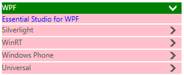
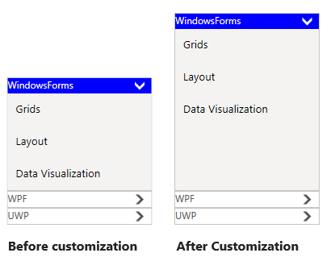

# Applying Accent Colors

SfAccordion support accent colors to highlight the hot spots of the control. You can customize the accent colors using [AccentBrush](https://help.syncfusion.com/cr/cref_files/wpf/Syncfusion.SfAccordion.WPF~Syncfusion.Windows.Controls.Layout.SfAccordion~AccentBrush.html) property.



<syncfusion:SfAccordion x:Name="accordion"  AccentBrush="Red"  HorizontalAlignment="Center" VerticalAlignment="Center"/>


accordion.AccentBrush = new SolidColorBrush() { Color = Windows.UI.Colors.Red };



## AccordionItem Style

You can customize the appearence of accordion item by writing the style of TargetType [SfAccordionItem](https://help.syncfusion.com/cr/wpf/Syncfusion.SfAccordion.WPF~Syncfusion.Windows.Controls.Layout.SfAccordionItem.html), the edited style can be applied to SfAccordion control by setting SfAccordion.[ItemContainerStyle](https://help.syncfusion.com/cr/wpf/Syncfusion.SfAccordion.WPF~Syncfusion.Windows.Controls.Layout.SfAccordion~ItemContainerStyle.html) property.



<syncfusion:SfAccordion  Width="300" AccentBrush="Green" HorizontalAlignment="Center" VerticalAlignment="Center">
	<syncfusion:SfAccordion.ItemContainerStyle>
		
	</syncfusion:SfAccordion.ItemContainerStyle>
	<syncfusion:SfAccordionItem Header="WPF" Content="Essential Studio for WPF"/>
	<syncfusion:SfAccordionItem Header="Silverlight" Content="Essential Studio for Silverlight"/>
	<syncfusion:SfAccordionItem Header="WinRT" Content="Essential Studio for WinRT"/>
	<syncfusion:SfAccordionItem Header="Windows Phone" Content="Essential Studio for Windows Phone"/>
	<syncfusion:SfAccordionItem Header="Universal"  Content="Essential Studio for Universal"/>
</syncfusion:SfAccordion>



## Accordion Expander Style

You can customize the appearence of expander button by writing the style of TargetType [AccordionButton](https://help.syncfusion.com/cr/wpf/Syncfusion.SfAccordion.WPF~Syncfusion.Windows.Controls.Layout.AccordionButton.html), the edited style can be applied to accordion item by setting [AccordionButtonStyle](https://help.syncfusion.com/cr/wpf/Syncfusion.SfAccordion.WPF~Syncfusion.Windows.Controls.Layout.SfAccordionItem~AccordionButtonStyle.html) property.



<Window.Resources>
    <!--  AccordionButton Style -->
	
</Window.Resources>

<!--SfAccordion Control -->
<syncfusion:SfAccordion x:Name="accordion2" HorizontalAlignment="Right" AccentBrush="Red" VerticalAlignment="Center" Width="180">
    <syncfusion:SfAccordionItem Header="WindowsForms" AccordionButtonStyle="{StaticResource expanderButtonStyle}">
		<Grid  Background="#FFF4F3F2">
			<Grid.RowDefinitions>
	    		<RowDefinition Height="40"/>
				<RowDefinition Height="40"/>
				<RowDefinition Height="40"/>
			</Grid.RowDefinitions>
			<TextBlock Text="Grids" Margin="10,10,10,2" FontSize="13.333" Grid.Row="0"/>
			<TextBlock Text="Layout" Margin="10,10,10,2" FontSize="13.333" Grid.Row="1"/>
			<TextBlock Text="Data Visualization" Margin="10,10,10,2" FontSize="13.333" Grid.Row="2"/>
		</Grid>
    </syncfusion:SfAccordionItem>
	<syncfusion:SfAccordionItem Header="WPF" AccordionButtonStyle="{StaticResource expanderButtonStyle}">
		<Grid  Background="#FFF4F3F2">
			<Grid.RowDefinitions>
				<RowDefinition Height="40"/>
				<RowDefinition Height="40"/>
				<RowDefinition Height="40"/>
			</Grid.RowDefinitions>
		    <TextBlock Text="Grids" Margin="10,10,10,2" FontSize="13.333" Grid.Row="0"/>
		    <TextBlock Text="Layout" Margin="10,10,10,2" FontSize="13.333" Grid.Row="1"/>
		    <TextBlock Text="Data Visualization" Margin="10,10,10,2" FontSize="13.333" Grid.Row="2"/>
		</Grid>
	</syncfusion:SfAccordionItem>
	<syncfusion:SfAccordionItem Header="UWP" AccordionButtonStyle="{StaticResource expanderButtonStyle}">
		<Grid  Background="#FFF4F3F2">
			<Grid.RowDefinitions>
				<RowDefinition Height="40"/>
				<RowDefinition Height="40"/>
				<RowDefinition Height="40"/>
			</Grid.RowDefinitions>
			<TextBlock Text="Grids" Margin="10,10,10,2" FontSize="13.333" Grid.Row="0"/>
			<TextBlock Text="Layout" Margin="10,10,10,2" FontSize="13.333" Grid.Row="1"/>
			<TextBlock Text="Data Visualization" Margin="10,10,10,2" FontSize="13.333" Grid.Row="2"/>
		</Grid>
	</syncfusion:SfAccordionItem>
</syncfusion:SfAccordion>



## AccordionItem Content Style

You can customize the content control in expanded state by writing the style of TargetType [ExpandableContentControl](https://help.syncfusion.com/cr/wpf/Syncfusion.SfAccordion.WPF~Syncfusion.Windows.Controls.Layout.ExpandableContentControl.html), the edited style can be applied to accordion item by setting [ExpandableContentControlStyle](https://help.syncfusion.com/cr/wpf/Syncfusion.SfAccordion.WPF~Syncfusion.Windows.Controls.Layout.SfAccordionItem~ExpandableContentControlStyle.html) property.



<Window.Resources>
    <!-- ExpandableContentControl Style  -->
	
</Window.Resources>

<!--SfAccordion Control -->
<syncfusion:SfAccordion x:Name="accordion1" SelectionMode="OneOrMore"  HorizontalAlignment="Center"  VerticalAlignment="Center" Width="180">
	<syncfusion:SfAccordionItem Header="WindowsForms" ExpandableContentControlStyle="{StaticResource expandableContentStyle}">
		<Grid  Background="#FFF4F3F2">
			<Grid.RowDefinitions>
				<RowDefinition Height="40"/>
				<RowDefinition Height="40"/>
				<RowDefinition Height="40"/>
			</Grid.RowDefinitions>
			<TextBlock Text="Grids" Margin="10,10,10,2" FontSize="13.333" Grid.Row="0"/>
			<TextBlock Text="Layout" Margin="10,10,10,2" FontSize="13.333" Grid.Row="1"/>
			<TextBlock Text="Data Visualization" Margin="10,10,10,2" FontSize="13.333" Grid.Row="2"/>
		</Grid>
	</syncfusion:SfAccordionItem>
	<syncfusion:SfAccordionItem Header="WPF">
		<Grid  Background="#FFF4F3F2">
			<Grid.RowDefinitions>
				<RowDefinition Height="40"/>
				<RowDefinition Height="40"/>
				<RowDefinition Height="40"/>
			</Grid.RowDefinitions>
			<TextBlock Text="Grids" Margin="10,10,10,2" FontSize="13.333" Grid.Row="0"/>
			<TextBlock Text="Layout" Margin="10,10,10,2" FontSize="13.333" Grid.Row="1"/>
			<TextBlock Text="Data Visualization" Margin="10,10,10,2" FontSize="13.333" Grid.Row="2"/>
		</Grid>
	</syncfusion:SfAccordionItem>
	<syncfusion:SfAccordionItem Header="UWP">
		<Grid  Background="#FFF4F3F2">
			<Grid.RowDefinitions>
				<RowDefinition Height="40"/>
				<RowDefinition Height="40"/>
				<RowDefinition Height="40"/>
			</Grid.RowDefinitions>
	    	<TextBlock Text="Grids" Margin="10,10,10,2" FontSize="13.333" Grid.Row="0"/>
		    <TextBlock Text="Layout" Margin="10,10,10,2" FontSize="13.333" Grid.Row="1"/>
			<TextBlock Text="Data Visualization" Margin="10,10,10,2" FontSize="13.333" Grid.Row="2"/>
		</Grid>
	</syncfusion:SfAccordionItem>
</syncfusion:SfAccordion>



