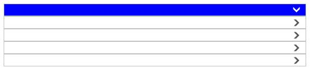
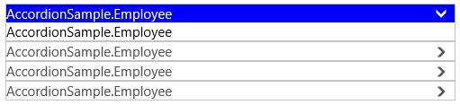

# Populating Items

`SfAccordionItem` are added as items of `SfAccordion`. Items can be added using `Items` or `ItemSource` property.

## Using Items

SfAccordion accepts `SfAccordionItem` as its children when added directly.

### Adding items to the control

Here five SfAccordionItems are added as the children of the `SfAccordion`.





    <layout:SfAccordion>

    <layout:SfAccordionItem/>

    <layout:SfAccordionItem/>

    <layout:SfAccordionItem/>

    <layout:SfAccordionItem/>

    <layout:SfAccordionItem/>

    </layout:SfAccordion>









    SfAccordion accordion = new SfAccordion();

    accordion.Items.Add(new SfAccordionItem());

    accordion.Items.Add(new SfAccordionItem());

    accordion.Items.Add(new SfAccordionItem());

    accordion.Items.Add(new SfAccordionItem());

    accordion.Items.Add(new SfAccordionItem());





    Dim accordion As New SfAccordion()

    accordion.Items.Add(New SfAccordionItem())

    accordion.Items.Add(New SfAccordionItem())

    accordion.Items.Add(New SfAccordionItem())

    accordion.Items.Add(New SfAccordionItem())

    accordion.Items.Add(New SfAccordionItem())





### Setting Header for items

`SfAccordionItem` provides a property `Header` that helps to set the header for the item. `Header` is visible in both expanded and collapsed state. Set the value as “WPF” for the first child and repeat the same procedure for the remaining children with values as “Silverlight”, “WinRT”, ”Windows Phone” and “Universal”.





    <layout:SfAccordion>

    <layout:SfAccordionItem Header="WPF"/>

    <layout:SfAccordionItem Header="Silverlight"/>

    <layout:SfAccordionItem Header="WinRT"/>

    <layout:SfAccordionItem Header="Windows Phone"/>

    <layout:SfAccordionItem Header="Universal"/>

    </layout:SfAccordion>









    SfAccordion accordion = new SfAccordion();

    accordion.Items.Add(new SfAccordionItem() { Header = "WPF" });

    accordion.Items.Add(new SfAccordionItem() { Header = "Silverlight" });

    accordion.Items.Add(new SfAccordionItem() { Header = "WinRT" });

    accordion.Items.Add(new SfAccordionItem() { Header = "Windows Phone" });

    accordion.Items.Add(new SfAccordionItem() { Header = "Universal" });





    Dim accordion As New SfAccordion()

    accordion.Items.Add(New SfAccordionItem() With {.Header = "WPF"})

    accordion.Items.Add(New SfAccordionItem() With {.Header = "Silverlight"})

    accordion.Items.Add(New SfAccordionItem() With {.Header = "WinRT"})

    accordion.Items.Add(New SfAccordionItem() With {.Header = "Windows Phone"})

    accordion.Items.Add(New SfAccordionItem() With {.Header = "Universal"})





`SfAccordion` control is populated as follows:

### Setting Content for items

`Content` property helps to set the content for `SfAccordionItem`. `SfAccordionItem` is a ContentControl so that any object can be added as its content. Content is visible only in expanded state.





    <layout:SfAccordion>

    <layout:SfAccordionItem Header="WPF" Content="Essential Studio for WPF"/>

    <layout:SfAccordionItem Header="Silverlight" Content="Essential Studio for Silverlight"/>

    <layout:SfAccordionItem Header="WinRT" Content="Essential Studio for WinRT"/>

    <layout:SfAccordionItem Header="Windows Phone" Content="Essential Studio for Windows Phone"/>

    <layout:SfAccordionItem Header="Universal" Content="Essential Studio for Universal"/>

    </layout:SfAccordion>









    SfAccordion accordion = new SfAccordion();

    accordion.Items.Add(new SfAccordionItem() { Header = "WPF", Content = "Essential Studio for WPF" });

    accordion.Items.Add(new SfAccordionItem() { Header = "Silverlight" , Content = "Essential Studio for Silverlight"});

    accordion.Items.Add(new SfAccordionItem() { Header = "WinRT", Content = "Essential Studio for WinRT" });

    accordion.Items.Add(new SfAccordionItem() { Header = "Windows Phone" , Content = "Essential Studio for Windows Phone"});

    accordion.Items.Add(new SfAccordionItem() { Header = "Universal" , Content = "Essential Studio for Universal"});





    Dim accordion As New SfAccordion()

    accordion.Items.Add(New SfAccordionItem() With {
        .Header = "WPF",
        .Content = "Essential Studio for WPF"
    })

    accordion.Items.Add(New SfAccordionItem() With {
        .Header = "Silverlight",
        .Content = "Essential Studio for Silverlight"
    })

    accordion.Items.Add(New SfAccordionItem() With {
        .Header = "WinRT",
        .Content = "Essential Studio for WinRT"
    })

    accordion.Items.Add(New SfAccordionItem() With {
        .Header = "Windows Phone",
        .Content = "Essential Studio for Windows Phone"
    })

    accordion.Items.Add(New SfAccordionItem() With {
        .Header = "Universal",
        .Content = "Essential Studio for Universal"
    })





## Using ItemsSource

SfAccordion accepts any business object collection to be bound to its ItemsSource property. 

### Adding items to the control

Follow the below steps to add the Items through ItemsSource property.

1.Create a model





    public class Employee
    {
    public string Name { get; set; }

    public string Description { get; set; }
    }





    Public Class Employee
    Public Property Name() As String

    Public Property Description() As String
    End Class





2.Create a collection of model





    private List<Employee> employees;

    public List<Employee> Employees
    {
        
    get { return employees; }

    set { employees = value; }

    }





    Private employees_Renamed As List(Of Employee)

    Public Property Employees() As List(Of Employee)

    Get
        Return employees_Renamed
    End Get

    Set(ByVal value As List(Of Employee))
        employees_Renamed = value
    End Set

    End Property





3.Populate the collection





    Employees = new List<Employee>();

    Employees.Add(new Employee() { Name = "James", Description = "Description about James" });

    Employees.Add(new Employee() { Name = "Linda", Description = "Description about Linda" });

    Employees.Add(new Employee() { Name = "Carl", Description = "Description about Carl" });

    Employees.Add(new Employee() { Name = "Niko", Description = "Description about Niko" });





    Employees = New List(Of Employee)()

    Employees.Add(New Employee() With {
        .Name = "James",
        .Description = "Description about James"
    })

    Employees.Add(New Employee() With {
        .Name = "Linda",
        .Description = "Description about Linda"
    })

    Employees.Add(New Employee() With {
        .Name = "Carl",
        .Description = "Description about Carl"
    })

    Employees.Add(New Employee() With {
        .Name = "Niko",
        .Description = "Description about Niko"
    })





4.Bind the Employees collection to `ItemsSource` property of `SfAccordion` Control





    <layout:SfAccordion ItemsSource="{Binding Employees}"/>





`SfAccordion` control is populated as follows:

### Setting Header for items

Header can be displayed using the property `DisplayMemberPath`. This property is used to get the header from Model class. Header is visible in both expanded and collapsed state. 





    <layout:SfAccordion ItemsSource="{Binding Employees}" DisplayMemberPath="Name"/>





`HeaderTemplate` property can also be used to display the header. `HeaderTemplateSelector` property is also provided to apply header template based on the selection logic. 





    <layout:SfAccordion ItemsSource="{Binding Employees}">

    <layout:SfAccordion.HeaderTemplate>

    <DataTemplate>

    <TextBlock Text="{Binding Name}"/>

    </DataTemplate>

    </layout:SfAccordion.HeaderTemplate>

    </layout:SfAccordion>





### Setting Content for items

Content can be displayed using the `ContentTemplate` property. Content is visible only in the expanded state.`ContentTemplateSelector` property is also provided to apply content template based on the selection logic.





    <layout:SfAccordion ItemsSource="{Binding Employees}" DisplayMemberPath="Name">

    <layout:SfAccordion.ContentTemplate>

    <DataTemplate>

    <TextBlock Text="{Binding Description}"/>

    </DataTemplate>

    </layout:SfAccordion.ContentTemplate>

    </layout:SfAccordion>





### Properties

User can customize the `SfAccordion` control based on needs by using the following properties.

<table>
<tr>
<th>
Property </th><th>
Description </th><th>
<tr>
<td>
TargetSize</td><td>
Gets or sets the desired size of the ExpandableContentControl content.</td><td>
<tr>
<td>
Percentage</td><td>
Sets the relative percentage of the content that is currently visible. Use the percentage property to animate to this size.</td><td>
<tr>
<td>
AccordionButtonStyle</td><td>
Sets the Style used by AccordionButton.</td><td>
<tr>
<td>
ExpandableContentControlStyle</td><td>
Sets the Style used by ExpandableContentControl.</td><td>
<tr>
<td>
ItemContainerStyle</td><td>
Sets the Style that is applied to the container element.</td><td>
</table>

Here we have provided the animation option, following code example demonstrates the same.

*Step 1:* Provide customization in SfAccordionItem





 <!--  SfAccordionItem Style  -->
 





*Step 2:* Apply the Style to SfAccordion using ItemContainerStyle





 <!-- SfAccordion Control -->

 <layout:SfAccordion x:Name="accordion1"  HorizontalAlignment="Center" VerticalAlignment="Center"  ItemContainerStyle="{StaticResource Style1}" >
 <layout:SfAccordionItem Header="WindowsForms">
 <Grid  Background="#FFF4F3F2">
 <Grid.RowDefinitions>
 <RowDefinition Height="40"/>
 <RowDefinition Height="40"/>
 <RowDefinition Height="40"/>
 </Grid.RowDefinitions>
 <TextBlock Text="Grids" Margin="10,10,10,2" FontSize="13.333" Grid.Row="0"/>
 <TextBlock Text="Layout" Margin="10,10,10,2" FontSize="13.333" Grid.Row="1"/>
 <TextBlock Text="Data Visualization" Margin="10,10,10,2"  FontSize="13.333" Grid.Row="2"/>
 </Grid>
 </layout:SfAccordionItem>
 <layout:SfAccordionItem Header="WPF">
 <Grid  Background="#FFF4F3F2">
 <Grid.RowDefinitions>
 <RowDefinition Height="40"/> 
 <RowDefinition Height="40"/>
 <RowDefinition Height="40"/>
 </Grid.RowDefinitions>
 <TextBlock Text="Grids" Margin="10,10,10,2" FontSize="13.333" Grid.Row="0"/>
 <TextBlock Text="Layout" Margin="10,10,10,2" FontSize="13.333" Grid.Row="1"/>
 <TextBlock Text="Data Visualization" Margin="10,10,10,2" FontSize="13.333" Grid.Row="2"/>
 </Grid>
 </layout:SfAccordionItem>
 <layout:SfAccordionItem Header="UWP">
 <Grid  Background="#FFF4F3F2">
 <Grid.RowDefinitions>
 <RowDefinition Height="40"/>
 <RowDefinition Height="40"/>
 <RowDefinition Height="40"/>
 </Grid.RowDefinitions>
 <TextBlock Text="Grids" Margin="10,10,10,2" FontSize="13.333" Grid.Row="0"/>
 <TextBlock Text="Layout" Margin="10,10,10,2" FontSize="13.333" Grid.Row="1"/>
 <TextBlock Text="Data Visualization" Margin="10,10,10,2" FontSize="13.333" Grid.Row="2"/>
 </Grid>
 </layout:SfAccordionItem>
 </layout:SfAccordion>




