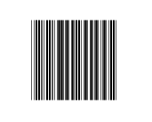
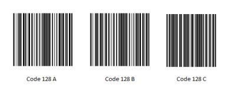
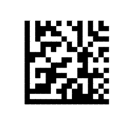

## Barcode Symbols

Barcode control supports 10 one dimensional (linear) and 2 two dimensional types. The complete list follows:

### 1D Bar codes

* Code 39
* Code 39 Extended
* Code 11
* Codabar
* Code 32
* Code 93
* Code 93Extended
* Code 128A
* Code 128B
* Code 128C

Code 39

The Code 39 character set includes the digits 0-9, the letters A-Z (upper case only), and the following symbols: space, minus (-), plus (+), period (.), dollar sign ($), slash (/), and percent (%). A special start / stop character is placed at the beginning and end of each barcode. The barcode may be of any length, although more than 25 characters really begin to push the bounds. Code 39 is just about the only type of barcode in common use that does not require a checksum.

Extended Code 39

Code 39 Extended is an extended version of Code 39 that supports the ASCII character set. So with Code 39 Extended, you can also code the 26 lower letters (a-z) and the special characters you have on your keyboard.

{  | markdownify }
{:.image }

Code 11

Code 11 is used primarily for labeling telecommunications equipment. The character set includes the digits 0 to 9, a dash ( - ), and a start / stop code. Each character is encoded with three bars and two spaces. Of these five elements, there may be two wide and three narrow elements, or one wide and four narrow elements.

{  | markdownify }
{:.image }

Codabar

Codabar is a variable length symbol that performs encoding of the following 20 characters:

* 0123456789-$:/.+ABCD.

Codabar uses the characters, A, B, C and D, only as start and stop characters. It is used in libraries, blood banks, the overnight package delivery industry, and a variety of other information processing applications.

{  | markdownify }
{:.image }

Code 32

Code32 is mainly used for coding pharmaceuticals, cosmetics and dietetics. It has the following structure:

* 'A' character (ASCII 65), which is not really encoded
* 8 digits for Pharmacode (It generally begins / is prefixed with 0)
* 1 digit for Checksum module 10, which is automatically calculated

{  | markdownify }
{:.image }

Code 93

Code 93 was designed to complement and improve upon Code 39. It can represent the full ASCII character set by using combinations of 2 characters. It is a continuous, variable-length symbol and produces denser code.

* The Standard Mode (default implementation) can encode uppercase letters (A through Z), digits (0 through 9), and special characters like the *, -, $, %, (Space), ., /, and +.
* The Full ASCII Mode or Extended Version can encode all 128 ASCII characters.

The asterisk (*) is not a true encode character, but is the start and stop symbol for Code 93.

{  | markdownify }
{:.image }

Code 128

Code 128 is a variable length, high density, alphanumeric, linear bar code symbol, capable of encoding full 128-character ASCII character set and extended character sets. This symbol includes a checksum digit for verification, and the bar code may also be verified character-by-character verifying the parity of each data byte.

Code 128 Code Sets

* Code Set A (or Chars Set A) includes all of the standard upper case U.S. alphanumeric keyboard characters and punctuation characters together with the control characters, (i.e. characters with ASCII values from 0 to 95 inclusive), and seven special characters.
* Code Set B (or Chars Set B) includes all of the standard upper case alphanumeric keyboard characters and punctuation characters together with the lower case alphabetic characters (i.e. characters with ASCII values from 32 to 127 inclusive), and seven special characters.
* Code Set C (or Chars Set C) includes the set of 100 digit pairs from 00 to 99 inclusive, as well as three special characters. This allows numeric data to be encoded as two data digits per symbol character, at effectively twice the density of standard data.

Code 128 Special characters

The last seven characters of Code Sets A and B (character values 96 - 102) and the last three characters of Code Set C (character values 100 - 102) are special non-data characters with no ASCII character equivalents, which have particular significance to the bar code reading device.

> _Note: When you specify that the data must be encoded by using Char Set C, then the number of characters after it must be even._

{  | markdownify }
{:.image }

The following code example shows how to create a code39 barcode from XAML:

[XAML]

&lt;sync:SfBarcode x:Name="barcode" Text="http://www.syncfusion.com" Symbology="Code39"&gt;

&lt;/sync:SfBarcode&gt;

> _Note: When a barcode control is shown empty, it means that an invalid or supported character is given as input. In such cases, we recommend the user to validate the input text for that specific barcode._

### 2D Bar codes

* QR code
* Data Matrix

QR bar code

QR bar code is a two dimensional barcode which is of popular use in automotive industry. It is known for fast readability and greater storage capacity. The user can set the data to the Text property to encode and render them in the control. The text can be either Numeric or AlphaNumeric or Binary which is chosen by the InputMode property. It can be encoded using any of the available 40 versions of QR code which can be set using Version property. The ErrorCorrectionLevel property helps to select a level among the four levels Low, Medium, Quartile and High.

{  | markdownify }
{:.image }

Data Matrix

DataMatrix bar codes are widely used in printed media such as labels and letters. It can be read easily by a bar code reader and also by mobile phones. It is a two dimensional barcode that consists of a grid of dark and light dots or blocks forming square or rectangular symbol. The data encoded in the barcode can either be number or alphanumeric.

> _Note: By default, the width of the quiet zone on all four sides of the barcode is equal to the dimension of the blocks._

{  | markdownify }
{:.image }

The symbol can be chosen using the dependency property Symbology. Here is the equivalent code sample:

[XAML]

&lt;sync:SfBarcode x:Name="barcode" Text="http://www.syncfusion.com" Symbology="QRBarcode"&gt;

&lt;/sync:SfBarcode&gt;

