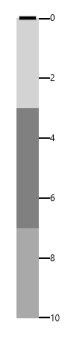
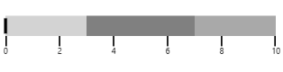
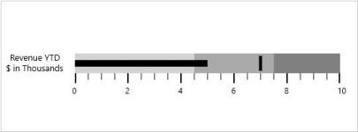
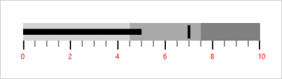
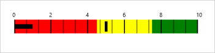

# Concept and Features

## Orientation

The view of the Bullet Graph is changed by setting the Orientation property. Quantitative scale contains two major components: ticks and labels. The length of the quantitative scale is customized by using the QuantitativeScaleLength property. The direction of the quantitative scale is personalized by making use of the FlowDirection property it’s either Forward or Backward.

[XAML]

  <syncfusion:SfBulletGraph Orientation="Vertical"   FlowDirection="Forward"

                                  QualitativeRangesSize="30" 

                                  QuantitativeScaleLength="400"

                                  Minimum="0" Maximum="10" Interval="2" >

            <syncfusion:SfBulletGraph.QualitativeRanges>

                <syncfusion:QualitativeRange RangeEnd="3" 

                                             RangeStroke="LightGray"

                                             RangeOpacity="1">

                </syncfusion:QualitativeRange>

                <syncfusion:QualitativeRange RangeEnd="7" 

                                             RangeStroke="Gray"

                                             RangeOpacity="1">

                </syncfusion:QualitativeRange>

                <syncfusion:QualitativeRange RangeEnd="10" 

                                             RangeStroke="DarkGray"

                                             RangeOpacity="1">

                </syncfusion:QualitativeRange>

            </syncfusion:SfBulletGraph.QualitativeRanges>

        </syncfusion:SfBulletGraph>



[C#]

            SfBulletGraph bulletgraph = new SfBulletGraph();

            bulletgraph.FlowDirection = BulletGraphFlowDirection.Forward;

            bulletgraph.Orientation = Orientation.Vertical;

            bulletgraph.QualitativeRangesSize = 30;

            bulletgraph.QuantitativeScaleLength = 400;

            bulletgraph.Minimum = 0;

            bulletgraph.Maximum = 10;

            bulletgraph.Interval = 2;

            bulletgraph.QualitativeRanges.Add(new QualitativeRange() { RangeEnd = 3, RangeOpacity = 1, RangeStroke = new SolidColorBrush(Colors.LightGray) });

            bulletgraph.QualitativeRanges.Add(new QualitativeRange() { RangeEnd = 7, RangeOpacity = 1, RangeStroke = new SolidColorBrush(Colors.Gray) });

            bulletgraph.QualitativeRanges.Add(new QualitativeRange() { RangeEnd = 10, RangeOpacity = 1, RangeStroke = new SolidColorBrush(Colors.DarkGray) });

            this.Grid.Children.Add(bulletgraph);



## Caption Settings

The Caption for a Bullet Graph is used to specify a unique label describing the value represented. 

[XAML]

         <syncfusion:SfBulletGraph Orientation="Horizontal"  Minimum="0" Maximum="10" Interval="2"  FlowDirection="Forward"

                                  QualitativeRangesSize="30"

                                  QuantitativeScaleLength="400">

            <syncfusion:SfBulletGraph.Caption>

                <StackPanel Margin="0,0,10,0">

                    <TextBlock Text="Revenue YTD" Foreground="Black"

                               FontSize="13" HorizontalAlignment="Center"/>

                    <TextBlock Text="$ in Thousands" Foreground="Black"

                               FontSize="13" HorizontalAlignment="Center"/>

                </StackPanel>

            </syncfusion:SfBulletGraph.Caption>

</syncfusion:SfBulletGraph>




[C#]

            SfBulletGraph bulletgraph = new SfBulletGraph();

            bulletgraph.FlowDirection = BulletGraphFlowDirection.Forward;

            bulletgraph.Orientation   = Orientation.Horizontal;

            bulletgraph.Minimum = 0;

            bulletgraph.Maximum = 10;

            bulletgraph.Interval = 2;

            bulletgraph.QualitativeRangesSize   = 30;

            bulletgraph.QuantitativeScaleLength = 400;

            TextBlock _textBlock   = new TextBlock() { Text = "Revenue YTD" };

            TextBlock _textBlock1  = new TextBlock() { Text = "$ in Thousands" };

            StackPanel _stackPanel = new StackPanel();

            _stackPanel.Children.Add(_textBlock);

            _stackPanel.Children.Add(_textBlock1);

            bulletgraph.Caption    = _stackPanel;

            this.Grid.Children.Add(bulletgraph);



## Caption Position

The caption in the Bullet Graph can be placed in the start or end of the quantitative scale by choosing from one of the two options available in the CaptionPosition property. They are:

1. Near (Default)
2. Far

### Code Example


[XAML]

    <syncfusion:SfBulletGraph Orientation="Horizontal" FlowDirection="Forward" Minimum="0" Maximum="10" Interval="2"  

                              QualitativeRangesSize="30" 

                              QuantitativeScaleLength="400"                              

                              FeaturedMeasure="5" 

                              FeaturedMeasureBarStroke="Red" 

                              FeaturedMeasureBarStrokeThickness="10"

                              ComparativeMeasureSymbolStroke="Black"

                              LabelOffset="5" LabelStroke="Black"

                              CaptionPosition="Far">

    </syncfusion:SfBulletGraph>




[C#]

SfBulletGraph bulletgraph = new SfBulletGraph();

      bulletgraph.FlowDirection = BulletGraphFlowDirection.Forward;

      bulletgraph.Orientation = Orientation.Horizontal;

      bulletgraph.QualitativeRangesSize = 30;

      bulletgraph.QuantitativeScaleLength = 400;

      bulletgraph.FeaturedMeasure = 5;

      bulletgraph.FeaturedMeasureBarStroke = new SolidColorBrush(Colors.Black);

      bulletgraph.FeaturedMeasureBarStrokeThickness = 10;

      bulletgraph.ComparativeMeasureSymbolStroke = new SolidColorBrush(Colors.Black);

      bulletgraph.LabelOffset = 5;

      bulletgraph.LabelStroke = new SolidColorBrush(Colors.Black);

      bulletgraph.CaptionPosition = BulletGraphCaptionPosition.Far;

      this.Grid.Children.Add(bulletgraph);



## Measure Settings (Performance/feature measure)

### Featured Measure:

Featured measure is used to display the primary data, or the current value of the data that you are measuring. It should usually be encoded as a bar, like the bar on a bar graph, and be prominent.

### Customizing Featured Measure:

The value of the featured measure of the Bullet Graph is set by the FeaturedMeasure property. By setting the FeaturedMeasureBarStroke property, the stroke of the feature measure bar can be customized. The thickness of the featured measure bar is modified by using FeaturedMeasureBarStrokeThickness.

### Code Example:

[XAML]

    <syncfusion:SfBulletGraph Orientation="Horizontal"  Minimum="0" Maximum="10" Interval="2"  FlowDirection="Forward" 

                              QualitativeRangesSize="30" 

                              QuantitativeScaleLength="400"                              

                              FeaturedMeasure="5" 

                              FeaturedMeasureBarStroke="Red" 

                              FeaturedMeasureBarStrokeThickness="10"

                              ComparativeMeasureSymbolStroke="Black"

                              LabelOffset="5" LabelStroke="Black"

                              CaptionPosition="Near">

    </syncfusion:SfBulletGraph>



[C#]

SfBulletGraph bulletgraph = new SfBulletGraph();

      bulletgraph.FlowDirection = BulletGraphFlowDirection.Forward;

      bulletgraph.Orientation = Orientation.Horizontal;

      bulletgraph.Minimum = 0;

      bulletgraph.Maximum = 10;

      bulletgraph.Interval = 2;

      bulletgraph.QualitativeRangesSize   = 30;

      bulletgraph.QuantitativeScaleLength = 400;

      bulletgraph.FeaturedMeasure = 5;

      bulletgraph.FeaturedMeasureBarStroke = new SolidColorBrush(Colors.Red);

      bulletgraph.FeaturedMeasureBarStrokeThickness = 10;

      bulletgraph.ComparativeMeasureSymbolStroke    = new SolidColorBrush(Colors.Black);

      bulletgraph.LabelOffset = 5;

      bulletgraph.LabelStroke  = new SolidColorBrush(Colors.Black);

      bulletgraph.CaptionPosition = BulletGraphCaptionPosition.Near;

      this.Grid.Children.Add(bulletgraph);



### Comparative Measure:

Comparative measure is less visually dominant than the featured measure. It is always encoded as a short line that runs perpendicular to the orientation of the graph. A good example would be a target for YTD revenue. Whenever the featured measure intersects a comparative measure, the comparative measure should appear behind the featured measure.

### Customizing Comparative Measure:

The value of the comparative measure is set by using the ComparativeMeasure property. By setting the ComparativeMeasureSymbolStroke property, the stroke of the comparative measure symbol is customized. The thickness of the comparative measure symbol is modified by using ComparativeMeasureSymbolStrokeThickness.

### Code Example:

[XAML]

        <syncfusion:SfBulletGraph Orientation="Horizontal"  FlowDirection="Forward"

                                  QualitativeRangesSize="30" 

                                  QuantitativeScaleLength="400"

                                  Minimum="0" Maximum="10" Interval="2" 

                                  ComparativeMeasure="7"

                                  ComparativeMeasureSymbolStroke="Red"

                                  ComparativeMeasureSymbolStrokeThickness="6">

        </syncfusion:SfBulletGraph>



[C#]

SfBulletGraph bulletgraph = new SfBulletGraph();

       bulletgraph.FlowDirection = BulletGraphFlowDirection.Forward;

       bulletgraph.Orientation = Orientation.Horizontal;

       bulletgraph.QualitativeRangesSize = 30;

       bulletgraph.QuantitativeScaleLength = 400;

       bulletgraph.Minimum = 0;

       bulletgraph.Maximum = 10;

       bulletgraph.Interval = 2;

       bulletgraph.ComparativeMeasure = 7;

       bulletgraph.ComparativeMeasureSymbolStroke = new SolidColorBrush(Colors.Red);

       bulletgraph.ComparativeMeasureSymbolStrokeThickness = 6;

       this.Grid.Children.Add(bulletgraph);



## Range Settings 

Ranges for a Bullet Graph are a collection of qualitative ranges. A qualitative range is a visual element that ends at a specified RangeEnd at the start of the previous range’s RangeEnd. The qualitative ranges are arranged according to each RangeEnd value.

### Customizing Range:

The width of the ranges can be customized by setting the QualitativeRangesSize property. By changing RangeStroke of the qualitative range, the stroke of the range can be personalized. By setting the RangeOpacity of the qualitative range, the opacity of the range is modified.

### Code Example:

[XAML]

        <syncfusion:SfBulletGraph Orientation="Horizontal" Minimum="0" Maximum="10" Interval="2"  FlowDirection="Forward"

                                  QualitativeRangesSize="30" 

                                  QuantitativeScaleLength="400">

            <syncfusion:SfBulletGraph.QualitativeRanges>

                <syncfusion:QualitativeRange RangeEnd="4.5" 

                                             RangeStroke="Red"

                                             RangeOpacity="1">

                </syncfusion:QualitativeRange>

                <syncfusion:QualitativeRange RangeEnd="7.5" 

                                             RangeStroke="Yellow"

                                             RangeOpacity="1">

                </syncfusion:QualitativeRange>

                <syncfusion:QualitativeRange RangeEnd="10" 

                                             RangeStroke="Green"

                                             RangeOpacity="1">

                </syncfusion:QualitativeRange>

            </syncfusion:SfBulletGraph.QualitativeRanges>

        </syncfusion:SfBulletGraph>



[C#]

  SfBulletGraph bulletgraph = new SfBulletGraph();

      bulletgraph.QualitativeRangesSize = 30;

      bulletgraph.QuantitativeScaleLength = 400;

      bulletgraph.FlowDirection = BulletGraphFlowDirection.Forward;

      bulletgraph.Orientation = Orientation.Horizontal;

      bulletgraph.Minimum = 0;

      bulletgraph.Maximum = 10;

      bulletgraph.Interval = 2;

      bulletgraph.QualitativeRanges.Add(new QualitativeRange() { RangeEnd = 4.5, RangeOpacity = 1, RangeStroke = new SolidColorBrush(Colors.Red) });

       bulletgraph.QualitativeRanges.Add(new QualitativeRange() { RangeEnd = 7.5, RangeOpacity = 1, RangeStroke = new SolidColorBrush(Colors.Yellow) });

       bulletgraph.QualitativeRanges.Add(new QualitativeRange() { RangeEnd = 10, RangeOpacity = 1, RangeStroke = new SolidColorBrush(Colors.Green) });

      this.Grid.Children.Add(bulletgraph);



## Binding RangeStroke to Ticks and Labels:

By setting BindWithRangeStrokeToLabels, the stroke of the labels is set related to the stroke of the specified ranges. Similarly, by setting BindWithRangeStrokeToTicks, the stroke of the ticks is set related to the stroke of the specified ranges.

### Code Example:

[XAML]

        <syncfusion:SfBulletGraph Orientation="Horizontal" Minimum="0" Maximum="10" Interval="2"  FlowDirection="Forward"

                                  QualitativeRangesSize="30" 

                                  QuantitativeScaleLength="400"

                                  BindRangeStrokeToLabels="True"

                                  BindRangeStrokeToTicks="True">

            <syncfusion:SfBulletGraph.QualitativeRanges>

                <syncfusion:QualitativeRange RangeEnd="4.5" 

                                             RangeStroke="Red"

                                             RangeOpacity="1">

                </syncfusion:QualitativeRange>

                <syncfusion:QualitativeRange RangeEnd="7.5" 

                                             RangeStroke="Yellow"

                                             RangeOpacity="1">

                </syncfusion:QualitativeRange>

                <syncfusion:QualitativeRange RangeEnd="10" 

                                             RangeStroke="Green"

                                             RangeOpacity="1">

                </syncfusion:QualitativeRange>

            </syncfusion:SfBulletGraph.QualitativeRanges>

        </syncfusion:SfBulletGraph>



[C#]

      SfBulletGraph bulletgraph = new SfBulletGraph();

      bulletgraph.FlowDirection = BulletGraphFlowDirection.Forward;

      bulletgraph.Orientation = Orientation.Horizontal;

      bulletgraph.Minimum = 0;

      bulletgraph.Maximum = 10;

      bulletgraph.Interval = 2;   bulletgraph.BindRangeStrokeToLabels = true;

      bulletgraph.BindRangeStrokeToTicks = true;

      bulletgraph.QualitativeRangesSize = 30;

      bulletgraph.QuantitativeScaleLength = 400;

      bulletgraph.QualitativeRanges.Add(new QualitativeRange() { RangeEnd = 4.5,     RangeOpacity = 1, RangeStroke = new SolidColorBrush(Colors.Red) });

      bulletgraph.QualitativeRanges.Add(new QualitativeRange() { RangeEnd = 7.5, RangeOpacity = 1, RangeStroke = new SolidColorBrush(Colors.Yellow) });

      bulletgraph.QualitativeRanges.Add(new QualitativeRange() { RangeEnd = 1,    RangeOpacity = 1, RangeStroke = new SolidColorBrush(Colors.Green) });

      this.Grid.Children.Add(bulletgraph);



## Scale Tick Mark Settings

### Quantitative scale is displayed with two types of ticks: 

* Major ticks, the primary scale indicators.
* Minor ticks, the secondary scale indicators that fall in between the major ticks.

### Customizing Ticks:

The stroke of the major and minor ticks is customized by setting the MajorTickStroke and MinorTickStroke properties. The size can be modified by using the MajorTickSize and MinorTickSize properties. By setting MajorTickStrokeThickness and MinorTickStrokeThickness, the stroke’s thickness is customized.

### Code Example:

[XAML]

    <syncfusion:SfBulletGraph Orientation="Horizontal" Minimum="0" Maximum="10" Interval="2"  FlowDirection="Forward"

                                  QualitativeRangesSize="30" 

                                  QuantitativeScaleLength="400"    

                                  MinorTicksPerInterval="3"

                                  MajorTickSize="15" MinorTickSize="10"

                                  MajorTickStroke="Red" MinorTickStroke="Green">

        </syncfusion:SfBulletGraph>




[C#]

  SfBulletGraph bulletgraph = new SfBulletGraph();

      bulletgraph.FlowDirection = BulletGraphFlowDirection.Forward;

      bulletgraph.Orientation = Orientation.Horizontal;

      bulletgraph.QualitativeRangesSize = 30;

      bulletgraph.QuantitativeScaleLength = 400;

      bulletgraph.Minimum = 0;

      bulletgraph.Maximum = 10;

      bulletgraph.Interval = 2;

      bulletgraph.MinorTicksPerInterval = 3;

      bulletgraph.MajorTickSize = 15;

      bulletgraph.MinorTickSize = 10;

      bulletgraph.MajorTickStroke = new SolidColorBrush(Colors.Red);

      bulletgraph.MinorTickStroke = new SolidColorBrush(Colors.Green);

      this.Grid.Children.Add(bulletgraph);



### TickPosition:

The ticks in the scale can be placed above or below the ranges of the quantitative scale by choosing the options available in the TickPosition property. 

They are:

1. Below (Default)
1. Above
2. Cross

### Code Example:


[XAML]

        <syncfusion:SfBulletGraph Orientation="Horizontal" Minimum="0" Maximum="10" Interval="2"  FlowDirection="Forward"

                                  QualitativeRangesSize="30" 

                                  QuantitativeScaleLength="400"

                                  Minimum="0" Maximum="10" Interval="2" 

                                  MinorTicksPerInterval="2"

                                  MinorTickStrokeThickness="1"

                                  MajorTickSize="30" MinorTickSize="30"

                                  MajorTickStroke="Black" MinorTickStroke="Black"                                  

                                  TickPosition="Cross">

        </syncfusion:SfBulletGraph>



[C#]

        SfBulletGraph bulletgraph = new SfBulletGraph();

            bulletgraph.FlowDirection = BulletGraphFlowDirection.Forward;

            bulletgraph.Orientation = Orientation.Horizontal;

            bulletgraph.QualitativeRangesSize = 30;

            bulletgraph.QuantitativeScaleLength = 400;

            bulletgraph.Minimum = 0;

            bulletgraph.Maximum = 10;

            bulletgraph.Interval = 2;

            bulletgraph.MinorTicksPerInterval = 2;

            bulletgraph.MinorTickStrokeThickness = 1;

            bulletgraph.MajorTickSize = 30;

            bulletgraph.MinorTickSize = 30;

            bulletgraph.MajorTickStroke = new SolidColorBrush(Colors.Black);

            bulletgraph.MinorTickStroke = new SolidColorBrush(Colors.Black);

            bulletgraph.TickPosition = BulletGraphTicksPosition.Cross; 

            this.Grid.Children.Add(bulletgraph);



## Scale Label settings

### Labels:

A quantitative scale label specifies the numeric value according to the major ticks in the range of the scale.

### Customizing Labels:

The label’s offset is changed by using the LabelOffset property. The foreground of the label is customized by setting LabelStroke. By setting LabelSize, the font size of the labels is modified. 

### Code Example:


[XAML]

        <syncfusion:SfBulletGraph Orientation="Horizontal" Minimum="0" Maximum="10" Interval="2"  FlowDirection="Forward"

                                  QualitativeRangesSize="30" 

                                  QuantitativeScaleLength="400"

                                  LabelOffset="5" 

                                  LabelStroke="Red">

        </syncfusion:SfBulletGraph>



[C#]

   SfBulletGraph bulletgraph = new SfBulletGraph();

      bulletgraph.FlowDirection = BulletGraphFlowDirection.Forward;

      bulletgraph.Orientation = Orientation.Horizontal;

      bulletgraph.Minimum = 0;

      bulletgraph.Maximum = 10;

      bulletgraph.Interval = 2;

      bulletgraph.QualitativeRangesSize = 30;

      bulletgraph.QuantitativeScaleLength = 400;

      bulletgraph.LabelOffset = 5;

      bulletgraph.LabelSize = 10;

      bulletgraph.LabelFormat = "";

      bulletgraph.LabelStroke = new SolidColorBrush(Colors.Red);

      this.Grid.Children.Add(bulletgraph);



### Label Position

The labels in the scale can be placed above or below the qualitative ranges by choosing the following options available in the LabelPosition property. 

1. Below (Default)
2. Above

### Code Example:


[XAML]

        <syncfusion:SfBulletGraph Orientation="Horizontal" Minimum="0" Maximum="10" Interval="2"  FlowDirection="Forward"

                                  QualitativeRangesSize="30" 

                                  QuantitativeScaleLength="400"                                  

                                  LabelOffset="5" LabelStroke="Black"

                                  TickPosition="Cross"

                                  LabelPosition="Above">

        </syncfusion:SfBulletGraph>




[C#]

SfBulletGraph bulletgraph = new SfBulletGraph();

      bulletgraph.FlowDirection = BulletGraphFlowDirection.Forward;

      bulletgraph.Orientation = Orientation.Horizontal;

      bulletgraph.Minimum = 0;

      bulletgraph.Maximum = 10;

      bulletgraph.Interval = 2;

      bulletgraph.QualitativeRangesSize = 30;

      bulletgraph.QuantitativeScaleLength = 400;

      bulletgraph.LabelOffset = 5;

      bulletgraph.LabelStroke = new SolidColorBrush(Colors.Black);

      bulletgraph.TickPosition = BulletGraphTicksPosition.Cross;

      bulletgraph.LabelPosition = BulletGraphLabelsPosition.Above;

      this.Grid.Children.Add(bulletgraph);



## Tooltip Setting

Tooltip in SfBulletGraph is used to view the values of FeaturedMeasure, ComparativeMeasure and QualitativeRange in the required design.

This tooltip is displayed when the mouse is over the FeaturedMeasure, ComparativeMeasure or QualitativeRange. Whereas, in touch device it is displayed on holding over the FeaturedMeasure, ComparativeMeasure and QualitativeRange of SfBulletGraph.

The SfBulletGraph tooltip is displayed only when the ShowToolTip property is set to true.

## FeaturedMeasureToolTipTemplate

You can display the value of FeaturedMeasure of SfBulletGraph in ToolTip that is used to view the FeaturedMeasure value .The FeaturedMeasureToolTipTemplate is DataTemplate type.

### Code Example:


[XAML]

                           <syncfusion:SfBulletGraph Orientation="Horizontal"  Minimum="0" Maximum="10" Interval="2"  FlowDirection="Forward"

                              QualitativeRangesSize="30"

                              QuantitativeScaleLength="400"                             

                              FeaturedMeasure="5"

                              FeaturedMeasureBarStroke="Black"

                              ComparativeMeasureSymbolStroke="Black"

                              LabelOffset="5" LabelStroke="Black"

                              MajorTickStroke="Black" MinorTickStroke="Black"

                              ShowToolTip="True"

                              CaptionPosition="Near">

            <syncfusion:SfBulletGraph.FeaturedMeasureToolTipTemplate>

                <DataTemplate>

                    <Border BorderBrush="#D3D3D3" BorderThickness="1.5" Background="#232323" CornerRadius="5">

                        <TextBlock Text="{Binding}" FontSize="14" Foreground="#D3D3D3" Margin="12 8"/>

                    </Border>

                </DataTemplate>

            </syncfusion:SfBulletGraph.FeaturedMeasureToolTipTemplate>

            <syncfusion:SfBulletGraph.QualitativeRanges>

                <syncfusion:QualitativeRange RangeEnd="4.5"

                                             RangeStroke="Red"

                                             RangeOpacity="1">

                </syncfusion:QualitativeRange>

                <syncfusion:QualitativeRange RangeEnd="7.5"

                                             RangeStroke="Yellow"

                                             RangeOpacity="1">

                </syncfusion:QualitativeRange>

                <syncfusion:QualitativeRange RangeEnd="10"

                                             RangeStroke="Green"

                                             RangeOpacity="1">

                </syncfusion:QualitativeRange>

            </syncfusion:SfBulletGraph.QualitativeRanges>

        </syncfusion:SfBulletGraph>



## ComparativeMeasureToolTipTemplate

You can display the value of ComparativeMeasure of SfBulletGraph in ToolTip that is used to view the ComparativeMeasure value. The ComparativeMeasureToolTipTemplate is DataTemplate type.

### Code Example:


[XAML]

                           <syncfusion:SfBulletGraph Orientation="Horizontal"  Minimum="0" Maximum="10" Interval="2"  FlowDirection="Forward"

                              QualitativeRangesSize="30"

                              QuantitativeScaleLength="400"                             

                              FeaturedMeasure="5"

                              ComparativeMeasure="4"

                              FeaturedMeasureBarStroke="Black"

                              ComparativeMeasureSymbolStroke="Black"

                              LabelOffset="5" LabelStroke="Black"

                              MajorTickStroke="Black" MinorTickStroke="Black"

                              ShowToolTip="True"

                              CaptionPosition="Near">

            <syncfusion:SfBulletGraph.ComparativeMeasureToolTipTemplate>

                <DataTemplate>

                    <Border BorderBrush="#D3D3D3" BorderThickness="1.5" Background="#232323" CornerRadius="5">

                        <TextBlock Text="{Binding}" FontSize="14" Foreground="#D3D3D3" Margin="12 8"/>

                    </Border>

                </DataTemplate>

            </syncfusion:SfBulletGraph.ComparativeMeasureToolTipTemplate>

            <syncfusion:SfBulletGraph.QualitativeRanges>

                <syncfusion:QualitativeRange RangeEnd="4.5"

                                             RangeStroke="Red"

                                             RangeOpacity="1">

                </syncfusion:QualitativeRange>

                <syncfusion:QualitativeRange RangeEnd="7.5"

                                             RangeStroke="Yellow"

                                             RangeOpacity="1">

                </syncfusion:QualitativeRange>

                <syncfusion:QualitativeRange RangeEnd="10"

                                             RangeStroke="Green"

                                             RangeOpacity="1">

                </syncfusion:QualitativeRange>

            </syncfusion:SfBulletGraph.QualitativeRanges>

        </syncfusion:SfBulletGraph>



## QualitativeRangeToolTipTemplate

You can display the value of QualitativeRange of SfBulletGraph in ToolTip that is used to view the Start and End value of QualitativeRange. The QualitativeRangeToolTipTemplate is DataTemplate type.

### Code Example:


[XAML]

                           <syncfusion:SfBulletGraph Orientation="Horizontal"  Minimum="0" Maximum="10" Interval="2"  FlowDirection="Forward"

                              QualitativeRangesSize="30"

                              QuantitativeScaleLength="400"                             

                              FeaturedMeasure="5"

                              ComparativeMeasure="4"

                              FeaturedMeasureBarStroke="Black"

                              ComparativeMeasureSymbolStroke="Black"

                              LabelOffset="5" LabelStroke="Black"

                              MajorTickStroke="Black" MinorTickStroke="Black"

                              ShowToolTip="True"

                              CaptionPosition="Near">

            <syncfusion:SfBulletGraph.QualitativeRangeToolTipTemplate>

                <DataTemplate>

                    <Border BorderBrush="#D3D3D3" BorderThickness="1.5" CornerRadius="5">

                        <Border Background="{Binding RangeStroke}" Opacity="0.7" CornerRadius="5">

                            <StackPanel Orientation="Horizontal" Margin="12 8" >

                                <TextBlock Text="{Binding RangeStart}" FontSize="14" Foreground="Black"/>

                                <TextBlock Text="-" FontSize="14" Foreground="Black" Width="10" TextAlignment="Center"/>

                                <TextBlock Text="{Binding RangeEnd}" FontSize="14" Foreground="Black"/>

                            </StackPanel>

                        </Border>

                    </Border>

                </DataTemplate>

            </syncfusion:SfBulletGraph.QualitativeRangeToolTipTemplate>

            <syncfusion:SfBulletGraph.QualitativeRanges>

                <syncfusion:QualitativeRange RangeEnd="4.5"

                                             RangeStroke="Red"

                                             RangeOpacity="1">

                </syncfusion:QualitativeRange>

                <syncfusion:QualitativeRange RangeEnd="7.5"

                                             RangeStroke="Yellow"

                                             RangeOpacity="1">

                </syncfusion:QualitativeRange>

                <syncfusion:QualitativeRange RangeEnd="10"

                                             RangeStroke="Green"

                                             RangeOpacity="1">

                </syncfusion:QualitativeRange>

            </syncfusion:SfBulletGraph.QualitativeRanges>

        </syncfusion:SfBulletGraph>



