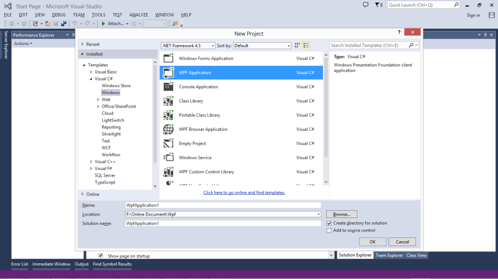
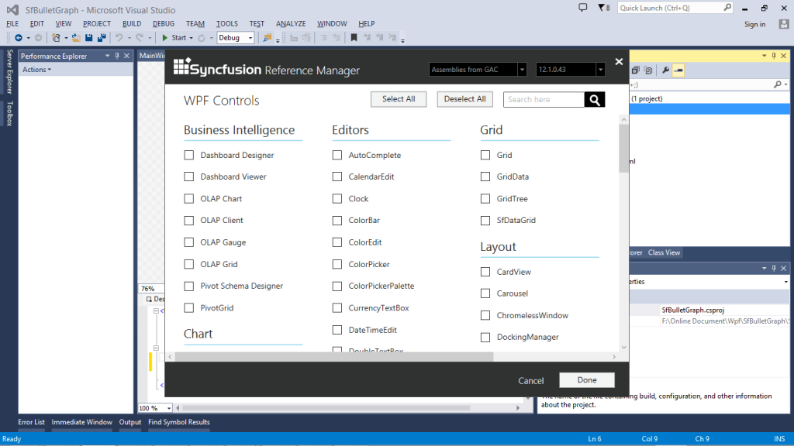
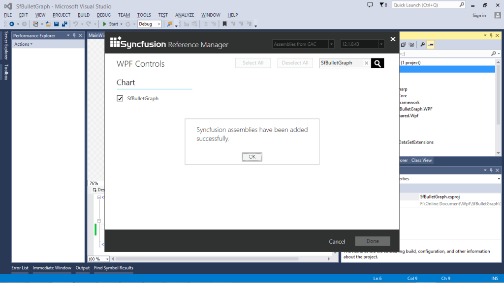
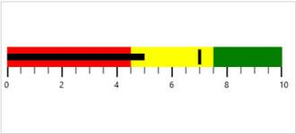

# Getting Started

The Bullet Graph is composed of quantitative scale, qualitative ranges, featured measure and comparative measure. The main purpose of the Bullet Graph is described by making use of the Caption. The quantitative scale of the Bullet Graph includes ticks and labels. The view of the bullet graph is changed by setting the Orientation property.

## Create the SfBulletGraph Programmatically

* Assembly Information

Bullet Graph is available in the following assembly.

Assembly: Syncfusion.SfBulletGraph.WPF

* NameSpace

Bullet Graph is available in the following namespace.

Namespace: Syncfusion.UI.Xaml.BulletGraph

* Creating Bullet Graph Programmatically

Refer to the following code to creating a Bullet Graph with all its basic properties specified in code.

### Code example



<Window x:Class="SfBulletGraph.MainWindow"

        xmlns="http://schemas.microsoft.com/winfx/2006/xaml/presentation"

        xmlns:x="http://schemas.microsoft.com/winfx/2006/xaml"

        xmlns:syncfusion ="http://schemas.syncfusion.com/wpf"

        Title="MainWindow" Height="350" Width="525">

    <Grid x:Name="LayoutRoot">

        <syncfusion:SfBulletGraph Orientation="Horizontal" LabelStroke="Black" MajorTickStroke="Black" TickPosition="Below" LabelPosition="Below"  FeaturedMeasure="4.5" ComparativeMeasure="7" Minimum="0" Maximum="10" Interval="2"  FlowDirection="Forward"

                                  QualitativeRangesSize="30" 

                                  QuantitativeScaleLength="400">

                <syncfusion:SfBulletGraph.QualitativeRanges>

                    <syncfusion:QualitativeRange RangeEnd="4.5" 

                                             RangeStroke="Red"

                                             RangeOpacity="1">

                    </syncfusion:QualitativeRange>

                    <syncfusion:QualitativeRange RangeEnd="7.5" 

                                             RangeStroke="Yellow"

                                             RangeOpacity="1">

                    </syncfusion:QualitativeRange>

                    <syncfusion:QualitativeRange RangeEnd="10" 

                                             RangeStroke="Green"

                                             RangeOpacity="1">

                    </syncfusion:QualitativeRange>

                </syncfusion:SfBulletGraph.QualitativeRanges>

            </syncfusion:SfBulletGraph>

    </Grid>

</Window>




         SfBulletGraph bulletgraph = new SfBulletGraph();

            bulletgraph.QualitativeRangesSize = 30;

            bulletgraph.QuantitativeScaleLength = 400;

            bulletgraph.FlowDirection = BulletGraphFlowDirection.Forward;

            bulletgraph.Orientation = Orientation.Horizontal;

            bulletgraph.FeaturedMeasure = 5;

            bulletgraph.ComparativeMeasure = 5;

            bulletgraph.LabelStroke = new SolidColorBrush(Colors.Black);

            bulletgraph.MajorTickStroke = new SolidColorBrush(Colors.Black);

            bulletgraph.Minimum = 0;

            bulletgraph.Maximum = 10;

            bulletgraph.Interval = 2;

            bulletgraph.QualitativeRanges.Add(new QualitativeRange() { RangeEnd = 4.5, RangeOpacity = 1, RangeStroke = new SolidColorBrush(Colors.Red) });

            bulletgraph.QualitativeRanges.Add(new QualitativeRange() { RangeEnd = 7.5, RangeOpacity = 1, RangeStroke = new SolidColorBrush(Colors.Yellow) });

            bulletgraph.QualitativeRanges.Add(new QualitativeRange() { RangeEnd = 10, RangeOpacity = 1, RangeStroke = new SolidColorBrush(Colors.Green) });

            this.Grid.Children.Add(bulletgraph);        



_SfBulletGraph with its Basic property_

## Create the SfBulletGraph with the Syncfusion Reference Manager

Syncfusion Reference Manager is used to add Syncfusion Tools.

To Add SfBulletGraph Control, follow the steps:

1. Create a simple WPF application by using Visual Studio.

   

    _Create a New Project using Visual Studio_

2. Right-Click on the Project and select SyncfusionReferenceManager.

   

   _Selecting the Syncfusion Reference Manager in Visual Studio_

3. The Syncfusion Reference Manager Wizard opens as follows.

   

    _Syncfusion Reference Manager Wizard_

4. Search SfBulletGraph by using SearchBox and select SfBulletGraph Control.  Click done to add the selected SfBulletGraph Control.

   

   _Searching SfBulletGraph Control using Syncfusion Reference Manager_

5. The SfBulletGraph assemblies is automatically added to the Project after Clicking OK.

   

   _Adding Reference Assemblies to the Project_

   

   _Acknowledgement Message for Added Syncfusion Assemblies_

6. Create a namespace reference to the SfBulletGraph control by using Syncfusion’s global namespace reference schemas.syncfusion.com or the SfBulletGraph control’s namespace reference by using Syncfusion.UI.Xaml.BulletGraph available in the Syncfusion.SfBulletGraph.WPF assembly.

   
		  xmlns:bulletgraph="http://schemas.syncfusion.com/wpf" 

		(or)

		  xmlns:bulletgraph ="clr-    namespace:Syncfusion.UI.Xaml.BulletGraph;assembly=Syncfusion.SfBulletGraph. WPF"

  

7. Add the following code to create a simple SfBulletGraph control.

   ~~~ html
			<Window x:Class="SfBulletGraph.MainWindow"

					xmlns="http://schemas.microsoft.com/winfx/2006/xaml/presentation"

					xmlns:x="http://schemas.microsoft.com/winfx/2006/xaml"

					xmlns:syncfusion ="http://schemas.syncfusion.com/wpf"

					Title="MainWindow" Height="350" Width="525">

				<Grid x:Name="LayoutRoot">

					<syncfusion:SfBulletGraph Orientation="Horizontal" LabelStroke="Black" MajorTickStroke="Black" TickPosition="Below" LabelPosition="Below"  FeaturedMeasure="4.5" ComparativeMeasure="7" Minimum="0" Maximum="10" Interval="2"  FlowDirection="Forward"

											  QualitativeRangesSize="30" 

											  QuantitativeScaleLength="400">

							<syncfusion:SfBulletGraph.QualitativeRanges>

								<syncfusion:QualitativeRange RangeEnd="4.5" 

														 RangeStroke="Red"

														 RangeOpacity="1">

								</syncfusion:QualitativeRange>

								<syncfusion:QualitativeRange RangeEnd="7.5" 

														 RangeStroke="Yellow"

														 RangeOpacity="1">

								</syncfusion:QualitativeRange>

								<syncfusion:QualitativeRange RangeEnd="10" 

														 RangeStroke="Green"

														 RangeOpacity="1">

								</syncfusion:QualitativeRange>

							</syncfusion:SfBulletGraph.QualitativeRanges>

						</syncfusion:SfBulletGraph>

				</Grid>

			</Window>

   ~~~
   {:.prettyprint}

			using System.Windows;

			using Syncfusion.UI.Xaml.BulletGraph;

			namespace BulletGraph

			{

				public partial class MainWindow : Window

				{

					public MainWindow()

					{

						InitializeComponent();

						SfBulletGraph bulletgraph = new SfBulletGraph();

						bulletgraph.QualitativeRangesSize = 30;

						bulletgraph.QuantitativeScaleLength = 400;

						bulletgraph.FlowDirection = BulletGraphFlowDirection.Forward;

						bulletgraph.Orientation = Orientation.Horizontal;

						bulletgraph.FeaturedMeasure = 5;

						bulletgraph.ComparativeMeasure = 5;

						bulletgraph.LabelStroke = new SolidColorBrush(Colors.Black);

						bulletgraph.MajorTickStroke = new SolidColorBrush(Colors.Black);

						bulletgraph.Minimum = 0;

						bulletgraph.Maximum = 10;

						bulletgraph.Interval = 2;

						bulletgraph.QualitativeRanges.Add(new QualitativeRange() { RangeEnd = 4.5, RangeOpacity = 1, RangeStroke = new SolidColorBrush(Colors.Red) });

						bulletgraph.QualitativeRanges.Add(new QualitativeRange() { RangeEnd = 7.5, RangeOpacity = 1, RangeStroke = new SolidColorBrush(Colors.Yellow) });

						bulletgraph.QualitativeRanges.Add(new QualitativeRange() { RangeEnd = 10, RangeOpacity = 1, RangeStroke = new SolidColorBrush(Colors.Green) });

						this.Grid.Children.Add(bulletgraph);        

			  }

			  }

			 }

8.  The simple SfBulletGraph control is created as follows.

   

    _SfBulletGraph with its Basic property_

N>   1. The Syncfusion Reference Manager is available in versions 11.3.0.30 and later. It supports referencing assemblies from version 10.4.0.71 version to the current version. 2. The Syncfusion Reference Manager can be used only in Visual Studio 2010, 2012, and 2013.

