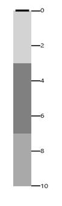

# Orientation 

By default orientation of SfBulletGraph is horizontal. It can be customized by using **Orientation** property respectively.




    <syncfusion:SfBulletGraph Orientation="Vertical">
    </syncfusion:SfBulletGraph>





     SfBulletGraph bulletgraph = new SfBulletGraph();
     bulletgraph.Orientation = Orientation.Vertical;
     this.Grid.Children.Add(bulletgraph);




<table>
<tr>
<td>
{{''| markdownify }}
</td><td>
{{''| markdownify }}
</td></tr>
</table>
