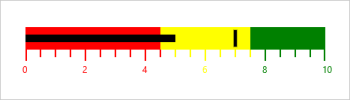

# Range Settings 

Ranges for a Bullet Graph are a collection of qualitative ranges. A qualitative range is a visual element that ends at a specified RangeEnd at the start of the previous range’s RangeEnd. The qualitative ranges are arranged according to each RangeEnd value.

### Customizing Range:

The width of the ranges can be customized by setting the QualitativeRangesSize property. By changing RangeStroke of the qualitative range, the stroke of the range can be personalized. By setting the RangeOpacity of the qualitative range, the opacity of the range is modified.

### Code Example:


        <syncfusion:SfBulletGraph Orientation="Horizontal" Minimum="0" Maximum="10" Interval="2"  FlowDirection="Forward"

                                  QualitativeRangesSize="30" 

                                  QuantitativeScaleLength="400">

            <syncfusion:SfBulletGraph.QualitativeRanges>

                <syncfusion:QualitativeRange RangeEnd="4.5" 

                                             RangeStroke="Red"

                                             RangeOpacity="1">

                </syncfusion:QualitativeRange>

                <syncfusion:QualitativeRange RangeEnd="7.5" 

                                             RangeStroke="Yellow"

                                             RangeOpacity="1">

                </syncfusion:QualitativeRange>

                <syncfusion:QualitativeRange RangeEnd="10" 

                                             RangeStroke="Green"

                                             RangeOpacity="1">

                </syncfusion:QualitativeRange>

            </syncfusion:SfBulletGraph.QualitativeRanges>

        </syncfusion:SfBulletGraph>




  SfBulletGraph bulletgraph = new SfBulletGraph();

      bulletgraph.QualitativeRangesSize = 30;

      bulletgraph.QuantitativeScaleLength = 400;

      bulletgraph.FlowDirection = BulletGraphFlowDirection.Forward;

      bulletgraph.Orientation = Orientation.Horizontal;

      bulletgraph.Minimum = 0;

      bulletgraph.Maximum = 10;

      bulletgraph.Interval = 2;

      bulletgraph.QualitativeRanges.Add(new QualitativeRange() { RangeEnd = 4.5, RangeOpacity = 1, RangeStroke = new SolidColorBrush(Colors.Red) });

       bulletgraph.QualitativeRanges.Add(new QualitativeRange() { RangeEnd = 7.5, RangeOpacity = 1, RangeStroke = new SolidColorBrush(Colors.Yellow) });

       bulletgraph.QualitativeRanges.Add(new QualitativeRange() { RangeEnd = 10, RangeOpacity = 1, RangeStroke = new SolidColorBrush(Colors.Green) });

      this.Grid.Children.Add(bulletgraph);



_Customizing Ranges of Bullet Graph_

## Binding RangeStroke to Ticks and Labels:

By setting BindWithRangeStrokeToLabels, the stroke of the labels is set related to the stroke of the specified ranges. Similarly, by setting BindWithRangeStrokeToTicks, the stroke of the ticks is set related to the stroke of the specified ranges.

### Code Example:


        <syncfusion:SfBulletGraph Orientation="Horizontal" Minimum="0" Maximum="10" Interval="2"  FlowDirection="Forward"

                                  QualitativeRangesSize="30" 

                                  QuantitativeScaleLength="400"

                                  BindRangeStrokeToLabels="True"

                                  BindRangeStrokeToTicks="True">

            <syncfusion:SfBulletGraph.QualitativeRanges>

                <syncfusion:QualitativeRange RangeEnd="4.5" 

                                             RangeStroke="Red"

                                             RangeOpacity="1">

                </syncfusion:QualitativeRange>

                <syncfusion:QualitativeRange RangeEnd="7.5" 

                                             RangeStroke="Yellow"

                                             RangeOpacity="1">

                </syncfusion:QualitativeRange>

                <syncfusion:QualitativeRange RangeEnd="10" 

                                             RangeStroke="Green"

                                             RangeOpacity="1">

                </syncfusion:QualitativeRange>

            </syncfusion:SfBulletGraph.QualitativeRanges>

        </syncfusion:SfBulletGraph>




      SfBulletGraph bulletgraph = new SfBulletGraph();

      bulletgraph.FlowDirection = BulletGraphFlowDirection.Forward;

      bulletgraph.Orientation = Orientation.Horizontal;

      bulletgraph.Minimum = 0;

      bulletgraph.Maximum = 10;

      bulletgraph.Interval = 2;   bulletgraph.BindRangeStrokeToLabels = true;

      bulletgraph.BindRangeStrokeToTicks = true;

      bulletgraph.QualitativeRangesSize = 30;

      bulletgraph.QuantitativeScaleLength = 400;

      bulletgraph.QualitativeRanges.Add(new QualitativeRange() { RangeEnd = 4.5,     RangeOpacity = 1, RangeStroke = new SolidColorBrush(Colors.Red) });

      bulletgraph.QualitativeRanges.Add(new QualitativeRange() { RangeEnd = 7.5, RangeOpacity = 1, RangeStroke = new SolidColorBrush(Colors.Yellow) });

      bulletgraph.QualitativeRanges.Add(new QualitativeRange() { RangeEnd = 1,    RangeOpacity = 1, RangeStroke = new SolidColorBrush(Colors.Green) });

      this.Grid.Children.Add(bulletgraph);



_Applying Range Stroke to Ticks and Labels_

