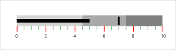

# Scale Tick Mark Settings

## Quantitative scale is displayed with two types of ticks: 

* Major ticks, the primary scale indicators.
* Minor ticks, the secondary scale indicators that fall in between the major ticks.

## Customizing Ticks:

The stroke of the major and minor ticks is customized by setting the MajorTickStroke and MinorTickStroke properties. The size can be modified by using the MajorTickSize and MinorTickSize properties. By setting MajorTickStrokeThickness and MinorTickStrokeThickness, the stroke’s thickness is customized.

### Code Example:


    <syncfusion:SfBulletGraph Orientation="Horizontal" Minimum="0" Maximum="10" Interval="2"  FlowDirection="Forward"

                                  QualitativeRangesSize="30" 

                                  QuantitativeScaleLength="400"    

                                  MinorTicksPerInterval="3"

                                  MajorTickSize="15" MinorTickSize="10"

                                  MajorTickStroke="Red" MinorTickStroke="Green">

        </syncfusion:SfBulletGraph>




  SfBulletGraph bulletgraph = new SfBulletGraph();

      bulletgraph.FlowDirection = BulletGraphFlowDirection.Forward;

      bulletgraph.Orientation = Orientation.Horizontal;

      bulletgraph.QualitativeRangesSize = 30;

      bulletgraph.QuantitativeScaleLength = 400;

      bulletgraph.Minimum = 0;

      bulletgraph.Maximum = 10;

      bulletgraph.Interval = 2;

      bulletgraph.MinorTicksPerInterval = 3;

      bulletgraph.MajorTickSize = 15;

      bulletgraph.MinorTickSize = 10;

      bulletgraph.MajorTickStroke = new SolidColorBrush(Colors.Red);

      bulletgraph.MinorTickStroke = new SolidColorBrush(Colors.Green);

      this.Grid.Children.Add(bulletgraph);



_Customizing Ticks in a Bullet Graph_

## TickPosition:

The ticks in the scale can be placed above or below the ranges of the quantitative scale by choosing the options available in the TickPosition property. 

They are:

1. Below (Default)
1. Above
2. Cross

### Code Example:



        <syncfusion:SfBulletGraph Orientation="Horizontal" Minimum="0" Maximum="10" Interval="2"  FlowDirection="Forward"

                                  QualitativeRangesSize="30" 

                                  QuantitativeScaleLength="400"

                                  Minimum="0" Maximum="10" Interval="2" 

                                  MinorTicksPerInterval="2"

                                  MinorTickStrokeThickness="1"

                                  MajorTickSize="30" MinorTickSize="30"

                                  MajorTickStroke="Black" MinorTickStroke="Black"                                  

                                  TickPosition="Cross">

        </syncfusion:SfBulletGraph>




        SfBulletGraph bulletgraph = new SfBulletGraph();

            bulletgraph.FlowDirection = BulletGraphFlowDirection.Forward;

            bulletgraph.Orientation = Orientation.Horizontal;

            bulletgraph.QualitativeRangesSize = 30;

            bulletgraph.QuantitativeScaleLength = 400;

            bulletgraph.Minimum = 0;

            bulletgraph.Maximum = 10;

            bulletgraph.Interval = 2;

            bulletgraph.MinorTicksPerInterval = 2;

            bulletgraph.MinorTickStrokeThickness = 1;

            bulletgraph.MajorTickSize = 30;

            bulletgraph.MinorTickSize = 30;

            bulletgraph.MajorTickStroke = new SolidColorBrush(Colors.Black);

            bulletgraph.MinorTickStroke = new SolidColorBrush(Colors.Black);

            bulletgraph.TickPosition = BulletGraphTicksPosition.Cross; 

            this.Grid.Children.Add(bulletgraph);



_Customizing Tick Position of Bullet Graph_