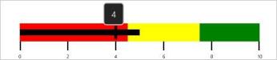
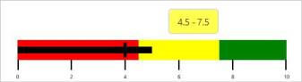

# Tooltip Setting

Tooltip in SfBulletGraph is used to view the values of FeaturedMeasure, ComparativeMeasure and QualitativeRange in the required design.

This tooltip is displayed when the mouse is over the FeaturedMeasure, ComparativeMeasure or QualitativeRange. Whereas, in touch device it is displayed on holding over the FeaturedMeasure, ComparativeMeasure and QualitativeRange of SfBulletGraph.

The SfBulletGraph tooltip is displayed only when the ShowToolTip property is set to true.

## FeaturedMeasureToolTipTemplate

You can display the value of FeaturedMeasure of SfBulletGraph in ToolTip that is used to view the FeaturedMeasure value .The FeaturedMeasureToolTipTemplate is DataTemplate type.

### Code Example:



                           <syncfusion:SfBulletGraph Orientation="Horizontal"  Minimum="0" Maximum="10" Interval="2"  FlowDirection="Forward"

                              QualitativeRangesSize="30"

                              QuantitativeScaleLength="400"                             

                              FeaturedMeasure="5"

                              FeaturedMeasureBarStroke="Black"

                              ComparativeMeasureSymbolStroke="Black"

                              LabelOffset="5" LabelStroke="Black"

                              MajorTickStroke="Black" MinorTickStroke="Black"

                              ShowToolTip="True"

                              CaptionPosition="Near">

            <syncfusion:SfBulletGraph.FeaturedMeasureToolTipTemplate>

                <DataTemplate>

                    <Border BorderBrush="#D3D3D3" BorderThickness="1.5" Background="#232323" CornerRadius="5">

                        <TextBlock Text="{Binding}" FontSize="14" Foreground="#D3D3D3" Margin="12 8"/>

                    </Border>

                </DataTemplate>

            </syncfusion:SfBulletGraph.FeaturedMeasureToolTipTemplate>

            <syncfusion:SfBulletGraph.QualitativeRanges>

                <syncfusion:QualitativeRange RangeEnd="4.5"

                                             RangeStroke="Red"

                                             RangeOpacity="1">

                </syncfusion:QualitativeRange>

                <syncfusion:QualitativeRange RangeEnd="7.5"

                                             RangeStroke="Yellow"

                                             RangeOpacity="1">

                </syncfusion:QualitativeRange>

                <syncfusion:QualitativeRange RangeEnd="10"

                                             RangeStroke="Green"

                                             RangeOpacity="1">

                </syncfusion:QualitativeRange>

            </syncfusion:SfBulletGraph.QualitativeRanges>

        </syncfusion:SfBulletGraph>



_SfBulletGraph with FeaturedMeasure ToolTip_

## ComparativeMeasureToolTipTemplate

You can display the value of ComparativeMeasure of SfBulletGraph in ToolTip that is used to view the ComparativeMeasure value. The ComparativeMeasureToolTipTemplate is DataTemplate type.

### Code Example:



                           <syncfusion:SfBulletGraph Orientation="Horizontal"  Minimum="0" Maximum="10" Interval="2"  FlowDirection="Forward"

                              QualitativeRangesSize="30"

                              QuantitativeScaleLength="400"                             

                              FeaturedMeasure="5"

                              ComparativeMeasure="4"

                              FeaturedMeasureBarStroke="Black"

                              ComparativeMeasureSymbolStroke="Black"

                              LabelOffset="5" LabelStroke="Black"

                              MajorTickStroke="Black" MinorTickStroke="Black"

                              ShowToolTip="True"

                              CaptionPosition="Near">

            <syncfusion:SfBulletGraph.ComparativeMeasureToolTipTemplate>

                <DataTemplate>

                    <Border BorderBrush="#D3D3D3" BorderThickness="1.5" Background="#232323" CornerRadius="5">

                        <TextBlock Text="{Binding}" FontSize="14" Foreground="#D3D3D3" Margin="12 8"/>

                    </Border>

                </DataTemplate>

            </syncfusion:SfBulletGraph.ComparativeMeasureToolTipTemplate>

            <syncfusion:SfBulletGraph.QualitativeRanges>

                <syncfusion:QualitativeRange RangeEnd="4.5"

                                             RangeStroke="Red"

                                             RangeOpacity="1">

                </syncfusion:QualitativeRange>

                <syncfusion:QualitativeRange RangeEnd="7.5"

                                             RangeStroke="Yellow"

                                             RangeOpacity="1">

                </syncfusion:QualitativeRange>

                <syncfusion:QualitativeRange RangeEnd="10"

                                             RangeStroke="Green"

                                             RangeOpacity="1">

                </syncfusion:QualitativeRange>

            </syncfusion:SfBulletGraph.QualitativeRanges>

        </syncfusion:SfBulletGraph>



_SfBulletGraph with ComparativeMeasure ToolTip_

## QualitativeRangeToolTipTemplate

You can display the value of QualitativeRange of SfBulletGraph in ToolTip that is used to view the Start and End value of QualitativeRange. The QualitativeRangeToolTipTemplate is DataTemplate type.

### Code Example:



                           <syncfusion:SfBulletGraph Orientation="Horizontal"  Minimum="0" Maximum="10" Interval="2"  FlowDirection="Forward"

                              QualitativeRangesSize="30"

                              QuantitativeScaleLength="400"                             

                              FeaturedMeasure="5"

                              ComparativeMeasure="4"

                              FeaturedMeasureBarStroke="Black"

                              ComparativeMeasureSymbolStroke="Black"

                              LabelOffset="5" LabelStroke="Black"

                              MajorTickStroke="Black" MinorTickStroke="Black"

                              ShowToolTip="True"

                              CaptionPosition="Near">

            <syncfusion:SfBulletGraph.QualitativeRangeToolTipTemplate>

                <DataTemplate>

                    <Border BorderBrush="#D3D3D3" BorderThickness="1.5" CornerRadius="5">

                        <Border Background="{Binding RangeStroke}" Opacity="0.7" CornerRadius="5">

                            <StackPanel Orientation="Horizontal" Margin="12 8" >

                                <TextBlock Text="{Binding RangeStart}" FontSize="14" Foreground="Black"/>

                                <TextBlock Text="-" FontSize="14" Foreground="Black" Width="10" TextAlignment="Center"/>

                                <TextBlock Text="{Binding RangeEnd}" FontSize="14" Foreground="Black"/>

                            </StackPanel>

                        </Border>

                    </Border>

                </DataTemplate>

            </syncfusion:SfBulletGraph.QualitativeRangeToolTipTemplate>

            <syncfusion:SfBulletGraph.QualitativeRanges>

                <syncfusion:QualitativeRange RangeEnd="4.5"

                                             RangeStroke="Red"

                                             RangeOpacity="1">

                </syncfusion:QualitativeRange>

                <syncfusion:QualitativeRange RangeEnd="7.5"

                                             RangeStroke="Yellow"

                                             RangeOpacity="1">

                </syncfusion:QualitativeRange>

                <syncfusion:QualitativeRange RangeEnd="10"

                                             RangeStroke="Green"

                                             RangeOpacity="1">

                </syncfusion:QualitativeRange>

            </syncfusion:SfBulletGraph.QualitativeRanges>

        </syncfusion:SfBulletGraph>



_SfBulletGraph with QualitativeRange ToolTip_

