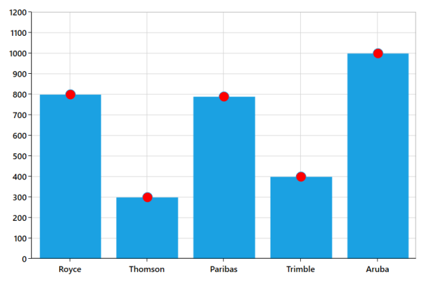
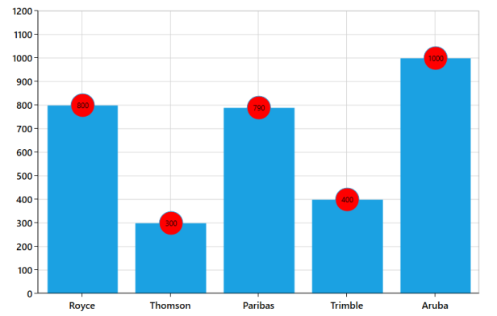
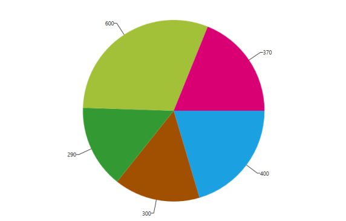
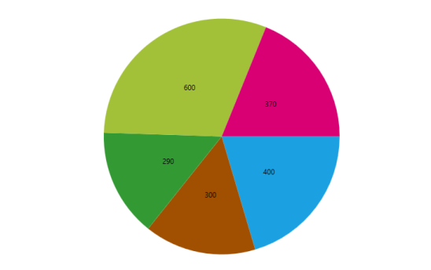

# Adornments

Chart adornments are used to display values related to a chart segment element. Values from data point(x, y) or other custom properties from a data source can be displayed. Each adornment can be represented by the following. 

* Marker- Displays the desired symbol at the (X, Y) point.
* Label - Displays the segment label content at the (X, Y) point.
* ConnectorLine - Line used to connect the (X, Y) point and the label element.

Various adornment customization are as follows,

## Adornments Positioning

The positioning of adornments inside the series is defined inside the Adornment Position property. This property differs in behavior based on the series type used. 

For instance, when you look at the Adornment Position of ColumnSeries, it can be set as TopandBottom and the adornment is placed in the middle of the segment accordingly, whereas in the LineSeries the only available position to display the Chart Adornment is the (x,y) point. 

Depending upon the requirement, adornments can be positioned in three ways.

* Top- Positions the Adornment at the top edge point of a chart segment.
* Bottom- Positions the Adornment at the bottom edge point of a chart segment.
* TopandBottom- Positions the Adornment at the center point of a chart segment. 

The following code example explains the positioning of adornments in the Chart Segment.



<syncfusion:SfChart x:Name="Chart"   Margin="5,0,10,0">

            <syncfusion:SfChart.DataContext>

                <local:ViewModel></local:ViewModel>

            </syncfusion:SfChart.DataContext>

            <syncfusion:SfChart.PrimaryAxis>

                <syncfusion:CategoryAxis />

            </syncfusion:SfChart.PrimaryAxis>

            <syncfusion:SfChart.SecondaryAxis>

                <syncfusion:NumericalAxis />

            </syncfusion:SfChart.SecondaryAxis>

            <syncfusion:ColumnSeries x:Name="series1"    XBindingPath="CompanyName" YBindingPath="CompanyTurnOver"   ItemsSource="{Binding CompanyDetails}">

                <syncfusion:ColumnSeries.AdornmentsInfo>

                    <syncfusion:ChartAdornmentInfo AdornmentsPosition="Top" ShowMarker="True" Symbol="Ellipse" SymbolWidth="20" SymbolHeight="20" SymbolInterior="Red"></syncfusion:ChartAdornmentInfo>

                </syncfusion:ColumnSeries.AdornmentsInfo>

            </syncfusion:ColumnSeries>

        </syncfusion:SfChart>
		
		

## Customizing Adornments

Adornment customization can be done by enriching the look of how they are placed in the chart. The symbols placed in the adornments can be modified using SymbolWidth and SymbolHeight properties. There are different types of symbols that can be added by using the Symbol property. 

SfChart allows you to define your own template for symbols by specifying the SymbolTemplate property. Thus, adornments can be modified according to individual specification or preference. 

The following APIs are used in customizing the adornments.

Customizing Adornments

<table>
<tr>
<th>
 Property</th><th>
  Definition</th></tr>
<tr>
<td>
HorizontalAlignment</td><td>
Gets or sets the HorizontalAlignment value that is used to align the adornment to Left, Right, Center or Stretch. </td></tr>
<tr>
<td>
VerticalAlignment</td><td>
Gets or sets the VerticalAlignment value that is used to align the adornment to Top, Bottom, Center or Stretch.</td></tr>
<tr>
<td>
SegmentLabelContent</td><td>
Gets or sets the LabelContent value that represents the content of the Segment Label.</td></tr>
<tr>
<td>
Showlabel</td><td>
Gets or sets the bool value that represents a value to enable the Show Label.</td></tr>
<tr>
<td>
ShowMarker</td><td>
Gets or sets the bool value that represents a value whether the enable the marker.</td></tr>
<tr>
<td>
Symbol</td><td>
Gets or sets the ChartSymbol value that represents the symbol of the marker.</td></tr>
<tr>
<td>
SymbolWidth</td><td>
Gets or sets the double value that represents the width of the symbol.</td></tr>
<tr>
<td>
SymbolHeight</td><td>
Gets or sets the double value that represents the Height of the symbol.</td></tr>
<tr>
<td>
SymbolInterior</td><td>
Gets or sets the Brush value that represents the interior color for the symbol.</td></tr>
<tr>
<td>
SymbolStroke</td><td>
Gets or sets the Brush value that represents the stroke for the symbol.</td></tr>
<tr>
<td>
SymbolTemplate</td><td>
Gets or sets the DataTemplate value that represents the template for the symbol.</td></tr>
<tr>
<td>
LabelTemplate</td><td>
Gets or sets the DataTemplate value that represents the template for the adornment label.</td></tr>
</table>

The following code example explains the customization of adornments.



<syncfusion:SfChart x:Name="Chart"   Margin="5,0,10,0">

            <syncfusion:SfChart.Resources>

                <DataTemplate x:Key="labeltemplate">

                    <TextBlock Text="{Binding}" ></TextBlock>

                </DataTemplate>

            </syncfusion:SfChart.Resources>

            <syncfusion:SfChart.DataContext>

                <local:ViewModel></local:ViewModel>

            </syncfusion:SfChart.DataContext>

            <syncfusion:SfChart.PrimaryAxis>

                <syncfusion:CategoryAxis />

            </syncfusion:SfChart.PrimaryAxis>

            <syncfusion:SfChart.SecondaryAxis>

                <syncfusion:NumericalAxis  />

            </syncfusion:SfChart.SecondaryAxis>

            <syncfusion:ColumnSeries x:Name="series1"    XBindingPath="CompanyName" YBindingPath="CompanyTurnOver"   ItemsSource="{Binding CompanyDetails}">

                <syncfusion:ColumnSeries.AdornmentsInfo>

                    <syncfusion:ChartAdornmentInfo AdornmentsPosition="Top" ShowLabel="True" SegmentLabelContent="YValue"  SegmentLabelFormat="#"  ShowMarker="True" Symbol="Ellipse" LabelTemplate="{StaticResource labeltemplate}" SymbolWidth="40" SymbolHeight="40" SymbolInterior="Red"></syncfusion:ChartAdornmentInfo>

                </syncfusion:ColumnSeries.AdornmentsInfo>

            </syncfusion:ColumnSeries>

        </syncfusion:SfChart>



## Adding Connector to Adornments

Connector is a line that is used to connect the data point in the series to the label. The connector line can be enabled using the ShowConnectorLine property. 

The following APIs are used in Connectors.

Adornments

<table>
<tr>
<th>
Property</th><th>
Definition</th></tr>
<tr>
<td>
ShowConnectorLine</td><td>
Gets or sets the bool value that represents a value to show the connector line.</td></tr>
<tr>
<td>
ConnectorHeight</td><td>
Gets or sets the double value that represents the height of the connector line.</td></tr>
<tr>
<td>
ConnectorLineStyle</td><td>
Gets or sets the style value represents the style for the connector line.</td></tr>
<tr>
<td>
ConnectorRotationAngle</td><td>
Gets or sets the double value that represents the rotation angle for the connector.</td></tr>
</table>

The following code example explains how to add connector line to the adornments.



<syncfusion:SfChart x:Name="Chart"   Margin="5,0,10,0">

            <syncfusion:SfChart.Resources>

                <DataTemplate x:Key="labeltemplate">

                    <TextBlock Text="{Binding}" ></TextBlock>

                </DataTemplate>

                

            </syncfusion:SfChart.Resources>

            <syncfusion:SfChart.DataContext>

                <local:ViewModel></local:ViewModel>

            </syncfusion:SfChart.DataContext>

            <syncfusion:SfChart.PrimaryAxis>

                <syncfusion:CategoryAxis  />

            </syncfusion:SfChart.PrimaryAxis>

            <syncfusion:SfChart.SecondaryAxis>

                <syncfusion:NumericalAxis   />

            </syncfusion:SfChart.SecondaryAxis>

            <syncfusion:LineSeries x:Name="series1" Label="Company Details"   XBindingPath="CompanyName" YBindingPath="CompanyTurnOver"   ItemsSource="{Binding CompanyDetails}">

                <syncfusion:LineSeries.AdornmentsInfo>

                    <syncfusion:ChartAdornmentInfo   ShowLabel="True"  SegmentLabelContent="YValue"  ShowMarker="True" Symbol="Ellipse" SymbolWidth="20" SymbolHeight="20" SymbolInterior="Red" ConnectorRotationAngle="90" ShowConnectorLine="True" ConnectorHeight="20" ConnectorLineStyle="{StaticResource linestyle}"  SegmentLabelFormat="#"   LabelTemplate="{StaticResource labeltemplate}"/>

                </syncfusion:LineSeries.AdornmentsInfo>

            </syncfusion:LineSeries>

        </syncfusion:SfChart>



## SmartLabel support for CircularSeries

When there are more points or points with similar values, the labels in Pie or Doughnut chart overlap with each other. SmartLabel feature is used here to prevent the overlap, by allowing labels to realign with respect to the available space.

###Advantages of using Smart Labels

1. Avoids the overlap of segment labels.
2. To view the label clearly and place the labels around the chart.

SmartLabel

<table>
<tr>
<th>
API Name</th><th>
Descriptions</th></tr>
<tr>
<td>
ConnectorMode</td><td>
This property enables you to define the connector mode for connector line. It can be Line or Bezier.</td></tr>
<tr>
<td>
EnableSmartLabels</td><td>
This property is used to enable or disable the smart labels support.</td></tr>
<tr>
<td>
UseSeriesPalette</td><td>
Gets or sets the boolean value that represents a value whether to set the series’ segment interior to the adornment connector line stroke and as label background brush.</td></tr>
</table>

###SmartLabels with LabelPosition as OutsideExtended

Segment label is positioned outside the circular chart with an extended connector line. The following code example illustrates how to set SmartLabels for OutsideExtended position with Bezier type connector line.



<syncfusion:PieSeries

                LabelPosition="OutsideExtended"

ItemsSource="{Binding CompanyDetails}"

                XBindingPath="CompanyName"

                 YBindingPath="CompanyTurnOver"

                EnableSmartLabels="True">

            <syncfusion:PieSeries.AdornmentsInfo>

                <syncfusion:ChartAdornmentInfo ShowLabel="True" ConnectorHeight="30" ShowConnectorLine="True" />

            </syncfusion:PieSeries.AdornmentsInfo>

        </syncfusion:PieSeries>



###SmartLabels with LabelPosition as Outside

Segment label is positioned outside the circular chart. The following code example shows how to set label position as Outside.



<syncfusion:PieSeries

                LabelPosition="Outside"

ItemsSource="{Binding CompanyDetails}"

                XBindingPath="CompanyName"

                 YBindingPath="CompanyTurnOver"

                EnableSmartLabels="True">

            <syncfusion:PieSeries.AdornmentsInfo>

                <syncfusion:ChartAdornmentInfo ShowLabel="True" ConnectorHeight="30" ShowConnectorLine="True" />

            </syncfusion:PieSeries.AdornmentsInfo>

        </syncfusion:PieSeries>



 The following screenshot illustrates a SmartLabel with LabelPosition as Outside.

###Smart Labels with LabelPosition as Inside

Segment label is positioned inside the circular chart. The following code example illustrates how to set the smart labels position to Inside.



<syncfusion:PieSeries

                LabelPosition="Inside" ItemsSource="{Binding CompanyDetails}"

                XBindingPath="CompanyName"

                 YBindingPath="CompanyTurnOver"

                EnableSmartLabels="True">

            <syncfusion:PieSeries.AdornmentsInfo>

                <syncfusion:ChartAdornmentInfo ShowLabel="True" />

            </syncfusion:PieSeries.AdornmentsInfo>

        </syncfusion:PieSeries>



 The following screenshot illustrates a SmartLabel with LabelPosition as Inside.

###Connector Type

This property is used to define the type of connector line that is to be drawn. This can either be Bezier or Line.

The following code example and screenshot demonstrate the usage of UseSeriesPalette property.



<syncfusion:PieSeries

                ConnectorType="Bezier"

                LabelPosition="OutsideExtended"

            ItemsSource="{Binding CompanyDetails}"

                XBindingPath="CompanyName"

                 YBindingPath="CompanyTurnOver"

                EnableSmartLabels="True">

            <syncfusion:PieSeries.AdornmentsInfo>

                <syncfusion:ChartAdornmentInfo UseSeriesPalette="True" ShowLabel="True" ConnectorHeight="40" ShowConnectorLine="True"/>

            </syncfusion:PieSeries.AdornmentsInfo>

        </syncfusion:PieSeries>



### Customizing Adornments

SfChart adornments, also known as DataLabels, can be customized with direct APIs. The following APIs are used in customizing the adornments.

Customizing Adornments

<table>
<tr>
<th>
Property</th><th>
Definition</th></tr>
<tr>
<td>
HorizontalAlignment</td><td>
Gets or sets the HorizontalAlignment value that is used to align the adornment to either Left, Right, Center or Stretch. </td></tr>
<tr>
<td>
VerticalAlignment</td><td>
Gets or sets the VerticalAlignment value that is used to align the adornment to either Top, Bottom, Center or Stretch.</td></tr>
<tr>
<td>
ShowMarker</td><td>
Gets or sets the value that disables or enables the marker.</td></tr>
<tr>
<td>
Symbol</td><td>
Gets or sets the ChartSymbol value that represents the symbol of the marker.</td></tr>
<tr>
<td>
SymbolWidth</td><td>
Gets or sets the width for the symbol.</td></tr>
<tr>
<td>
SymbolHeight</td><td>
Gets or sets the height of the symbol.</td></tr>
<tr>
<td>
SymbolInterior</td><td>
Gets or sets the Brush that represents the fill color for the symbol.</td></tr>
<tr>
<td>
SymbolStroke</td><td>
Gets or sets the Brush value that represents the stroke for the symbol.</td></tr>
<tr>
<td>
SymbolTemplate</td><td>
Gets or sets the DataTemplate that represents the custom shape for the symbol.</td></tr>
</table>

The following code illustrates the various customization for adornments.



<syncfusion:ColumnSeries Label="2013"

                 ItemsSource="{Binding Computers}"

                 XBindingPath="Computer"

                 YBindingPath="Year2013"

                                     >

<!--Adornment Customization-->

<syncfusion:ColumnSeries.AdornmentsInfo>

<syncfusion:ChartAdornmentInfo ShowLabel="True"  

                                                   HorizontalAlignment="Center"

                                                   VerticalAlignment="Center"

                  ShowMarker="True"

                  Symbol="Ellipse"

                  SymbolWidth="50"

                  SymbolHeight="50"

                                                   SymbolInterior="GreenYellow"

                  SymbolStroke="Black"

                                                   >                    </syncfusion:ChartAdornmentInfo>

</syncfusion:ColumnSeries.AdornmentsInfo>

</syncfusion:ColumnSeries>



The following APIs are used to customize the labels of the adornments.

###Customizing Adornment Labels

<table>
<tr>
<th>
Property</th><th>
Definition</th></tr>
<tr>
<td>
SegmentLabelContent</td><td>
Gets or sets the LabelContent value that represents the content of the label.</td></tr>
<tr>
<td>
Showlabel</td><td>
Gets or sets the bool value that enable or disable the labels.</td></tr>
<tr>
<td>
SegmentLabelFormat</td><td>
Gets or sets the format for the adornment labels.</td></tr>
<tr>
<td>
LabelTemplate</td><td>
Gets or sets the custom DataTemplate value defined for the adornment label.</td></tr>
<tr>
<td>
FontFamily</td><td>
Gets or sets the font family of the adornment labels.</td></tr>
<tr>
<td>
FontStyle</td><td>
Gets or sets the font style of the adornment labels.</td></tr>
<tr>
<td>
FontSize</td><td>
Gets or sets the font size of the adornment labels.</td></tr>
<tr>
<td>
BorderThickness</td><td>
Gets or sets the border thickness around the adornment labels.</td></tr>
<tr>
<td>
BorderBrush</td><td>
Gets or sets the color for the adornment label’s border.</td></tr>
<tr>
<td>
Background</td><td>
Gets or sets the background color for the adornment labels.</td></tr>
<tr>
<td>
Foreground</td><td>
Gets or sets the text color for the adornment labels.</td></tr>
<tr>
<td>
Margin</td><td>
Gets or sets the outer margin of the adornment labels.</td></tr>
<tr>
<td>
LabelRotationAngle</td><td>
Gets or sets the double value that represents the angle to rotate the adornment Label.</td></tr>
</table>

The following code example explains the customization of adornments labels.



<syncfusion:ColumnSeries Label="2013"

                         ItemsSource="{Binding Computers}"

                         XBindingPath="Computer"

                         YBindingPath="Year2013"

                                      >

<!—Adornment Label Customization-->

        <syncfusion:ColumnSeries.AdornmentsInfo>

      <syncfusion:ChartAdornmentInfo ShowLabel="True"  

                                     FontFamily="Times New Roman" 

                                     FontStyle="Normal" 

   FontSize="22" 

                                     BorderThickness="2" 

   BorderBrush="Black" 

                                     Background="YellowGreen" 

   Foreground="Brown"  

                                     Margin="5"

                                     SegmentLabelFormat="# cm">

                    </syncfusion:ChartAdornmentInfo>  </syncfusion:ColumnSeries.AdornmentsInfo>

 </syncfusion:ColumnSeries>    



### Adornments Label Rotation    

SfChart allows you to define the angle for adornments by specifying LabelRotationAngle in ChartAdornmentInfo.

The following code example explains the adornments rotation. 



   <chart:ColumnSeries XBindingPath="Name" Label="Year 2010" YBindingPath="Value"   
                                              ItemsSource="{Binding Datas}" >
                                              
               <chart:ColumnSeries.AdornmentsInfo>
               
                   <chart:ChartAdornmentInfo ShowLabel="True" LabelRotationAngle="-45" />
                   
               </chart:ColumnSeries.AdornmentsInfo>
               
    </chart:ColumnSeries>
    


