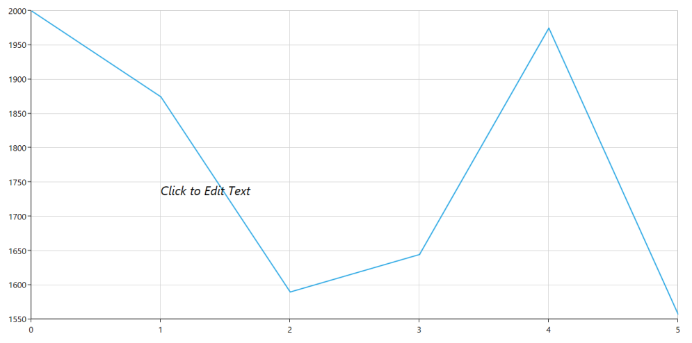
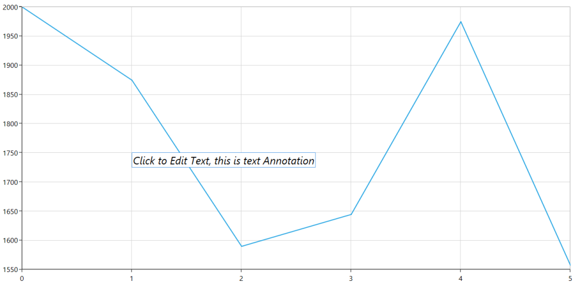
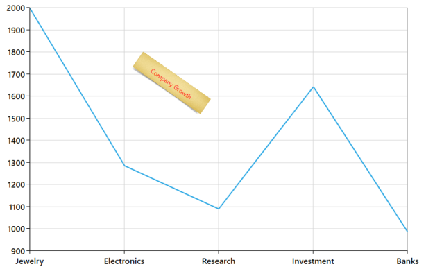
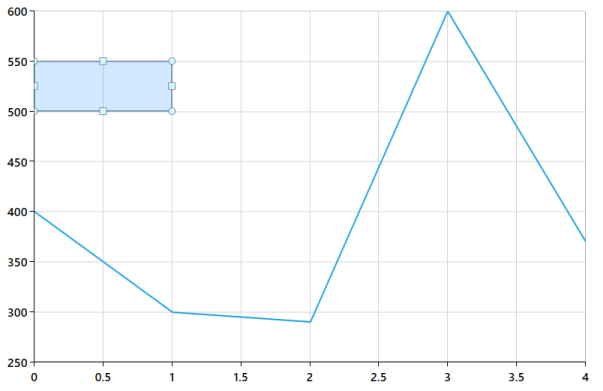

# Annotations

SfChart supports Annotations. It allows you to mark the specific area of interest in the chart area. You can draw custom shapes, also text and images can be added using Annotations. They can be positioned either in axis units or pixel units. Annotations are positioned based on X and Y axes, when you define CoordinateUnit as Axis; and it is positioned based on chart area pixel values, when you define CoordinateUnit as Pixel.

The following APIs are used to define and customize Annotation.

Annotations

<table>
<tr>
<th>
Property</th><th>
Definition</th></tr>
<tr>
<td>
Annotations</td><td>
Represents the annotations</td></tr>
<tr>
<td>
Text</td><td>
Gets or sets the string value that represents the text for Annotation.</td></tr>
<tr>
<td>
ContentTemplate</td><td>
Gets or sets the DataTemplate that represents the template for the content of the Annotations.</td></tr>
<tr>
<td>
ShowToolTip</td><td>
Gets or sets the bool value that represents the value to enable the ToolTip.</td></tr>
<tr>
<td>
CoordinateUnit</td><td>
Gets or sets the CoordinateUnit value that represents the rendering canvas for the Annotations.</td></tr>
<tr>
<td>
X1</td><td>
Gets or sets the double value that represents the X1 Coordinate of the Annotation.</td></tr>
<tr>
<td>
Y1</td><td>
Gets or sets the double value that represents the Y1 Coordinate of the Annotation.</td></tr>
<tr>
<td>
FontSize</td><td>
Gets or sets the double value that represents the font size for the text of the Annotation.</td></tr>
<tr>
<td>
FontFamily</td><td>
Gets or sets the FontFamily value that represents the Font Family for the text of the Annotation.</td></tr>
<tr>
<td>
FontStyle</td><td>
Gets or sets the FontStyle that represents the FontStyle for the text of the Annotation.</td></tr>
<tr>
<td>
FontWeight</td><td>
Gets or sets the FontWeight the FontWeight for the text of the Annotation.</td></tr>
</table>
Events

The following events are supported by Annotation.

Annotation Events

<table>
<tr>
<th>
Events</th><th>
 Description</th></tr>
<tr>
<td>
Selected           </td><td>
Occurs when annotation is selected.</td></tr>
<tr>
<td>
UnSlected     </td><td>
Occurs when annotation is unselected.</td></tr>
<tr>
<td>
DragStart</td><td>
Occurs when annotation drag is started.</td></tr>
<tr>
<td>
DragDelta  </td><td>
Occurs when annotation is dragging. You can cancel the dragging by using Cancel argument. </td></tr>
<tr>
<td>
DragCompleted   </td><td>
Occurs when annotation drag is completed.</td></tr>
<tr>
<td>
MouseDown</td><td>
Occurs when any mouse button is pressed while the pointer is over the annotation.</td></tr>
<tr>
<td>
MouseUp</td><td>
Occurs when any mouse button is released while the pointer is over the annotation.</td></tr>
<tr>
<td>
MouseLeftButtonDown</td><td>
Occurs when the left mouse button is pressed while the mouse pointer is over the annotation.</td></tr>
<tr>
<td>
MouseLeftButtonUp</td><td>
Occurs when the left mouse button is released while the mouse pointer is over the annotation.</td></tr>
<tr>
<td>
MouseRightButtonDown</td><td>
Occurs when the right mouse button is pressed while the mouse pointer is over the annotation.</td></tr>
<tr>
<td>
MouseRightButtonUp</td><td>
Occurs when the right mouse button is released while the mouse pointer is over the annotation.</td></tr>
<tr>
<td>
MouseMove</td><td>
Occurs when the mouse pointer moves while over the annotation.</td></tr>
<tr>
<td>
MouseLeave</td><td>
Occurs when the mouse pointer leaves the bounds of the annotation.</td></tr>
</table>

## TextAnnotation

TextAnnotations are used to add simple text in specific points over the chart area. You can customize the TextAnnotation using properties like FontFamily, FontSize.

Rotate the TextAnnotation

The Angle property is used to get or set the angle for rotating the Annotation. 

The following code example and screenshot demonstrate the usage of TextAnnotation in SfChart.



<syncfusion:SfChart.Annotations>

            <syncfusion:TextAnnotation Text="Company Details" CoordinateUnit="Pixel" FontFamily="Calibri (Body)" FontSize="14"FontStyle="Italic" Angle="35" X1="300" Y1="580" EnableEditing="True" />

        </syncfusion:SfChart.Annotations>



##API

Text Annotation API

<table>
<tr>
<th>
Property</th><th>
Definition</th></tr>
<tr>
<td>
EnableEditing</td><td>
Gets or sets a value to enable the editing support for annotation.</td></tr>
</table>

###Editing the text in Annotation 

SfChart provides you with an editing option for the text in any annotations. The following code example and screenshot demonstrate how to edit the text in Annotations.



 <syncfusion:SfChart.Annotations>

<syncfusion:TextAnnotation Text="Click to Edit Text" CoordinateUnit="Axis" FontSize="24"FontStyle="Italic" X1="1" Y1="1750"/>

</syncfusion:SfChart.Annotations>



###Before Editing

###OnEditMode:

## ImageAnnotation

SfChart provides support to add images as Annotation over the chart area, using the class ImageAnnotation. The following APIs are used in ImageAnnotation.

ImageAnnotation

<table>
<tr>
<th>
 Property</th><th>
Definition</th></tr>
<tr>
<td>
Angle</td><td>
Gets or sets the double value that represents the rotation angle for the text in Annotation.</td></tr>
<tr>
<td>
ImageSource</td><td>
Gets or sets the ImageSource value that represents the source from where the image must be added. </td></tr>
<tr>
<td>
X2</td><td>
Gets or sets the double value that represents the X2 Coordinate the ImageAnnotation.</td></tr>
<tr>
<td>
Y2</td><td>
Gets or sets the double value that represents the Y2 Coordinate for the ImageAnnotation.</td></tr>
</table>

The following code demonstrates how to add ImageAnnotation to chart control.



<syncfusion:SfChart.Annotations>

            <syncfusion:ImageAnnotation ImageSource="Annotation.png" Angle="35" Text="Company Growth" HorizontalTextAlignment="Center" VerticalTextAlignment="Center" Foreground="Red" CoordinateUnit="Axis"  X1="1" X2="3.5" Y1="1600" Y2="1710" >

                </syncfusion:ImageAnnotation>

        </syncfusion:SfChart.Annotations>



## ShapeAnnotations

ShapeAnnotation allows you to add annotations in the form of shapes such as rectangles, ellipses and lines at the specific area of interest, in the chart area. 

####EllipseAnnotation- Used to draw a circle or an ellipse over the chart area.

####RectangleAnnotation- Used to draw a rectangle over the chart area.

####VerticalLineAnnotation- Used to draw a vertical line across the chart area.

####HorizontalLineAnnotation- Used to add a horizontal line across the chart area.

The following APIs are used to customize ShapeAnnotations.

ShapeAnnotation

<table>
<tr>
<th>
Property</th><th>
Definition</th></tr>
<tr>
<td>
SelectedAnnotation</td><td>
Gets or sets the Annotation value that represents the selected type of Annotation in Shape Annotation.</td></tr>
<tr>
<td>
Fill</td><td>
Gets or sets the Brush value that represents the Fill Color inside the Shape Annotation.</td></tr>
<tr>
<td>
X2</td><td>
Gets or sets the double value that represents the X2 Coordinate of the Shape Annotation.</td></tr>
<tr>
<td>
Y2</td><td>
Gets or sets the Annotation value that represents the Y2 Coordinate of the Shape Annotation.</td></tr>
<tr>
<td>
CanDrag</td><td>
Get or sets the bool value that represent to drag the Annotation.</td></tr>
<tr>
<td>
CanResize</td><td>
Get or sets the bool value that represent to resize the Annotation.</td></tr>
</table>
RectangleAnnotation

The following code example demonstrates the usage of RectangleAnnotation.



<syncfusion:SfChart.Annotations>

            <syncfusion:RectangleAnnotation Text="Company Growth" Foreground="Red" FontSize="14" HorizontalTextAlignment="Center" VerticalTextAlignment="Center"  CoordinateUnit="Axis" X1=0" X2="1" Y1="500" Y2="550"/>

        </syncfusion:SfChart.Annotations>


##LineAnnotations

LineAnnotations displays line at specific points. The points where the line is displayed are determined by the X1, X2, Y1, Y2 properties. 

The following APIs are used to customize LineAnnotation.

LineAnnotation

<table>
<tr>
<th>
Property</th><th>
Definition</th></tr>
<tr>
<td>
ShowLine</td><td>
Gets or sets the bool value that represents whether to show the line in LineAnnotation.</td></tr>
<tr>
<td>
LineCap</td><td>
Gets or sets the LineCap value that represents the cap displayed at the ends of the line. </td></tr>
</table>

The following code demonstrates how to add a LineAnnotation to the chart control.



<syncfusion:SfChart.Annotations>

            <syncfusion:LineAnnotation ShowLine="True" LineCap="Arrow" Stroke="Red" StrokeThickness="3" CoordinateUnit="Axis" X1="0" X2="1" Y1="300" Y2="300"/>

        </syncfusion:SfChart.Annotations>



## Drag and Resize the Annotation

SfChart provides dragging and resizing support for ShapeAnnotations.The following code example and screenshot demonstrate the drag and resize support for a RectangleAnnotation.



  <syncfusion:SfChart.Annotations>

      <syncfusion:RectangleAnnotation CoordinateUnit="Axis X1="0" Y1=”500" X2="1" Y2="550" CanResize="True" CanDrag="True"/>

 </syncfusion:SfChart.Annotations>


