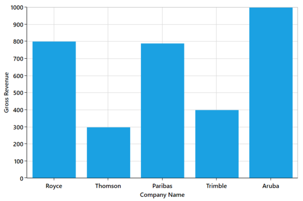
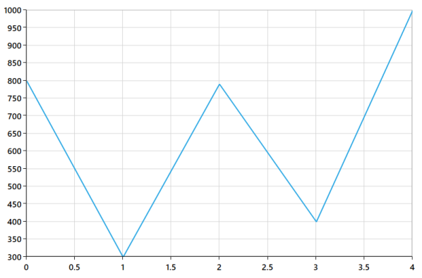
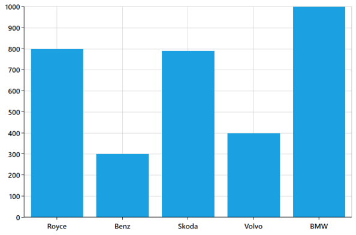
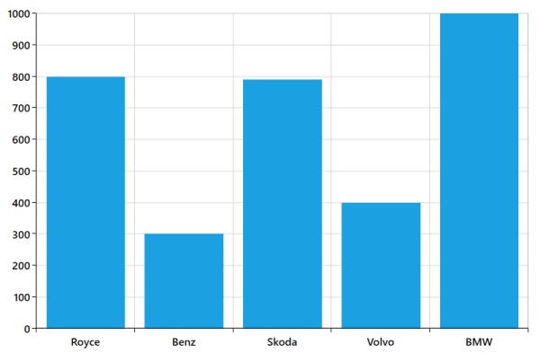
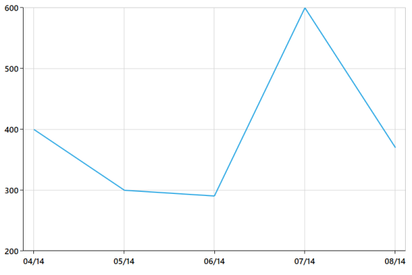
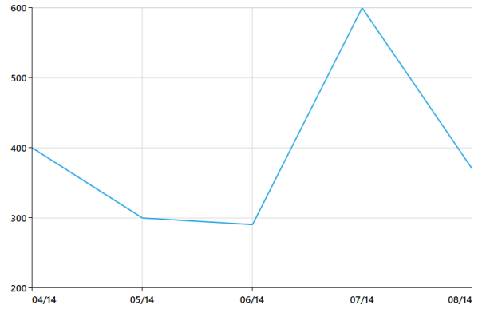
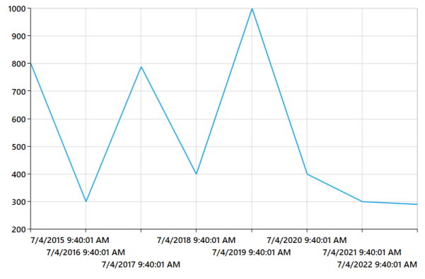

# Axis

ChartAxis is used to locate a data point inside the chart area. Generally, to locate a data point, you require two axes, along each direction, that is, horizontal and vertical, in a chart. The vertical axis, or y-axis, usually represents numerical values .The horizontal axis, or x-axis, represents categorical or numerical or date and time values. ChartAxis supports the following types.

You can choose any ChartAxis derived types, like DateTimeAxis, NumericalAxis, CategoryAxis, LogarithmicAxis or TimeSpanAxis depending on the value type. DateTimeCategoryAxis is a special type, used to plot date and time values for the given datapoints. 

## NumericAxis

NumericalAxis is used to plot numericals to the chart. You can set NumericalAxis for both PrimaryAxis and SecondaryAxis.

The following APIs are used to customize NumericalAxis.

Properties

<table>
<tr>
<th>
Property</th><th>
Definition</th></tr>
<tr>
<td>
Interval</td><td>
Gets or sets the double that represents the interval between the labels.</td></tr>
<tr>
<td>
Minimum</td><td>
Gets or sets the double that represents the Minimum value for the Axis.</td></tr>
<tr>
<td>
Maximum</td><td>
Gets or sets the double that represents the Maximum value for the Axis.</td></tr>
<tr>
<td>
RangePadding</td><td>
Gets or sets the NumericalPadding that specifies how to render the segments in chart area.</td></tr>
<tr>
<td>
StartRangeFromZero</td><td>
Gets or sets the bool that represents a value to enable start the range from zero. </td></tr>
</table>
 


<syncfusion:SfChart x:Name="Chart"   Margin="5,0,10,0">

            <syncfusion:SfChart.DataContext>

                <local:ViewModel/>

            </syncfusion:SfChart.DataContext>

            <syncfusion:SfChart.PrimaryAxis>

                <syncfusion:CategoryAxis   Header="Company Name"/>

            </syncfusion:SfChart.PrimaryAxis>

            <syncfusion:SfChart.SecondaryAxis>

                <syncfusion:NumericalAxis Interval="100" Minimum="0" Maximum="1000" RangePadding="Round"   Header="Gross Revenue "/>

            </syncfusion:SfChart.SecondaryAxis>

            <syncfusion:ColumnSeries x:Name="series1" Label="Company Details"   XBindingPath="CompanyName" YBindingPath="CompanyTurnOver"   ItemsSource="{Binding CompanyDetails}">

            </syncfusion:ColumnSeries>

        </syncfusion:SfChart>



## CategoryAxis

CategoryAxis is an index based axis that plots values based on the index of the data point collection. The points are equally spaced here.

The following APIs are used in CategoryAxis.

CategoryAxis

<table>
<tr>
<th>
Property</th><th>
Definition</th></tr>
<tr>
<td>
Interval</td><td>
Gets or sets the double value that represents the interval between the labels.</td></tr>
<tr>
<td>
LabelPlacement</td><td>
Gets or sets the LabelPlacement that represents the position of the label in the axis.</td></tr>
</table>



<syncfusion:SfChart x:Name="Chart"   Margin="5,0,10,0">

                <syncfusion:SfChart.DataContext>

                    <local:ViewModel/>

                </syncfusion:SfChart.DataContext>

                <syncfusion:SfChart.PrimaryAxis>

                    <syncfusion:CategoryAxis   Header="Company Name"/>

                </syncfusion:SfChart.PrimaryAxis>

                <syncfusion:SfChart.SecondaryAxis>

                    <syncfusion:NumericalAxis Interval="10" Minimum="200" Maximum="400" RangePadding="Round"   Header="Gross Revenue "/>

                </syncfusion:SfChart.SecondaryAxis>

                <syncfusion:ColumnSeries x:Name="series1" Label="Company Details"   XBindingPath="CompanyName" YBindingPath="CompanyTurnOver"   ItemsSource="{Binding CompanyDetails}">

                </syncfusion:ColumnSeries>

            </syncfusion:SfChart>



## DateTimeAxis

DateTimeAxis is used to plot DateTime values. The DateTimeAxis is widely used to make financial charts in places like the Stock Market, where index plotting is done everyday.

The following APIs are used for customizing DateTimeAxis.

DateTimeAxis

<table>
<tr>
<th>
Property</th><th>
Definition</th></tr>
<tr>
<td>
Minimum</td><td>
Gets or sets the DateTime value that represents a minimum value of the Axis.</td></tr>
<tr>
<td>
Maximum</td><td>
Gets or sets the DateTime value that represents a maximum value of the Axis.</td></tr>
<tr>
<td>
RangePadding</td><td>
Gets or sets the DateTimeRangePadding value that specifies segment arrangement in the chart area.</td></tr>
<tr>
<td>
Interval</td><td>
Gets or sets the double value as the interval between labels.</td></tr>
<tr>
<td>
IntervalType</td><td>
Gets or sets the DateTimeIntervalType. It represents the type of the interval. This property is used to define the type of interval to be displayed and considered for plotting the series.</td></tr>
<tr>
<td>
EnableBusinessHours</td><td>
Gets or sets the bool value that represents a value to enable business hours.</td></tr>
<tr>
<td>
OpenTime</td><td>
Gets or sets the double value that represents the open working time of a day.</td></tr>
<tr>
<td>
CloseTime</td><td>
Gets or sets the double value that represents the close working time of a day.</td></tr>
<tr>
<td>
WorkingDays</td><td>
Gets or sets the double value that represents the working days of a week.</td></tr>
</table>

###DateTimeIntervalType

The DateTime interval corresponds to the type specified in the IntervalType property.

For instance, if the Interval is set as 2 and IntervalType is set as Days, the labels are plotted for every two days. The following are the values for IntervalType property:

* Auto
* Days
* Hours
* Milliseconds
* Minutes 
* Months
* Seconds
* Years

The default IntervalType of a DateTimeAxis is Auto. It calculates the type automatically and the interval, accordingly.



<syncfusion:SfChart.PrimaryAxis>

                <syncfusion:DateTimeAxis Name="Primary" 

                                    IntervalType="Years" Interval="1" />

            </syncfusion:SfChart.PrimaryAxis>



The following code example and screenshot are for DateTimeAxis.



  <syncfusion:SfChart x:Name="Chart"   Margin="5,0,10,0">

            <syncfusion:SfChart.DataContext>

                <local:ViewModel/>

            </syncfusion:SfChart.DataContext>

            <syncfusion:SfChart.PrimaryAxis>

                <syncfusion:DateTimeAxis Interval="1" LabelFormat="yyyy" IntervalType="Years”/>

            </syncfusion:SfChart.PrimaryAxis>

            <syncfusion:SfChart.SecondaryAxis>

                <syncfusion:NumericalAxis />

            </syncfusion:SfChart.SecondaryAxis>

            <syncfusion:LineSeries x:Name="series1" Label="Company Details"   XBindingPath="Year" YBindingPath="CompanyTurnOver"  ItemsSource="{Binding CompanyDetails}">

            </syncfusion:LineSeries>

        </syncfusion:SfChart>



## DateTimeCategoryAxis

DateTimeCategoryAxis is a special type of axis used mainly with financial series. All the data points are plotted with equal spaces, similar to CategoryAxis, thereby removing space for missing dates. Intervals and range for the axis are calculated similar to DateTimeAxis. There are no visual gaps between points, even when the difference between two points is more than a year.

DateTimeCategoryAxis

<table>
<tr>
<th>
Property</th><th>
Definition</th></tr>
<tr>
<td>
Interval</td><td>
Gets or sets the double value that represents the interval between the labels.</td></tr>
<tr>
<td>
IntervalType</td><td>
Gets or sets the DateTimeIntervalType that represents the type of the interval.</td></tr>
</table>



<syncfusion:SfChart x:Name="Chart"   Margin="5,0,10,0">

            <syncfusion:SfChart.DataContext>

                <local:ViewModel/>

            </syncfusion:SfChart.DataContext>

            <syncfusion:SfChart.PrimaryAxis>

                <syncfusion:DateTimeCategoryAxis Interval="1" LabelFormat="yyyy" IntervalType="Years"  Header="Company Name"/>

            </syncfusion:SfChart.PrimaryAxis>

            <syncfusion:SfChart.SecondaryAxis>

                <syncfusion:NumericalAxis   Header="Gross Revenue (cr.)"/>

            </syncfusion:SfChart.SecondaryAxis>

            <syncfusion:LineSeries x:Name="series1" Label="Company Details"   XBindingPath="Year" YBindingPath="CompanyTurnOver"   ItemsSource="{Binding CompanyDetails}">

            </syncfusion:LineSeries>

        </syncfusion:SfChart>



## TimeSpanAxis

TimeSpanAxis is used to plot the time span values in the PrimaryAxis. TimeSpanAxis has the advantage of plotting data with milliseconds difference. The limitation of TimeSpanAxis is that it can only accept timespan values (hh:mm:ss) and datetime values are not accepted.

The following APIs are used in TimeSpanAxis.

TimeSpanAxis

<table>
<tr>
<th>
Property</th><th>
Definition</th></tr>
<tr>
<td>
Interval</td><td>
Gets or sets the double value that represents the interval between the labels.</td></tr>
<tr>
<td>
Minimum</td><td>
Gets or sets the timespan value that represents the minimum value for the Axis.</td></tr>
<tr>
<td>
Maximum</td><td>
Gets or sets the timespan value that represents the maximum value for the Axis. </td></tr>
</table>



 <syncfusion:SfChart x:Name="Chart"   Margin="5,0,10,0">

            <syncfusion:SfChart.DataContext>

                <local:ViewModel/>

            </syncfusion:SfChart.DataContext>

            <syncfusion:SfChart.PrimaryAxis>

                <syncfusion:TimeSpanAxis Interval="00:00:01" Header="Company Name"/>

            </syncfusion:SfChart.PrimaryAxis>

            <syncfusion:SfChart.SecondaryAxis>

                <syncfusion:NumericalAxis   Header="Gross Revenue (cr.)"/>

            </syncfusion:SfChart.SecondaryAxis>

            <syncfusion:LineSeries x:Name="series1" Label="Company Details"   XBindingPath="Year" YBindingPath="CompanyTurnOver"  ItemsSource="{Binding CompanyDetails}">

            </syncfusion:LineSeries>

        </syncfusion:SfChart>



## LogarithmicAxis

LogarithmicAxis is used to plot the logarithmic scale for the chart. In order to plot the logarithmic scale, you must specify the base value using LogarithmicBase Property.

The following APIs are used to customize the LogarithmicAxis.

LogarithmicAxis

<table>
<tr>
<th>
Property</th><th>
Definition</th></tr>
<tr>
<td>
Interval</td><td>
Gets or sets the double value that represents the interval between the labels</td></tr>
<tr>
<td>
Minimum</td><td>
Gets or sets the double value that represents the minimum value for the Axis.</td></tr>
<tr>
<td>
Maximum</td><td>
Gets or sets the double value that represents the maximum value of the Axis. </td></tr>
<tr>
<td>
LogarithmicBase</td><td>
Gets or sets the double value that represents the logarithmic base value of the Axis.</td></tr>
</table>



<syncfusion:SfChart x:Name="Chart"   Margin="5,0,10,0">

            <syncfusion:SfChart.DataContext>

                <local:ViewModel/>

            </syncfusion:SfChart.DataContext>

            <syncfusion:SfChart.PrimaryAxis>

                <syncfusion:CategoryAxis   Header="Company Name"/>

            </syncfusion:SfChart.PrimaryAxis>

            <syncfusion:SfChart.SecondaryAxis>

                <syncfusion:LogarithmicAxis LogarithmicBase="10"   Header="Gross Revenue (cr.)"/>

            </syncfusion:SfChart.SecondaryAxis>

            <syncfusion:LineSeries x:Name="series1" Label="Company Details"   XBindingPath="CompanyName" YBindingPath="CompanyTurnOver"   ItemsSource="{Binding CompanyDetails}">

            </syncfusion:LineSeries>

        </syncfusion:SfChart>



 Note: Logarithmic Axis does not support zero or negative values._

The following screenshot illustrates the SfChart with LogarithmicAxis.

## Multiple Axes

SfChart provides a way to arrange multiple series inside the same chart area, giving the chart more space than x-axis and y-axis.These axes can be arranged in a stack or in a side by side pattern. 

By default, all the series are plotted based on Primary and Secondary Axis. You can add more axes by adding additional axis to the series. There are two properties XAxis and YAxis in all the series, except Accumulation Series.



 <syncfusion:ColumnSeries Label="2010" 

     ItemsSource="{Binding Demands}"

     XBindingPath="Demand"

     YBindingPath="Year2010"

     Interior="Green"

     

            <syncfusion:ColumnSeries.XAxis>

                <syncfusion:NumericalAxis Header="Additional X Axis"/>

            </syncfusion:ColumnSeries.XAxis>

            <syncfusion:ColumnSeries.YAxis>

                <syncfusion:NumericalAxis Header="Additional Y Axis"/>

            </syncfusion:ColumnSeries.YAxis>

        </syncfusion:ColumnSeries>

        <syncfusion:LineSeries Label="2011" 

    ItemsSource="{Binding Demands}"

    XBindingPath="Demand"

    YBindingPath="Year2011"

    Interior="Black"

    StrokeThickness="2"

    />



The following screenshot illustrates SfChart with multiple axes.

Note: The first series is plotting based on additional X & Y axis and second series (or remaining series) is plotting against the Primary and Secondary axis.

###Axis Positioning

By default, the x-axis is arranged horizontally at the bottom of the chart and the y-axis is arranged vertically on the left-side of the chart. You can change the alignment of the axes by setting OpposedPosition to True. It arranges the x-axis at the top and the y-axis on the right-side of the chart. 

The following is the code example for setting the OpposedPosition property.



<syncfusion:ColumnSeries.XAxis>

            <syncfusion:NumericalAxis Header="Additional X Axis" OpposedPosition="True"/>

        </syncfusion:ColumnSeries.XAxis>

        <syncfusion:ColumnSeries.YAxis>

            <syncfusion:NumericalAxis Header="Additional Y Axis" OpposedPosition="True"/>

        </syncfusion:ColumnSeries.YAxis>
		
		

The following is a screenshot demonstrating y-axis of a chart arranged in OpposedPosition.

## Inversed Axis

This feature is used to reverse chart plotting inverse the axis scaling.



<syncfusion:SfChart.PrimaryAxis>

                <syncfusion:CategoryAxis   FontSize="16" IsInversed="True" OpposedPosition="True" />

            </ syncfusion:SfChart.PrimaryAxis>

            <syncfusion:SfChart.SecondaryAxis>

                <syncfusion:NumericalAxis FontSize="16" Minimum="0" Maximum="2000" Interval=”200” IsInversed="True" OpposedPosition="True" />

            </syncfusion:SfChart.SecondaryAxis>



## Axis range and Interval

ChartAxis calculates the range and intervals automatically based on the values of series data points. You can also explicitly specify the range and interval using the Minimum, Maximum and Interval properties. 

Tip: You cannot specify range for CategoryAxis instead you can use ZoomFactor and ZoomPosition.

Note: You can force the NumericalAxis to start range from zero by enabling StartRangeFromZero. The following is the code example for setting the ChartAxis properties.

 The following is the code sample for setting the ChartAxis properties:



<syncfusion:SfChart.PrimaryAxis>

                <syncfusion:CategoryAxis FontSize="14"/>

            </syncfusion:SfChart.PrimaryAxis>

            <syncfusion:SfChart.SecondaryAxis>

                <syncfusion:NumericalAxis FontSize="14"/>

            </syncfusion:SfChart.SecondaryAxis>


###Range Padding

The NumericalAxis and DateTimeAxis have a RangePadding property that can be used to add padding to the range of a chart's axes.

NumericalAxis RangePadding

The following types are available for NumericalAxis: 

* Additional
* None
* Normal
* Round

By default, the default RangePadding value for PrimaryAxis is Auto and for SecondaryAxis, the default value is Round.

The following screenshot demonstrates RangePadding as None, where no padding is applied for the axis.

Normal RangePadding for a NumericalAxis is used mostly for the y-axis to have padding based on the Range calculation.

The following screenshot illustrates a chart’s y-axis with RangePadding set to Normal.

Round RangePadding for a NumericalAxis rounds the range of the chart axis to the nearest possible value.

The following screenshot demonstrates a chart’s x-axis with RangePadding set to Round.

If RangePadding for NumericalAxis is set to Additional, the interval of the axis is added as padding.

The following screenshot demonstrates a chart’s x-axis with RangePadding set to Additional.

###DateTimeAxis RangePadding

The RangePadding types available in the DateTimeAxis are: 

* Additional
* None
* Round

By default, the RangePadding for a DateTimeAxis is None.

The following screenshot demonstrates a chart’s x-axis with RangePadding set to None. 

When RangePadding for DateTimeAxis is set to Additional, the DateTime interval of the axis is added as padding, as shown in the following screenshot.

When RangePadding for DateTimeAxis is set to Round, the range of the chart axis is rounded off to the nearest possible DateTime value, as shown in the following screenshot.

## Positioning axis labels

###Label Placement

The CategoryAxis includes the LabelPlacement property, used to set the labels of the axis between the tick lines or on the tick lines of the category axis. By default the LabelPlacement value for the CategoryAxis is OnTicks.

There are two types of LabelPlacement:

* BetweenTicks
* OnTicks

The following code example and screenshot shows LabelPlacement set to OnTicks.



  <syncfusion:SfChart.PrimaryAxis>

     <syncfusion:CategoryAxis LabelPlacement="OnTicks" 

         FontSize="16"  />

 </syncfusion:SfChart.PrimaryAxis>



The following code example and screenshot shows LabelPlacement set to BetweenTicks.



  <syncfusion:SfChart.PrimaryAxis>

    <syncfusion:CategoryAxis LabelPlacement="BetweenTicks" 

           FontSize="16"  />

    </syncfusion:SfChart.PrimaryAxis>



###Label Position 

The LabelsPosition property is used to position the axis label either inside or outside the chart plotting area.

The following code example and screenshot illustrate the use of LabelsPosition.



  <syncfusion:SfChart.PrimaryAxis>

    <syncfusion:CategoryAxis  LabelsPosition="Inside" 

           FontSize="16"  />

    </syncfusion:SfChart.PrimaryAxis>





  <syncfusion:SfChart.PrimaryAxis>

    <syncfusion:CategoryAxis  LabelsPosition="Outside" 

           FontSize="16"  />

    </syncfusion:SfChart.PrimaryAxis>


###Positioning Edge Labels

SfChart provides support to customize the edge labels of the axis to adjust its position using the EdgeLabelDrawingMode property. 

The following are the customizing options in EdgeLabelDrawingMode.

* Center- Positions the label with tickline as center.
* Fit- Position the gridline inside based on the edge label size.
* Hide- Hides the edge labels.
* Shift- Shifts the edge labels inside to label width.

The following code example and screenshot show EdgeLabelsDrawingMode set to Center.



  <syncfusion:SfChart.PrimaryAxis>

  <syncfusion:DateTimeAxis    LabelFormat="MM/yy" EdgeLabelsDrawingMode="Center" FontSize="16"  />

    </syncfusion:SfChart.PrimaryAxis>



The following code example and screenshot shows EdgeLabelsDrawingMode set to Fit.



  <syncfusion:SfChart.PrimaryAxis>

  <syncfusion:DateTimeAxis    LabelFormat="MM/yy" EdgeLabelsDrawingMode="Fit" FontSize="16"  />

    </syncfusion:SfChart.PrimaryAxis>



The following code example and screenshot shows EdgeLabelDrawingMode set to Hide.



  <syncfusion:SfChart.PrimaryAxis>

  <syncfusion:DateTimeAxis    LabelFormat="MM/yy" EdgeLabelsDrawingMode="Hide" FontSize="16"  />

    </syncfusion:SfChart.PrimaryAxis>



The following code example and screenshot shows EdgeLabelsDrawingMode set to Shift.



  <syncfusion:SfChart.PrimaryAxis>

  <syncfusion:DateTimeAxis    LabelFormat="MM/yy" EdgeLabelsDrawingMode="Shift" FontSize="16"  />

    </syncfusion:SfChart.PrimaryAxis>



## Smart Labels

When a number of axis labels exist, they may overlap with each other. SfChart provides features to handle the overlapping labels using the LabelsIntersectAction property.

The following are the options for intersecting action.

* None
* Hide
* MultipleRows

The following code example and screenshot shows LabelsIntersectAction set to None.



  <syncfusion:SfChart.PrimaryAxis>

    <syncfusion:DateTimeAxis   LabelsIntersectAction="None"  

           FontSize="16"  />

    </syncfusion:SfChart.PrimaryAxis>



The following code example and screenshot shows LabelsIntersectAction set to Hide.



  <syncfusion:SfChart.PrimaryAxis>

    <syncfusion:DateTimeAxis   LabelsIntersectAction="Hide"  

           FontSize="16"  />

    </syncfusion:SfChart.PrimaryAxis>



The following code example and screenshot show LabelsIntersectAction set to MultipleRows.



  <syncfusion:SfChart.PrimaryAxis>

    <syncfusion:DateTimeAxis   LabelsIntersectAction="MultipleRows"  

           FontSize="16"  />

    </syncfusion:SfChart.PrimaryAxis>



## Add units to labels

You can customize the axis label to display its measuring units by adding a prefix or a suffix. This feature can be achieved using the PrefixLabelTemplate and PostfixLabelTemplate properties.

The following code example and screenshot demonstrate the usage of PrefixLabelTemplate.



  <DataTemplate x:Key="yPrefix">

     <TextBlock FontSize="15" VerticalAlignment="Center" Text="$"/>

  </DataTemplate>

<syncfusion:SfChart.SecondaryAxis>

       <syncfusion:NumericalAxis FontSize="16" Minimum="0" Maximum="1000" PrefixLabelTemplate="{StaticResource yPrefix}" />

</syncfusion:SfChart.SecondaryAxis>



The following code example and screenshot demonstrate the usage of PostfixLabelTemplate.



  <DataTemplate x:Key="yPostfix">

       <TextBlock FontSize="8" VerticalAlignment="Top" Text="0"/>

 </DataTemplate>

<chart:SfChart.SecondaryAxis>

       <chart:NumericalAxis FontSize="16" Minimum="0" Maximum="100" PostfixLabelTemplate="{StaticResource yPostfix}" />

</chart:SfChart.SecondaryAxis>



## Formatting axis labels

SfChart provides the LabelFormat property for defining the custom formatting for the axis labels. This property supports all standard formatting type of numerical and date time values.



 <syncfusion:SfChart.PrimaryAxis>

      <syncfusion:DateTimeAxis LabelFormat="hh:mm tt" IntervalType="Hours" Interval="1" Header="Computer sales" />

</syncfusion:SfChart.PrimaryAxis>

<syncfusion:SfChart.SecondaryAxis>

      <syncfusion:NumericalAxis Header="Quantity Sold" LabelFormat="##.00"/>

</syncfusion:SfChart.SecondaryAxis>



## Styling Header and Labels

SfChart provides support to customize the axis header and label. The following APIs are used to customize the header and label.

HeaderStyle and LabelStyle

<table>
<tr>
<th>
Property</th><th>
Definition</th></tr>
<tr>
<td>
HeaderStyle</td><td>
Gets or sets the style for the axis header. The header’s Foreground, FontSize and FontFamily are customized using this property.</td></tr>
<tr>
<td>
LabelStyle</td><td>
Gets or sets the style for the axis labels. The label’s Foreground, FontSize and FontFamily are customized using this property.</td></tr>
</table>



<syncfusion:SfChart Height="250" Width="500">

            < syncfusion:SfChart.PrimaryAxis>

                < syncfusion:CategoryAxis  Header="City">

                    < syncfusion:CategoryAxis.LabelStyle>

                        < syncfusion:LabelStyle FontSize="10" FontFamily="Arial" Foreground="Green" ></syncfusion:LabelStyle>

                    </syncfusion:CategoryAxis.LabelStyle>

                </syncfusion:CategoryAxis>

            </syncfusion:SfChart.PrimaryAxis>

            <syncfusion:SfChart.SecondaryAxis>

                <syncfusion:NumericalAxis x:Name="axis" Header="Year" >

                    <syncfusion:NumericalAxis.LabelStyle >

                        <syncfusion:LabelStyle FontSize="10" Foreground="Green" FontFamily="Arial" ></syncfusion:LabelStyle>

                    </syncfusion:NumericalAxis.LabelStyle>

                </syncfusion:NumericalAxis>

            </syncfusion:SfChart.SecondaryAxis>

            <syncfusion:LineSeries XBindingPath="City" YBindingPath="Year1950" ItemsSource="{Binding PopulationPercent}"></syncfusion:LineSeries>

        </syncfusion:SfChart>

## GridLines and TickLines 

###GridLines

By default, gridlines are automatically added to the ChartAxis in its defined intervals. SfChart supports customization of gridline. You can control the visibility of the gridlines using the ShowGridLines property. 

The following code example and screenshot show ShowGridLines set to False.



  <syncfusion:SfChart.PrimaryAxis>

    <syncfusion:CategoryAxis ShowGridLines="False" 

           FontSize="16"  />

    </syncfusion:SfChart.PrimaryAxis>



###Ticklines

Ticklines are small markers extending from the gridlines, used to indicate the axis scaling. Tickline can be positioned either inside or outside of the axis line.

The following code example and screenshot illustrate major and small ticklines set to Inside.



   <syncfusion:SfChart.PrimaryAxis>

<syncfusion:NumericalAxis LabelsPosition="Inside" TickLineSize="10" SmallTickLineSize="5" TickLinesPosition="Inside" SmallTickLinesPosition="Inside" SmallTicksPerInterval="2"  FontSize="16"  />

            </syncfusion:SfChart.PrimaryAxis>



You can customize the appearance of major gridline, minor gridlines and ticklines using the MajorTickLineStyle, MinorTickLineStyle, MajorGridLineStyle and MinorGridLineStyle properties. Also axis lines can be customized using AxisLineStyle as follows.



<syncfusion:SfChart>

   <syncfusion:SfChart.Resources>

                

                

                

                

                

  </syncfusion:SfChart.Resources>

  <syncfusion:SfChart.PrimaryAxis>

                <syncfusion:DateTimeAxis  MajorGridLineStyle="{StaticResource majorGridLineStyle }"

                    MinorGridLineStyle="{StaticResource minorGridLineStyle}"

                    MajorTickLineStyle="{StaticResource majorTickLineStyle}"

                    MinorTickLineStyle="{StaticResource minorTickLineStyle}"

                    AxisLineStyle="{StaticResource axisLineStyle}"       

                    SmallTicksPerInterval="1" TickLineSize="10"

                    SmallTickLineSize="6" LabelFormat="yyyy"

                   />

            </syncfusion:SfChart.PrimaryAxis>

            <syncfusion:SfChart.SecondaryAxis>

                <syncfusion:NumericalAxis MajorTickLineStyle="{StaticResource majorTickLineStyle}"

                      MajorGridLineStyle="{StaticResource majorGridLineStyle }"

                      MinorGridLineStyle="{StaticResource minorGridLineStyle}"

                      MinorTickLineStyle="{StaticResource minorTickLineStyle}"

                      AxisLineStyle="{StaticResource axisLineStyle}"       

                      SmallTicksPerInterval="1" TickLineSize="10"

                      SmallTickLineSize="5" HorizontalAlignment="Right"  

            </syncfusion:SfChart.SecondaryAxis>

            <syncfusion:FastLineBitmapSeries   XBindingPath="Date" YBindingPath="Value" >

            </syncfusion:FastLineBitmapSeries>

        </syncfusion:SfChart>



