# Axis

[`ChartAxis`](http://help.syncfusion.com/cr/cref_files/wpf/sfchart/Syncfusion.SfChart.WPF~Syncfusion.UI.Xaml.Charts.ChartAxis.html#) is used to locate a data point inside the chart area. Generally, to locate a data point two axes are required along vertical and horizontal direction. The vertical axis or y-axis usually represents numerical values. The horizontal axis or x-axis represents categorical or numerical or date and time values. 

The following are the API’s in ChartAxis

* [`ArrangeRect`](http://help.syncfusion.com/cr/cref_files/wpf/sfchart/Syncfusion.SfChart.WPF~Syncfusion.UI.Xaml.Charts.ChartAxis~ArrangeRect.html#) – Represents the bounds of chart axis size. 
* [`VisibleRange`](http://help.syncfusion.com/cr/cref_files/wpf/sfchart/Syncfusion.SfChart.WPF~Syncfusion.UI.Xaml.Charts.ChartAxis~VisibleRange.html#) – Represent the axis start and end values.
* [`VisibleLabels`](http://help.syncfusion.com/cr/cref_files/wpf/sfchart/Syncfusion.SfChart.WPF~Syncfusion.UI.Xaml.Charts.ChartAxis~VisibleLabels.html#) – Represents the axis label collection which are visible in axis.

The following topics explains in detail about the axis and its parts

## Header

In [`ChartAxis`](http://help.syncfusion.com/cr/cref_files/wpf/sfchart/Syncfusion.SfChart.WPF~Syncfusion.UI.Xaml.Charts.ChartAxis.html#) you can define any object as header using [`Header`](http://help.syncfusion.com/cr/cref_files/wpf/sfchart/Syncfusion.SfChart.WPF~Syncfusion.UI.Xaml.Charts.ChartAxis~Header.html#) property. The following code example demonstrates the defining header in primary and secondary axis. 



<syncfusion:SfChart.PrimaryAxis>

<syncfusion:CategoryAxis Header="Metals"/>

</syncfusion:SfChart.PrimaryAxis>

<syncfusion:SfChart.SecondaryAxis>

<syncfusion:NumericalAxis Header="Values(In Tonnes)"/>

</syncfusion:NumericalAxis>

</syncfusion:SfChart.SecondaryAxis>



**Header** **Customization**

Default appearance of the header can be customized using [`HeaderTemplate`](http://help.syncfusion.com/cr/cref_files/wpf/sfchart/Syncfusion.SfChart.WPF~Syncfusion.UI.Xaml.Charts.ChartAxis~HeaderTemplate.html#) property. The following code snippet demonstrates the header customization.



<syncfusion:SfChart.PrimaryAxis>

<syncfusion:CategoryAxis>

<syncfusion:CategoryAxis.HeaderTemplate>

<DataTemplate>

<Border BorderBrush="Black" CornerRadius="5" BorderThickness="1">

<TextBlock Text="Demands" FontSize="12" FontStyle="Italic" FontWeight="Bold" Margin="3"/>

</Border>

</DataTemplate>

</syncfusion:CategoryAxis.HeaderTemplate>

</syncfusion:CategoryAxis>

</syncfusion:SfChart.PrimaryAxis>

<syncfusion:SfChart.SecondaryAxis>

<syncfusion:NumericalAxis Header="Values(In Tonnes)”/>

<syncfusion:NumericalAxis.HeaderTemplate>

<DataTemplate>

<Border BorderBrush="Black" CornerRadius="5" BorderThickness="1">

<TextBlock Text="Demands" FontSize="12" FontStyle="Italic" FontWeight="Bold" Margin="3"/>

</Border>

</DataTemplate>

</syncfusion:NumericalAxis.HeaderTemplate>

</syncfusion:NumericalAxis>

</syncfusion:SfChart.SecondaryAxis>



**HeaderStyle**

[`HeaderStyle`](http://help.syncfusion.com/cr/cref_files/wpf/sfchart/Syncfusion.SfChart.WPF~Syncfusion.UI.Xaml.Charts.ChartAxis~HeaderStyle.html#) property is used to provide style for the axis header. The following code example explains header style customization.



<syncfusion:SfChart.PrimaryAxis>

<syncfusion:CategoryAxis Header="Metals" >

<syncfusion:CategoryAxis.HeaderStyle>

<syncfusion:LabelStyle FontFamily="Algerian" FontSize="13" Foreground="Black"> 

</syncfusion:LabelStyle>

</syncfusion:CategoryAxis.HeaderStyle>

</syncfusion:CategoryAxis>

</syncfusion:SfChart.PrimaryAxis>

<syncfusion:SfChart.SecondaryAxis>

<syncfusion:NumericalAxis Header="Values(In Tonnes)"/>

<syncfusion:NumericalAxis.HeaderStyle>

<syncfusion:LabelStyle FontFamily="Algerian" FontSize="13" Foreground="Black"> 

</syncfusion:LabelStyle>

</syncfusion:NumericalAxis.HeaderStyle>

</syncfusion:NumericalAxis>

</syncfusion:SfChart.SecondaryAxis>



## Axis Labels

Labels will be generated by the range and the values binded to [`XBindingPath`](http://help.syncfusion.com/cr/cref_files/wpf/sfchart/Syncfusion.SfChart.WPF~Syncfusion.UI.Xaml.Charts.ChartSeriesBase~XBindingPath.html#) or [`YBindingPath`](http://help.syncfusion.com/cr/cref_files/wpf/sfchart/Syncfusion.SfChart.WPF~Syncfusion.UI.Xaml.Charts.XyDataSeries~YBindingPath.html#) properties.

**Positioning** **the** **Labels**

The [`LabelsPosition`](http://help.syncfusion.com/cr/cref_files/wpf/sfchart/Syncfusion.SfChart.WPF~Syncfusion.UI.Xaml.Charts.ChartAxis~LabelsPosition.html#) property is used to position the axis label either inside or outside the chart plotting area. By default, LabelsPosition is outside.

**Inside**



<syncfusion:SfChart.PrimaryAxis>

<syncfusion:NumericalAxis  LabelsPosition="Inside">

</syncfusion:NumericalAxis>

</syncfusion:SfChart.PrimaryAxis>



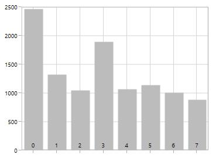

**LabelRotationAngle**

[`LabelRotationAngle`](http://help.syncfusion.com/cr/cref_files/wpf/sfchart/Syncfusion.SfChart.WPF~Syncfusion.UI.Xaml.Charts.ChartAxis~LabelRotationAngle.html#) property allows you to define the angle for the label content. The following code example illustrates the [`LabelRotationAngle`](http://help.syncfusion.com/cr/cref_files/wpf/sfchart/Syncfusion.SfChart.WPF~Syncfusion.UI.Xaml.Charts.ChartAxis~LabelRotationAngle.html#).



<syncfusion:SfChart.PrimaryAxis>

<syncfusion:DateTimeAxis  LabelRotationAngle="90" >

</syncfusion:DateTimeAxis>

</syncfusion:SfChart.PrimaryAxis>



**Custom** **Labels**

SfChart allows user to define the labels for the axis. For defining the axis label you have to set the [`LabelContent`](http://help.syncfusion.com/cr/cref_files/wpf/sfchart/Syncfusion.SfChart.WPF~Syncfusion.UI.Xaml.Charts.ChartAxisLabel~LabelContent.html#) and [`Position`](http://help.syncfusion.com/cr/cref_files/wpf/sfchart/Syncfusion.SfChart.WPF~Syncfusion.UI.Xaml.Charts.ChartAxisLabel~Position.html#) property .You can define the labels using [`CustomLabels`](http://help.syncfusion.com/cr/cref_files/wpf/sfchart/Syncfusion.SfChart.WPF~Syncfusion.UI.Xaml.Charts.ChartAxis~CustomLabels.html#) property as in the below code snippet.



<syncfusion:SfChart.PrimaryAxis>

<syncfusion:CategoryAxis >

<syncfusion:CategoryAxis.CustomLabels>

<syncfusion:ChartAxisLabel Position="0" LabelContent="0-1"/>

<syncfusion:ChartAxisLabel Position="1" LabelContent="1-2"/>

<syncfusion:ChartAxisLabel Position="2" LabelContent="2-3"/>

<syncfusion:ChartAxisLabel Position="3" LabelContent="3-4"/>

<syncfusion:ChartAxisLabel Position="4" LabelContent="4-5"/>

<syncfusion:ChartAxisLabel Position="5" LabelContent="5-5"/>

</syncfusion:CategoryAxis.CustomLabels>

</syncfusion:CategoryAxis>

</syncfusion:SfChart.PrimaryAxis>



You can also directly bind the collection of labels to the [`LabelsSource`](http://help.syncfusion.com/cr/cref_files/wpf/sfchart/Syncfusion.SfChart.WPF~Syncfusion.UI.Xaml.Charts.ChartAxis~LabelsSource.html#) property for defining custom labels. The following code example demonstrates the defining the label collection in code behind and binding the property in XAML page.



public List<LabelItem> Labels { get; set; }

Labels = new List<LabelItem>

{

new LabelItem() {Position=0, Content = "0-1"},

new LabelItem() {Position=1, Content = "1-2"},

new LabelItem() {Position=2, Content = "2-3"},

new LabelItem() {Position=3, Content = "3-4"},

new LabelItem() {Position=4, Content = "4-5"},

new LabelItem() {Position=5, Content = "5-6"},

new LabelItem() {Position=6, Content = "6-7"},

new LabelItem() {Position=7, Content = "7-8"},

};

public class LabelItem

{

public string Content { get; set; }

public int Position { get; set; }

}





<syncfusion:SfChart.PrimaryAxis>

<syncfusion:CategoryAxis LabelsSource="{Binding Labels}" ContentPath="Content" PositionPath="Position">

</syncfusion:CategoryAxis>

</syncfusion:SfChart.PrimaryAxis>



**Label** **Formatting**

Axis labels can be formatting by predefined formatting types based on the axis types.

**DateTimeAxis**



<syncfusion:SfChart.PrimaryAxis>

<syncfusion:DateTimeAxis LabelFormat="MMM/dd" FontSize="12" >

</syncfusion:DateTimeAxis>

</syncfusion:SfChart.PrimaryAxis>



**TimeSpanAxis**



<syncfusion:SfChart.PrimaryAxis>

<syncfusion:TimeSpanAxis LabelFormat="g" ></syncfusion:TimeSpanAxis>

</syncfusion:SfChart.PrimaryAxis>



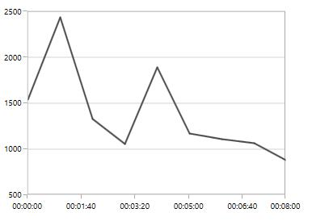

**NumericalAxis**



<syncfusion:SfChart.SecondaryAxis>

<syncfusion:NumericalAxis LabelFormat="0.00" />

</syncfusion:SfChart.SecondaryAxis>



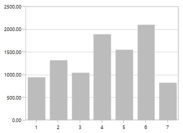

**Adding** **Units** **to** **Labels**

To display the measuring units, it can be added as a prefix or suffix to the axis labels. This can be achieved using the [`PrefixLabelTemplate`](http://help.syncfusion.com/cr/cref_files/wpf/sfchart/Syncfusion.SfChart.WPF~Syncfusion.UI.Xaml.Charts.ChartAxis~PrefixLabelTemplate.html#) and [`PostfixLabelTemplate`](http://help.syncfusion.com/cr/cref_files/wpf/sfchart/Syncfusion.SfChart.WPF~Syncfusion.UI.Xaml.Charts.ChartAxis~PostfixLabelTemplate.html#) properties.

**PrefixLabelTemplate**



<syncfusion:SfChart.SecondaryAxis>

<syncfusion:NumericalAxis FontSize="10">

<syncfusion:NumericalAxis.PrefixLabelTemplate>

<DataTemplate>

<TextBlock FontSize="10" VerticalAlignment="Center" Text="$"/>

</DataTemplate>

</syncfusion:NumericalAxis.PrefixLabelTemplate>

</syncfusion:NumericalAxis>

</syncfusion:SfChart.SecondaryAxis>



**PostfixLabelTemplate**



<syncfusion:SfChart.SecondaryAxis>

<syncfusion:NumericalAxis >

<syncfusion:NumericalAxis.PostfixLabelTemplate>

<DataTemplate>

<TextBlock FontSize="10" VerticalAlignment="Center" Text="K"/>

</DataTemplate>

</syncfusion:NumericalAxis.PostfixLabelTemplate>

</syncfusion:NumericalAxis>

</syncfusion:SfChart.SecondaryAxis>



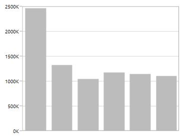

**LabelTemplate**

[`LabelTemplate`](http://help.syncfusion.com/cr/cref_files/wpf/sfchart/Syncfusion.SfChart.WPF~Syncfusion.UI.Xaml.Charts.ChartAxis~LabelTemplate.html#) property allows you to define the appearance for the axis labels .the following code example illustrates the [`LabelTemplate`](http://help.syncfusion.com/cr/cref_files/wpf/sfchart/Syncfusion.SfChart.WPF~Syncfusion.UI.Xaml.Charts.ChartAxis~LabelTemplate.html#) property.



<syncfusion:SfChart.PrimaryAxis>

<syncfusion:CategoryAxis>

<syncfusion:CategoryAxis.LabelTemplate>

<DataTemplate >

<Border Background="Gray" CornerRadius="5" >

<TextBlock Text="{Binding LabelContent}" Foreground="White"

FontStyle="Normal" FontSize="10" FontWeight="Bold"

Margin="3">

</TextBlock>

<Border.Effect>

<DropShadowEffect ShadowDepth="6" Direction="315" Color="LightGray" Opacity="0.25"

BlurRadius="0.8" />

</Border.Effect>

</Border>

</DataTemplate>

</syncfusion:CategoryAxis.LabelTemplate>

</syncfusion:CategoryAxis>

</syncfusion:SfChart.PrimaryAxis>



**LabelExtent**

This property allows us to set the distance between the axis header and the axis using [`LabelExtent`](http://help.syncfusion.com/cr/cref_files/wpf/sfchart/Syncfusion.SfChart.WPF~Syncfusion.UI.Xaml.Charts.ChartAxis~LabelExtent.html#) property.The following code snippet defines the [`LabelExtent`](http://help.syncfusion.com/cr/cref_files/wpf/sfchart/Syncfusion.SfChart.WPF~Syncfusion.UI.Xaml.Charts.ChartAxis~LabelExtent.html#) property.



<syncfusion:SfChart.PrimaryAxis>

<syncfusion:CategoryAxis Header="Demand" LabelExtent="50" >

</syncfusion:CategoryAxis>



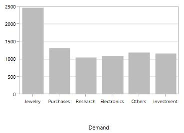

**Smart** **Axis** **Labels**

When there are more number of axis labels, they may overlap with each other. SfChart provides support to handle the overlapping labels using the [`LabelsIntersectAction`](http://help.syncfusion.com/cr/cref_files/wpf/sfchart/Syncfusion.SfChart.WPF~Syncfusion.UI.Xaml.Charts.ChartAxis~LabelsIntersectAction.html#) property. By default the [`LabelsIntersectAction`](http://help.syncfusion.com/cr/cref_files/wpf/sfchart/Syncfusion.SfChart.WPF~Syncfusion.UI.Xaml.Charts.ChartAxis~LabelsIntersectAction.html#) value is Hide.

The following are the options for intersecting action.

* None
* Hide
* MultipleRows
* Rotate

**None**

None option is used to display all the label even if it intersects. The following code snippet demonstrates the LabelsIntersectAction as None option.



<syncfusion:SfChart.PrimaryAxis>

<syncfusion:CategoryAxis LabelsIntersectAction="None"/>

</syncfusion:SfChart.PrimaryAxis>



**Hide**

Hide option is used to hide the labels if it intersects .You can define the hide as shown in the below code snippet.



<syncfusion:SfChart.PrimaryAxis>

<syncfusion:DateTimeAxis  LabelsIntersectAction="Hide"/>

</syncfusion:SfChart.PrimaryAxis>



**MultipleRows**

This option is used to move the labels to next row if it intersects .The following code demonstrates the MultipleRows option in [`LabelsIntersectAction`](http://help.syncfusion.com/cr/cref_files/wpf/sfchart/Syncfusion.SfChart.WPF~Syncfusion.UI.Xaml.Charts.ChartAxis~LabelsIntersectAction.html#).



<syncfusion:SfChart.PrimaryAxis>

<syncfusion:DateTimeAxis  LabelsIntersectAction="MultipleRows">

</syncfusion:DateTimeAxis>

</syncfusion:SfChart.PrimaryAxis>



**Auto**

This option in [`LabelsIntersectAction`](http://help.syncfusion.com/cr/cref_files/wpf/sfchart/Syncfusion.SfChart.WPF~Syncfusion.UI.Xaml.Charts.ChartAxis~LabelsIntersectAction.html#) property is used to rotate the labels if it intersects .The following code snippet and image demonstrates the rotate option in [`LabelsIntersectAction`](http://help.syncfusion.com/cr/cref_files/wpf/sfchart/Syncfusion.SfChart.WPF~Syncfusion.UI.Xaml.Charts.ChartAxis~LabelsIntersectAction.html#) property.



<syncfusion:CategoryAxis LabelsIntersectAction="Auto">

</syncfusion:CategoryAxis>



**EdgeLabelsDrawingMode**

SfChart provides support to customize the position of the edge labels in axis using the [`EdgeLabelsDrawingMode`](http://help.syncfusion.com/cr/cref_files/wpf/sfchart/Syncfusion.SfChart.WPF~Syncfusion.UI.Xaml.Charts.ChartAxis~EdgeLabelsDrawingMode.html#) property. [`EdgeLabelsDrawingMode`](http://help.syncfusion.com/cr/cref_files/wpf/sfchart/Syncfusion.SfChart.WPF~Syncfusion.UI.Xaml.Charts.ChartAxis~EdgeLabelsDrawingMode.html#) property default value is center.

The following are the customizing options in [`EdgeLabelsDrawingMode`](http://help.syncfusion.com/cr/cref_files/wpf/sfchart/Syncfusion.SfChart.WPF~Syncfusion.UI.Xaml.Charts.ChartAxis~EdgeLabelsDrawingMode.html#).

* Center- Positions the label with tick line as center.
* Fit- Position the gridline inside based on the edge label size.
* Hide- Hides the edge labels.
* Shift- Shifts the edge labels to the left or right so that it comes inside the chart area.

**Center**



<syncfusion:SfChart.PrimaryAxis>

<syncfusion:DateTimeAxis  EdgeLabelsDrawingMode="Center" >

</syncfusion:DateTimeAxis>

</syncfusion:SfChart.PrimaryAxis>



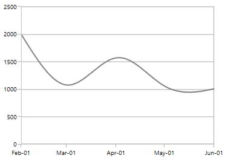

**Shift**



<syncfusion:SfChart.PrimaryAxis>

<syncfusion:DateTimeAxis  EdgeLabelsDrawingMode="Shift" ></syncfusion:DateTimeAxis>

</syncfusion:SfChart.PrimaryAxis>



**Hide**



<syncfusion:SfChart.PrimaryAxis>

<syncfusion:DateTimeAxis  EdgeLabelsDrawingMode="Hide">

</syncfusion:DateTimeAxis>

</syncfusion:SfChart.PrimaryAxis>



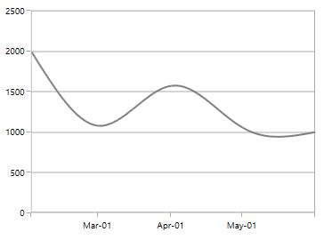

**Fit**



<syncfusion:SfChart.PrimaryAxis>

<syncfusion:DateTimeAxis  EdgeLabelsDrawingMode="Fit">

</syncfusion:DateTimeAxis>

</syncfusion:SfChart.PrimaryAxis>



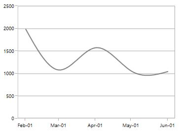

**EdgeLabelsVisibilityMode**

The visibility of the extreme labels of the axis can be controlled using [`EdgeLabelsVisibilityMode`](http://help.syncfusion.com/cr/cref_files/wpf/sfchart/Syncfusion.SfChart.WPF~Syncfusion.UI.Xaml.Charts.ChartAxis~EdgeLabelsVisibilityMode.html#) property. By default the default option in [`EdgeLabelsVisibilityMode`](http://help.syncfusion.com/cr/cref_files/wpf/sfchart/Syncfusion.SfChart.WPF~Syncfusion.UI.Xaml.Charts.ChartAxis~EdgeLabelsVisibilityMode.html#) is set, which displays the edge label based on auto interval calculations .The following image depicts the default option in [`EdgeLabelsVisibilityMode`](http://help.syncfusion.com/cr/cref_files/wpf/sfchart/Syncfusion.SfChart.WPF~Syncfusion.UI.Xaml.Charts.ChartAxis~EdgeLabelsVisibilityMode.html#) while zooming.

**Always** **Visible**

AlwaysVisible option in [`EdgeLabelsVisibilityMode`](http://help.syncfusion.com/cr/cref_files/wpf/sfchart/Syncfusion.SfChart.WPF~Syncfusion.UI.Xaml.Charts.ChartAxis~EdgeLabelsVisibilityMode.html#) is used to view the edge labels even while performing zooming.

The following code example and image demonstrates the AlwaysVisible option while zooming.



<syncfusion:SfChart.PrimaryAxis>

<syncfusion:NumericalAxis EdgeLabelsVisibilityMode="AlwaysVisible" 

EnableScrollBar="True">

</syncfusion:NumericalAxis>

</syncfusion:SfChart.PrimaryAxis>



**Visible**

Visible option is used to display the edge labels (first and last label) irrespective of the auto interval calculation until zooming (i.e., in normal state)



<syncfusion:SfChart.PrimaryAxis>

<syncfusion:NumericalAxis EdgeLabelsVisibilityMode="Visible" EnableScrollBar="True" >

</syncfusion:NumericalAxis>

</syncfusion:SfChart.PrimaryAxis>



## Grid lines

By default, gridlines are automatically added to the [`ChartAxis`](http://help.syncfusion.com/cr/cref_files/wpf/sfchart/Syncfusion.SfChart.WPF~Syncfusion.UI.Xaml.Charts.ChartAxis.html#) in its defined intervals. SfChart supports customization of gridline. The visibility of the gridlines can be controlled using the [`ShowGridLines`](http://help.syncfusion.com/cr/cref_files/wpf/sfchart/Syncfusion.SfChart.WPF~Syncfusion.UI.Xaml.Charts.ChartAxis~ShowGridLines.html#) property.

The following code example illustrates the [`ShowGridLines`](http://help.syncfusion.com/cr/cref_files/wpf/sfchart/Syncfusion.SfChart.WPF~Syncfusion.UI.Xaml.Charts.ChartAxis~ShowGridLines.html#) property as false in the primary axis.



<syncfusion:SfChart.PrimaryAxis>

<syncfusion:NumericalAxis  ShowGridLines="False"  >

</syncfusion:NumericalAxis>

</syncfusion:SfChart.PrimaryAxis>



Style can also be applied to Major and Minor Gridlines using [`MajorGridLineStyle`](http://help.syncfusion.com/cr/cref_files/wpf/sfchart/Syncfusion.SfChart.WPF~Syncfusion.UI.Xaml.Charts.ChartAxis~MajorGridLineStyle.html#) and [`MinorGridLineStyle`](http://help.syncfusion.com/cr/cref_files/wpf/sfchart/Syncfusion.SfChart.WPF~Syncfusion.UI.Xaml.Charts.ChartAxis~MinorGridLineStyle.html#) properties.

**MajorGridLineStyle**



<syncfusion:SfChart.PrimaryAxis>

<syncfusion:NumericalAxis  ShowGridLines="True" >

<syncfusion:NumericalAxis.MajorGridLineStyle>

</syncfusion:NumericalAxis.MajorGridLineStyle>

</syncfusion:NumericalAxis>

</syncfusion:SfChart.PrimaryAxis>



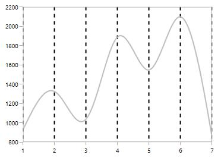

**MinorGridLineStyle**

Minor gridlines will be added automatically when the small tick lines is defined inside the chart area.



<syncfusion:SfChart.SecondaryAxis>

<syncfusion:NumericalAxis SmallTicksPerInterval="3">

<syncfusion:NumericalAxis.MinorGridLineStyle>

</syncfusion:NumericalAxis.MinorGridLineStyle>

</syncfusion:NumericalAxis>

</syncfusion:SfChart.SecondaryAxis>



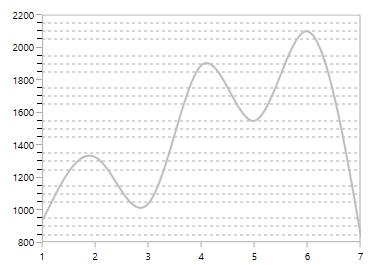

## Tick lines

Tick line are the small lines which is drawn on the axis line representing the axis labels .Tick lines will be drawn outside of the axis by default. 

**TickLineSize**

Tick lines thickness can be customized using [`TickLineSize`](http://help.syncfusion.com/cr/cref_files/wpf/sfchart/Syncfusion.SfChart.WPF~Syncfusion.UI.Xaml.Charts.ChartAxis~TickLineSize.html#) property as shown in the below code snippet.



<syncfusion:SfChart.PrimaryAxis>

<syncfusion:NumericalAxis  TickLineSize="10" ></syncfusion:NumericalAxis>

</syncfusion:SfChart.PrimaryAxis>



**Positioning** **the** **Major** **Tick** **Lines**

Tick lines can be positioned inside or outside of the chart area using [`TickLinesPosition`](http://help.syncfusion.com/cr/cref_files/wpf/sfchart/Syncfusion.SfChart.WPF~Syncfusion.UI.Xaml.Charts.ChartAxis~TickLinesPosition.html#) property. By default the tick lines will positioned outside of the chart area. The following code example demonstrates the positioning tick lines inside chart area.



<syncfusion:SfChart.PrimaryAxis>

<syncfusion:NumericalAxis TickLinesPosition="Inside">

</syncfusion:NumericalAxis>

</syncfusion:SfChart.PrimaryAxis>



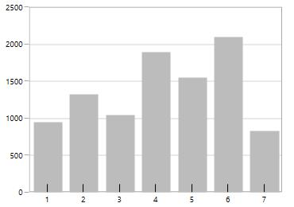

**Customization**

Style can be applied to major tick lines using [`MajorTickLineStyle`](http://help.syncfusion.com/cr/cref_files/wpf/sfchart/Syncfusion.SfChart.WPF~Syncfusion.UI.Xaml.Charts.ChartAxis~MajorTickLineStyle.html#) property .The following code snippet demonstrates the styling of major tick lines.



<syncfusion:SfChart.PrimaryAxis>

<syncfusion:NumericalAxis TickLineSize="10">

<syncfusion:NumericalAxis.MajorTickLineStyle>

</syncfusion:NumericalAxis.MajorTickLineStyle>

</syncfusion:NumericalAxis>

</syncfusion:SfChart.PrimaryAxis>



**MinorTickLines**

Minor tick lines can be added by defining [`SmallTicksPerInterval`](http://help.syncfusion.com/cr/cref_files/wpf/sfchart/Syncfusion.SfChart.WPF~Syncfusion.UI.Xaml.Charts.RangeAxisBase~SmallTicksPerInterval.html#) property. This property will add the tick lines  to every interval.

The following code example demonstrates the small ticks set for every interval.



<syncfusion:SfChart.PrimaryAxis>

<syncfusion:NumericalAxis Interval="1" SmallTicksPerInterval="4" >

</syncfusion:NumericalAxis>

</syncfusion:SfChart.PrimaryAxis>



**Positioning** **the** **minor** **tick** **lines**

Minor tick lines can be positioned inside or outside using [`SmallTickLinesPosition`](http://help.syncfusion.com/cr/cref_files/wpf/sfchart/Syncfusion.SfChart.WPF~Syncfusion.UI.Xaml.Charts.RangeAxisBase~SmallTickLinesPosition.html#) property. By default the minor tick lines will be positioned outside.

The following code example demonstrates the positioning of minor tick lines inside the chart area.



<syncfusion:SfChart.PrimaryAxis>

<syncfusion:NumericalAxis SmallTicksPerInterval="2" SmallTickLinesPosition="Inside">

</syncfusion:NumericalAxis>

</syncfusion:SfChart.PrimaryAxis>



**Customization** **of** **Minor** **Ticklines**

The thickness of the minor tick lines can be customized using [`SmallTickLineSize`](http://help.syncfusion.com/cr/cref_files/wpf/sfchart/Syncfusion.SfChart.WPF~Syncfusion.UI.Xaml.Charts.RangeAxisBase~SmallTickLineSize.html#) property as shown in the below code snippet.



<syncfusion:SfChart.PrimaryAxis>

<syncfusion:NumericalAxis Interval="1" SmallTicksPerInterval="3" SmallTickLineSize="10">

</syncfusion:NumericalAxis>

</syncfusion:SfChart.PrimaryAxis>



Styling customization of minor tick lines can be defined using [`MinorTickLineStyle`](http://help.syncfusion.com/cr/cref_files/wpf/sfchart/Syncfusion.SfChart.WPF~Syncfusion.UI.Xaml.Charts.ChartAxis~MinorTickLineStyle.html#) property. The following code example and image demonstrates the style for minor tick lines.



<syncfusion:NumericalAxis FontSize="12"  Interval="1" SmallTicksPerInterval="3" TickLineSize="10" SmallTickLineSize="5">

<syncfusion:NumericalAxis.MinorTickLineStyle>

</syncfusion:NumericalAxis.MinorTickLineStyle>

</syncfusion:NumericalAxis>

</syncfusion:SfChart.PrimaryAxis>



N> For category axis, small tick lines is not applicable since it is rendered based on index positions.

## AxisLine

SfChart provides support to customize the style of the axis line by defining the [`AxisLineStyle`](http://help.syncfusion.com/cr/cref_files/wpf/sfchart/Syncfusion.SfChart.WPF~Syncfusion.UI.Xaml.Charts.ChartAxis~AxisLineStyle.html#) property as shown in the below code snippet.



<syncfusion:SfChart.PrimaryAxis>

<syncfusion:NumericalAxis  Interval="1" >

<syncfusion:NumericalAxis.AxisLineStyle>

</syncfusion:NumericalAxis.AxisLineStyle>

</syncfusion:NumericalAxis>

</syncfusion:SfChart.PrimaryAxis>



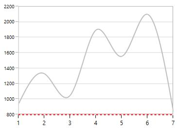

**Applying** **Padding** **to** **the** **Axis** **line**

The padding to the axis line is defined using [`AxisLineOffset`](http://help.syncfusion.com/cr/cref_files/wpf/sfchart/Syncfusion.SfChart.WPF~Syncfusion.UI.Xaml.Charts.ChartAxis~AxisLineOffset.html#) property. The following code example demonstrates the setting [`AxisLineOffset`](http://help.syncfusion.com/cr/cref_files/wpf/sfchart/Syncfusion.SfChart.WPF~Syncfusion.UI.Xaml.Charts.ChartAxis~AxisLineOffset.html#) for x axis.



<syncfusion:SfChart.PrimaryAxis>

<syncfusion:NumericalAxis AxisLineOffset="20" >

</syncfusion:NumericalAxis>

</syncfusion:SfChart.PrimaryAxis>



## Origin Customization

SfChart allows you to customize the origin.By default the axis will be rendered having (0,0) as origin in x and y axes.

**ShowAxisNextToOrigin**

[`ShowAxisNextToOrigin`](http://help.syncfusion.com/cr/cref_files/wpf/sfchart/Syncfusion.SfChart.WPF~Syncfusion.UI.Xaml.Charts.ChartAxis~ShowAxisNextToOrigin.html#) property is used to move the axis line to the origin value in [`Origin`](http://help.syncfusion.com/cr/cref_files/wpf/sfchart/Syncfusion.SfChart.WPF~Syncfusion.UI.Xaml.Charts.ChartAxis~Origin.html#) property based on the x or y axes. .The following code example demonstrates shifting the axis in the origin value in numerical axis.



<syncfusion:SfChart.SecondaryAxis>

<syncfusion:NumericalAxis Origin="3" ShowAxisNextToOrigin="True">

</syncfusion:NumericalAxis>

</syncfusion:SfChart.SecondaryAxis>



**Positioning** **the** **Header** 

The following image demonstrates the default positioning of header when the axis is moved inside based on the origin value.

If you want to position the header outside of the chart area then you can set the Far option in [`HeaderPosition`](http://help.syncfusion.com/cr/cref_files/wpf/sfchart/Syncfusion.SfChart.WPF~Syncfusion.UI.Xaml.Charts.ChartAxis~HeaderPosition.html#) property.

The following code example demonstrates the positioning of the header outside even when the axis is moved inside.



<syncfusion:SfChart.SecondaryAxis>

<syncfusion:NumericalAxis HeaderPosition="Far"

Origin="3" ShowAxisNextToOrigin="True" Header="Value(In Tonnes)" >

</syncfusion:NumericalAxis>

</syncfusion:SfChart.SecondaryAxis>



**Adding** **Origin** **line**

The origin line can be added to chart area by setting the [`ShowOrigin`](http://help.syncfusion.com/cr/cref_files/wpf/sfchart/Syncfusion.SfChart.WPF~Syncfusion.UI.Xaml.Charts.ChartAxis~ShowOrigin.html#) property to true .The following code example demonstrates the displaying origin line at (3,0) position value as set in [`Origin`](http://help.syncfusion.com/cr/cref_files/wpf/sfchart/Syncfusion.SfChart.WPF~Syncfusion.UI.Xaml.Charts.ChartAxis~Origin.html#) property.



<syncfusion:SfChart.SecondaryAxis>

<syncfusion:NumericalAxis Origin="3" ShowOrigin="True">

</syncfusion:NumericalAxis>

</syncfusion:SfChart.SecondaryAxis>



## Types of Axis

[`ChartAxis`](http://help.syncfusion.com/cr/cref_files/wpf/sfchart/Syncfusion.SfChart.WPF~Syncfusion.UI.Xaml.Charts.ChartAxis.html#) supports the following types.

* NumericalAxis
* CategoryAxis
* DateTimeAxis
* DateTimeCategoryAxis
* TimeSpanAxis
* LogarithmicAxis

You can choose any type of [`ChartAxis`](http://help.syncfusion.com/cr/cref_files/wpf/sfchart/Syncfusion.SfChart.WPF~Syncfusion.UI.Xaml.Charts.ChartAxis.html#), like [`DateTimeAxis`](http://help.syncfusion.com/cr/cref_files/wpf/sfchart/Syncfusion.SfChart.WPF~Syncfusion.UI.Xaml.Charts.DateTimeAxis.html#), [`NumericalAxis`](http://help.syncfusion.com/cr/cref_files/wpf/sfchart/Syncfusion.SfChart.WPF~Syncfusion.UI.Xaml.Charts.NumericalAxis.html#), [`CategoryAxis`](http://help.syncfusion.com/cr/cref_files/wpf/sfchart/Syncfusion.SfChart.WPF~Syncfusion.UI.Xaml.Charts.CategoryAxis.html#), [`LogarithmicAxis`](http://help.syncfusion.com/cr/cref_files/wpf/sfchart/Syncfusion.SfChart.WPF~Syncfusion.UI.Xaml.Charts.LogarithmicAxis.html#) or [`TimeSpanAxis`](http://help.syncfusion.com/cr/cref_files/wpf/sfchart/Syncfusion.SfChart.WPF~Syncfusion.UI.Xaml.Charts.TimeSpanAxis.html#) depending on the value type. [`DateTimeCategoryAxis`](http://help.syncfusion.com/cr/cref_files/wpf/sfchart/Syncfusion.SfChart.WPF~Syncfusion.UI.Xaml.Charts.DateTimeCategoryAxis.html#) is a special type, used to plot date and time values for the given data points.

### NumericalAxis

[`NumericalAxis`](http://help.syncfusion.com/cr/cref_files/wpf/sfchart/Syncfusion.SfChart.WPF~Syncfusion.UI.Xaml.Charts.NumericalAxis.html#) is used to plot numerical values to the chart. [`NumericalAxis`](http://help.syncfusion.com/cr/cref_files/wpf/sfchart/Syncfusion.SfChart.WPF~Syncfusion.UI.Xaml.Charts.NumericalAxis.html#) can be defined for both [`PrimaryAxis`](http://help.syncfusion.com/cr/cref_files/wpf/sfchart/Syncfusion.SfChart.WPF~Syncfusion.UI.Xaml.Charts.SfChart~PrimaryAxis.html#) and [`SecondaryAxis`](http://help.syncfusion.com/cr/cref_files/wpf/sfchart/Syncfusion.SfChart.WPF~Syncfusion.UI.Xaml.Charts.SfChart~SecondaryAxis.html#). The following code snippet shows how to define the [`NumericalAxis`](http://help.syncfusion.com/cr/cref_files/wpf/sfchart/Syncfusion.SfChart.WPF~Syncfusion.UI.Xaml.Charts.NumericalAxis.html#).



<syncfusion:SfChart.PrimaryAxis>

<syncfusion:NumericalAxis  >

</syncfusion:NumericalAxis>

</syncfusion:SfChart.PrimaryAxis>

<syncfusion:SfChart.SecondaryAxis>

<syncfusion:NumericalAxis >

</syncfusion:NumericalAxis>

</syncfusion:SfChart.SecondaryAxis>



**Customizing** **the** **NumericalAxis** **Range**

[`Maximum`](http://help.syncfusion.com/cr/cref_files/wpf/sfchart/Syncfusion.SfChart.WPF~Syncfusion.UI.Xaml.Charts.NumericalAxis~Maximum.html#) property used for setting the maximum value for the axis range and [`Minimum`](http://help.syncfusion.com/cr/cref_files/wpf/sfchart/Syncfusion.SfChart.WPF~Syncfusion.UI.Xaml.Charts.NumericalAxis~Minimum.html#) property is used for setting the minimum value for the axis range.



<syncfusion:SfChart.SecondaryAxis>

<syncfusion:NumericalAxis Maximum="2750" Minimum="250" Interval="250">

</syncfusion:NumericalAxis>

</syncfusion:SfChart.SecondaryAxis>



N> If  minimum or maximum value is set, the other value is calculated by default internally.

**StartRangeFromZero**

[`NumericalAxis`](http://help.syncfusion.com/cr/cref_files/wpf/sfchart/Syncfusion.SfChart.WPF~Syncfusion.UI.Xaml.Charts.NumericalAxis.html#) will calculate the range based on the data points binded to the axis. To start the range from zero have to define the [`StartRangeFromZero`](http://help.syncfusion.com/cr/cref_files/wpf/sfchart/Syncfusion.SfChart.WPF~Syncfusion.UI.Xaml.Charts.NumericalAxis~StartRangeFromZero.html#) property to True. The following code example demonstrates the NumericalAxis range starting from zero.



<syncfusion:SfChart.SecondaryAxis>

<syncfusion:NumericalAxis StartRangeFromZero="True">

</syncfusion:NumericalAxis>

</syncfusion:SfChart.SecondaryAxis>



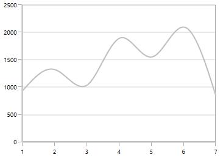

N> By default, Range is calculated between the minimum and maximum value of the data points.

### CategoryAxis

[`CategoryAxis`](http://help.syncfusion.com/cr/cref_files/wpf/sfchart/Syncfusion.SfChart.WPF~Syncfusion.UI.Xaml.Charts.CategoryAxis.html#) is an indexed based axis that plots values based on the index of the data point collection. The points are equally spaced here. The following code example initializes the [`CategoryAxis`](http://help.syncfusion.com/cr/cref_files/wpf/sfchart/Syncfusion.SfChart.WPF~Syncfusion.UI.Xaml.Charts.CategoryAxis.html#).



<syncfusion:SfChart.PrimaryAxis>

<syncfusion:CategoryAxis >

</syncfusion:CategoryAxis>

</syncfusion:SfChart.PrimaryAxis>



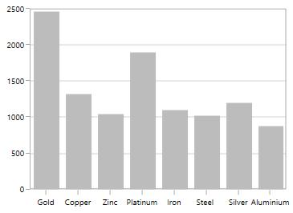

**LabelPlacement**

In [`CategoryAxis`](http://help.syncfusion.com/cr/cref_files/wpf/sfchart/Syncfusion.SfChart.WPF~Syncfusion.UI.Xaml.Charts.CategoryAxis.html#), labels is placed based on tick lines using [`LabelPlacement`](http://help.syncfusion.com/cr/cref_files/wpf/sfchart/Syncfusion.SfChart.WPF~Syncfusion.UI.Xaml.Charts.CategoryAxis~LabelPlacement.html#) property. By default the labels is placed OnTicks. The following code example demonstrates placing the label between ticks in [`CategoryAxis`](http://help.syncfusion.com/cr/cref_files/wpf/sfchart/Syncfusion.SfChart.WPF~Syncfusion.UI.Xaml.Charts.CategoryAxis.html#)



<syncfusion:SfChart.PrimaryAxis>

<syncfusion:CategoryAxis LabelPlacement="BetweenTicks">

</syncfusion:CategoryAxis>

</syncfusion:SfChart.PrimaryAxis>



### DateTimeAxis

[`DateTimeAxis`](http://help.syncfusion.com/cr/cref_files/wpf/sfchart/Syncfusion.SfChart.WPF~Syncfusion.UI.Xaml.Charts.DateTimeAxis.html#) is used to plot DateTime values. The [`DateTimeAxis`](http://help.syncfusion.com/cr/cref_files/wpf/sfchart/Syncfusion.SfChart.WPF~Syncfusion.UI.Xaml.Charts.DateTimeAxis.html#) is widely used to make financial charts in places like the Stock Market, where index plotting is done every day.



<syncfusion:SfChart.PrimaryAxis>

<syncfusion:DateTimeAxis  LabelFormat="MMM-dd"></syncfusion:DateTimeAxis>

</syncfusion:SfChart.PrimaryAxis>



**Customizing** **the** **Range**

[`Minimum`](http://help.syncfusion.com/cr/cref_files/wpf/sfchart/Syncfusion.SfChart.WPF~Syncfusion.UI.Xaml.Charts.DateTimeAxis~Minimum.html#) and [`Maximum`](http://help.syncfusion.com/cr/cref_files/wpf/sfchart/Syncfusion.SfChart.WPF~Syncfusion.UI.Xaml.Charts.DateTimeAxis~Maximum.html#) properties behavior is same as in NumericalAxis instead of setting numerical value, you have to set date time values.



<syncfusion:SfChart.PrimaryAxis>

<syncfusion:DateTimeAxis  Minimum="2015/01/10" Maximum="2015/07/01" LabelFormat="MMM-dd" 

IntervalType="Months" Interval="1">

</syncfusion:DateTimeAxis>

</syncfusion:SfChart.PrimaryAxis>



**Business** **Hours** **Range** **Calculation**

SfChart provides support to plot only the business hours in DateTimeAxis.This support is enabled by setting [`EnableBusinessHours`](http://help.syncfusion.com/cr/cref_files/wpf/sfchart/Syncfusion.SfChart.WPF~Syncfusion.UI.Xaml.Charts.DateTimeAxis~EnableBusinessHours.html#) property to true.

The following properties are used for business hour range calculation

* [`OpenTime`](http://help.syncfusion.com/cr/cref_files/wpf/sfchart/Syncfusion.SfChart.WPF~Syncfusion.UI.Xaml.Charts.DateTimeAxis~OpenTime.html#)- Represents the open working time of a day.
* [`CloseTime`](http://help.syncfusion.com/cr/cref_files/wpf/sfchart/Syncfusion.SfChart.WPF~Syncfusion.UI.Xaml.Charts.DateTimeAxis~CloseTime.html#)- Represents the close working time of a day.
* [`WorkingDays`](http://help.syncfusion.com/cr/cref_files/wpf/sfchart/Syncfusion.SfChart.WPF~Syncfusion.UI.Xaml.Charts.DateTimeAxis~WorkingDays.html#)- Represents the working days of a week.

The following code snippet demonstrates the business hours support in DateTimeAxis



<syncfusion:SfChart.PrimaryAxis>

<syncfusion:DateTimeAxis EnableBusinessHours="True" OpenTime="9" 

CloseTime="24" WorkingDays="Friday,Saturday,Sunday,Monday,Tuesday,Wednesday,Sunday">

</syncfusion:DateTimeAxis>

</syncfusion:SfChart.PrimaryAxis>



### DateTimeCategoryAxis

[`DateTimeCategoryAxis`](http://help.syncfusion.com/cr/cref_files/wpf/sfchart/Syncfusion.SfChart.WPF~Syncfusion.UI.Xaml.Charts.DateTimeCategoryAxis.html#) is a special type of axis used mainly with financial series. All the data points are plotted with equal spaces, similar to [`CategoryAxis`](http://help.syncfusion.com/cr/cref_files/wpf/sfchart/Syncfusion.SfChart.WPF~Syncfusion.UI.Xaml.Charts.CategoryAxis.html#), thereby removing space for missing dates. Intervals and range for the axis are calculated similar to [DateTimeAxis](http://help.syncfusion.com/cr/cref_files/wpf/sfchart/Syncfusion.SfChart.WPF~Syncfusion.UI.Xaml.Charts.DateTimeAxis.html#). There are no visual gaps between points, even when the difference between two points is more than a year.



<syncfusion:SfChart.PrimaryAxis>

<syncfusion:DateTimeCategoryAxis LabelFormat="MMM-dd" >

</syncfusion:DateTimeCategoryAxis>

</syncfusion:SfChart.PrimaryAxis>



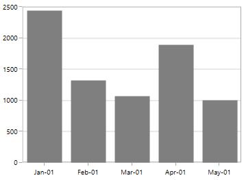

### TimeSpan Axis

[`TimeSpanAxis`](http://help.syncfusion.com/cr/cref_files/wpf/sfchart/Syncfusion.SfChart.WPF~Syncfusion.UI.Xaml.Charts.TimeSpanAxis.html#) is used to plot the time span values in the [`PrimaryAxis`](http://help.syncfusion.com/cr/cref_files/wpf/sfchart/Syncfusion.SfChart.WPF~Syncfusion.UI.Xaml.Charts.SfChart~PrimaryAxis.html#). [`TimeSpanAxis`](http://help.syncfusion.com/cr/cref_files/wpf/sfchart/Syncfusion.SfChart.WPF~Syncfusion.UI.Xaml.Charts.TimeSpanAxis.html#) has the advantage of plotting data with milliseconds difference. The limitation of [`TimeSpanAxis`](http://help.syncfusion.com/cr/cref_files/wpf/sfchart/Syncfusion.SfChart.WPF~Syncfusion.UI.Xaml.Charts.TimeSpanAxis.html#) is that it can only accept timespan values (hh:mm:ss) and date time values are not accepted.



<syncfusion:SfChart.PrimaryAxis>

<syncfusion:TimeSpanAxis >

</syncfusion:TimeSpanAxis>

</syncfusion:SfChart.PrimaryAxis>



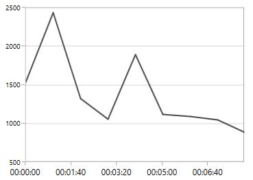

**Customizing** **the** **Range**

The following code snippet demonstrates the [`Minimum`](http://help.syncfusion.com/cr/cref_files/wpf/sfchart/Syncfusion.SfChart.WPF~Syncfusion.UI.Xaml.Charts.TimeSpanAxis~Minimum.html#) and [`Maximum`](http://help.syncfusion.com/cr/cref_files/wpf/sfchart/Syncfusion.SfChart.WPF~Syncfusion.UI.Xaml.Charts.TimeSpanAxis~Maximum.html#) properties for [`TimeSpanAxis`](http://help.syncfusion.com/cr/cref_files/wpf/sfchart/Syncfusion.SfChart.WPF~Syncfusion.UI.Xaml.Charts.TimeSpanAxis.html#).



<syncfusion:SfChart.PrimaryAxis>

<syncfusion:TimeSpanAxis Minimum="00:00:00" Maximum="00:10:00">

</syncfusion:TimeSpanAxis>

</syncfusion:SfChart.PrimaryAxis>



### LogarithmicAxis

[`LogarithmicAxis`](http://help.syncfusion.com/cr/cref_files/wpf/sfchart/Syncfusion.SfChart.WPF~Syncfusion.UI.Xaml.Charts.LogarithmicAxis.html#) is used to plot the logarithmic scale for the chart. The Logarithmic values will be plotted based on the logarithmic base value as 10.



<syncfusion:SfChart.SecondaryAxis>

<syncfusion:LogarithmicAxis />

</syncfusion:SfChart.SecondaryAxis>



**Logarithmic** **Base**

You can also change the base for logarithmic values. By default the logarithmic values is calculated the base from 10.The following code example demonstrates the logarithmic values in y axis calculated from base 2.



<syncfusion:SfChart.SecondaryAxis>

<syncfusion:LogarithmicAxis LogarithmicBase="2">

</syncfusion:LogarithmicAxis>

</syncfusion:SfChart.SecondaryAxis>



**Customizing** **the** **Range**

The following code snippet demonstrates the range customization of [`LogarithmicAxis`](http://help.syncfusion.com/cr/cref_files/wpf/sfchart/Syncfusion.SfChart.WPF~Syncfusion.UI.Xaml.Charts.LogarithmicAxis.html#) based on [`Minimum`](http://help.syncfusion.com/cr/cref_files/wpf/sfchart/Syncfusion.SfChart.WPF~Syncfusion.UI.Xaml.Charts.LogarithmicAxis~Minimum.html#) and [`Maximum`](http://help.syncfusion.com/cr/cref_files/wpf/sfchart/Syncfusion.SfChart.WPF~Syncfusion.UI.Xaml.Charts.LogarithmicAxis~Maximum.html#) properties.



<syncfusion:SfChart.SecondaryAxis>

<syncfusion:LogarithmicAxis Minimum="100" Maximum="7000" >

</syncfusion:LogarithmicAxis>

</syncfusion:SfChart.SecondaryAxis>



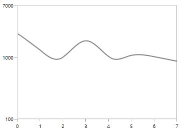

## Customizing the Intervals

[`ChartAxis`](http://help.syncfusion.com/cr/cref_files/wpf/sfchart/Syncfusion.SfChart.WPF~Syncfusion.UI.Xaml.Charts.ChartAxis.html#) calculates the range and intervals automatically based on the data points. The axis range and interval can be defined using the [`Minimum`](http://help.syncfusion.com/cr/cref_files/wpf/sfchart/Syncfusion.SfChart.WPF~Syncfusion.UI.Xaml.Charts.NumericalAxis~Minimum.html#), [`Maximum`](http://help.syncfusion.com/cr/cref_files/wpf/sfchart/Syncfusion.SfChart.WPF~Syncfusion.UI.Xaml.Charts.NumericalAxis~Maximum.html#) and [`Interval`](http://help.syncfusion.com/cr/cref_files/wpf/sfchart/Syncfusion.SfChart.WPF~Syncfusion.UI.Xaml.Charts.NumericalAxis~Interval.html#) properties.

**NumericalAxis**

The following code snippet demonstrates the interval customization in NumericalAxis.



<syncfusion:SfChart.SecondaryAxis>

<syncfusion:NumericalAxis Interval="250">

</syncfusion:NumericalAxis>

</syncfusion:SfChart.SecondaryAxis>



**CategoryAxis**

The following code snippet demonstrates the interval customization in CategoryAxis.



<syncfusion:SfChart.PrimaryAxis>

<syncfusion:CategoryAxis Interval="2">

</syncfusion:CategoryAxis>

</syncfusion:SfChart.PrimaryAxis>



**DateTimeAxis**

The DateTimeAxis interval value corresponds to the type specified in the [`IntervalType`](http://help.syncfusion.com/cr/cref_files/wpf/sfchart/Syncfusion.SfChart.WPF~Syncfusion.UI.Xaml.Charts.DateTimeAxis~IntervalType.html#) property.

For instance, if the Interval is set as 2 and [`IntervalType`](http://help.syncfusion.com/cr/cref_files/wpf/sfchart/Syncfusion.SfChart.WPF~Syncfusion.UI.Xaml.Charts.DateTimeAxis~IntervalType.html#) is set as Days, the labels are plotted for every two days. The following are the options for [`IntervalType`](http://help.syncfusion.com/cr/cref_files/wpf/sfchart/Syncfusion.SfChart.WPF~Syncfusion.UI.Xaml.Charts.DateTimeAxis~IntervalType.html#) property

Auto
* Days
* Hours
* Milliseconds
* Minutes
* Months
* Seconds
* Years

The default [`IntervalType`](http://help.syncfusion.com/cr/cref_files/wpf/sfchart/Syncfusion.SfChart.WPF~Syncfusion.UI.Xaml.Charts.DateTimeAxis~IntervalType.html#) of a [`DateTimeAxis`](http://help.syncfusion.com/cr/cref_files/wpf/sfchart/Syncfusion.SfChart.WPF~Syncfusion.UI.Xaml.Charts.DateTimeAxis_members.html#) is Auto. It calculates the type automatically and the interval, accordingly.

The following code snippet demonstrates the DateTimeAxis having one month interval.



<syncfusion:SfChart.PrimaryAxis>

<syncfusion:DateTimeAxis  Interval="1"  IntervalType="Months" LabelFormat="MMM-dd"></syncfusion:DateTimeAxis>

</syncfusion:SfChart.PrimaryAxis>



**DesiredIntervalsCount**

[`DesiredIntervalsCount`](http://help.syncfusion.com/cr/cref_files/wpf/sfchart/Syncfusion.SfChart.WPF~Syncfusion.UI.Xaml.Charts.ChartAxis~DesiredIntervalsCount.html#) property is used to specify the count of the axis labels between the first and last label. The following sample code defines the [`DesiredIntervalsCount`](http://help.syncfusion.com/cr/cref_files/wpf/sfchart/Syncfusion.SfChart.WPF~Syncfusion.UI.Xaml.Charts.ChartAxis~DesiredIntervalsCount.html#) property.



<syncfusion:SfChart.SecondaryAxis>

<syncfusion:NumericalAxis DesiredIntervalsCount="7">

</syncfusion:NumericalAxis>

</syncfusion:SfChart.SecondaryAxis>



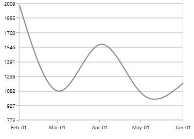

**Maximum** **Labels**

[`MaximumLabels`](http://help.syncfusion.com/cr/cref_files/wpf/sfchart/Syncfusion.SfChart.WPF~Syncfusion.UI.Xaml.Charts.ChartAxis~MaximumLabels.html#) property defines the count of the axis labels in the 100 pixels.



<syncfusion:SfChart.SecondaryAxis>

<syncfusion:NumericalAxis  MaximumLabels="2">

</syncfusion:NumericalAxis>

</syncfusion:SfChart.SecondaryAxis>

<syncfusion:ColumnSeries ItemsSource="{Binding Demands}" XBindingPath="Demand" YBindingPath="Year2010">

<syncfusion:ColumnSeries.YAxis>

<syncfusion:NumericalAxis MaximumLabels="2" >

</syncfusion:NumericalAxis>

</syncfusion:ColumnSeries.YAxis>

</syncfusion:ColumnSeries>



## Apply Padding to the Range

The [`NumericalAxis`](http://help.syncfusion.com/cr/cref_files/wpf/sfchart/Syncfusion.SfChart.WPF~Syncfusion.UI.Xaml.Charts.NumericalAxis.html#) and [`DateTimeAxis`](http://help.syncfusion.com/cr/cref_files/wpf/sfchart/Syncfusion.SfChart.WPF~Syncfusion.UI.Xaml.Charts.DateTimeAxis.html#) have a [`RangePadding`](http://help.syncfusion.com/cr/cref_files/wpf/sfchart/Syncfusion.SfChart.WPF~Syncfusion.UI.Xaml.Charts.NumericalAxis~RangePadding.html#) property that can be used to add padding to the range of a chart’s axes.

### DateTimeRangePadding

By default the date time range padding is auto.



<syncfusion:SfChart.PrimaryAxis>

<syncfusion:DateTimeAxis  RangePadding="Additional">

</syncfusion:DateTimeAxis>

</syncfusion:SfChart.PrimaryAxis>



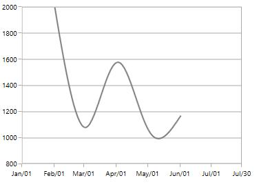

**Round**



<syncfusion:SfChart.PrimaryAxis>

<syncfusion:DateTimeAxis  RangePadding="Round">

</syncfusion:DateTimeAxis>

</syncfusion:SfChart.PrimaryAxis>



**None**



<syncfusion:SfChart.PrimaryAxis>

<syncfusion:DateTimeAxis  RangePadding="None">

</syncfusion:DateTimeAxis>

</syncfusion:SfChart.PrimaryAxis>****



### NumericalRangePadding

The following types are available for [`NumericalAxis`](http://help.syncfusion.com/cr/cref_files/wpf/sfchart/Syncfusion.SfChart.WPF~Syncfusion.UI.Xaml.Charts.NumericalAxis.html#):

* Additional
* None
* Normal
* Round
* Auto

By default, the default [`RangePadding`](http://help.syncfusion.com/cr/cref_files/wpf/sfchart/Syncfusion.SfChart.WPF~Syncfusion.UI.Xaml.Charts.NumericalAxis~RangePadding.html#) value for [`PrimaryAxis`](http://help.syncfusion.com/cr/cref_files/wpf/sfchart/Syncfusion.SfChart.WPF~Syncfusion.UI.Xaml.Charts.SfChart~PrimaryAxis.html#) is Auto and for [`SecondaryAxis`](http://help.syncfusion.com/cr/cref_files/wpf/sfchart/Syncfusion.SfChart.WPF~Syncfusion.UI.Xaml.Charts.SfChart~SecondaryAxis.html#), the default value is Round.

**Normal**



<syncfusion:SfChart.PrimaryAxis>

<syncfusion:NumericalAxis  RangePadding="Normal">

</syncfusion:NumericalAxis>

</syncfusion:SfChart.PrimaryAxis>



**Additional**



<syncfusion:SfChart.PrimaryAxis>

<syncfusion:NumericalAxis  RangePadding="Additional">

</syncfusion:NumericalAxis>

</syncfusion:SfChart.PrimaryAxis>



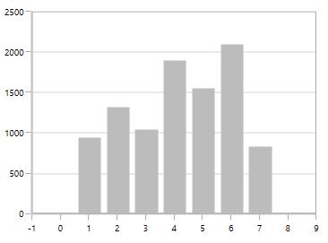

**None**



<syncfusion:SfChart.PrimaryAxis>

<syncfusion:NumericalAxis  RangePadding="None">

</syncfusion:NumericalAxis>

</syncfusion:SfChart.PrimaryAxis>



##  Applying Padding to the Axis

[`PlotOffset`](http://help.syncfusion.com/cr/cref_files/wpf/sfchart/Syncfusion.SfChart.WPF~Syncfusion.UI.Xaml.Charts.ChartAxis~PlotOffset.html#) property is used to provide padding to the axis. The following code snippet demonstrates the padding applied to both x and y axes.



<syncfusion:SfChart.PrimaryAxis>

<syncfusion:NumericalAxis  PlotOffset="30">

</syncfusion:NumericalAxis>

</syncfusion:SfChart.PrimaryAxis>

<syncfusion:SfChart.SecondaryAxis>

<syncfusion:NumericalAxis PlotOffset="30">

</syncfusion:NumericalAxis>

</syncfusion:SfChart.SecondaryAxis>



## Auto Interval Calculation on Zooming

[`EnableAutoIntervalOnZooming`](http://help.syncfusion.com/cr/cref_files/wpf/sfchart/Syncfusion.SfChart.WPF~Syncfusion.UI.Xaml.Charts.ChartAxis~EnableAutoIntervalOnZooming.html#) property is used to maintain the interval even it is in zooming state only if we set the interval to the axis. Default value of this property is true. While zooming based on the auto range padding the interval will be calculated.

If you set [`EnableAutoIntervalOnZooming`](http://help.syncfusion.com/cr/cref_files/wpf/sfchart/Syncfusion.SfChart.WPF~Syncfusion.UI.Xaml.Charts.ChartAxis~EnableAutoIntervalOnZooming.html#) as False, the intervals will be calculated on the interval based on the axis while zooming.



<syncfusion:SfChart.PrimaryAxis>

<syncfusion:NumericalAxis  EnableScrollBar="True" Interval="1"

EnableAutoIntervalOnZooming="False">

</syncfusion:NumericalAxis>

</syncfusion:SfChart.PrimaryAxis>



## Multiple Axes

SfChart provides a way to arrange multiple series inside the same chart area, giving the chart more space than x-axis and y-axis. These axes can be arranged in a stacking order or in a side by side pattern.

By default, all the series are plotted based on primary and secondary axis. You can add more axes by adding additional axis to the series. There are two properties [`XAxis`](http://help.syncfusion.com/cr/cref_files/wpf/sfchart/Syncfusion.SfChart.WPF~Syncfusion.UI.Xaml.Charts.CartesianSeries~XAxis.html#) and [`YAxis`](http://help.syncfusion.com/cr/cref_files/wpf/sfchart/Syncfusion.SfChart.WPF~Syncfusion.UI.Xaml.Charts.CartesianSeries~YAxis.html#) in all the series type which is used to provide Multiple axes support, except [`AccumulationSeries`](http://help.syncfusion.com/cr/cref_files/wpf/sfchart/Syncfusion.SfChart.WPF~Syncfusion.UI.Xaml.Charts.AccumulationSeriesBase.html#).



<syncfusion:ColumnSeries ItemsSource="{Binding Demands}"

XBindingPath="Demand"  YBindingPath="Year2011">

</syncfusion:ColumnSeries>

<syncfusion:LineSeries  ItemsSource="{Binding Demands}"

XBindingPath="Date"  YBindingPath="Year2011">

<syncfusion:LineSeries.XAxis>

<syncfusion:DateTimeAxis />

</syncfusion:LineSeries.XAxis>

<syncfusion:LineSeries.YAxis>

<syncfusion:NumericalAxis/>

</syncfusion:LineSeries.YAxis>

</syncfusion:LineSeries>



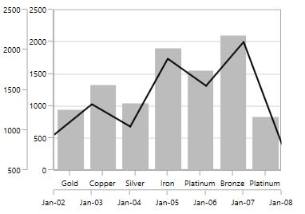

In the above image, the LineSeries is plotted based on additional X & Y axis and ColumnSeries (or remaining series) is plotted against the primary and secondary axis.

## Events

* [`ActualRangeChanged`](http://help.syncfusion.com/cr/cref_files/wpf/sfchart/Syncfusion.SfChart.WPF~Syncfusion.UI.Xaml.Charts.ChartAxis~ActualRangeChanged_EV.html#)   - Occurs at the when the range is changed in the axis.
* [`LabelCreated`](http://help.syncfusion.com/cr/cref_files/wpf/sfchart/Syncfusion.SfChart.WPF~Syncfusion.UI.Xaml.Charts.ChartAxis~LabelCreated_EV.html#)- Occurs when labels is created.
* [`AxisBoundChanged`](http://help.syncfusion.com/cr/cref_files/wpf/sfchart/Syncfusion.SfChart.WPF~Syncfusion.UI.Xaml.Charts.ChartAxis~AxisBoundsChanged_EV.html#)- Occurs when the bounds of the axis changed.
