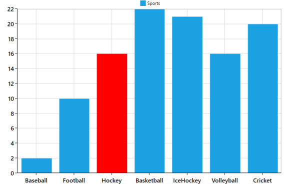

# EmptyPoints

The data collection that is passed to the chart can have NaN, or infinite values that are considered as empty points. You can show these empty points by setting the ShowEmptyPoints property to True. The representation of empty points can be modified in multiple ways by specifying the properties EmptyPointStyle, EmptyPointValue, EmptyPointInterior, and EmptyPointSymbolTemplate.

The following code example shows how to handle empty points in a series using sample data.




     <syncfusion:SfChart>

            <!-- Assign datacontext object for the Chart-->

            <syncfusion:SfChart.DataContext>

                <local:CategoryDataViewModel/>

            </syncfusion:SfChart.DataContext>

            <!-- Add Legend to the Chart-->

            <syncfusion:SfChart.Legend>

                <syncfusion:ChartLegend/>

            </syncfusion:SfChart.Legend>

            <!-- Add Axes to the Chart-->

            <syncfusion:SfChart.PrimaryAxis>

                <syncfusion:CategoryAxis/>

            </syncfusion:SfChart.PrimaryAxis>

            <syncfusion:SfChart.SecondaryAxis>

                <syncfusion:NumericalAxis/>

            </syncfusion:SfChart.SecondaryAxis>

<!-- Add ColumnSeries to the Chart-->

            <syncfusion:ColumnSeries Label="Sports" ItemsSource="{Binding EmptyPointDatas}"

                   XBindingPath="Category" YBindingPath="Value"

                   ShowEmptyPoints="True" EmptyPointInterior="Red"

                    EmptyPointStyle="Interior"

                    EmptyPointValue="Average"/>

        </syncfusion:SfChart>




public class CategoryDataViewModel

{

public CategoryDataViewModel()

{

EmptyPointDatas = new ObservableCollection<CategoryData>();

EmptyPointDatas.Add(new CategoryData("Baseball", 2, 1));

EmptyPointDatas.Add(new CategoryData("Football", 10, 6));

EmptyPointDatas.Add(new CategoryData("Hockey", double.NaN, double.NaN));

EmptyPointDatas.Add(new CategoryData("Basketball", 22, 18));

EmptyPointDatas.Add(new CategoryData("IceHockey", 21, 18));

EmptyPointDatas.Add(new CategoryData("Volleyball", 16, 12));

EmptyPointDatas.Add(new CategoryData("Cricket", 20, 15));

}

public ObservableCollection<CategoryData> EmptyPointDatas

{

get;

set;

}

}

public class CategoryData : INotifyPropertyChanged

{

private string category;

private double value;

private double value2;

public CategoryData(string category, double value, double value2)

{

Category = category; Value = value; Value2 = value2;

}

public string Category

{

get

{ return category; }

set

{

if (category != value)

{

category = value;

OnPropertyChanged("Category");

}

}

}

public double Value

{

get

{ return value; }

set

{

if (this.value != value)

{

this.value = value;

OnPropertyChanged("Value");

}

}

}

public double Value2

{

get

{ return value2; }

set

{

if (value2 != value)

{

value2 = value; OnPropertyChanged("Value2");

}

}

}

void OnPropertyChanged(string propertyName)

{

if (PropertyChanged != null)

{

PropertyChanged(this, new PropertyChangedEventArgs(propertyName));

}

}

public event PropertyChangedEventHandler PropertyChanged;

}




The following is a screenshot of a ColumnSeries with empty points.

