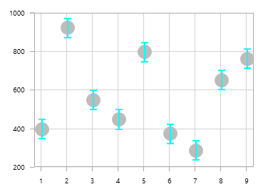
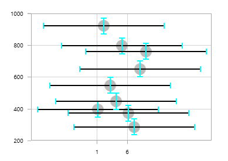

# Error Bars

[ErrorBarSeries](http://help.syncfusion.com/cr/cref_files/wpf/sfchart/Syncfusion.SfChart.WPF~Syncfusion.UI.Xaml.Charts.ErrorBarSeries.html# "") is used to indicate the errors or uncertainty in reported values. This will find the possible variations in measurements, and in Chart control these values are displayed as data points.

The [`HorizontalErrorValue`](http://help.syncfusion.com/cr/cref_files/wpf/sfchart/Syncfusion.SfChart.WPF~Syncfusion.UI.Xaml.Charts.ErrorBarSeries~HorizontalErrorValue.html# "") and [`VerticalErrorValue`](http://help.syncfusion.com/cr/cref_files/wpf/sfchart/Syncfusion.SfChart.WPF~Syncfusion.UI.Xaml.Charts.ErrorBarSeries~VerticalErrorValue.html# "") is used to set the error value(variation) to the series.

The following code examples illustrates how to create error bar series:



<chart:ScatterSeries ScatterWidth="20" ScatterHeight="20"  Label="Coal" 

ItemsSource="{Binding EnergyProductions}" Interior="#BCBCBC"

XBindingPath="ID" YBindingPath="Coal">

</chart:ScatterSeries>

<chart:ErrorBarSeries Name="Errorseries"   ItemsSource="{Binding EnergyProductions}" 

XBindingPath="ID" YBindingPath="Coal" 

VerticalErrorValue="50" HorizontalErrorValue="1" >

</chart:ErrorBarSeries>



## Mode

This [`Mode`](http://help.syncfusion.com/cr/cref_files/wpf/sfchart/Syncfusion.SfChart.WPF~Syncfusion.UI.Xaml.Charts.ErrorBarSeries~Mode.html# "") property is used to define whether to identify horizontal error or vertical error. By default, the Mode value is Both, which will display both horizontal and vertical error values.

### Horizontal

To view horizontal error value, you can set the Mode as Horizontal as shown in the below code example.



<chart:ErrorBarSeries Name="Errorseries"   ItemsSource="{Binding EnergyProductions}" 

XBindingPath="ID" YBindingPath="Coal"                                  

VerticalErrorValue="50" HorizontalErrorValue="1" 

Mode="Horizontal">



### Vertical

To view vertical error value, you can set the Mode as Horizontal as shown in the below code example.



<chart:ErrorBarSeries Name="Errorseries"   ItemsSource="{Binding EnergyProductions}" 

XBindingPath="ID" YBindingPath="Coal" 

VerticalErrorValue="50" HorizontalErrorValue="1" 

Mode="Vertical">



## Type

SfChart supports the following type of error bar series.

* Fixed, 
* Percentage, 
* Standard Deviation,
* Standard Error.

N> The default error bar series is Fixed.

### Fixed



<chart:ErrorBarSeries Name="Errorseries"  

ItemsSource="{Binding EnergyProductions}" 

XBindingPath="ID" 

YBindingPath="Coal" 

VerticalErrorValue="40" HorizontalErrorValue="10" 

Mode="Both" Type="Fixed">



### Percentage



<chart:ErrorBarSeries Name="Errorseries"  

ItemsSource="{Binding EnergyProductions}" 

XBindingPath="ID" 

YBindingPath="Coal" 

VerticalErrorValue="40" HorizontalErrorValue="10" 

Mode="Both" Type="Percentage">



### Standard Deviation



<chart:ErrorBarSeries Name="Errorseries"  

ItemsSource="{Binding EnergyProductions}" 

XBindingPath="ID" 

YBindingPath="Coal" 

VerticalErrorValue="40" HorizontalErrorValue="10" 

Mode="Both" Type="StandardDeviation"/>



### Standard Errors



<chart:ErrorBarSeries Name="Errorseries"  

ItemsSource="{Binding EnergyProductions}" 

XBindingPath="ID" 

YBindingPath="Coal" 

VerticalErrorValue="40" HorizontalErrorValue="10" 

Mode="Both" Type="StandardErrors"/>



### Custom

If the Type is Custom, you have to bind [`HorizontalErrorPathValue`](http://help.syncfusion.com/cr/cref_files/wpf/sfchart/Syncfusion.SfChart.WPF~Syncfusion.UI.Xaml.Charts.ErrorBarSeries~HorizontalErrorPath.html# "") and [`VerticalErrorPathValue`](http://help.syncfusion.com/cr/cref_files/wpf/sfchart/Syncfusion.SfChart.WPF~Syncfusion.UI.Xaml.Charts.ErrorBarSeries~VerticalErrorPath.html# "") as shown in the below code snippet.



<chart:ErrorBarSeries Name="Errorseries"  

ItemsSource="{Binding EnergyProductions}" 

XBindingPath="ID" 

YBindingPath="Coal" 

HorizontalErrorPath="HorizontalErrorValue"

VerticalErrorPath="VerticalErrorValue"

Mode="Both" Type="Custom"/>



## Customization 

SfChart provides customization properties for the error bar lines as in the following section.

### Line Style

You can define the LineStyle for the error bar lines using [`HorizontalLineStyle`](http://help.syncfusion.com/cr/cref_files/wpf/sfchart/Syncfusion.SfChart.WPF~Syncfusion.UI.Xaml.Charts.ErrorBarSeries~HorizontalLineStyle.html# "") and [`VerticalLineStyle`](http://help.syncfusion.com/cr/cref_files/wpf/sfchart/Syncfusion.SfChart.WPF~Syncfusion.UI.Xaml.Charts.ErrorBarSeries~VerticalLineStyle.html# "") properties as in the below code examples.



<chart:ErrorBarSeries.HorizontalLineStyle>

<chart:LineStyle Stroke="Black"  StrokeThickness="2"  >

</chart:LineStyle>

</chart:ErrorBarSeries.HorizontalLineStyle>





<chart:ErrorBarSeries.VerticalLineStyle>

<chart:LineStyle Stroke="Black"  StrokeThickness="2"  >

</chart:LineStyle>

</chart:ErrorBarSeries.VerticalLineStyle>



### Line Cap Style

ErrorBar line cap can be customized using [`HorizontalCapLineStyle`](http://help.syncfusion.com/cr/cref_files/wpf/sfchart/Syncfusion.SfChart.WPF~Syncfusion.UI.Xaml.Charts.ErrorBarSeries~HorizontalCapLineStyle.html# "") and [`VerticalCapLineStyle`](http://help.syncfusion.com/cr/cref_files/wpf/sfchart/Syncfusion.SfChart.WPF~Syncfusion.UI.Xaml.Charts.ErrorBarSeries~VerticalCapLineStyle.html# "") as in the below code examples.



<chart:ErrorBarSeries.HorizontalCapLineStyle>

<chart:CapLineStyle Stroke="Black" StrokeThickness="2"  

LineWidth="10"></chart:CapLineStyle>

</chart:ErrorBarSeries.HorizontalCapLineStyle>





<chart:ErrorBarSeries.VerticalCapLineStyle>

<chart:CapLineStyle Stroke="Black" StrokeThickness="3"  

LineWidth="15"></chart:CapLineStyle>

</chart:ErrorBarSeries.VerticalCapLineStyle>



