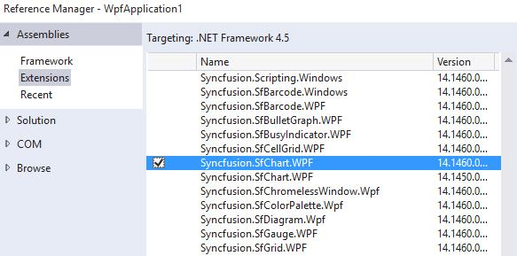
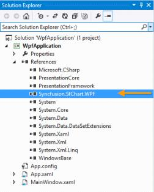
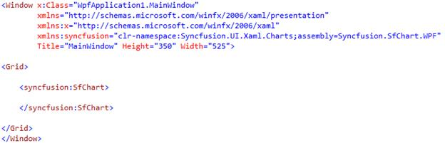
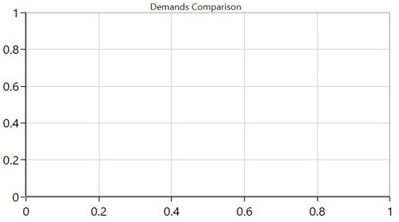
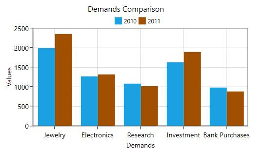
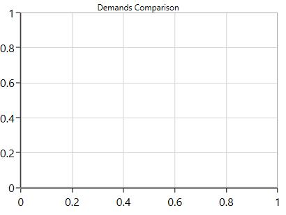
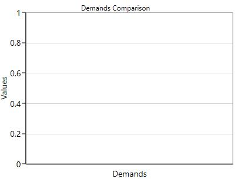

# Getting Started

The following section helps you to build your application with SfChart. 

## Steps

   * Create new WPF project using Visual Studio. For more [details](https://msdn.microsoft.com/en-IN/library/bb546958(v=vs.90))
   * Add the SfChart assembly to your application. 
   * Initialize chart control.
   * Adding header to the chart control.
   * Adding axes to the chart control.
   * Adding series to the chart control.
   * Adding legends for the series.
   
These steps were explained below for both XAML and code behind.

## Create a simple chart from XAML

### Adding assembly reference

1. Open the Add Reference window from your project.
2. Choose Windows > Extensions > Syncfusion.SfChart.WPF.

N> This window differs for the Visual Basic project.

T> Select the framework version respective to your application. The version can be identified as below:
<table>
<tr>
<td>
XX.X450.0.X
</td> 
 <td>4.5 Framework
 </td>
 </tr>
<tr>
<td>XX.X451.0.X
</td>
<td>4.5.1 Framework
</td>
</tr>
<tr>
<td>XX.X460.0.X
</td>
<td>4.6 Framework
</td>
</tr>
</table>

Add the following namespace in your XAML window.


xmlns:syncfusion="clr-namespace:Syncfusion.UI.Xaml.Charts;assembly=Syncfusion.SfChart.WPF"


### Add SfChart from Toolbox

Drag and drop the SfChart control from the Toolbox to your application.

Now the Syncfusion.SfChart.WPF reference is added to the application references and the xmlns namespace code is generated in MainWindow.xaml as below.

In this section, the data in the following table is used for demonstration.

**Gold** **Demand** **in** **World** **market**

<table>
<tr>
<th>
Demand for Gold
</th>
<th>
2010 (In Tonnes)
</th>
<th>
2011 (In Tonnes)
</th>
</tr>
<tr>
<td>
Jewelry
</td>
<td>
1,998.0
</td>
<td>
2,361.2
</td>
</tr>
<tr>
<td>
Electronics
</td>
<td>
1284.0
</td>
<td>
1328.0
</td>
</tr>
<tr>
<td>
Research
</td>
<td>
1090.5
</td>
<td>
1032.0
</td>
</tr>
<tr>
<td>
Investment
</td>
<td>
1,643.0
</td>
<td>
1898.0
</td>
</tr>
<tr>
<td>
Bank Purchases
</td>
<td>
987.0
</td>
<td>
887.7
</td>
</tr>
</table>

Before proceeding with the chart, create data model with the above details as follows.


    public class GoldDemand
    {
        public string Demand { get; set; } 
        public double Year2010 { get; set; } 
        public double Year2011 { get; set; }
    }


Create a collection property in MainWindow class as below:


    public partial class MainWindow : Window
    {
        public MainWindow()
        {
            InitializeComponent();
        }

        public ObservableCollection<GoldDemand> Demands { get; set; } 
    }


Add the values to this Demands property, with the values illustrated in the above table.



InitializeComponent();

this.Demands = new ObservableCollection<GoldDemand> 
{ 
      new GoldDemand() 
      { 
        Demand = "Jewelry", Year2010 = 1998.0, Year2011 = 2361.2 }, 
        new GoldDemand() { Demand = "Electronics", Year2010 = 1284.0, Year2011 = 1328.0 }, 
        new GoldDemand() { Demand = "Research", Year2010 = 1090.5, Year2011 = 1032.0 }, 
        new GoldDemand() { Demand = "Investment", Year2010 = 1643.0, Year2011 = 1898.0 }, 
        new GoldDemand() { Demand = "Bank Purchases", Year2010 = 987.0, Year2011 = 887.0 }
      } 
};



### Initialize the chart


<Grid>
        
    <syncfusion:SfChart>
            
    </syncfusion:SfChart>
            
</Grid>


### Initialize the chart 

You need to initialize the chart represented by the following class Syncfusion.UI.Xaml.SfChart.



<syncfusion:SfChart>

</syncfusion:SfChart>



### Add header to chart

The header of the chart acts as the title, to identify its purpose. 

Here you specify “Demands Comparison” as header as in below code example.



    <Grid>

        <syncfusion:SfChart Header="Demands Comparison" Height="300" Width="400">
                        
        </syncfusion:SfChart>

    </Grid>



### Adding Axes

The following code example illustrates how to add primary (horizontal) and secondary (vertical) axes to the SfChart.



<syncfusion:SfChart.PrimaryAxis>
    <syncfusion:CategoryAxis Header="Demands" FontSize="14"/>
</syncfusion:SfChart.PrimaryAxis>
            
<syncfusion:SfChart.SecondaryAxis>
    <syncfusion:NumericalAxis Header="Values" FontSize="14"/>
</syncfusion:SfChart.SecondaryAxis>



N> SfChart supports default axes, so that these axes (primary and secondary axis) will get generated automatically based upon the data bind to the chart, if You didn’t specify the axes explicitly. 

### Adding series 

You can add any type of series ranges from line, scatter to financial types series. For demo purpose, we have chosen column series for demo purpose. 

You need to initialize two series for representing the years 2010 and 2011 respectively (refer table).


<syncfusion:ColumnSeries/> 
<syncfusion:ColumnSeries/>


T> The graph selection depends on user scenario and the nature of the data. For example, consider a case where you are developing a chart to visualize the number of online users on a website for any given 30-minute interval during the day. In this scenario, since the data plotted is of high density and also based on two independent variables, choosing the line graph series would provide proper visualization.

After you have added the series, you need to add ItemSource, XBindingPath and YBindingPath APIs, to populate your data in the chart.

* `ItemsSource` - It is a property to hold our data source, like other collection controls like ListBox and ComboBox, that you can bind your underlying collection to it.
* `XBindingPath` - It is a string property, used to map properties that need to be bound to the Primary Axis (or XAxis). It is like a value member path in ListBox.
* `YBindingPath` - It is a string property, used to map properties that need to be bound to the Secondary Axis (Or YAxis). It is like a value member path in ListBox.
* `Label` - This property gives names for the series, which in turn mapped by the Legend.


<syncfusion:ColumnSeries Label="2010" ItemsSource="{Binding Demands}" XBindingPath="Demand" YBindingPath="Year2010" />

<syncfusion:ColumnSeries Label="2011" ItemsSource="{Binding Demands}" XBindingPath="Demand" YBindingPath="Year2011" />


### Add legends to the chart

The following code example illustrates the syntax to add the [`legends`](http://help.syncfusion.com/wpf/sfchart/legend) in chart. 



<syncfusion:SfChart.Legend>
    <syncfusion:ChartLegend Visibility="Visible"/>
</syncfusion:SfChart.Legend>



Now you have prepared a Chart demonstrating the studies related to Gold demands in World market. The following code example gives you the complete code for creating a chart.



<syncfusion:SfChart HorizontalAlignment="Center" VerticalAlignment="Center" Header="Demands Comparison" FontSize="16" 
                    Height="300" Width="500">
            
    <!--Initialize the horizontal for SfChart-->
    <syncfusion:SfChart.PrimaryAxis>
        <syncfusion:CategoryAxis Header="Demands" FontSize="14"/>
    </syncfusion:SfChart.PrimaryAxis>
            

    <!--Initialize the vertical for SfChart-->
    <syncfusion:SfChart.SecondaryAxis>
        <syncfusion:NumericalAxis Header="Values" FontSize="14"/>
    </syncfusion:SfChart.SecondaryAxis>

            
    <!--Adding Legend to the SfChart-->
    <syncfusion:SfChart.Legend>
        <syncfusion:ChartLegend Visibility="Visible"/>
    </syncfusion:SfChart.Legend>
            

    <!--Initialize the series for SfChart-->
    <syncfusion:ColumnSeries Label="2010" ItemsSource="{Binding Demands}" XBindingPath="Demand" YBindingPath="Year2010" />

    <syncfusion:ColumnSeries Label="2011" ItemsSource="{Binding Demands}" XBindingPath="Demand" YBindingPath="Year2011" />
            
</syncfusion:SfChart>



### Code Behind



    public partial class MainWindow : Window
    {
        public MainWindow()
        {
            InitializeComponent();

            this.Demands = new ObservableCollection<GoldDemand> 
            { 
                new GoldDemand() 
                { 
                    Demand = "Jewelry", Year2010 = 1998.0, Year2011 = 2361.2 
                }, 
                    new GoldDemand() { Demand = "Electronics", Year2010 = 1284.0, Year2011 = 1328.0 },
                    new GoldDemand() { Demand = "Research", Year2010 = 1090.5, Year2011 = 1032.0 }, 
                    new GoldDemand() { Demand = "Investment", Year2010 = 1643.0, Year2011 = 1898.0 }, 
                    new GoldDemand() { Demand = "Bank Purchases", Year2010 = 987.0, Year2011 = 887.0 } 
            };

            this.DataContext = this;
        }

        public ObservableCollection<GoldDemand> Demands { get; set; } 
    }

    public class GoldDemand
    {
        public string Demand { get; set; } 
        public double Year2010 { get; set; } 
        public double Year2011 { get; set; }
    }


    
The following chart is created as a result of the above codes.

## Create a simple chart from code behind (C#/VB)

Some developers prefer code behind as the first approach for development, to create things dynamically. This section helps you create to SfChart from code behind.

### Adding assembly reference

* Open the Add Reference window from your project.
* Choose Windows > Extensions >Syncfusion.SfChart.WPF
* Add the following namespace in your C# file, MainWindow.xaml.cs.



using Syncfusion.UI.Xaml.Charts;





Imports Syncfusion.UI.Xaml.Charts



### Initialize the chart

You need to create the instance for the SfChart as below.



SfChart chart = new SfChart();





Dim chart As New SfChart()



### Adding header to the chart

The header acts as the title for the Chart you created, to identify its purpose.



chart.Header = "Demands Comparison";





chart.Header = "Demands Comparison"



### Adding Axes

The following code example illustrates how to add Primary (horizontal) and Secondary (vertical) axes to the SfChart.



//Adding horizontal axis to the chart 

CategoryAxis primaryAxis = new CategoryAxis(); 

primaryAxis.Header = "Demands"; 

chart.PrimaryAxis = primaryAxis; 

//Adding vertical axis to the chart 

NumericalAxis secondaryAxis = new NumericalAxis(); 

secondaryAxis.Header = "Values"; 

chart.SecondaryAxis = secondaryNumericalAxis;





'Adding horizontal axis to the chart 

Dim primaryAxis As New CategoryAxis()

primaryAxis.Header = "Demands"

chart.PrimaryAxis = primaryAxis

'Adding vertical axis to the chart 

Dim secondaryAxis As New NumericalAxis()

secondaryAxis.Header = "Values"

chart.SecondaryAxis = secondaryAxis



N> SfChart supports default axes, so that these axes (primary and secondary axis) will get generated automatically based upon the data bind to the chart, if you didn’t specify the axes explicitly. 

### Adding series

You can add any type of series ranges from line, scatter to financial types series. For demo purpose, we have chosen column series for demo purpose. 

You need to initialize two series for representing the years 2010 and 2011 respectively (refer table).



ColumnSeries series1 = new ColumnSeries();

ColumnSeries series2 = new ColumnSeries();





Dim series1 As New ColumnSeries()

Dim series2 As New ColumnSeries()



T> The graph selection depends on the user scenario and the nature of the data. For example, consider the case where a user is developing a chart to visualize the number of online users on a website for any given 30-minute interval during the day. In this scenario, since the data plotted is of high density and also based on two independent variables, choosing the line graph series would provide proper visualization.

After you have added the series, you need to add ItemSource, XBindingPath and YBindingPath APIs, to populate your data in the chart.

* `ItemsSource` - It is a property to hold our data source, like other collection controls like ListBox and ComboBox, that you can bind your underlying collection to it.
* `XBindingPath` - It is a string property, used to map properties that need to be bound to the PrimaryAxis (or XAxis). It is like a value member path in ListBox.
* `YBindingPath` - It is a string property, used to map properties that need to be bound to the SecondaryAxis (Or YAxis). It is like a value member path in ListBox.
* `Label` - This property gives names for the series, which in turn mapped by the Legend.



ColumnSeries series1 = new ColumnSeries();

series1.ItemsSource = this.Demands;

series1.XBindingPath = "Demand";

series1.YBindingPath = "Year2010";

ColumnSeries series2 = new ColumnSeries();

series2.XBindingPath = "Demand";

series2.YBindingPath = "Year2011";

series2.ItemsSource = this.Demands;

chart.Series.Add(series1);

chart.Series.Add(series2);





Dim series1 As New ColumnSeries()

series1.ItemsSource = Me.Demands

series1.XBindingPath = "Demand"

series1.YBindingPath = "Year2010"

Dim series2 As New ColumnSeries()

series2.XBindingPath = "Demand"

series2.YBindingPath = "Year2011"

series2.ItemsSource = Me.Demands

chart.Series.Add(series1)

chart.Series.Add(series2)



N> Syncfusion Chart also supports rendering combination of multiple series. Refer this for details.

### Adding legends to the chart

The following code examples demonstrates how to add [`legends`](http://help.syncfusion.com/wpf/sfchart/legend) to your chart.



ChartLegend legend = new ChartLegend();

legend.Visibility = System.Windows.Visibility.Visible;

chart.Legend = legend; 





Dim legend As New ChartLegend()

legend.Visibility = System.Windows.Visibility.Visible

chart.Legend = legend



Now you have prepared a Chart demonstrating the studies related to Gold demands in World market. 

The following code example gives you the complete code for creating a chart.



SfChart chart = new SfChart();

chart.Header = "Demands Comparison";

//Adding horizontal axis to the chart

CategoryAxis primaryCategoryAxis = new CategoryAxis(); 

primaryCategoryAxis.Header = "Demands"; 

chart.PrimaryAxis = primaryCategoryAxis; 

//Adding vertical axis to the chart 

NumericalAxis secondaryNumericalAxis = new NumericalAxis(); 

secondaryNumericalAxis.Header = "Values"; 

chart.SecondaryAxis = secondaryNumericalAxis;

//Initialize the two series for SfChart
ColumnSeries series1 = new ColumnSeries();

series1.ItemsSource = this.Demands;

series1.XBindingPath = "Demand";

series1.YBindingPath = "Year2010";

ColumnSeries series2 = new ColumnSeries();

series2.XBindingPath = "Demand";

series2.YBindingPath = "Year2011";

series2.ItemsSource = this.Demands;

//Adding Series to the Chart Series Collection
chart.Series.Add(series1);

chart.Series.Add(series2);

//Adding Legends for the chart
ChartLegend legend = new ChartLegend();

legend.Visibility = System.Windows.Visibility.Visible;

chart.Legend = legend;

//Setting Chart as a Content for the Grid in Page
this.MainGrid.Children.Add(chart);





Dim chart As New SfChart()

chart.Header = "Demands Comparison"

'Adding horizontal axis to the chart 

Dim primaryAxis As New CategoryAxis()

primaryAxis.Header = "Demands"

chart.PrimaryAxis = primaryAxis

'Adding vertical axis to the chart  

Dim secondaryAxis As New NumericalAxis()

secondaryAxis.Header = "Values"

chart.SecondaryAxis = secondaryAxis

'Initialize the two series for SfChart
Dim series1 As New ColumnSeries()

series1.ItemsSource = Me.Demands

series1.XBindingPath = "Demand"

series1.YBindingPath = "Year2010"

Dim series2 As New ColumnSeries()

series2.XBindingPath = "Demand"

series2.YBindingPath = "Year2011"

series2.ItemsSource = Me.Demands

'Adding Series to the Chart Series Collection

chart.Series.Add(series1)

chart.Series.Add(series2)

'Adding Legends for the chart

Dim legend As New ChartLegend()

legend.Visibility = System.Windows.Visibility.Visible

chart.Legend = legend

'Setting Chart as a Content for the Grid in Page

Me.MainGrid.Children.Add(chart)



The following output is displayed as a result of the above code example.

