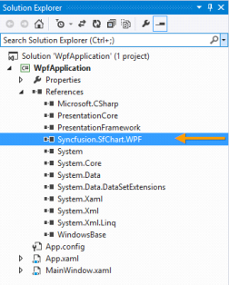
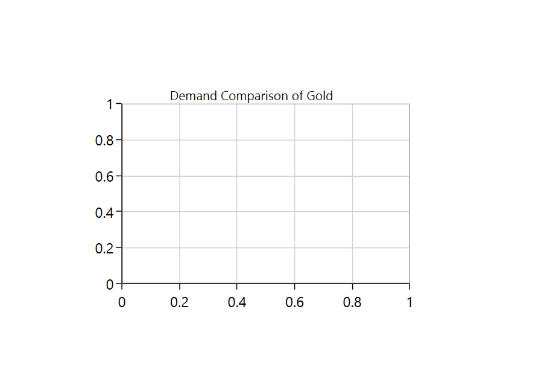
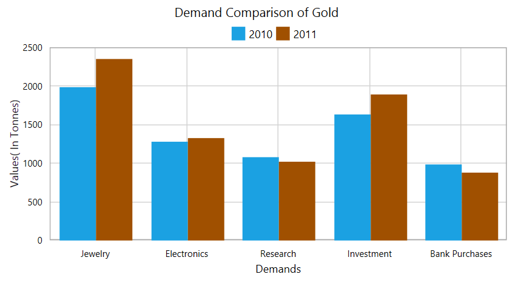
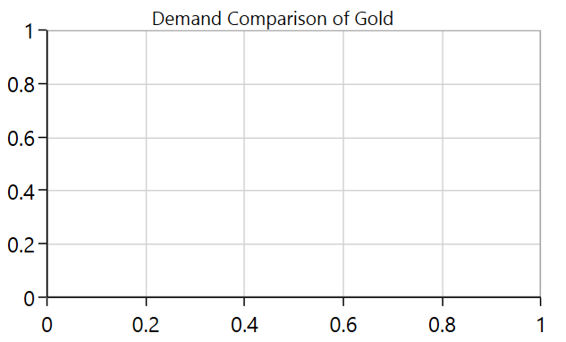
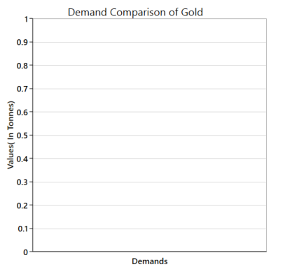
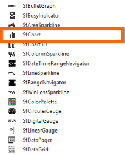

---
layout: post
title: Getting Started| SfChart | Wpf | Syncfusion
description: getting started
platform: wpf
control: SfChart
documentation: ug
---

# Getting Started

This section helps you get started with the SfChart control.

##Visual Structure

###Create a simple Chart from XAML

###Create a simple Chart from Code Behind 

## Visual Structure

The following image helps you understand various elements in SfChart, when you use it for the first time. 

A chart is composed of various elements such as ChartSeries, ChartLegend, ChartAxis, ChartAdornment, grid lines and headers. 

**Chart Header** - Represents the title of the chart.
**ChartSeries** - Represents the type of chart to be drawn in the chart area.
**ChartLegend** - Displays brief information about the ChartSeries plotted in the chart area.
**ChartAdornment** - Displays information about the data points in ChartSeries.
**ChartAxis** - Displays a linear scale of values with definite intervals between them.

## Create a simple chart from XAML

This session demonstrates how to create a chart using SfChart control from XAML. For that, you must add the SfChart reference to your application.

###Add assembly reference

1. Open the Add Reference window from your project.
2. Choose Windows > Extensions >Syncfusion.SfChart.WPF.
3. Add the following namespace in your XAML page.



xmlns:syncfusion="clr-namespace:Syncfusion.UI.Xaml.Charts;assembly=Syncfusion.SfChart.WPF"



N> Adding the extension Syncfusion.SfChart.WPF, adds all the Syncfusion WPF controls.You can also add the SfChart reference alone from the following location. C:\Program Files (x86)\Syncfusion\Essential Studio\<version>\Assemblies\(3.5/4.0/4.5.1)<Visual Studio Version>

###Initialize the Chart 

You need to initialize the chart represented by the following class Syncfusion.UI.Xaml.SfChart.



<syncfusion:SfChart>

</syncfusion:SfChart>


###Add SfChart from Toolbox

Drag and drop the SfChart control from the Toolbox to the required location, where the chart has to be displayed. You can select Toolbox from the View menu, when the toolbox window is not available in the project. Now the Toolbox window appears at the left end of the screen.

The Syncfusion WPF reference is added to the application reference and the xmlns namespace is added to MainPage.xaml.

The data in the following table is used to plot the chart for the demand for gold in the world market.

Gold Demand in World market

<table>
<tr>
<th>
Demand for Gold</th><th>
2010 (In Tonnes)</th><th>
2011 (In Tonnes)</th></tr>
<tr>
<td>
Jewelry </td><td>
1,998.0</td><td>
2,361.2</td></tr>
<tr>
<td>
Electronics</td><td>
1284.0</td><td>
1328.0</td></tr>
<tr>
<td>
Research </td><td>
1090.5</td><td>
1032.0</td></tr>
<tr>
<td>
Investment</td><td>
1,643.0</td><td>
1898.0</td></tr>
<tr>
<td>
Bank Purchases</td><td>
987.0</td><td>
887.7</td></tr>
</table>

Before proceeding with the chart, create data model chart with the above details as follows.



public class GoldDemand

{

public string Demand { get; set; }

public double Year2010 { get; set; }

public double Year2011 { get; set; }

}



Now, you have a model chart with properties like Demand and Values that can hold values of each item in the collection.



public ObservableCollection<GoldDemand> Demands { get; set; }

Populate the underlying collection


Add the values to the above defined collection property called Demand, with the values illustrated in the above table.



this.Demands = new ObservableCollection<GoldDemand>

{

new GoldDemand() {Demand = "Jewelry", Year2010 = 1998.0, Year2011 = 2361.2},

new GoldDemand() {Demand = "Electronics", Year2010 = 1284.0, Year2011 = 1328.0},

new GoldDemand() {Demand = "Research", Year2010 = 1090.5, Year2011 = 1032.0},

new GoldDemand() {Demand = "Investment", Year2010 = 1643.0, Year2011 = 1898.0},

new GoldDemand() {Demand = "Bank Purchases", Year2010 = 987.0, Year2011 = 887.0}

};

Now you can add the chart elements required for the above scenario to the SfChart instance created.

### Add Header to Chart

The header of the chart acts as the title of the chart created, to identify its purpose. Here, the header, Demand Comparison of Gold, is added.



<syncfusion:SfChart HorizontalAlignment="Center" VerticalAlignment="Center" 

Header="Demand Comparison of Gold" 

Height="300" Width="500">

</syncfusion:SfChart>



### Add Axes

The following code example illustrates how to add Primary (horizontal) and Secondary (vertical) axes to the SfChart.



<syncfusion:SfChart.PrimaryAxis>

<syncfusion:CategoryAxis Header="Demands" FontSize="14"/>

</syncfusion:SfChart.PrimaryAxis>

<syncfusion:SfChart.SecondaryAxis>

<syncfusion:NumericalAxis Header="Values ( In Tonnes)" FontSize="14"/>

</syncfusion:SfChart.SecondaryAxis>



N> SfChart supports default axes (primary and secondary axis will be generated automatically), which will create the primary and secondary axis based on the data binded with chart. 

###Add ChartSeries to Chart

To begin plotting data, choose from a wide variety of graphical representations available from the chart library such as LineSeries, ColumnSeries. ColumnSeries is created in the following example. Two column series are initialized to represent the years 2010 and 2011 respectively.

Tip: The graph selection depends on user scenario and the nature of the data. For example, consider a case where you are developing a chart to visualize the number of online users on a website for any given 30-minute interval during the day. In this scenario, since the data plotted is of high density and also based on two independent variables, choosing the line graph series would provide proper visualization.
 

<table>
<tr>
<th>
<syncfusion:ColumnSeries Label="2010"                                 ItemsSource="{Binding Demands}"                                XBindingPath="Demand"                                YBindingPath="Year2010"                                />            <syncfusion:ColumnSeries Label="2011"                                 ItemsSource="{Binding Demands}"                                XBindingPath="Demand"                                YBindingPath="Year2011"/></th></tr>
<tr>
<td>
{{ 'Note: Syncfusion Chart also supports rendering combination of multiple series.' | markdownify }}</td></tr>
</table>

After you have added the series, you can add ItemSource, XBindingPath and YBindingPath APIs, to populate your data to the chart. 

**ItemsSource**- It is a collection property, like other collection controls like ListBox and ComboBox, that you can bind your underlying collection to it.

**XBindingPath**- It is a string property, used to map properties that need to be bound to the Primary Axis (or XAxis). It is like a value member path in ListBox.

**YBindingPath**- It is a string property, used to map properties that need to be bound to the Secondary Axis (Or YAxis). It is like a value member path in ListBox.

**Label**- This property gives names for the series, mapped by the Legend.

### Add Legends to Chart

Legends act as indicators for the chart. They carry some metadata about plotting data in the ChartSeries. (For more details)



<syncfusion:SfChart.Legend>

<syncfusion:ChartLegend Visibility="Visible"/>

</syncfusion:SfChart.Legend>



Now you have created a Chart demonstrating the studies related to Gold demands in World market. The following code examples are for both XAML and CodeBehind.



<syncfusion:SfChart HorizontalAlignment="Center" VerticalAlignment="Center" Header="Demand Comparison of Gold" FontSize="16" Height="300" Width="500">

<!--Initialize the Primary Axis for SfChart-->

<syncfusion:SfChart.PrimaryAxis>

<syncfusion:CategoryAxis Header="Demands" FontSize="14"/>

</syncfusion:SfChart.PrimaryAxis>

<!--Initialize the Secondary Axis for SfChart-->

<syncfusion:SfChart.SecondaryAxis>

<syncfusion:NumericalAxis Header="Values( In Tonnes)" FontSize="14"/>

</syncfusion:SfChart.SecondaryAxis>

<!--Adding Legend to the SfChart-->

<syncfusion:SfChart.Legend>

<syncfusion:ChartLegend Visibility="Visible"/>

</syncfusion:SfChart.Legend>

<!--Initialize the Chart Series for SfChart-->

<syncfusion:ColumnSeries Label="2010" 

ItemsSource="{Binding Demands}"

XBindingPath="Demand"

YBindingPath="Year2010"

/>

<syncfusion:ColumnSeries Label="2011" 

ItemsSource="{Binding Demands}"

XBindingPath="Demand"

YBindingPath="Year2011"

/>

</syncfusion:SfChart>

			

###Code Behind



	public sealed partial class MainPage : Page

	{

	public MainPage()

	{

	this.InitializeComponent();

	this.Demands = new ObservableCollection<GoldDemand>

	{

	new GoldDemand() {Demand = "Jewelry", Year2010 = 1998.0, Year2011 = 2361.2},

	new GoldDemand() {Demand = "Electronics", Year2010 = 1284.0, Year2011 = 1328.0},

	new GoldDemand() {Demand = "Research", Year2010 = 1090.5, Year2011 = 1032.0},

	new GoldDemand() {Demand = "Investment", Year2010 = 1643.0, Year2011 = 1898.0},

	new GoldDemand() {Demand = "Bank Purchases", Year2010 = 987.0, Year2011 = 887.0}

	};

	DataContext = this;

	}

	public ObservableCollection<GoldDemand> Demands { get; set; }

	}

	public class GoldDemand

	{

	public string Demand { get; set; }

	public double Year2010 { get; set; }

	public double Year2011 { get; set; }

	}



The following Chart is created as a result of the above data and code.

 

## Create a simple chart from code behind 

Some developers prefer code behind as the first approach for development, to create things dynamically. This section helps you create SfChart from code behind.

###Add assembly reference

1. Open the Add Reference window from your project.
2. Choose Windows > Extensions >Syncfusion.SfChart.WPF.
3. Add the following namespace in your C# file, MainPage.xaml.cs.



using Syncfusion.UI.Xaml.Charts;





Imports Syncfusion.UI.Xaml.Charts



 

N> Adding the extension Syncfusion.SfChart.WPF, will add all the Syncfusion WPF controls. Also you can add the SfChart reference alone from the below location.

C:\Program Files (x86)\Syncfusion\Essential Studio\<version>\Assemblies\(3.5/4.0/4.5.1)<Visual Studio Version>

The following section demonstrates a simple Chart with the data discussed above, that is SfChart from XAML. A collection property called Demand is created. (For more details). 

###Initialize the Chart 

You need to initialize the Chart represented by the class Syncfusion.UI.Xaml.SfChart.



SfChart chart = new SfChart();





Dim chart As New SfChart()



###Add Header to the Chart

The header acts as the title for the Chart you created, to identify its purpose. 



chart.Header = "Demand Comparison for Gold";





chart.Header = "Demand Comparison for Gold"



###Add Axes

The following code example illustrates how to add Primary (horizontal) and Secondary (vertical) axes to the SfChart.



//Adding Primary Axis to the chart

CategoryAxis primaryCategoryAxis = new CategoryAxis();

primaryCategoryAxis.Header = "Demands";

chart.PrimaryAxis = primaryCategoryAxis;

//Adding Secondary Axis to the chart

NumericalAxis secondaryNumericalAxis = new NumericalAxis();

secondaryNumericalAxis.Header = "Values ( In Tonnes)";

chart.SecondaryAxis = secondaryNumericalAxis;





'Adding Primary Axis to the chart

Dim primaryCategoryAxis As New CategoryAxis()

primaryCategoryAxis.Header = "Demands"

chart.PrimaryAxis = primaryCategoryAxis

'Adding Secondary Axis to the chart

Dim secondaryNumericalAxis As New NumericalAxis()

secondaryNumericalAxis.Header = "Values ( In Tonnes)"

chart.SecondaryAxis = secondaryNumericalAxis



N> SfChart supports default axes, that is the primary and secondary axis are generated automatically, that create the primary and secondary axis based on the data binded with chart.

###Add ChartSeries to Chart

To begin plotting data, choose from a wide variety of graphical representations available from the chart library such as LineSeries, ColumnSeries. ColumnSeries is created in the following code example. Two column series are initialized to represent the years 2010 and 2011 respectively.

Tip: The graph selection depends on the user scenario and the nature of the data. For example, consider the case where a user is developing a chart to visualize the number of online users on a website for any given 30-minute interval during the day. In this scenario, since the data plotted is of high density and also based on two independent variables, choosing the line graph series would provide proper visualization.
 



//Intialize the first series (ColumnSeries) for the chart

ColumnSeries series1 = new ColumnSeries();

series1.Label = "2010";

series1.ItemsSource = Demands;

series1.XBindingPath = "Demand";

series1.YBindingPath = "Year2010";

//Intialize the second series (ColumnSeries) for the chart

ColumnSeries series2 = new ColumnSeries();

series2.Label = "2011";

series2.ItemsSource = Demands;

series2.XBindingPath = "Demand";

series2.YBindingPath = "Year2011";

//Adding Series to the Chart Series Collection

chart.Series.Add(series1);

chart.Series.Add(series2);





'Intialize the first series (ColumnSeries) for the chart

Dim series1 As New ColumnSeries()

series1.Label = "2010"

series1.ItemsSource = Demands

series1.XBindingPath = "Demand"

series1.YBindingPath = "Year2010"

'Intialize the second series (ColumnSeries) for the chart

Dim series2 As New ColumnSeries()

series2.Label = "2011"

series2.ItemsSource = Demands

series2.XBindingPath = "Demand"

series2.YBindingPath = "Year2011"

'Adding Series to the Chart Series Collection

chart.Series.Add(series1)

chart.Series.Add(series2)
 


N> Syncfusion Chart also supports rendering combination of multiple series.

After you add the series, you can add ItemSource, XBindingPath and YBindingPath APIs, to populate your data to the chart. 

**ItemsSource** – It is a collection property, like other collection controls like ListBox, ComboBox, that you can bind your underlying collection to it.

**XBindingPath**– It is a string property, used to map properties that need to be bound to the Primary Axis (or XAxis). It is like a value member path in ListBox.

**YBindingPath**– It is a string property, used to map properties that need to be bound to the Secondary Axis (Or YAxis). It is like a value member path in ListBox.

**Label** – This property gives names for the series, mapped by the Legend.

###Add Legends to Chart

Legends are like indicators for the chart, with metadata about data plotting in the ChartSeries. (For more detail)




//Adding Legends for the chart

chart.Legend = new ChartLegend() {Visibility = Visibility.Visible};





'Adding Legends for the chart

chart.Legend = New ChartLegend() With {.Visibility = Visibility.Visible}




Now you have created a chart that demonstrates the studies related to Gold demands in World market. 




SfChart chart = new SfChart();

chart.HorizontalAlignment = HorizontalAlignment.Center;

chart.VerticalAlignment = VerticalAlignment.Center;

chart.Header = "Demand Comparison for Gold";

chart.Height = 300d;

chart.Width = 500d;

//Adding Primary Axis to the chart

CategoryAxis primaryCategoryAxis = new CategoryAxis();

primaryCategoryAxis.Header = "Demands";

chart.PrimaryAxis = primaryCategoryAxis;

//Adding Secondary Axis to the chart

NumericalAxis secondaryNumericalAxis = new NumericalAxis();

secondaryNumericalAxis.Header = "Values ( In Tonnes)";

chart.SecondaryAxis = secondaryNumericalAxis;

//Intialize the first series (ColumnSeries) for the chart

ColumnSeries series1 = new ColumnSeries();

series1.Label = "2010";

series1.ItemsSource = Demands;

series1.XBindingPath = "Demand";

series1.YBindingPath = "Year2010";

//Intialize the second series (ColumnSeries) for the chart

ColumnSeries series2 = new ColumnSeries();

series2.Label = "2011";

series2.ItemsSource = Demands;

series2.XBindingPath = "Demand";

series2.YBindingPath = "Year2011";

//Adding Series to the Chart Series Collection

chart.Series.Add(series1);

chart.Series.Add(series2);

//Adding Legends for the chart

chart.Legend = new ChartLegend() {Visibility = Visibility.Visible};

//Setting Chart as a Content for the Grid in Page

this.MainGrid.Children.Add(chart);




Dim chart As New SfChart()

chart.HorizontalAlignment = HorizontalAlignment.Center

chart.VerticalAlignment = VerticalAlignment.Center

chart.Header = "Demand Comparison for Gold"

chart.Height = 300R

chart.Width = 500R

'Adding Primary Axis to the chart

Dim primaryCategoryAxis As New CategoryAxis()

primaryCategoryAxis.Header = "Demands"

chart.PrimaryAxis = primaryCategoryAxis

'Adding Secondary Axis to the chart

Dim secondaryNumericalAxis As New NumericalAxis()

secondaryNumericalAxis.Header = "Values ( In Tonnes)"

chart.SecondaryAxis = secondaryNumericalAxis

'Intialize the first series (ColumnSeries) for the chart

Dim series1 As New ColumnSeries()

series1.Label = "2010"

series1.ItemsSource = Demands

series1.XBindingPath = "Demand"

series1.YBindingPath = "Year2010"

'Intialize the second series (ColumnSeries) for the chart

Dim series2 As New ColumnSeries()

series2.Label = "2011"

series2.ItemsSource = Demands

series2.XBindingPath = "Demand"

series2.YBindingPath = "Year2011"

'Adding Series to the Chart Series Collection

chart.Series.Add(series1)

chart.Series.Add(series2)

'Adding Legends for the chart

chart.Legend = New ChartLegend() With {.Visibility = Visibility.Visible}

'Setting Chart as a Content for the Grid in Page

Me.MainGrid.Children.Add(chart)



The following output is displayed as a result of the above code example.

